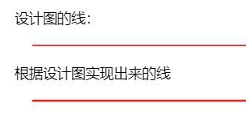

## 1px边框的问题

 在移动端web开发中，UI设计稿中设置边框为1像素，前端在开发过程中如果出现border:1px，测试会发现在某些机型上，1px会比较粗，即是较经典的移动端1px像素问题。



按照iPhone6的尺寸,一张750px宽的设计图，这个750px其实就是iPhone6的设备像素，在测量设计图时量到的1px其实是1设备像素，而当我们设置布局视口等于理想视口等于375px，并且由于iPhone6的DPR为2，写css时的1px对应的是2设备像素，所以看起来会粗一点。


## 解决办法

### border-image

基于media查询判断不同的设备像素比给定不同的border-image：

```css
.border_1px{
          border-bottom: 1px solid #000;
        }
        @media only screen and (-webkit-min-device-pixel-ratio:2){
            .border_1px{
                border-bottom: none;
                border-width: 0 0 1px 0;
                border-image: url(../img/1pxline.png) 0 0 2 0 stretch;
            }
        }

```

### background-image

和border-image类似，准备一张符合条件的边框背景图，模拟在背景上。
```css
.border_1px{
          border-bottom: 1px solid #000;
        }
@media only screen and (-webkit-min-device-pixel-ratio:2{
.border_1px{
        background: url(../img/1pxline.png) repeat-x left bottom;
        background-size: 100% 1px;
            }
        }


```

### 伪类 + transform 推荐
线条其实就是伪元素，把背景设置成了线条的颜色，看起来就像是线条了。
基于media查询判断不同的设备像素比对线条进行缩放：
```css
.border_1px:before{
          content: '';
          position: absolute;
          top: 0;
          height: 1px;
          width: 100%;
          background-color: #000;
          transform-origin: 50% 0%;
        }
        @media only screen and (-webkit-min-device-pixel-ratio:2){
            .border_1px:before{
                transform: scaleY(0.5);
            }
        }
        @media only screen and (-webkit-min-device-pixel-ratio:3){
            .border_1px:before{
                transform: scaleY(0.33);
            }
        }

```

这种方式可以满足各种场景，如果需要满足圆角，只需要给伪类也加上border-radius即可。