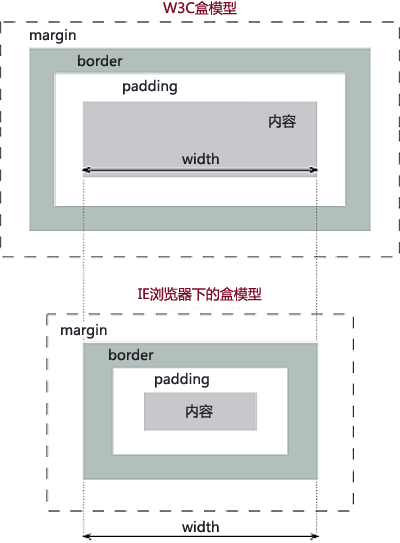

## css盒模型

元素的内在盒子是由 margin box、border box、padding box、content box 组成的，这四个盒子由外到内构成了盒模型。

## 盒模型主要分两种

标准盒模型
IE盒模型(怪异盒模型)

## 两者的区别：

标准盒模型的宽高则为内容区域的宽高
IE盒模型则宽高为 border + padding + 内容区



## 如何切换

box-sizing来进行切换
- border-box 切换为IE盒模型
- content-box 默认属性 为标准模式

计算宽度的时候不包含 border pading 很烦人，而且又是默认值，业内一般采用以下代码重置样式：
```
:root {
  box-sizing: border-box;
}
* {
  box-sizing: inherit;// 继承
}

```