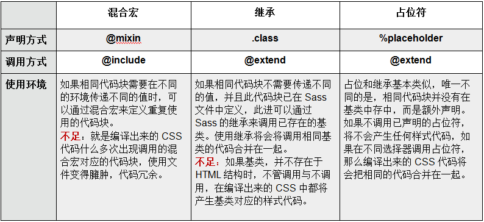

- https://www.jianshu.com/p/680aea02eba4
- https://www.html.cn/doc/sass/#lists
- https://www.sass.hk/guide/

## scss 和 sass

sass和scss其实是一样的css预处理语言，SCSS 是 Sass 3 引入新的语法，其后缀名是分别为 .sass和.scss两种。
SASS版本3.0之前的后缀名为.sass，而版本3.0之后的后缀名.scss。
两者是有不同的，继sass之后scss的编写规范基本和css一致，sass时代是有严格的缩进规范并且没有‘{}’和‘；’。
而scss则和css的规范是一致的。
## 变量

普通变量和默认变量
!default:含义是：如果这个变量被声明赋值了，那就用它声明的值，否则就用这个默认值。

```scss
$font-size: 16px; //重新声明变量
$font-size: 14px !default; //默认变量
```

全局变量就是定义在元素外面的变量

```scss


#scss
$color:#333 !default;//全局变量
h1{
  color: $color;//引用全局变量
  a{
    $color:red;//重新定义变量，局部变量
    span{
      color: $color;//引用局部变量
    }
  }
  $color:#999;//重新定义变量，局部变量
  span{
    color:$color;//引用局部变量
  }
}
#编译后的css
h1 {
  color: #333;
}
h1 a span {
    color: red;
}
h1 span {
    color: #999;
}
```

### Map

Maps 代表一个键和值对集合，其中键用于查找值。他们可以很容易地将值收集到命名组中，并且可以动态地访问这些组

\$map: (key1: value1, key2: value2, key3: value3);

和列表（Lists）不同，Maps 必须始终使用括号括起来，并且必须用逗号分隔。

### List

列表(lists) 是指 Sass 如何表示在 CSS 声明的，类似 margin: 10px 15px 0 0 或 font-face: Helvetica, Arial, sans-serif 这样的值，列表只是一串其他值，无论是用空格还是用逗号隔开。事实上，独立的值也被视为列表：只包含一个值的列表。

## 群组选择器的嵌套

```scss
.main {
  h1,
  h2 {
    font-size: 20px;
  }
  a {
    color: red;
    span {
      font-size: 16px;
    }
  }
}
#编译后的css .main h1,
.main h2 {
  font-size: 20px;
}
.main a {
  color: red;
}
.main a span {
  font-size: 16px;
}
```

## 嵌套属性;

```scss
nav {
  border: {
    style: solid;
    width: 1px;
    color: #ccc;
  }
}

nav {
  border-style: solid;
  border-width: 1px;
  border-color: #ccc;
}
```

## 父选择器的标识符&

```scss
#scss div a {
  color: #333;
  &:hover {
    color: red;
  }
  //如果body的class .ies
  body.ies & {
    color: #888;
  }
}
#编译后的css div a {
  color: #333;
}
div a:hover {
  color: red;
}
body.ies div a {
  color: #888;
}
```

特别注意多个类名的同时选择：
```scss
  .suggestion-item {
    padding: $menu-item-padding-y $menu-item-padding-x;
    cursor: pointer;
    transition: $menu-transition;
    color: $body-color;
    &.is-active {
      background: $menu-item-active-color !important;
      color: $white !important;
    }
  }
```
&.is-active 选择的是同时满足两个类名的元素类似`.suggestion-item.is-active`这样写
```
<li class="suggestion-item is-active">anydream</li>
```

## &写在嵌套类名开头，继承名称

& 必须作为选择器的第一个字符，其后可以跟随后缀生成复合的选择器，例如
```scss
#main {
  color: black;
  &-sidebar { border: 1px solid; }
}
=====
#main {
  color: black; }
  #main-sidebar { border: 1px solid; }
```

## 子代选择器

```scss
article {
  ~ article {
    border-top: 1px dashed #ccc;
  }
  > section {
    background: #eee;
  }
  dl > {
    dt {
      color: #333;
    }
    dd {
      color: #555;
    }
  }
  nav + & {
    margin-top: 0;
  } // 选择在上层nav元素后面的article（&父级选择器导致的
}
```

## 导入 SASS 文件;

css 有一个特别不常用的特性，即@import 规则，它允许在一个 css 文件中导入其他 css 文件。然而，后果是只有执行到@import 时，浏览器才会去下载其他 css 文件，这导致页面加载起来特别慢。

sass 也有一个@import 规则，但不同的是，sass 的@import 规则在生成 css 文件时就把相关文件导入进来。这意味着所有相关的样式被归纳到了同一个 css 文件中，而无需发起额外的下载请求。

## 使用 SASS 部分文件;\_night-sky.scss

约定即，sass 局部文件的文件名以下划线开头。这样，sass 就不会在编译时单独编译这个文件输出 css，而只把这个文件用作导入。

当你@import 一个局部文件时，还可以不写文件的全名，即省略文件名开头的下划线。举例来说，你想导入 themes/\_night-sky.scss 这个局部文件里的变量，你只需在样式表中写@import "themes/night-sky";。

## 嵌套导入;

sass 允许@import 命令写在 css 规则内

```scss
//_blue-theme.scss的局部文件
aside {
  background: blue;
  color: white;
}
```

```scss
.blue-theme {
  @import "blue-theme";
}

//生成的结果跟你直接在.blue-theme选择器内写_blue-theme.scss文件的内容完全一样。

.blue-theme {
  aside {
    background: blue;
    color: #fff;
  }
}
```

## 原生的 CSS 导入;

因为 sass 的语法完全兼容 css，所以你可以把原始的 css 文件改名为.scss 后缀，即可直接导入了。

## 混合器

### @mixin

```scss
@mixin rounded-corners {
  -moz-border-radius: 5px;
  -webkit-border-radius: 5px;
  border-radius: 5px;
}
```

```scss
notice {
  background-color: green;
  border: 2px solid #00aa00;
  @include rounded-corners;
}

//sass最终生成：
.notice {
  background-color: green;
  border: 2px solid #00aa00;
  -moz-border-radius: 5px;
  -webkit-border-radius: 5px;
  border-radius: 5px;
}
```

### 混合器传参;

```scss
@mixin link-colors($normal, $hover, $visited) {
  color: $normal;
  &:hover {
    color: $hover;
  }
  &:visited {
    color: $visited;
  }
}

a {
  @include link-colors(blue, red, green);
}
```

sass 允许通过语法\$name: value 的形式指定每个参数的值。这种形式的传参，参数顺序就不必再在乎了

```sass

a {
    @include link-colors(
      $normal: blue,
      $visited: green,
      $hover: red

  );
}

//Sass最终生成的是：

a { color: blue; }
a:hover { color: red; }
a:visited { color: green; }
```

### 默认参数值;

```scss
@mixin link-colors($normal, $hover: $normal, $visited: $normal) {
  color: $normal;
  &:hover {
    color: $hover;
  }
  &:visited {
    color: $visited;
  }
}

.c {
  @include link-colors(red);
}
```

编译：

```scss
.c {
  color: red;
}
.c:hover {
  color: red;
}
.c:visited {
  color: red;
}
```

## 函数 function

SASS 中的函数可以使用全局变量，还可以接受像混合(mixin)一样的参数。函数可以有多个语句组成，但是必须设定返回值(return)。但是混合(mixin)就可以不用设置返回值即可操作。函数(function)传入的值也可以带有变量

```scss
$oneWidth: 10px;
$twoWidth: 40px;

@function widthFn($n) {
  @return $n * $twoWidth + ($n - 1) * $oneWidth;
}

.leng {
	width: widthFn(5);
}


@function pow($base, $exponent) {
  $result: 1;
  @for $_ from 1 through $exponent {
    $result: $result * $base;
  }
  @return $result;
}

.sidebar {
  float: left;
  margin-left: pow(4, 3) * 1px;
}
```

编译后 CSS 代码

```

.leng {
  width: 240px;
}
```
Sass内置很多工具函数：https://www.runoob.com/sass/sass-functions.html
https://sass-lang.com/documentation/modules
序号 | 函数类别
------- | -------
1 | Sass 字符串相关函数
2 | Sass 数字相关函数
3 | Sass 列表(List)相关函数
4 | Sass 映射(Map)相关函数
5 | Sass 选择器相关函数
6 | Sass Introspection 相关函数
7 | Sass 颜色相关函数

## 选择器继承

@extend 背后最基本的想法是，如果.seriousError @extend .error， 那么样式表中的任何一处.error 都用.error.seriousError 这一选择器组进行替换。这就意味着相关样式会如预期那样应用到.error 和.seriousError

```
//通过选择器继承继承样式
.error {
  border: 1px solid red;
  background-color: #fdd;
}
.seriousError {
  @extend .error;
  border-width: 3px;
}
```

不要在 css 规则中使用后代选择器（比如.foo .bar）去继承 css 规则。如果你这么做，同时被继承的 css 规则有通过后代选择器修饰的样式，生成 css 中的选择器的数量很快就会失控

## 占位符继承

这段代码没有被 @extend 调用，他并没有产生任何代码块，只是静静的躺在你的某个 SCSS 文件中。只有通过 @extend 调用才会产生代码：

```
//SCSS
%mt5 {
  margin-top: 5px;
}
%pt5{
  padding-top: 5px;
}

.btn {
  @extend %mt5;
  @extend %pt5;
}

.block {
  @extend %mt5;

  span {
    @extend %pt5;
  }
}
```

## 对比



## 插值语句

相当动态设置选择器或者设置一些变量

```
#scss
$name: foo;
$attr: border;
p.#{$name} {
  #{$attr}-color: blue;
}
#编译后的css
p.foo {
  border-color: blue; }
```

## 语句

布尔运算 (Boolean Operations)
SassScript 支持布尔值的 and, or, 和 not 运算。

```
and运算
#scss
$age:10;
html{
  @if ($age > 10 and $age < 25) {// and->or
        color: green;
   }@else{
     color:red;
   }
}
#编译后的css
html {
  color: red; }


$age:10;
html{
  @if ($age not 25) {
        color: green;
   }@else{
     color:red;
   }
}
#编译后的css
html {
  color: green; }
```

还支持条件运算

- if()
- @if
- @for
- @each


## 运算

SassScript 支持数字的加减乘除、取整等运算 (+, -, *, /, %)，如果必要会在不同单位间转换值。

### 以下三种情况 / 将被视为除法运算符号：

- 如果值，或值的一部分，是变量或者函数的返回值
- 如果值被圆括号包裹
- 如果值是算数表达式的一部分

```
p {
  font: 10px/8px;             // Plain CSS, no division
  $width: 1000px;
  width: $width/2;            // Uses a variable, does division
  width: round(1.5)/2;        // Uses a function, does division
  height: (500px/2);          // Uses parentheses, does division
  margin-left: 5px + 8px/2px; // Uses +, does division
  font: #{$font-size}/#{$line-height};
}
```
编译为
```
p {
  font: 10px/8px;
  width: 500px;
  height: 250px;
  margin-left: 9px; }
```

### + 可用于连接字符串 或者 计算

p {
  cursor: e + -resize; // cursor: e-resize; 
  font-size: 5px + 2em; // 单位不一致，编译报错
  font-size: 5px + 2; // 7px
  font-size: 5px * 2px; // invalid CSS
}