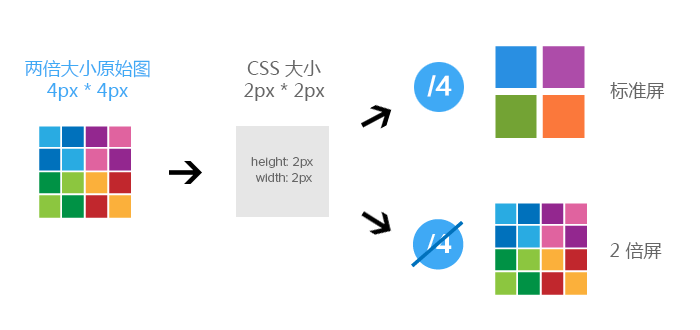
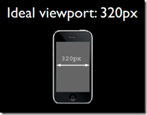
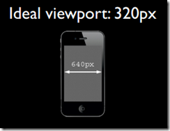
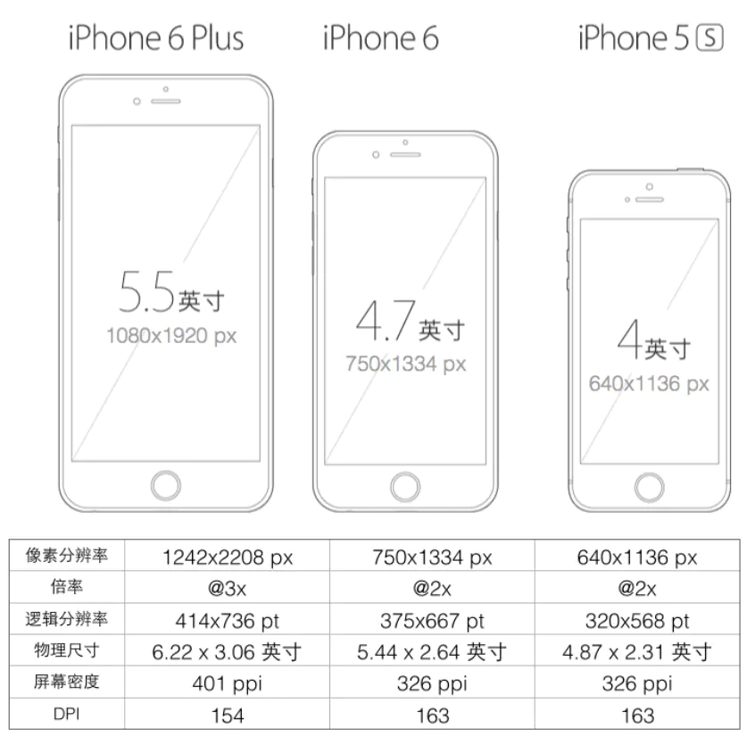

## px，em，rem 的区别

px 像素(Pixel)。绝对单位。像素 px 是相对于显示器屏幕分辨率而言的，是一个虚拟长度单位，是计算 机系统的数字化图像长度单位，如果 px 要换算成物理长度，需要指定精度 DPI。

em 是相对长度单位，相对于当前对象内文本的字体尺寸。如当前对行内文本的字体尺寸未被人为设置， 则相对于浏览器的默认字体尺寸。它会继承父级元素的字体大小，因此并不是一个固定的值。
rem 是 CSS3 新增的一个相对单位(root em，根 em)，使用 rem 为元素设定字体大小时，仍然是相对大小， 但相对的只是 HTML 根元素。

## 分辨率

屏幕分辨率指一个屏幕具体由多少个像素点组成。
iPhone XS Max 和 iPhone SE的分辨率分别为2688 x 1242和1136 x 640。这表示手机分别在垂直和水平上所具有的像素点数。

## 关于像素的概念

- PPI(Pixel Per Inch)：每英寸包括的像素数。
- DPI(Dot Per Inch)：即每英寸包括的点数。
- DP(device pixel):设备像素,又称物理像素。
- DIP(device independt pixel)设备独立像素,又称逻辑像素即 CSS 里的 px
- DPR 设备像素比 device pixel ratio 简称 dpr

## DPR 设备像素比的由来

在没出现视网膜屏幕前，其实并没有设备像素和设备独立像素的区分，因为他们都是一样的。你在 css 里写多少 px，就是占用了设备像素多少个像素点。但是当出现了视网膜，甚至更高 PPI 值的屏幕后，屏幕上分布的像素点越来越多，如果你仍然用 css 的 1px 来表示设备上的 1px 物理像素点，那么在一个低 ppi 值的屏幕上和高 ppi 值的屏幕上，你编写的同样一个 css 里的 px 值，在两个屏幕上显示就很大差别了，如在低 ppi 屏上正常显示，另一个就会十分小。为了解决这个问题，就区分出两个概念了。

设备独立像素，就是把组成设备显示的像素点重新编排，这个编排结果符合开发人员认知上的 px 情况，而不是设备真实的物理像素。就是在设备像素上抽象了一层，以固定数量的设备像素来表示一个设备独立像素，重新构成设备显示的像素点。
因此，我们写 css 时的 px 值，就是基于这个设备独立像素上进行的。

至于要以多少个设备像素组成一个设备独立像素，还引入了一个“设备像素比（Device Pixel Ratio），简称 DPR 的概念来解释了。

即物理像素和设备独立像素的比值。
DPR = 设备像素 / 设备独立像素
DPR = 物理像素/ 设备逻辑像素（css 像素）
(设备分辨率很高时把 4 个物理像素点视为一个 dpr 就为 2)

平时你可能会看到使用 DPI 来描述图片和屏幕，这时的 DPI 应该和 PPI 是等价的，DPI 最常用的是用于描述打印机，表示打印机每英寸可以打印的点数。



## 关于缩放

如果把浏览器或手机页面放大 2 倍之后，window.innerWidth 和 window.innerHeight 都变成了放大之前的 1/2，但是此时 window.devicePixelRatio 变成了放大之前的 2 倍，为什么是这样子呢？

因为你本来1px放大2倍后逻辑像素也是1px(放大不影响逻辑像素，只是影响显示)，但是你屏幕确需要2倍的物理像素来显示。这是就 2物理/1逻辑 也是就DPR变大2倍

或者反过来，因为 window.innerWidth 是用 CSS 像素衡量的，放大两倍之后(原来是 100px 的它还是 100px，只是你看到的变大了，px 不会变)，浏览器窗口只能看到之前一半的内容，所以 window.innerWidth 是之前的一半，而 dpr = 设备像素 / 设备独立像素，这里的设备独立像素就是我们的 window.innerWidth，所以 dpr 变为原来的 2 倍

记忆：页面放大 DPR 变大，页面缩小 DPR 减小

如现在页面 DPR 是 3，我想让 1 物理像素=1 的设备逻辑像素该怎么办（现在是 3 物理像素=1 逻辑像素
将页面缩放 1/3 倍，这时 1px 等于一个真正的屏幕像素。即 DPR 为 1

## 关于 viewport

### viewport是什么

通常viewport是指视窗、视口，浏览器上(也可能是一个app中的webview)用来显示网页的那部分区域。在移动端和pc端视口是不同的，pc端的视口是浏览器窗口区域，而在移动端有三个不同的视口概念：布局视口、视觉视口、理想视口(为layout viewport 、 visual viewport 和 ideal viewport 三类)

布局视口：在浏览器窗口css的布局区域，布局视口的宽度限制css布局的宽。为了能在移动设备上正常显示那些为pc端浏览器设计的网站，移动设备上的浏览器都会把自己默认的viewport设为980px或其他值，一般都比移动端浏览器可视区域大很多，所以就会出现浏览器出现横向滚动条的情况


视觉视口：用户通过屏幕看到的页面区域，通过缩放查看显示内容的区域，在移动端缩放不会改变布局视口的宽度，当缩小的时候，屏幕覆盖的css像素变多，视觉视口变大，当放大的时候，屏幕覆盖的css像素变少，视觉视口变小。


理想视口：一般来讲，这个视口其实不是真是存在的，它对设备来说是一个最理想布局视口尺寸，在用户不进行手动缩放的情况下，可以将页面理想地展示。那么所谓的理想宽度就是浏览器（屏幕）的宽度了。

 ideal viewport并没有一个固定的尺寸，不同的设备拥有有不同的ideal viewport。所有的iphone的ideal viewport宽度都是320px，无论它的屏幕宽度是320还是640，也就是说，在iphone中，css中的320px就代表iphone屏幕的宽度。





### 移动设备的viewport 如何变成理想的视口

移动设备默认的viewport是layout viewport，也就是那个比屏幕要宽的viewport，所以一般来讲，移动设备上的viewport都是要大于浏览器可视区域的但在进行移动设备网站的开发时，我们需要的是ideal viewport。那么怎么才能得到ideal viewport呢？这就该轮到meta标签出场了。

**device-width 是设备逻辑像素的宽**

```
<meta name="viewport" content="width=device-width, initial-scale=1.0,minimum-scale=1.0,maximum-scale=1.0,user-scalable=no">

```

　该meta标签的作用是让当前viewport的宽度等于设备的宽度，同时不允许用户手动缩放。也许允不允许用户缩放不同的网站有不同的要求，但让viewport的宽度等于设备的宽度，这个应该是大家都想要的效果，如果你不这样的设定的话，那就会使用那个比屏幕宽的默认viewport，也就是说会出现横向滚动条。

meta viewport 标签首先是由苹果公司在其safari浏览器中引入的，目的就是解决移动设备的viewport问题。后来安卓以及各大浏览器厂商也都纷纷效仿，引入对meta viewport的支持，事实也证明这个东西还是非常有用的。

　　在苹果的规范中，meta viewport 有6个属性(暂且把content中的那些东西称为一个个属性和值)，如下：


## 设置device-width然后基于rem适配

手机分辨率现在大多数的dpr都不是1，可能每种手机都不同，这代表不同手机的分辨率可能相差很大，看下图



如果不用逻辑像素的话，现在设置一个750px的框，在iPhone6上可能看到的就刚好是整个屏幕的宽度，而到了iPhone6Plus这里可能才2/3作业的屏幕，那么就说明不同屏幕大小都不同了

为了避免这种差异，一般解决办法就是设置viewport的width=device-width


用 iphone6 举例，设置 width=device-width
```
<meta name="viewport" content="width=device-width,initial-sacle=1">
```
DPR = 物理像素/ 设备逻辑像素（css 像素）
DPR = 物理像素/ device-width
device-width = 物理像素/DPR
iphone 6/7/8**物理**竖屏的宽度为 750px，它的 dpr=2，用 2px 表示 1px，这样设置之后 viewport 的宽度就变成 375px(设备逻辑像素 = 物理像素/DPR=750/2=375)

而iPhone6Plus的计算出来再414左右，两者已经很接近了，但还是存在差异，所以一般都不能直接设置px

我们可以动态获取屏幕逻辑宽度然后计算出rem，来适配

```
<script>
    document.documentElement.style.fontSize = (document.documentElement.clientWidth / 750)*100 + 'px';
</script>
<body>
    <div>

    </div>
</body>
<script>
    window.addEventListener('resize',()=>{
        // 如果设计稿是750px  一个图形宽为50px 那占的比例就50/750
        // 这里相当于把宽度也分成了750份，50rem就就是占50/750 以达到适配的效果
        // 但一般字体再chrome<12px会无效，说以我们放大100倍，设置1个单位时就用0.01即可 
        document.documentElement.style.fontSize = (document.documentElement.clientWidth / 750)*100 + 'px';
    })
</script>
```