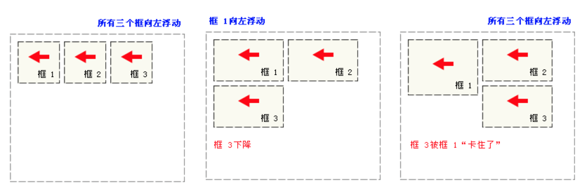

## 浮动到底是什么

浮动核心就一句话：浮动元素会脱离文档流并向左/向右浮动，直到碰到父元素或者另一个浮动元素。脱离文档，也就是说浮动不会影响普通元素的布局.

## 为什么要使用浮动

浮动可以内联排列，实现类似inline-block的效果；但是如果每个元素的高度不一致，会出现“卡住”的情况。



## 为什么要清除浮动

浮动会导致父元素高度坍塌:浮动元素脱离了文档流，并不占据文档流的位置，自然父元素也就不能被撑开，所以没了高度。

## clear如何清除浮动

clear属性不允许被清除浮动的元素的左边/右边挨着浮动元素，底层原理是在被清除浮动的元素上边或者下边添加足够的清除空间。

clear 属性规定元素盒子的边不能和浮动元素相邻。该属性只能影响使用清除的元素本身，不能影响其他元素。

```
//利用伪元素清除浮动
.clearfix:after {
     content:"."; 
     display:block; 
     height:0; 
     visibility:hidden; 
     clear:both; 
}
.clearfix { 
    *zoom:1; // 适配IE6
}
```

.clearfix告诉浏览器，我的左右（both）都不允许有浮动的元素存在，请清除掉我周围的浮动元素。然而，因为浮动元素（.floatDiv）位置已经确定，浏览器在计算.clearfix的位置时，为满足其需求，将.clearfix渲染在浮动元素下方，保证了.clearfix左右没有浮动元素。同时可以看出，父元素的高度也被撑起来了,其兄弟元素的渲染也不再受到浮动的影响，这是因为.clearfix仍然在文档流中，它必须在父元素的边界内，父元素只有增加其高度才能达到此目的.

zoom（transform: scale有点像）属性是IE浏览器的专有属性， 它可以设置或检索对象的缩放比例。当设置了zoom的值之后，所设置的元素就会就会扩大或者缩小，高度宽度就会重新计算了，这里一旦改变zoom值时其实也会发生重新渲染，运用这个原理，也就解决了ie下子元素浮动时候父元素不随着自动扩大的问题。当IE遇到问题的时候，尤其是IE67，zoom: 1可以激活BFC，然后激活BFC后就可以解决好多问题啦

## clear缺点

clear只能作用于块级元素，并且其并不能解决后面元素可能发生的文字环绕问题。

## 不要在浮动元素上清除浮动

浮动元素，脱离了文档流，就算给元素上下加了清除空间，也是没有任何意义的。