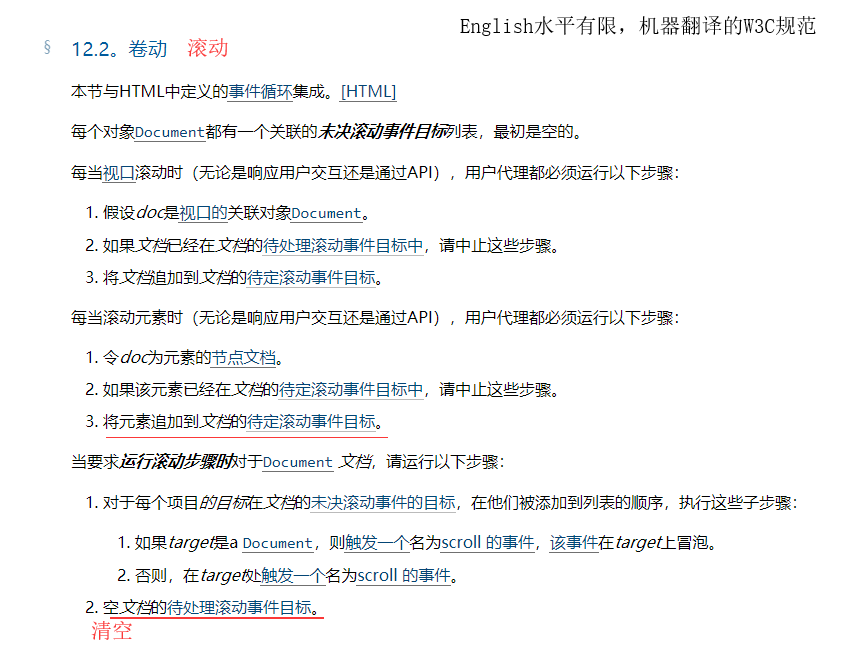

## 移动端触摸事件

### 常用事件

- ①touchstart：当手指触碰到屏幕的时候触发
- ②touchmove：当手指在屏幕上滑动的时候触发
- ③touchend：当手指离开屏幕的时候时候触发
- ④touchcancel 事件：当系统停止跟踪触摸的时候触发(这个事件很少会用，一般不做深入研究)。 电话接入或者弹出信息等其他事件切入

### 移动端事件对象 event 有以下属性：

- touches：表示当前跟踪的触摸操作的 touch 对象的数组。
- targetTouches：特定于事件目标的 Touch 对象的数组。
- changeTouches：表示自上次触摸以来发生了什么改变的 Touch 对象的数组。

通过这样一个对象，能够获取到当前触碰的坐标，触碰的手指个数等等。 其中最重要的常用的莫过于手指列表了。

三个手指触碰，三个手指列表都存在触碰事件对象里面，在每次发生触碰之后这里的列表都会更新。

```
var div = document.querySelector("#div");
         div.ontouchmove = function(evt){
            this.innerHTML = `
                touches-length:${evt.touches.length}
                targetTouches-length:${evt.targetTouches.length}
                changedTouches-length:${evt.changedTouches.length}
                `
            console.log(evt);
        }

```

### 每个 touch 对象包含的属性

- clientX：触摸目标在视口中的 x 坐标。
- clientY：触摸目标在视口中的 y 坐标。
- identifier：标识触摸的唯一 ID。
- pageX：触摸目标在页面中的 x 坐标。
- pageY：触摸目标在页面中的 y 坐标。
- screenX：触摸目标在屏幕中的 x 坐标。
- screenY：触摸目标在屏幕中的 y 坐标。
- target：触目的 DOM 节点目标。


## 移动端 300ms 点击延迟由来

故事：2007 年初。苹果公司在发布首款 iPhone 前夕，遇到一个问题：当时的网站都是为大屏幕设备所设计的。于是苹果的工程师们做了一些约定，应对 iPhone 这种小屏幕浏览桌面端站点的问题。

这当中最出名的，当属双击缩放(double tap to zoom)，这也是会有上述 300 毫秒延迟的主要原因。

双击缩放，顾名思义，即用手指在屏幕上快速点击两次，iOS 自带的 Safari 浏览器会将网页缩放至原始比例。 那么这和 300 毫秒延迟有什么联系呢？ 假定这么一个场景。用户在 iOS Safari 里边点击了一个链接。由于用户可以进行双击缩放或者双击滚动的操作，当用户一次点击屏幕之后，浏览器并不能立刻判断用户是确实要打开这个链接，还是想要进行双击操作。因此，iOS Safari 就等待 300 毫秒，以判断用户是否再次点击了屏幕。 鉴于 iPhone 的成功，其他移动浏览器都复制了 iPhone Safari 浏览器的多数约定，包括双击缩放，几乎现在所有的移动端浏览器都有这个功能。之前人们刚刚接触移动端的页面，在欣喜的时候往往不会 care 这个 300ms 的延时问题，可是如今 touch 端界面如雨后春笋，用户对体验的要求也更高，这 300ms 带来的卡顿慢慢变得让人难以接受。

也就是说，移动端浏览器会有一些默认的行为，比如双击缩放、双击滚动。这些行为，尤其是双击缩放，主要是为桌面网站在移动端的浏览体验设计的。而在用户对页面进行操作的时候，移动端浏览器会优先判断用户是否要触发默认的行为。

**重点：由于移动端会有双击缩放的这个操作，因此移动端浏览器在 click 之后要等待 300ms，看用户有没有下一次点击，也就是这次操作是不是双击。**

## 浏览器的解决方案

### 方案一：禁用缩放

表明这个页面是不可缩放的，那双击缩放的功能就没有意义了，此时浏览器可以禁用默认的双击缩放行为并且去掉 300ms 的点击延迟。

```
<meta name="viewport" content="user-scalable=no">
<meta name="viewport" content="initial-scale=1,maximum-scale=1">
```

缺点：就是必须通过完全禁用缩放来达到去掉点击延迟的目的，然而完全禁用缩放并不是我们的初衷，我们只是想禁掉默认的双击缩放行为，这样就不用等待 300ms 来判断当前操作是否是双击。但是通常情况下，我们还是希望页面能通过双指缩放来进行缩放操作，比如放大一张图片，放大一段很小的文字。

### 方案二：更改默认的视口宽度

随着响应式设计的普及，很多站点都已经对移动端坐过适配和优化了，这个时候就不需要双击缩放了，如果能够识别出一个网站是响应式的网站，那么移动端浏览器就可以自动禁掉默认的双击缩放行为并且去掉 300ms 的点击延迟

设置了下述 meta 标签，那浏览器就可以认为该网站已经对移动端做过了适配和优化，就无需双击缩放操作了。

```
<meta name="viewport" content="width=device-width">
```

### 方案三：CSS touch-action

touch-action 这个 CSS 属性。这个属性指定了相应元素上能够触发的用户代理（也就是浏览器）的默认行为。如果将该属性值设置为 touch-action: none，那么表示在该元素上的操作不会触发用户代理的任何默认行为，就无需进行 300ms 的延迟判断。

## 浏览器的事件触发顺序

touchstart --> mouseover(有的浏览器没有实现) --> mousemove(一次) -->mousedown --> mouseup --> click -->touchend

## 点击穿透问题

click 点击有 300ms 的延迟，会产生点击穿透现象

假如页面上有两个元素 A 和 B。B 元素在 A 元素之上。我们在 B 元素的 touchstart 事件上注册了一个回调函数，该回调函数的作用是隐藏 B 元素。我们发现，当我们点击 B 元素，B 元素被隐藏了，随后，A 元素触发了 click 事件。
这是因为在移动端浏览器，事件执行的顺序是 touchstart > touchend > click。而 click 事件有 300ms 的延迟，当 touchstart 事件把 B 元素隐藏之后，隔了 300ms，浏览器触发了 click 事件，但是此时 B 元素不见了，所以该事件被派发到了 A 元素身上。如果 A 元素是一个链接，那此时页面就会意外地跳转。

那对于触摸屏，我们直接监听 touchstart 事件不就好了吗？
使用 touchstart 去代替 click 事件有两个不好的地方。
第一：touchstart 是手指触摸屏幕就触发，有时候用户只是想滑动屏幕，却触发了 touchstart 事件，这不是我们想要的结果；
第二：使用 touchstart 事件在某些场景下可能会出现点击穿透的现象。

### 方案一：pointer-events

比较麻烦且有缺陷，不建议使用 mask 隐藏后，给按钮下面元素添上 pointer-events: none;样式，让 click 穿过去，350ms 后去掉这个样式，恢复响应缺陷是 mask 消失后的的 350ms 内，用户可以看到按钮下面的元素点着没反应，如果用户手速很快的话一定会发现

### 方案二：FastClick-tap 事件的一种

FastClick 是 FT Labs 专门为解决移动端浏览器 300 毫秒点击延迟问题所开发的一个轻量级的库。FastClick 的实现原理是在检测到 touchend 事件的时候，会通过 DOM 自定义事件立即出发模拟一个 click 事件，并把浏览器在 300ms 之后的 click 事件阻止掉。

不建议使用:
因为有人遇到了 bug，首先引入 fastclick 库，再把页面内所有 touch 事件都换成 click，其实稍微有点麻烦，建议引入这几 KB 就为了解决点透问题不值得

### 方案三：点击后延迟 350ms 再隐藏 mask

改动最小，缺点是隐藏 mask 变慢了，350ms 还是能感觉到慢的

只需要针对 mask 做处理就行，改动非常小，如果要求不高的话，用这个比较省力

### 方案四：只用 click

下下策，因为会带来 300ms 延迟，页面内任何一个自定义交互都将增加 300 毫秒延迟，想想都慢。不用 touch 就不会存在 touch 之后 300ms 触发 click 的问题，如果交互性要求不高可以这么做，

### 方案五：只用 touch

最简单的解决方案，完美解决点击穿透问题

把页面内所有 click 全部换成 touch 事件（ touchstart 、’touchend’、’tap’）， 需要特别注意 a 标签，a 标签的 href 也是 click，需要去掉换成 js 控制的跳转，或者直接改成 span + tap 控制跳转。如果要求不高，不在乎滑走或者滑进来触发事件的话，span + touchend 就可以了，毕竟 tap 需要引入第三方库

## tap 事件

虽然已经没有太大的必要自行实现一个 tap 事件，但是我们还是很好奇可以怎么实现一个能够快速触发的 tap 的事件？有两个库，一个是 zepto，另一个是 fastclick，它们都可以解决点击延迟的问题。其中，zepto 有一个自定义事件 tap，它是一个没有延迟的 click 事件。而 fastclick 是在 touchend 之后生成一个 click 事件，并立即触发这个 click，再取消原本的 click 事件。这两者的原理都是一样的，都是在 touchend 之后触发，一个是触发它自己定义的 tap 事件，一个是触发原生 click。

这里有一个关键的问题，就是 touchend 之后不能够每次都触发 tap，因为有可能用户是在上下滑并不是在点击，不然的话直接监听 touchstart 就好了。所以怎么判定用户是点击还是在上下滑呢？Zepto 是用的位移偏差，即记录下 touchstart 的时候的初始位移，然后用 touchend 的时候的位移减掉初始位移的偏差，如果这个差值在 30 以内，则认为用户是点击，大于 30 则认为是滑动。而 fastclick 是用的时间偏差，分别记录 touchstart 和 touchend 的时间戳，如果它们的时间差大于 700 毫秒，则认为是滑动操作，否则是点击操作。

## 滚动透传现象

### 先来看下规范

有一个误区就是我们设置了一个和屏幕一样大小的遮罩层，盖住了下面的内容，按理说我们应该能屏蔽掉下方的所有事件也就是说不可能触发下面内容的滚动。那么我们就去看一下规范，什么时候会触发滚动。[https://www.w3.org/TR/2016/WD-cssom-view-1-20160317/#scrolling-events](https://www.w3.org/TR/2016/WD-cssom-view-1-20160317/#scrolling-events)

来一张机器翻译的规范的图片，影响理解的地方做了标记,文档即为 document 对象


首先滚动的 target 可以是 document 和里面的 element。
其次，在 element 上的 scroll 事件是不冒泡的，document 上的 scroll 事件冒泡。
所以如果我们想通过在 scroll 的节点上去阻止它的滚动事件冒泡来解决问题是不可行的！因为它根本就不冒泡,无法触及 dom tree 的父节点何谈触发它们的滚动。

其实规范只说明了浏览器应该在什么时候滚动，而没有说不应该在什么时候滚动。浏览器正确实现了规范，滚动穿透也并不是浏览器的 bug。

### 为什么会出现透传

看我图上画出的两条红线，第一处应该说的滚动一个元素时，也会为 document 追加滚动事件到其待定滚动事件队列，并在再元素滚动时清空这些目标。

所以在页面上加了一个遮罩层并不会影响 document 滚动事件的产生。根据规范，如果目标节点是不能滚动的那么将会尝试 document 上的滚动，也就是说遮罩层虽然不可滚动，但是这个时候浏览器会去触发 document 的滚动从而导致了下方文档的滚动。

也就是说如果 document 也不可滚动了，也就不会有这个问题了。这就引出了解决问题的第一种方案：把 document 设置为 overflow hidden。

## 解决办法

### overflow hidden

既然滚动是由于文档超出了一屏产生的，那么就让它超出部分 hidden 掉就好了，所以在遮罩层被弹出的时候可以给 html 和 body 标签设置一个 class：

```
.modal--open {
  height: 100%;
  overflow: hidden;
}
```

但是这样又会引来一个新的问题，如果文档之前存在一定的滚动高度那么这样设置后会导致之前的滚动距离失效，文档滚回了最顶部，这样一来岂不是得不偿失？但是我们可以在加 class 之前记录好之前的滚动具体然后在关闭遮罩层的时候把滚动距离设置回来。这样问题是可以得到解决的实现成本也很低，但是如果遮罩层是透明的，弹出后用户仍然会看到丢失距离后的下方页面，显然这样并不是完美的方案。

### position: fixed;

这个办法也能使得我的元素无法滚动，从而达到目的.
给 overflow: scroll: 的元素加上一个 class (一般都是 body 元素)。退出的时候去掉这个 class。

```
// css 部分
modal_open {
    position: fixed;
    height: 100%;
}

// js 部分
document.body.classList.add('modal_open');
document.body.classList.remove('modal_open');

```

缺点：弹出层后页面的滚动位置会丢失，需要用 js 来还原

### touchmove + preventDefault

```
modal.addEventListener('touchmove', function(e) {
  e.preventDefault();
}, false);
```

这样用 js 阻止滚动后看起来效果不错了，但是也有一个缺点：
弹出层里不能有其它需要滚动的内容（如大段文字需要固定高度，显示滚动条也会被阻止）

### 终极解决方案 封装 fixed

弹框弹起时执行 fixedBody 方法，弹框收起时执行 looseBody 释放页面。

```
  fixedBody() {
      var scrollTop =document.body.scrollTop || document.documentElement.scrollTop
      document.body.style.cssText += 'position:fixed;top:-' + scrollTop + 'px;'
    },
  looseBody() {
      var body = document.body
      body.style.position = ''
      var top = body.style.top
      document.body.scrollTop = document.documentElement.scrollTop = -parseInt(top)
      body.style.top = ''
    },
```
