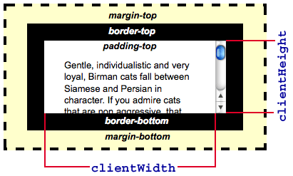
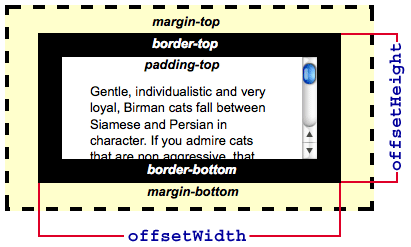
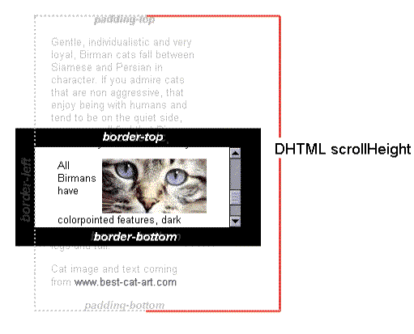
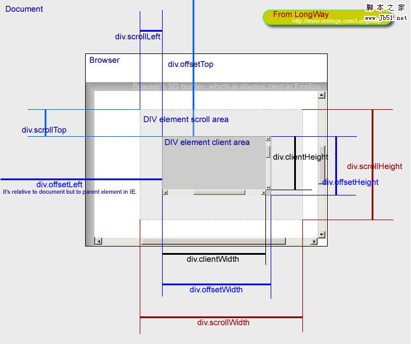
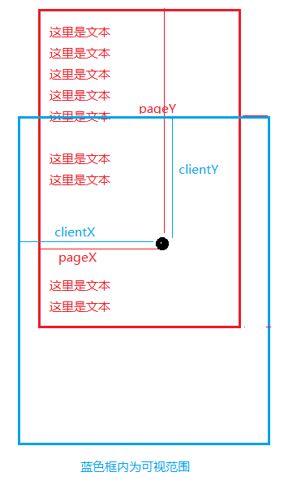

## 网页可见区域

- 网页可见区域高 
document.documentElement.clientHeight=height + padding \* 2- 滚动条宽度
- 网页可见区域宽 
document.documentElement.clientWidth=width + padding \* 2- 滚动条宽度

## 指定元素的总宽高

- 指定元素的总高度 
document.body.offsetHeight= height+border*2+padding*2 = clientHeight + 滚动条宽度 + 边框宽度\*2
- 指定元素的总宽度 
document.body.offsetWidth= width+border*2+padding*2 = clientWidth + 滚动条宽度 + 边框宽度\*2

## 滚动宽高

- scrollHeight 的 MDN 解释：元素内容高度的度量，包括由于溢出导致的视图中不可见内容(总高度)
- 滚动总高度 document.body.scrollHeight

- 滚动的高度 document.body.scrollTop

- 滚动总宽度 document.body.scrollWidth

判断是否滑到底部：this.scrollHeight - this.scrollTop === this.clientHeight;

## 屏幕物理分辨率
>一般是1920x1080

- 屏幕物理分辨率高（不变）window.screen.height=window.screen.availHeight+windows 上下任务栏
- 屏幕物理分辨率宽（不变）window.screen.width=window.screen.availHeight+windows 左右任务栏

## 浏览器

- 浏览器可视窗口的高度，不包括边框、工具栏、调试窗口（可变）window.innerHeight
- 浏览器可视窗口的宽度，不包括边框（可变）window.innerWidth
- 浏览器窗口的宽度，包括滚动条和边框（可变）window.outerHeight
- 浏览器窗口的高度，包括边框、工具栏（可变）window.outerWidth

## 浏览器窗口的可用宽高

- 浏览器窗口的可用高度，不包括 windows 任务栏（可变）window.screen.availHeight
- 浏览器窗口的可用宽度，不包括 windows 任务栏（可变）window.screen.availWidth
- 浏览器窗口距离显示屏上部高度（可变） window.screenTop
- 浏览器窗口距离显示屏下部高度（可变） window.screenLeft

## 一张完善的图

