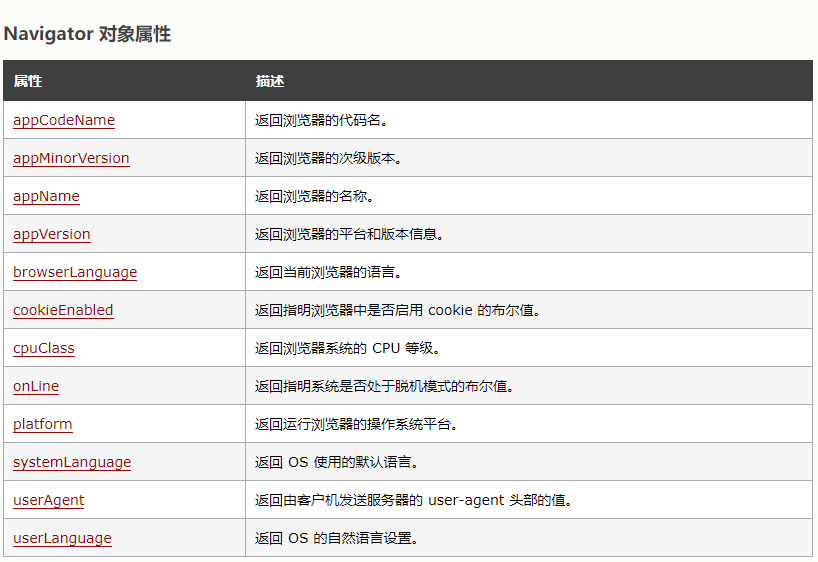

## Html5 语义化与新特性

### 什么是 HTML 语义化？

表示选择合适的标签（语义化标签）便于开发者阅读和写出更优雅的代码

意义：根据内容的结构化（内容语义化），选择合适的标签（代码语义化）便于开发者阅读和写出更优雅的代码的同时让浏览器的爬虫和机器很好地解析

```
article、footer、header、nav、section，
表单控件，calendar、date、time、email、url、search;
```

### 为什么要使用语义化标签？

在没有 CSS 样式的情况下，页面整体也会呈现很好的结构效果
更有利于用户体验
更有利于搜索引擎优化
代码结构清晰，方便团队开发与维护

### Navigator 对象

Navigator 对象包含有关浏览器的信息。


### HTML5 新特性有哪些？

- 语义化标签
- 音视频处理
- canvas / webGL
- svg
- history API
- requestAnimationFrame
- 地理位置(navigator.geolocation.getCurrentPosition(showPosition);)
- 离线存储(创建 cache manifest 文件)
- Web 存储(localStorage)
- webSocket
- Web Workers
- Drag 和 drop (拖拽，兼容性不高)

## 渐进增强与优雅降级的理解及区别

### 渐进增强（Progressive Enhancement）：

一开始就针对低版本浏览器进行构建页面，完成基本的功能，然后再针对高级浏览器进行效果、交互、追加功能达到更好的体验。

### 优雅降级（Graceful Degradation）：

一开始就构建站点的完整功能，然后针对浏览器测试和修复。比如一开始使用 CSS3 的特性构建了一个应用，然后逐步针对各大浏览器进行 hack 使其可以在低版本浏览器上正常浏览。

```
.transition { /*渐进增强写法*/
  -webkit-transition: all .5s;
     -moz-transition: all .5s;
       -o-transition: all .5s;
          transition: all .5s;
}
.transition { /*优雅降级写法*/
          transition: all .5s;
       -o-transition: all .5s;
     -moz-transition: all .5s;
  -webkit-transition: all .5s;
}

```

## meta viewport 相关

```
<!DOCTYPE html>  H5标准声明，使用 HTML5 doctype，不区分大小写
<head lang=”en”> 标准的 lang 属性写法
<meta charset=’utf-8′>    声明文档使用的字符编码
<meta http-equiv=”X-UA-Compatible” content=”IE=edge,chrome=1″/>   优先使用 IE 最新版本和 Chrome
<meta name=”description” content=”不超过150个字符”/>       页面描述
<meta name=”keywords” content=””/>      页面关键词
<meta name=”author” content=”name, email@gmail.com”/>    网页作者
<meta name=”robots” content=”index,follow”/>      搜索引擎抓取
<meta name=”viewport” content=”initial-scale=1, maximum-scale=3, minimum-scale=1, user-scalable=no”> 为移动设备添加 viewport
<meta name=”apple-mobile-web-app-title” content=”标题”> iOS 设备 begin
<meta name=”apple-mobile-web-app-capable” content=”yes”/>  添加到主屏后的标题（iOS 6 新增）
是否启用 WebApp 全屏模式，删除苹果默认的工具栏和菜单栏
<meta name=”apple-itunes-app” content=”app-id=myAppStoreID, affiliate-data=myAffiliateData, app-argument=myURL”>
添加智能 App 广告条 Smart App Banner（iOS 6+ Safari）
<meta name=”apple-mobile-web-app-status-bar-style” content=”black”/>
<meta name=”format-detection” content=”telphone=no, email=no”/>  设置苹果工具栏颜色
<meta name=”renderer” content=”webkit”>  启用360浏览器的极速模式(webkit)
<meta http-equiv=”X-UA-Compatible” content=”IE=edge”>     避免IE使用兼容模式
<meta http-equiv=”Cache-Control” content=”no-siteapp” />    不让百度转码
<meta name=”HandheldFriendly” content=”true”>     针对手持设备优化，主要是针对一些老的不识别viewport的浏览器，比如黑莓
<meta name=”MobileOptimized” content=”320″>   微软的老式浏览器
<meta name=”screen-orientation” content=”portrait”>   uc强制竖屏
<meta name=”x5-orientation” content=”portrait”>    QQ强制竖屏
<meta name=”full-screen” content=”yes”>              UC强制全屏
<meta name=”x5-fullscreen” content=”true”>       QQ强制全屏
<meta name=”browsermode” content=”application”>   UC应用模式
<meta name=”x5-page-mode” content=”app”>    QQ应用模式
<meta name=”msapplication-tap-highlight” content=”no”>    windows phone 点击无高光
设置页面不缓存
<meta http-equiv=”pragma” content=”no-cache”>
<meta http-equiv=”cache-control” content=”no-cache”>
<meta http-equiv=”expires” content=”0″>

```

## 移动端视口配置

- initial-scale：初始的缩放比例
- minimum-scale：允许用户缩放到的最小比例
- maximum-scale：允许用户缩放到的最大比例
- user-scalable：用户是否可以手动缩放

```
<meta name="viewport" content="width=device-width, initial-scale=1.0,minimum-scale=1.0,maximum-scale=1.0,user-scalable=no">
```


```
<meta name="viewport" content="width=device-width,initial-sacle=1">
```

device-width 就是设备独立像素 = 物理像素/dpr
iphone 6 竖屏的宽度为 750px，它的 dpr=2，用 2px 表示 1px，这样设置之后 viewport 的宽度就变成 375px

## Attribute 和 Property

### Attribute 和 Property 的区别

首先在定义上更准确的来说，Attribute 和 Property 分别为特性和属性，作为区别。 
其次，这样理解下来，我们知道 Attribute 就是 DOM 节点自带属性，例如我们在 HTML 中常用的 id,class,src,title,alt 等。而 Property 则是这个 DOM 元素作为对象，其附加的属性或者内容，例如 childNodes，firstChild 等。

### javascript 使用中我们应该注意的事项

property 是 DOM 中的属性，是 JavaScript 里的对象，是有类型的，例如 Bollean，number，string 等

attribute 是 HTML 标签上的特性，它的值只能够是 string；

## innerHtml 和 outerHtml

inner 只是标签内，outer 是包括标签

## DOCTYPE 的作用

DOCTYPE 是 document type (文档类型) 的缩写。`<!DOCTYPE >`声明位于文档的最前面，处于标签之前，它不是 html 标签。主要作用是告诉浏览器的解析器使用哪种 HTML 规范或者 XHTML 规范来解析页面。

删除<!DOCTYPE>会发生什么？
在 W3C 标准出来之前，不同的浏览器对页面渲染有不同的标准，产生了一定的差异。这种渲染方式叫做混杂模式。在 W3C 标准出来之后，浏览器对页面的渲染有了统一的标准，这种渲染方式叫做标准模式。<!DOCTYPE>不存在或者形式不正确会导致 HTML 或 XHTML 文档以混杂模式呈现，就是把如何渲染 html 页面的权利交给了浏览器，有多少种浏览器就有多少种展示方式。因此要提高浏览器兼容性就必须重视<!DOCTYPE>

严格模式和混杂模式
严格模式和混杂模式都是浏览器的呈现模式，浏览器究竟使用混杂模式还是严格模式呈现页面与网页中的 DTD（文件类型定义）有关，DTD 里面包含了文档的规则。比如：loose.dtd
- 严格模式：又称标准模式，是指浏览器按照 W3C 标准来解析代码，呈现页面
- 混杂模式：又称为怪异模式或者兼容模式，是指浏览器按照自己的方式来解析代码，使用一种比较宽松的向后兼容的方式来显示页面。


## Document.documentElement

返回文档对象（document）的根元素的只读属性（如HTML文档的 `<html>` 元素）。

## preload 预加载(下载)
>https://developer.mozilla.org/zh-CN/docs/Web/HTML/Preloading_content

浏览器会在遇到如下link标签时，立刻开始下载main.js(不阻塞parser)，并放在内存中，但不会执行其中的JS语句。当资源真正被使用的时候立即执行，就无需等待网络的消耗。
```
<link rel="preload" href="/main.js" as="script">
```

- preload加载的资源是在浏览器渲染机制之前进行处理的，并且不会阻塞onload事件和渲染；
- preload可以支持加载多种类型的资源，并且可以加载跨域资源；特别是字体文件，不会再出现 font 字体在页面渲染出来后，才加载完毕，然后页面字体闪一下变成预期字体。
- preload加载的js脚本其加载和执行的过程是分离的。即preload会预加载相应的脚本代码，待到需要时自行调用；

忽略 as 属性，或者错误的 as 属性会使 preload 等同于 XHR 请求，浏览器不知道加载的是什么，因此会赋予此类资源非常低的加载优先级。

css里面定义了字体的url。那么直到浏览器开始解析CSS了才会识别出来需要加载这个资源。
如果我们提前让浏览器下载好(preload)这个资源呢？那么执行CSS的时候就可以直接用了。


## prefetch 预判加载
> https://juejin.im/post/5b5984b851882561da216311

Prefetch 是一个低优先级的资源提示，允许浏览器在后台（空闲时）获取将来可能用得到的资源，并且将他们存储在浏览器的缓存中。一旦一个页面加载完毕就会开始下载其他的资源，然后当用户点击了一个带有 prefetched 的连接，它将可以立刻从缓存中加载内容。有三种不同的 prefetch 的类型，link，DNS 和 prerendering

```
资源预加载：<link rel="prefetch" href="test.css">
DNS预解析：<link rel="dns-prefetch" href="//haitao.nos.netease.com">
http预连接：<link rel="prefetch" href="//www.kaola.com"> 将建立对该域名的TCP链接
页面预渲染：<link rel="prerender" href="//m.kaola.com"> 将会预先加载链接文档的所有资源
```

资源预加载:当有页面使用的时候，直接从缓存中读取(可能是disk缓存也可能是memory缓存)。其实就是把决定是否和什么时间加载这个资源的决定权交给浏览器。

如果prefetch还没下载完之前，浏览器发现script标签也引用了同样的资源，浏览器会再次发起请求，这样会严重影响性能的，加载了两次，，所以不要在当前页面马上就要用的资源上用prefetch，要用preload。


## preload 和 prefetch 异同点

### 缓存方式相同

Chrome有四种缓存：
- http cache(disk cache 磁盘缓存)
- memory cache(浏览器内存)
- Service Worker cache
- Push cache(推送缓存是 HTTP/2 中的内容)。

当一个资源被 preload 或者 prefetch 获取后，它可以从 HTTP 缓存移动至渲染器的内存缓存中。
- 如果资源可以被缓存（比如说存在有效的cache-control 和 max-age），它被存储在 HTTP（disk） 缓存中可以被现在或将来的任务使用，状态码304（未验证
- 如果资源不能被缓存在 HTTP 缓存中，作为代替，那么其在被使用前则均存储在memory cache，状态码200


### 优先级不同

- Preload来告诉浏览器预先请求当前页需要的资源，从而提高这些资源的请求优先级。比如，对于那些本来请求优先级较低的关键请求，我们可以通过设置Preload来提升这些请求的优先级。

- Prefetch来告诉浏览器用户将来可能在其他页面（非本页面）可能使用到的资源，那么浏览器会在空闲时，就去预先加载这些资源放在http(disk)缓存内，最常见的dns-prefetch。比如，当我们在浏览A页面，如果会通过A页面中的链接跳转到B页面，而B页面中我们有些资源希望尽早提前加载，那么我们就可以在A页面里添加这些资源Prefetch，那么当浏览器空闲时，就会去加载这些资源。


### prefetch的资源不一定加载

- preload   是告诉浏览器页面必定需要的资源，浏览器一定会加载这些资源；
- prefetch 是告诉浏览器页面可能需要的资源，浏览器不一定会加载这些资源。

## 避免混用 preload 和 prefetch

preload 和 prefetch 混用的话，并不会复用资源，而是会重复加载。

## 避免错用 preload 加载跨域资源


若 css 中有应用于已渲染到 DOM 树的元素的选择器，且设置了 @font-face 规则时，会触发字体文件的加载。
而字体文件加载中时，DOM 中的这些元素，是处于不可见的状态。对已知必加载的 font 文件进行预加载，除了有性能提升外，更有体验优化的效果。
在我们的场景中，已知 antd.css 会依赖 font 文件，所以我们可以对这个字体文件进行 preload:
```
<link rel="preload" as="font" crossorigin href="https://at.alicdn.com/t/font_zck90zmlh7hf47vi.woff">
```


为启用CORS的资源(如字体或具有crossorigin属性的图像)预加载链接，还必须包含crossorigin属性，以便正确使用资源。不然跨域资源会加载两次且优先级不同

css 样式文件中有一个 @font-face 依赖一个 font 文件，样式文件中依赖的字体文件加载的优先级是 Highest；
在使用 preload 预加载这个 font 文件时，若不指定 crossorigin 属性(即使同源)，则会采用匿名模式的 CORS 去加载，优先级是 High


## 什么是预渲染？ Pre Render


先说服务端渲染，首先得有后端服务器（一般是 Node.js）才可以使用。

SSR 常用于以下两个场景：
- 有 SEO 诉求，用在搜索引擎检索以及社交分享，用在前台类应用。
- 首屏渲染时长有要求，常用在移动端、弱网情况下。
- 
如果我没有后端服务器，也想用在上面提到的两个场景，那么推荐使用预渲染。

预渲染与服务端渲染唯一的不同点在于渲染时机，服务端渲染的时机是在用户访问时执行渲染（即实时渲染，数据一般是最新的），预渲染的时机是在项目构建时，当用户访问时，数据不是一定是最新的（如果数据没有实时性，则可以直接考虑预渲染）。

预渲染（Pre Render）在构建时执行渲染，将渲染后的 HTML 片段生成静态 HTML 文件。无需使用 web 服务器实时动态编译 HTML，适用于静态站点生成。


Vue里常用的 prerender-spa-plugin这个webpack插件就可以用来做预渲染。这个插件依赖无头浏览器poptear来实现，hexo这个博客框架就类似预渲染

在应用编译时就直接生成一个html静态代码（不含js交互，只能适用于静态导航界面）


## js判断css动画是否完成 animation,transition
>https://blog.csdn.net/lanmanck/article/details/52176103