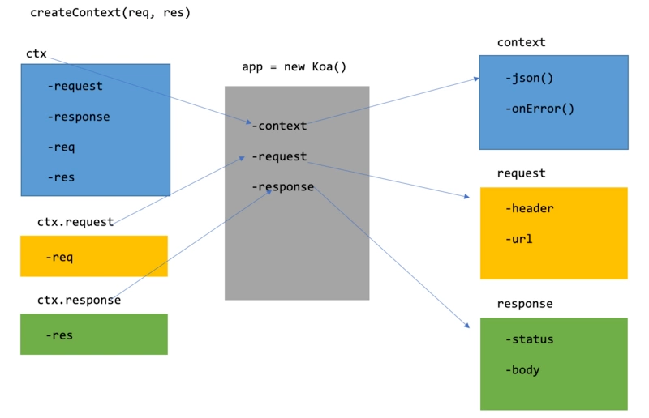
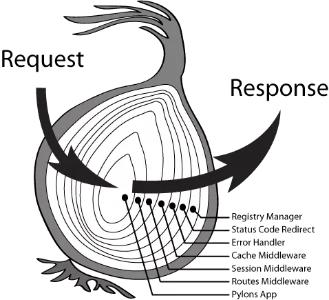
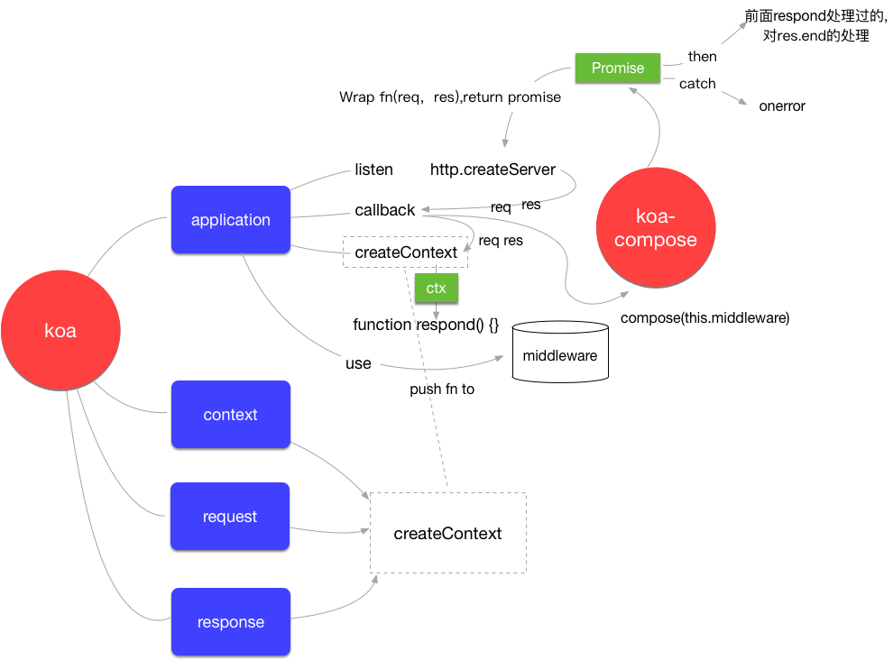
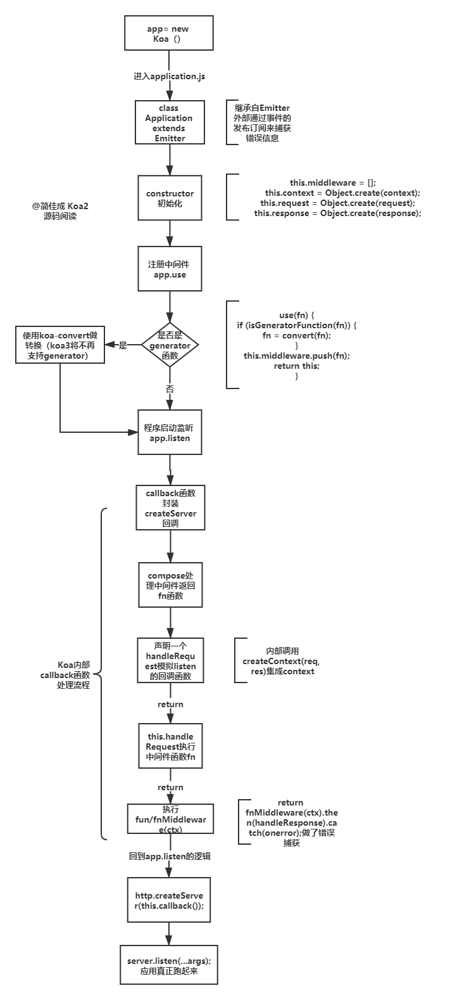

## 源码总结

### application.js
1. 启动框架

2. 实现洋葱模型中间件机制

3. 封装高内聚的context

4. 实现异步函数的统一错误处理机制

### context.js

1. 错误事件处理

2. 代理response对象和request对象的部分属性和方法

### response.js 和 request.js

基于node原生res和req封装了一系列便利属性和方法，供处理请求时调用。使用Es6的get和set来代理属性，所以当你访问ctx.request.xxx的时候，实际上是在访问request对象上的赋值器（setter）和取值器（getter）。


## 初始化koa的app

```
const Koa = require('koa');
const app = new Koa();
```
new Koa 其实就是实力化了koa模块导出的方法，现在可以进去看一下究竟干了什么：
```
//  require('koa')
module.exports = class Application extends Emitter {
  constructor() {
    super();

    this.proxy = false;
    this.middleware = [];
    this.subdomainOffset = 2;
    this.env = process.env.NODE_ENV || 'development';
    // 为什么不直接用this.context=context:这样会导致两者指向同一片内存，而不是实现继承的目的。通过原型链继承原来的属性。这样可以有效的防止污染原来的对象。
    this.context = Object.create(context);
    this.request = Object.create(request);
    this.response = Object.create(response);
    if (util.inspect.custom) {
      this[util.inspect.custom] = this.inspect;
    }
  }
}
```

初始化koa的时候，koa做了以下2件事：

- 继承Emitter，具备处理异步事件的能力。
- 在创建实例过程中，有三个对象作为实例的属性被初始化，分别是context、request、response。还有存放中间件的数组mddleware。

## 注册中间件 app.use

实例化koa之后，接下来，使用app.use传入中间件函数
```
app.use(async (ctx,next) => {
    await next();
});
```
koa对应执行源码：
```
 use(fn) {
    if (isGeneratorFunction(fn)) {
      fn = convert(fn);
    }
    this.middleware.push(fn);
    return this;
  }
```
执行app.use的时候，koa做了这2件事情：
* 判断是否是generator函数，如果是，使用koa-convert做转换（koa3将不再支持generator）。
* 所有传入use的方法，会被push到middleware中。

koa-convert就是将generator函数转为类async函数，koa2处于对koa1版本的兼容，中间件函数如果是generator函数的话，会使用koa-convert进行转换为“类async函数”。（不过到第三个版本，该兼容会取消）。koa-convert类似于一个co模块，将generator函数自动执行，并封装promise，具体可参考之前手写async await 函数那里。

## 程序真正启动 app.listen

使用了node原生http.createServer创建服务器，并把this.callback()作为参数传递进去。可以知道，this.callback()返回的一定是这种形式：(req, res) => {}。继续看下this.callback代码。
```
listen(...args) {
    const server = http.createServer(this.callback());
    return server.listen(...args);
  }
```

## callback函数
node原生http.createServer创建服务器，并把this.callback()作为参数传递进去。可以知道，this.callback()返回的一定是这种形式：(req, res) => {}

```
callback() {
    // compose处理所有中间件函数。洋葱模型实现核心
    const fn = compose(this.middleware);

    //* createServer每次请求执行函数handleRequest
    const handleRequest = (req, res) => {
      // 这里拿到原生的req和res对象并基于req和res封装集成为ctx
      const ctx = this.createContext(req, res);
      // 调用handleRequest处理请求返回的结果
      return this.handleRequest(ctx, fn);
    };

    return handleRequest;
  }

 handleRequest(ctx, fnMiddleware) {
    const res = ctx.res;
    res.statusCode = 404;

    // 调用context.js的onerror函数
    const onerror = err => ctx.onerror(err);

    // 处理响应内容
    const handleResponse = () => respond(ctx);

    // 确保一个流在关闭、完成和报错时都会执行响应的回调函数
    onFinished(res, onerror);

    // 中间件执行、统一错误处理机制的关键，并且这就是一次请求最终返回的结果
    return fnMiddleware(ctx).then(handleResponse).catch(onerror);
 }
```


- handleRequest就是构造createServer的参数（(req, res) => {}
- 通过createContext集成context
- compose(this.middleware),使用了koa-compose包,处理中间件调用逻辑。实现洋葱模型
- koa的统一错误处理机制是如何实现的？

## 集成node原生的req和res对象-context

ctx（context）是一个上下文对象，里面绑定了很多请求和相应相关的数据和方法，例如ctx.path、ctx.query、ctx.body()等等等等，极大的为开发提供了便利。

context.js、request.js、response.js三个文件分别是request、response、context三个模块的代码文件。context就是我们平时写koa代码时的ctx，它相当于一个全局的koa实例上下文this，它连接了request、response两个功能模块，并且暴露给koa的实例和中间件等回调函数的参数中，起到承上启下的作用。

### createContext函数
从上面callback函数里可以看出ctx是由this.createContext函数生成的

```
 // 针对每个请求，都要创建ctx对象
  createContext(req, res) {
    const context = Object.create(this.context);
    const request = context.request = Object.create(this.request);
    const response = context.response = Object.create(this.response);
    context.app = request.app = response.app = this;
    context.req = request.req = response.req = req;
    context.res = request.res = response.res = res;
    request.ctx = response.ctx = context;
    request.response = response;
    response.request = request;
    context.originalUrl = request.originalUrl = req.url;
    context.state = {};
    return context;
  }
```

request、response两个功能模块分别对node的原生request、response进行了一个功能的封装，使用了getter和setter属性，基于node的对象req/res对象封装koa的request/response对象。我们基于这个原理简单实现一下request.js、response.js，首先创建response.js文件，然后写入以下代码：

```
// response.js
module.exports = {
    get body() {
        return this._body;
    },
    set body(data) {
        this._body = data;
    },
    get status() {
        return this.res.statusCode;
    },
    set status(statusCode) {
        if (typeof statusCode !== 'number') {
            throw new Error('something wrong!');
        }
        this.res.statusCode = statusCode;
    }
};

```

我们写的response看上去很简单，可以再参考下koa2的request.js的部分源码:
可以发现其实koa2内部通过class的get set 帮我我们分封装了大部分属性，使得我们的操作更加简单
```
module.exports = {

  /**
   * Return request header.
   *
   * @return {Object}
   * @api public
   */

  get header() {
    return this.req.headers;
  },
  set header(val) {
    this.req.headers = val;
  },
  get origin() {
    return `${this.protocol}://${this.host}`;
  },
  get href() {
    // support: `GET http://example.com/foo`
    if (/^https?:\/\//i.test(this.originalUrl)) return this.originalUrl;
    return this.origin + this.originalUrl;
  },
  get method() {
    return this.req.method;
  },
  set method(val) {
    this.req.method = val;
  },
  get path() {
    return parse(this.req).pathname;
  },
  set path(path) {
    const url = parse(this.req);
    if (url.pathname === path) return;

    url.pathname = path;
    url.path = null;

    this.url = stringify(url);
  },
  get query() {
    const str = this.querystring;
    const c = this._querycache = this._querycache || {};
    return c[str] || (c[str] = qs.parse(str));
  },
  set query(obj) {
    this.querystring = qs.stringify(obj);
  },
```


### delegates代理模式

为什么response.js和request.js使用get set代理，而context.js使用delegate代理? 

原因主要是: set和get方法里面还可以加入一些自己的逻辑处理,是的我们的操作更加简化。而delegate就比较纯粹了，只代理属性。


delegates依赖的作用
>[详细解释](https://segmentfault.com/a/1190000017313480) 
[delegates的实现过程源码](https://www.cnblogs.com/DM428/p/11069522.html)
- Delegate(proto, prop)创建一个代理实例，使用proto对象下的prop对象作为被代理者
- method(name) 接受一个方法，进行方法代理
- getter(name) 属性的获取被代理
- setter(name) 属性的赋值代理
- access(name) 赋值和获取值得双向代理
- fluent(name) 被代理者中该属性有值就返回该值,没有的话可以通过函数调用设置，返回ctx对象


简单的实例：如将request上的方法直接代理到ctx上:
```
var ctx = {

const delegate = require('delegates');

var ctx = {};

ctx.request = {
  fn: function(i){return i}
};

delegate(ctx, 'request')
    .method('fn');

console.log(ctx.fn(1))
```

### context最终结构

源码里面就比较复杂，代理了很多的方法，最后的结果如图


所以这样委托代理后，即有set和get封装处理的node原生API，又有koa2帮我们处理过的的API
```
app.use((ctx) => {
  console.log(ctx.req.url)
  console.log(ctx.request.req.url)
  console.log(ctx.response.req.url)
  console.log(ctx.request.url)
  console.log(ctx.request.path)
  console.log(ctx.url)
  console.log(ctx.path)
})
```

* ctx.req：原生的req对象
* ctx.res：原生的res对象
* ctx.request：koa自己封装的request对象
* ctx.response：koa自己封装的response对象


## compose函数-中间件机制

函数式编程有个compose的概念，compose 就是执行一系列的任务（函数），比如有以下任务队列，let tasks = [step1, step2, step3, step4],每一个 step 都是一个步骤，按照步骤一步一步的执行到结尾(step4 是头部第一个元素，step1 是尾部)。


Koa的中间件机制类似上面的compose，同样是把多个函数包装成一个，但是koa的中间件类似洋葱模型，也就是从A中间件执行到B中间件，B中间件执行完成以后，仍然可以再次回到A中间件。


如下是注册的一个中间件，use接受一个async函数，它有两个参数一个是ctx，一个是next，具体参数的含义看后面的源码分析
```
// 日志 手写的打印信息的功能
app.use(async (ctx, next) => {
  const start = new Date()
  await next()
  const ms = new Date() - start
  console.log(`${ctx.method} ${ctx.url} - ${ms}ms`)
})
```

- 通过use传进来的中间件是一个回调函数，回调函数的参数是ctx上下文和next
- next其实就是控制权的交接棒，next的作用是停止运行当前中间件，将控制权交给下一个中间件，执行下一个中间件的next()之前的代码，当下一个中间件运行的代码遇到了next()，又会将代码执行权交给下下个中间件
- 当执行到最后一个中间件的时候，控制权发生反转，开始回头去执行之前所有中间件中剩下未执行的代码，这整个流程有点像一个伪递归
- 当最终所有中间件全部执行完后，会返回一个Promise对象，因为我们的compose函数返回的是一个async的函数，async函数执行完后会返回一个Promise，这样我们就能将所有的中间件异步执行同步化，通过then就可以执行响应函数和错误处理函数。

经过上面的四步就形成了koa2的一个洋葱模型（感觉就是一个函数嵌套的调用栈，后进先出，request过来最后一个中间件最先执行完然后弹出，再执行完上一个中间件）



经过前面callback函数的分析我们知道会调用const fn = compose(this.middleware);最后会把fn传递给handleRequest，这里先分析compose的作用

```JavaScript
function compose (middleware) {
  // 首先参数是middleware这是前面存储的中间件数组
  if (!Array.isArray(middleware)) throw new TypeError('Middleware stack must be an array!')
  for (const fn of middleware) {
    if (typeof fn !== 'function') throw new TypeError('Middleware must be composed of functions!')
  }
  // 首先看第一层返回的函数的两个参数，这其实是在handleRequest里会传入的参数
  return function (context, next) {
    // last called middleware #
    let index = -1
    return dispatch(0)
    function dispatch (i) {
      // 一个中间件里多次调用next
      if (i <= index) return Promise.reject(new Error('next() called multiple times'))
      index = i
      //* fn就是当前的中间件
      let fn = middleware[i]
      // 最后一个中间件如果也next时进入(一般最后一个中间件是直接操作ctx.body，并不需要next了)
      if (i === middleware.length) fn = next 
       // 没有中间件，直接返回成功
      if (!fn) return Promise.resolve()
      try {
        /* 
          * 使用了bind函数返回新的函数，类似下面的代码
          return Promise.resolve(fn(context, function next () {
            return dispatch(i + 1)
          }))
        */
        // dispatch.bind(null, i + 1)就是中间件里的next参数，调用它就可以进入下一个中间件
        return Promise.resolve(fn(context, dispatch.bind(null, i + 1)));
      } catch (err) {
        // 中间件是async的函数，报错不会走这里，直接在fnMiddleware的catch中捕获
        // 捕获中间件是普通函数时的报错,Promise化，这样才能走到fnMiddleware的catch方法
        return Promise.reject(err)
      }
    }
  }
}
```

## 中间件的next函数是个啥

经过上面的源码分析可以发现我们传入app.use的函数最终是在compose里dispatch返回的函数里执行的，传入use的函数就是下面的fn函数
```
Promise.resolve(fn(context, dispatch.bind(null, i + 1)));
```
所以fn的第二个参数就是我们的next，next就是一个包裹了dispatch的函数

在第n个中间件中执行next，就是执行dispatch(n+1)，也就是进入第n+1个中间件

因为dispatch返回的都是Promise，所以在第n个中间件await next(); 进入第n+1个中间件。当第n+1个中间件执行完成后，可以返回第n个中间件

如果在某个中间件中不再调用next，那么它之后的所有中间件都不会再调用了

## 为什么一般都要在next函数前面加await

>await关键字的意思是阻塞代码并对其后的表达式或函数调用进行取值
使用await关键字的话函数必须是async函数
但为了保证中间件的执行顺序，koa2规定如果某个中间件使用了await关键字，那么每一个中间件的next前面都应添加await关键字


先考虑目的:实现洋葱模型，这是 koa 基本思想。如果不返回 promise，不用 async，当有中间件用异步的时候，无法实现洋葱模型。
现在假设我们不加的话，如果下一个中间件 也就是 next 的执行, 其实是会被放到异步里面去了，那么这时候可能后面的next中间件还没执行完，前面的中间件就往后执行了，这就不是洋葱模型了（当仅在第二个中间件中使用await关键字时有可能破坏这个执行顺序

我们用 await  promiseFn();来模拟一个异步耗时任务
```
app.use((ctx,next)=>{
  console.log('111');
   var result =  next();
  console.log(result);//Promise { <pending> }
  console.log('222');
});
app.use(async(ctx,next)=>{
  console.log('333');
  next();
  let testVar = await  promiseFn();
  console.log('444');
});
...
function promiseFn(){
    return new Promise(function(resovle,reject){
        setTimeout(function(){
            resovle('5');
        },500)
    });
}
```
期待输出结果为洋葱模型：

```
//111
//333
//444
//222

```
输出结果却变为：

```
//111
//333
//222
//444

```

因为中间件1中的next()不会等待下一个中间件函数中的异步代码（即使阻塞）拿到`Promise { <pending> }`结果后继续往下执行打印222，然后等阻塞代码执行完后才打印444。造成中间件函数不再以next()为分隔呈洋葱模型执行，所以每一个next()前都必须添加await关键字。


## 错误处理机制

### 中间件错误机制的处理

因为compose组合之后的函数返回的仍然是Promise对象，所以我们可以在catch捕获异常
之前知道创建sever后最后返回的是handleRequest函数执行的结果,fnMiddleware就是compose处理后返回的方法，执行开启中间的按顺序调用，最后返回Promise。
所以可以在最后加上catch(onerror)
```
handleRequest(ctx, fnMiddleware) {
  const handleResponse = () => respond(ctx);
  const onerror = err => ctx.onerror(err);
  // catch捕获，触发ctx的onerror方法
  return fnMiddleware(ctx).then(handleResponse).catch(onerror);
}
```

注意这里onerror会触发ctx.onerror来处理错误，内部还订阅了一个事件用于外部框架监听下面介绍

### 框架层如何感知中间件内部的错误

方法一：如果我们想在框架层面捕获中间件的错误可以：
```
// 捕获全局异常的中间件
app.use(async (ctx, next) => {
  try {
    await next()
  } catch (error) {
    return ctx.body = 'error'
  }
}
)
```
方法二：因为Application一开始就继承原生的Emitter，可以通过事件的发布订阅，从而实现error监听

我们监听了一个事件error，它在什么时候触发呢？与context.js内部实现的一个onerror方法有关，这个方法就是上面中间件内部报错会回调的方法
```
app.on('error', err => {
    console.log('error happends: ', err.stack);
});
```

onerror是封装好的方法，注意看`this.app.emit('error', err, this)`这句就是触发我们的监听函数
```
  onerror(err) {
    if (null == err) return;
    if (!(err instanceof Error)) err = new Error(util.format('non-error thrown: %j', err));
    let headerSent = false;
    if (this.headerSent || !this.writable) {
      headerSent = err.headerSent = true;
    }
    // 重点在这里
    this.app.emit('error', err, this);
    if (headerSent) {
      return;
    }
    const { res } = this;
    if (typeof res.getHeaderNames === 'function') {
      res.getHeaderNames().forEach(name => res.removeHeader(name));
    } else {
      res._headers = {}; // Node < 7.7
    }
    this.set(err.headers);
    this.type = 'text';
    if ('ENOENT' == err.code) err.status = 404;
    if ('number' != typeof err.status || !statuses[err.status]) err.status = 500;
    const code = statuses[err.status];
    const msg = err.expose ? err.message : code;
    this.status = err.status;
    this.length = Buffer.byteLength(msg);
    res.end(msg);
  },
```

## 流程图




