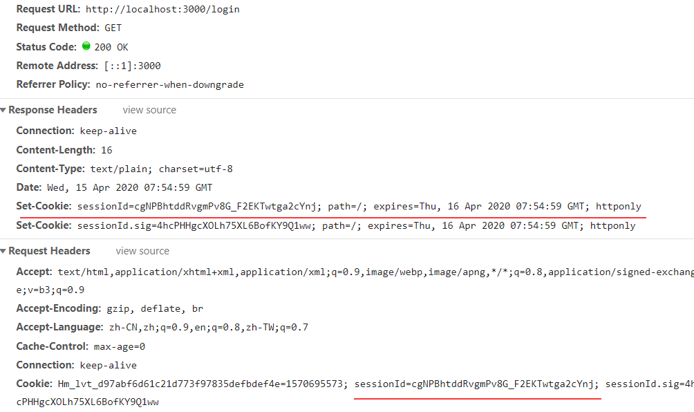
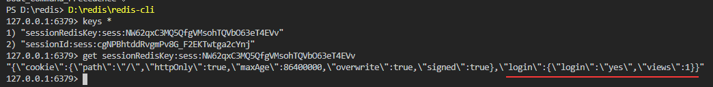

##

## 全局安装 koa 的脚手架

```tsx
cnpm install -g koa-generator
```

## 采用 ejs 后端渲染模板建立项目

```tsx
koa2 -e koa2-project
```

这个命令执行完后还需要安装依赖

```tsx
cnpm install
```

然后运行

```tsx
cnpm run dev
```

## 项目的入口 app.js 分析

```tsx
const Koa = require('koa')
const app = new Koa()
const views = require('koa-views')
const json = require('koa-json')
const onerror = require('koa-onerror')
const bodyparser = require('koa-bodyparser')
const logger = require('koa-logger')

// 导入配置的路由信息
const index = require('./routes/index')
const users = require('./routes/users')

// 监听错误,可配置错误显示的页面 通过redirect重定向
// 原理是 重写koa源码里的app.context.onerror函数，加上个性化配置
onerror(app)

// middlewares 解析数据
app.use(bodyparser({
  enableTypes:['json', 'form', 'text']
}))

// 把json字符串转变为js的对象
app.use(json())

// 日志 打印一些请求的信息
app.use(logger())

// 挂载目录为静态资源
app.use(require('koa-static')(__dirname + '/public'))

// 注册后端编译模版 之后可以直接在router里render一个路径
app.use(views(__dirname + '/views', {
  extension: 'ejs'
}))

// 日志 手写的打印信息的功能
app.use(async (ctx, next) => {
  const start = new Date()
  await next()
  const ms = new Date() - start
  console.log(`${ctx.method} ${ctx.url} - ${ms}ms`)
})

// routes 真正挂载路由到app上
app.use(index.routes(), index.allowedMethods())
app.use(users.routes(), users.allowedMethods())

// 监听错误，显示到后台
app.on('error', (err, ctx) => {
  console.error('server error', err, ctx)
});

module.exports = app
```

## ejs 模板渲染引擎

### 变量的使用

```tsx
    <h1><%= title %></h1>
    <p>EJS Welcome to <%= title %></p>
```

为什么能导入 title 这个变量是因为在 app 注册了路径

```tsx
// 注册后端编译模版渲染路径
app.use(views(__dirname + '/views', {
  extension: 'ejs'
}))

router.get('/', async (ctx, next) => {
    // 这里的index其实就指向的是前面views下面的index
  await ctx.render('index', {
    title: 'Hello Koa 2!'
  })
})
```

### 语句的使用
>就是用<%  %>把关键字和变量包起来

条件语句
```tsx
    <% if (locals.isNarrow) { %>
    <style>
        body {
            width: 400px;
            margin: 0 auto;
            margin-top: 100px;
        }
    </style>
    <% } %>
```
循环语句
```tsx
<% blogList.forEach(blog => { %>
    <div class="item-wrapper">
        <span><%= blog.createdAtFormat%></span>
    </div>
<% }) %>
```

### 组件的使用

```tsx
            <li class="nav-item">
                <a class="nav-link" href="/">
                    <i class="fa fa-home"></i>
                    <%= title%>
                </a>
            </li>
```
在另一个页面就可以用include来导入上面的组件
```tsx
<%- include('component/header', { title: '主页'})%>
```

## MySQL 安装与连接

```tsx
npm install --save mysql2
```
以下可以看到直接使用mysql来连接和查询还是比较麻烦的，有封装好的工具sequelize
```tsx
// get the client
const mysql = require('mysql2');
 
// create the connection to database
const connection = mysql.createConnection({
  host: 'localhost',
  user: 'root',
  database: 'test'
});
 
// simple query
connection.query(
  'SELECT * FROM `table` WHERE `name` = "Page" AND `age` > 45',
  function(err, results, fields) {
    console.log(results); // results contains rows returned by server
    console.log(fields); // fields contains extra meta data about results, if available
  }
);

```

## Sequelize 安装使用

sequelize是对mysql操作的一个封装简化，所以安装好了mysql后就可以安装使用工具
```tsx
cnpm i --save sequelize 
```
sequelize的使用可以参照这个中文的文档[https://demopark.github.io/sequelize-docs-Zh-CN/](https://demopark.github.io/sequelize-docs-Zh-CN/)
这里也有一份增删改查，外键，分页，多表联查的例子`[Sequelize](../../Sequelize/src)`

Sequelize有一个缺点就是需要你自己去使用seq.define去与表创建模型关联
```tsx
const User = seq.define("user", {
  //id会自动创建，并设为主键、自增
  userName: {
    type: Sequelize.STRING, //varchar(255)
    allowNull: false
  },
  password: {
    type: Sequelize.STRING,
    allowNull: false
  },
  nickName: {
    type: Sequelize.STRING,
    comment: "昵称"
  }
  //自动创建：createAt 和 updateAt
});
```
如果不映射这个model再操作数据库时会有问题，比如插入的时候就插入不了
所以我们需要一个自动化的工具可以使用sequelize-auto（虽然大多数教程还是在用这个工具，但是长期未更新感觉不太好用了） 和 sequelize-automate

## sequelize-automate 自动生成models

```tsx
 cnpm install --save sequelize-automate
```

```tsx
  // 配置一条命令
  "scripts": {
    "models":"sequelize-automate -c \"./sequelize-automate.config.json\""
  },  
```
用sequelize-automate.config.json配置一些数据库的相关信息
```tsx
{
    "dbOptions": {
      "database": "sequelize_test",
      "username": "root",
      "password": "*******",
      "dialect": "mysql",
      "host": "localhost",
      "port": 3306,
      "logging": false
    },
    "options": {
      "type": "js",
      "dir": "src/models"
    }
  }
```

```tsx
cnpm run models 就直接生成好了
```

## 安装eslint

```tsx
// 安装eslint-loader 在webpack中解析
// 安装babel-eslint  对Babel解析器的包装与ESLint兼容
// -D 安装在开发依赖环境 devDependencies 原--save-dev的简写
npm i eslint eslint-loader babel-eslint -D

```
然后配置一个.eslintignore和.eslintrc.js文件即可
```tsx
//.eslintrc.js
module.exports = {
    "parser": "babel-eslint",
    "env": {
        "browser": true,
        "commonjs": true,
        "es6": true,
        "node":true,
    },
    "extends": "eslint:recommended",
    "globals": {
        "Atomics": "readonly",
        "SharedArrayBuffer": "readonly"
    },
    "parserOptions": {
        "ecmaVersion": 2018
    },
    "rules": {
    }
};
```

## 封装环境变量 安装cross-env

cross-env 主要是让你的设置的环境变量能在每一个系统上跑，windows mac linux都适用

```tsx
cnpm i cross-env -S
```

封装环境变量然后倒入到需要的文件，这样可以做到统一处理，以后需要添加修改只需修改一处代码
```tsx
const ENV = process.env.NODE_ENV

module.exports = {
    isDev: ENV === 'dev',
    notDev: ENV !== 'dev',
    isProd: ENV === 'production',
    notProd: ENV !== 'production',
    isTest: ENV === 'test',
    notTest: ENV !== 'test'
}
```
现在我们运行一条指令就可以带上环境变量
```tsx
cross-env NODE_ENV=production pm2 start pm2.conf.json
```

## redis安装与使用

```tsx
PS D:\redis> D:\redis\redis-server.exe redis.windows.conf
[20572] 15 Apr 14:16:18.502 # Creating Server TCP listening socket *:6379: bind: No error
```

```tsx
PS D:\redis> D:\redis\redis-cli
127.0.0.1:6379> 
```
然后可以通过 
```tsx
set key value//设置
get key// 获取
```

## node 操作 redis

安装redis插件用来连接redis
```tsx
cnpm i redis -S
```

node连接已经启动好的redis服务
```tsx
const redis = require('redis')

let REDIS_CONF = {
    port: 6379,
    host: '127.0.0.1'
}
// 创建客户端
const redisClient = redis.createClient(REDIS_CONF.port, REDIS_CONF.host)
redisClient.on('error', err => {
    console.error('redis error', err)
})
redisClient.on('ready', res => {
    console.log('连接成功',res)
    set('name','jjc')
    set('obj',{name:'jjc',age:'21'})
    get('name').then((res)=>console.log(res))
    get('obj').then((res)=>console.log(res))
})
```

set和get方法需要封装一下，就是把JS对象转化成JSON字符串即可
```tsx
function set(key, val, timeout = 60 * 60) {
    if (typeof val === 'object') {
        val = JSON.stringify(val)
    }
    redisClient.set(key, val)
    redisClient.expire(key, timeout)
}

function get(key) {
    const promise = new Promise((resolve, reject) => {
        redisClient.get(key, (err, val) => {
            if (err) {
                reject(err)
                return
            }
            try {
                resolve(
                    JSON.parse(val)
                )
            } catch (ex) {
                resolve(val)
            }
        })
    })
    return promise
}
```

## Koa 连接 redis 并储存session

之前安装的插件是node原生连接redis，这里使用Koa中间件来连接
koa-redis
```tsx
cnpm i koa-redis koa-generic-session -S
```
首先我们知道ctx.cookie是可以直接操作cookie的，但是session是一种会话机制，一般我们采用cookie来存储生成的sessionID，但没有现成的办法来操作sessionID的生成与存储模式

所以我们可以使用koa的中间件 koa-generic-session 解决这个问题。这个插件提供了一个可配置的方法，我们可以用它来
- 生成sessionID
- 配置cookie信息
- 往cookie写入sessionID，并加密
- 将sessionID对应的数据储存到redis缓存中

```tsx
const session = require('koa-generic-session')
const redisStore = require('koa-redis')
// session 配置
app.keys = ['qwerasd123456']
app.use(session({
    key: 'sessionId', // cookie name 默认是 `koa.sid`
    prefix: 'sessionRedisKey:sess:', // redis key 的前缀，默认是 `koa:sess:`
    cookie: {
        path: '/',
        httpOnly: true,
        maxAge: 24 * 60 * 60 * 1000  // 单位 ms
    },
    store: redisStore({
        all: `${REDIS_CONF.host}:${REDIS_CONF.port}`// 你redis服务的地址
    })
}))
```

现在注册完这个中间件后你可以直接使用ctx.session来操作你的session数据，然后由中间件来帮助你生成sessionID,写入cookie，真实数据存入redis
```tsx
const router = require('koa-router')()

router.get('/login', async (ctx, next) => {
  const session = ctx.session
  if(session.login == null){
    session.login = {
        login:'yes',
        views:1,
    }
  }else{
    session.login.views++ 
  }
  ctx.body = `已经登录${session.login.views}次`
})
```
现在访问`http://localhost:3000/login`会打出“已经登录1次”

现在来看看http的字段信息,可以看下图已经自动帮我们写好了cookie


现在我们可以查看这个sessionID对应在redis数据库里面的数据,这里谁便查看一个都可以看到里面缓存的数据



## 测试环境 Jest

```tsx
cnpm i jest -D
```
配置下script命令
```tsx
  "scripts": {
    "test": "cross-env NODE_ENV=test jest ./src --runInBand --forceExit --colors"
  },
```
- --runInBand 顺序执行
- --forceExit 强制退出
- --colors 输出按颜色区分一些标识

然后运行会自动寻找.test.js结尾的文件执行，里面可以直接使用一些test，expect等函数

## API 接口测试

如果需要测试接口我们还需要一个测试接口的插件
```tsx
cnpm i supertest -D
```
导入之前app.js里的实例化的app对象，调用它原型链是的一个callback方法生成server对象用于请求
```tsx
const request = require('supertest')
// 执行app里面的callback函数 返回一个(res,req)=>{}的函数 相当于是请求的一个回调函数
const callback = require('../../app').callback()
console.log(callback)
// 在传入request进行处理 这样我们可以直接请求路由 并获取res
const server = request(callback)
console.log(callback)


test('测试Demo 应该成功', async () => {
    const res = await server
        .get('/json')
    expect(res.body).toEqual({
        title:'koa2 json'
    })
})

// cnpm run test即可

```