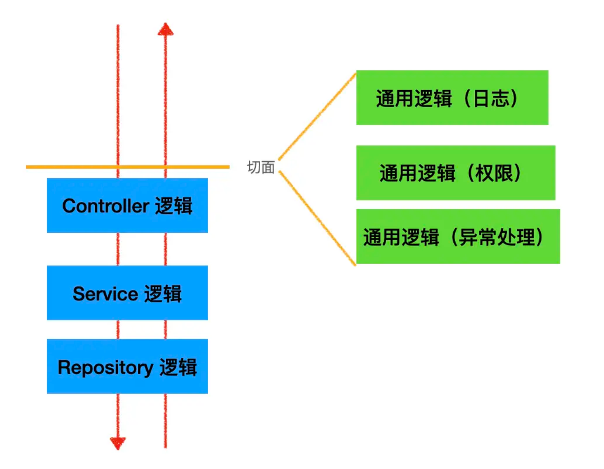

## AOP 和 OOP

- AOP：Aspect oriented programming 面向切面编程
- OOP：Object–Oriented Programming 面向对象编程

OOP 编程思想可以解决大部分的代码重复问题。但是有一些问题是处理不了的。比如在父类 Animal 中的多个方法的相同位置出现了重复的代码，OOP 就解决不了。

```js
/**
 * 动物父类
 */
public class Animal {

    /** 身高 */
    private String height;

    /** 体重 */
    private double weight;

    public void eat() {
        // 性能监控代码
        long start = System.currentTimeMillis();

        // 业务逻辑代码
        System.out.println("I can eat...");

        // 性能监控代码
        System.out.println("执行时长：" + (System.currentTimeMillis() - start)/1000f + "s");
    }

    public void run() {
        // 性能监控代码
        long start = System.currentTimeMillis();

        // 业务逻辑代码
        System.out.println("I can run...");

        // 性能监控代码
        System.out.println("执行时长：" + (System.currentTimeMillis() - start)/1000f + "s");
    }
}

```

这部分重复的代码，一般统称为 横切逻辑代码，横切逻辑代码存在的问题：
- 代码重复问题
- 横切逻辑代码和业务代码混杂在一起，代码臃肿，不变维护

AOP 另辟蹊径，提出横向抽取机制，将横切逻辑代码和业务逻辑代码分离

## AOP 为什么叫面向切面编程

- 切 ：指的是横切逻辑，原有业务逻辑代码不动，只能操作横切逻辑代码，所以面向横切逻辑

- 面 ：横切逻辑代码往往要影响的是很多个方法，每个方法如同一个点，多个点构成一个面。这里有一个面的概念

## Nestjs中AOP
> https://juejin.cn/post/7076431946834214925#heading-1

1. 一个请求过来，可能会经过 Controller（控制器）、Service（服务）、Repository（数据库访问）

2. 如果想在这个调用链路里加入一些通用逻辑该怎么加呢？比如日志记录、权限控制、异常处理等。

3. 容易想到的是直接改造 Controller 层代码，加入这段逻辑。这样可以，但是不优雅，因为这些通用的逻辑侵入到了业务逻辑里面。能不能透明的给这些业务逻辑加上日志、权限等处理呢？

4. 那是不是可以在调用 Controller 之前和之后加入一个执行通用逻辑的阶段呢？
比如这样：


这样的横向扩展点就叫做切面，这种透明的加入一些切面逻辑的编程方式就叫做 AOP （面向切面编程）

AOP 的好处是可以把一些通用逻辑分离到切面中，保持业务逻辑的存粹性，这样切面逻辑可以复用，还可以动态的增删

其实 Express 的中间件的洋葱模型也是一种 AOP 的实现，因为你可以透明的在外面包一层，加入一些逻辑，内层感知不到。

而 Nest.js 实现 AOP 的方式更多，一共有五种，包括 Middleware、Guard、Pipe、Inteceptor、ExceptionFilter

