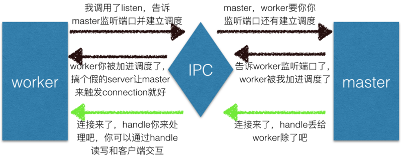
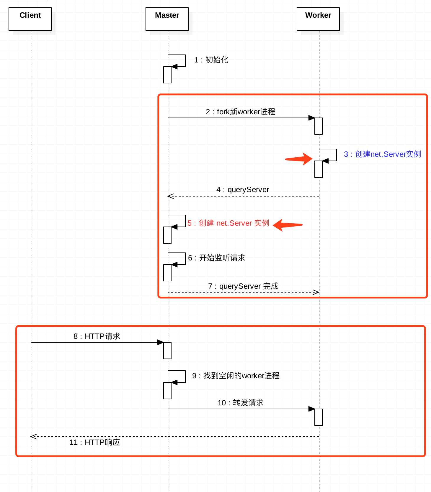
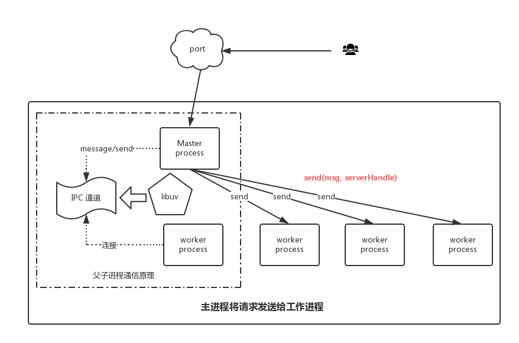
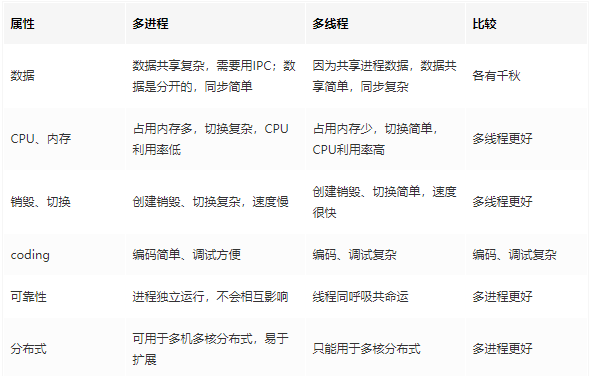

## node 多进程

在单核 CPU 系统之上我们采用 单进程 + 单线程 的模式来开发。在多核 CPU 系统之上，可以通过 `child_process.fork` 开启多个进程（Node.js 在 v0.8 版本之后新增了Cluster 来实现多进程架构） ，即 多进程 + 单线程 模式。注意：开启多进程不是为了解决高并发，主要是解决了单进程模式下 Node.js CPU 利用率不足的情况，充分利用多核 CPU 的性能。

### child_process子进程创建

*   [`child_process.spawn()`](http://nodejs.cn/s/CKoDGf) 使用给定的 `command` 衍生一个新进程，并带上 `args` 中的命令行参数，如果省略 `args`，则其默认为一个空数组。
*   [`child_process.spawnSync()`](http://nodejs.cn/s/bmkUrE) 函数则以同步的方式提供了等效的功能，但会阻塞事件循环直到衍生的进程退出或终止

*   [`child_process.exec()`](http://nodejs.cn/s/pkpJMy): 衍生一个 shell 并在该 shell 中运行命令，当完成时则将 `stdout` 和 `stderr` 传给回调函数。
*   [`child_process.execFile()`](http://nodejs.cn/s/N6uK8q): 类似于 [`child_process.exec()`](http://nodejs.cn/s/pkpJMy)，但是默认情况下它会直接衍生命令而不先衍生 shell。
*   [`child_process.fork()`](http://nodejs.cn/s/VDCJMa): 衍生一个新的 Node.js 进程，并调用一个指定的模块，该模块已建立了 IPC 通信通道，允许在父进程与子进程之间发送消息。（是 [`child_process.spawn()`](http://nodejs.cn/s/CKoDGf) 的一个特例）
*   [`child_process.execSync()`](http://nodejs.cn/s/i6KxMV): [`child_process.exec()`](http://nodejs.cn/s/pkpJMy) 的同步版本，将会阻塞 Node.js 事件循环。
*   [`child_process.execFileSync()`](http://nodejs.cn/s/ed75fU): [`child_process.execFile()`](http://nodejs.cn/s/N6uK8q) 的同步版本，将会阻塞 Node.js 事件循环。
*   
### 每种适用场景
*   `child_process.spawn()`：适用于返回大量数据，例如图像处理，二进制数据处理。
*   `child_process.exec()`：适用于小量数据，maxBuffer 默认值为 200 \* 1024 超出这个默认值将会导致程序崩溃，数据量过大可采用 spawn。
*   `child_process.execFile()`：类似 `child_process.exec()`，区别是不能通过 shell 来执行，不支持像 I/O 重定向和文件查找这样的行为
*   `child_process.fork()`： 衍生新的进程，进程之间是相互独立的，每个进程都有自己的 V8 实例、内存，系统资源是有限的，不建议衍生太多的子进程出来，通长根据系统\*\* CPU 核心数\*\*设置。`const cpus = require('os').cpus();`

## Node js 集群（cluster） 多进程

node实例是单线程作业的。在服务端编程中，利用服务器的多核的资源的话，就应该多创建几个进程，由多个进程共同提供服务，以此提升系统的吞吐率，所以通常会创建多个node实例来处理客户端的请求，对这样多个node实例，我们称之为cluster（集群）。

借助node的cluster模块，开发者可以在几乎不修改原有项目代码的前提下，获得集群服务带来的好处。利用cluster模块，使用node封装好的API、IPC通道和调度机可以非常简单的创建包括一个master进程下HTTP代理服务器 + 多个worker进程多个HTTP应用服务器的架构。

master进程通过 cluster.fork() 来创建 worker进程。cluster.fork() 内部 是通过 child_process.fork() 来创建子进程。(fork 出来的都是子进程。子进程和父进程具有相同的代码段、数据段、堆栈，但是它们的内存空间不共享。)

master进程、woker进程可以通过IPC通道进行通信。




- 子进程发消息： process.send({ cmd: 'notifyRequest' });
- 父亲去监听： cluster.workers[id].on('message', messageHandler);
- 当然也可以反过来 父进程cluster.workers[id].send消息。子进程process.on

```
const cluster = require('cluster');
const http = require('http');

if (cluster.isMaster) {

  // 跟踪 http 请求。
  let numReqs = 0;
  setInterval(() => {
    console.log(`请求的数量 = ${numReqs}`);
  }, 1000);

  // 对请求计数。
  function messageHandler(msg) {
    if (msg.cmd && msg.cmd === 'notifyRequest') {
      numReqs += 1;
    }
  }

  // 启动 worker 并监听包含 notifyRequest 的消息。
  const numCPUs = require('os').cpus().length;
  console.log(numCPUs)
  for (let i = 0; i < numCPUs; i++) {
    cluster.fork();
  }

  for (const id in cluster.workers) {
    cluster.workers[id].on('message', messageHandler);
  }

} else {
    console.log("工作进程"+process.pid)
  // 工作进程有一个 http 服务器。
  http.Server((req, res) => {
      console.log("工作进程监听"+process.pid)
    res.writeHead(200);
    res.end('123123\n');

    // 通知主进程接收到了请求。
    // 第一次参数是message 还可以有第二个参数 句柄 传递socket对象 sever对象 管道等等
    process.send({ cmd: 'notifyRequest' });
  }).listen(8000);
}

```


### IPC (内部进程通信)通道实现通信


操作系统的进程间通信方式主要有以下几种：

- 共享内存:不同进程共享同一段内存空间。通常还需要引入信号量机制，来实现同步与互斥。
- 消息传递:这种模式下，进程间通过发送、接收消息来实现信息的同步。
- 信号量:信号量简单说就是系统赋予进程的一个状态值，未得到控制权的进程会在特定地方被强迫停下来，等待可以继续进行的信号到来。如果信号量只有 0 或者 1 两个值的话，又被称作“互斥锁”。这个机制也被广泛用于各种编程模式中。
- 管道:管道本身也是一个进程，它用于连接两个进程，将一个进程的输出作为另一个进程的输入。可以用 pipe 系统调用来创建管道。我们经常用的“ | ”命令行就是利用了管道机制。


### 一个端口可以被多个进程监听？

通常来说，多个进程监听同个端口，系统会报错。


表面上看代码好像每个子进程都在监听端口，但其实这里在net模块中，listen底层做了处理，worker进程创建的server是不会对端口进行监听的。
根据当前进程是master进程，还是worker进程：

- master进程：在该端口上正常监听请求。（没做特殊处理）
- worker进程：创建server实例。然后通过IPC通道，向master进程发送消息，让master进程也创建 server 实例，并在该端口上监听请求。当请求进来时，master进程将请求转发给worker进程的server实例。

这是一种端口的共享：master进程监听特定端口，并将客户请求转发给worker进程。





### 如何进行端口共享即分发内容

父进程由于绑定了端口号，所以可以捕获连接请求，父进程的onconnection方法会被触发，onconnection方法触发时会传递TCP对象参数，由于之前父进程记录了所有的worker，所以父进程可以选择要处理请求的worker，然后通过向worker发送act为newconn的消息，并传递TCP对象，子进程监听到消息后，对传递过来的TCP对象进行封装，封装成socket，然后触发connection事件。这样就实现了子进程虽然不监听端口，但是依然可以处理用户请求的目的。


## node线程

### node 主线程是单线程的

- 主线程是单线程（异步），将后续的逻辑写成函数，传入到当前执行的函数中，当执行的函数得到了结果后，执行传入的函数`（回调函数）`。
- i/o操作，读写操作，异步读写（能用异步绝不用同步） `非阻塞式i/o`，即可以异步读写?
- event-driven`事件驱动`（发布订阅）。

### Node.js是单线程的，那么Node.js启动后线程数不是1？

线程数不为1，不是因为线程池，而是因为V8。Node.js启动后会创建V8实例，V8实例是多线程的，V8中的线程有：

*   主线程：获取代码、编译执行
*   编译线程：主线程执行的时候，可以优化代码
*   Profiler线程：记录哪些方法耗时，为优化提供支持
*   其他线程：用于垃圾回收清除工作，因为是多个线程，所以可以并行清除

### Node线程池

- 网络IO不会占用线程池
- 大多数的文件IO会占用线程池的线程（\*Sync会阻塞主线程不会用线程池）
- Node.js对一些CPU密集的操作也会放到线程池里面执行(Crypto、Zlib模块)

 
### 同步 异步 阻塞 非阻塞 

**注意：`同步、异步`是被调用者的状态，`阻塞、非阻塞`是调用者的状态、消息**

*   同步：即为调用者等待被调用者这个过程，如果被调用者一直不反回结果，调用者就会一直等待，这就是同步，**同步有返回值**
*   异步：即为调用者不等待被调用者是否返回，被调用者执行完了就会通过状态、通知或者回调函数给调用者，**异步没有返回值**
*   阻塞：指代当前线程在结果返回之前会被挂起，不会继续执行下去（可以理解为由于遇到了障碍而造成的动弹不得）
*   非阻塞： 即当前线程不管你返回什么，都会继续往下执行

| 组合 | 表现 | 结果 |  |
| --- | --- | --- | --- |
| 同步阻塞 | 得不到结果不返回，线程进入阻塞态等待 |一个线程在等待  |  |
|  同步非阻塞|  得不到结果不返回，线程不阻塞一直在CPU运行| 一个线程在正常运行 |  |
|  异步阻塞| 去到别的线程，让别的线程阻塞起来等待结果，自己不阻塞 | 多个线程都在等待 |  |
|  异步非阻塞|  去到别的线程，别的线程一直在运行，直到得出结果| 多个线程都在正常运行 |  |


### 并发 并行


**并发**是指一个时间段内，有几个程序都在同一个CPU上运行，但任意一个时刻点上只有一个程序在处理机上运行。

**并行**是指一个时间段内，有几个程序都在几个CPU上运行，任意一个时刻点上，有多个程序在同时运行，并且多道程序之间互不干扰。

  


## Node.js的运行机制


*   V8引擎解析JavaScript脚本。
*   解析后的代码，调用Node API。
*   libuv库负责Node API的执行。它将不同的任务分配给不同的线程，形成一个Event Loop（事件循环），以异步的方式将任务的执行结果返回给V8引擎。
*   V8引擎再将结果返回给用户。

## 多线程多进程对比




### node内部揭秘
https://segmentfault.com/a/1190000014926921#articleHeader5
  


