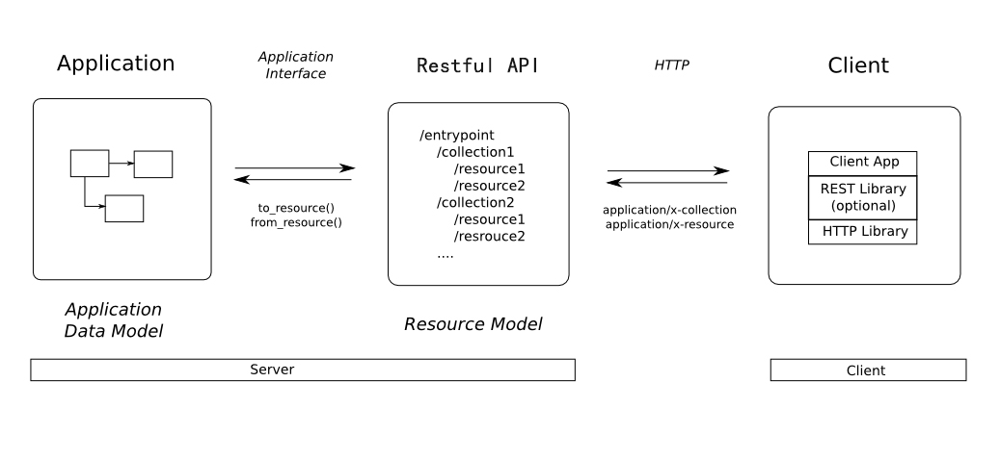

## REST 

REpresentational State Transfer 表现层状态转移

全称是Resource Representational State Transfer
通俗来讲就是：资源在网络中以某种表现形式进行状态转移

* Resource：资源，即数据（前面说过网络的核心）。比如 newsfeed，friends等；
* Representational：某种表现形式，比如用JSON，XML，JPEG等；
* State Transfer：状态变化。通过HTTP动词实现。

### REST本身不实用
REST描述的是在网络中client和server的一种交互形式；REST本身不实用，实用的是如何设计 RESTful API（REST风格的网络接口）；

### RESTful API
Server提供的RESTful API中，URL中只使用名词来指定资源，原则上不使用动词。“资源”是REST架构或者说整个网络处理的核心。
比如：
http://api.qc.com/v1/newsfeed: 获取某人的新鲜;
http://api.qc.com/v1/friends: 获取某人的好友列表;
http://api.qc.com/v1/profile: 获取某人的详细信息;

### HTTP动词来
用HTTP协议里的动词来实现资源的添加，修改，删除等操作。
即通过HTTP动词来实现资源的状态扭转：
* GET 用来获取资源
* POST 用来新建资源（也可以用于更新资源）
* PUT 用来更新资源
* DELETE 用来删除资源

### 资源表现形式 与 序列化
Server和Client之间传递某资源的一个表现形式，比如用JSON，XML传输文本，或者用JPG，WebP传输图片等。当然还可以压缩HTTP传输时的数据（on-wire data compression）。

确保序列化和反序列化方法的实现，是开发RESTful API最重要的一步准备工作

Serialization 和 Deserialization即序列化和反序列化。RESTful API以规范统一的格式作为数据的载体，常用的格式为json或xml，以json格式为例，当客户端向服务器发请求时，或者服务器相应客户端的请求，向客户端返回数据时，都是传输json格式的文本，而在服务器内部，数据处理时基本不用json格式的字符串，而是native类型的数据，最典型的如类的实例，即对象（object）

### Validation即数据校验

Validation虽然是RESTful API 编写中的一个可选项，但它对API的安全、服务器的开销和交互的友好性而言，都具有重要意义，因此，Gevin建议，开发一套完善的RESTful API时，Validation的实现必不可少。

### Authentication 和 Permission

Authentication指用户认证，Permission指权限机制，这两点是使RESTful API 强大、灵活和安全的基本保障。
常用的认证机制是Basic Auth和OAuth，RESTful API 开发中，除非API非常简单，且没有潜在的安全性问题，否则，认证机制是必须实现的，并应用到API中去。Basic Auth非常简单，很多框架都集成了Basic Auth的实现，自己写一个也能很快搞定，OAuth目前已经成为企业级服务的标配，其相关的开源实现方案非常丰富（更多）。

### 状态码
 用 HTTP Status Code传递Server的状态信息。比如最常用的 200 表示成功，500 表示Server内部错误等。

 ## RESTful 大白话

* 看Url就知道要什么
* 看http method就知道干什么
* 看http status code就知道结果如何

## 参考
- https://juejin.im/post/57d168e9bf22ec005f98a3a5#heading-0