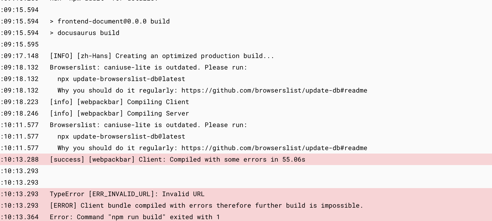

## Local

[Local success](../Local/Local.md)

www.baidu.com

## Vercel

```bash
[17:15:27.395] Cloning github.com/jianjiachenghub/frontend-document (Branch: main, Commit: 4c66c73)
[17:15:27.712] Previous build cache not available
[17:15:34.316] Cloning completed: 6.920s
[17:15:34.702] Running "vercel build"
[17:15:35.136] Vercel CLI 28.13.2
[17:15:35.886] Warning: Detected "engines": { "node": ">=16.14" } in your `package.json` that will automatically upgrade when a new major Node.js Version is released. Learn More: http://vercel.link/node-version
[17:15:35.893] Running "install" command: `npm install`...
[17:15:41.471] npm WARN deprecated stable@0.1.8: Modern JS already guarantees Array#sort() is a stable sort, so this library is deprecated. See the compatibility table on MDN: https://developer.mozilla.org/en-US/docs/Web/JavaScript/Reference/Global_Objects/Array/sort#browser_compatibility
[17:16:01.347] 
[17:16:01.347] added 1086 packages, and audited 1087 packages in 25s
[17:16:01.505] 
[17:16:01.505] 27 vulnerabilities (9 moderate, 17 high, 1 critical)
[17:16:01.505] 
[17:16:01.505] To address issues that do not require attention, run:
[17:16:01.505]   npm audit fix
[17:16:01.505] 
[17:16:01.505] Some issues need review, and may require choosing
[17:16:01.506] a different dependency.
[17:16:01.506] 
[17:16:01.506] Run `npm audit` for details.
[17:16:01.851] 
[17:16:01.851] > frontend-document@0.0.1 build
[17:16:01.851] > docusaurus build
[17:16:01.851] 
[17:16:03.409] [INFO] [zh-Hans] Creating an optimized production build...
[17:16:04.539] [info] [webpackbar] Compiling Client
[17:16:04.562] [info] [webpackbar] Compiling Server
[17:17:00.409] [success] [webpackbar] Client: Compiled with some errors in 55.87s
[17:17:00.415] 
[17:17:00.415] 
[17:17:00.415] TypeError [ERR_INVALID_URL]: Invalid URL
[17:17:00.415] [ERROR] Client bundle compiled with errors therefore further build is impossible.
[17:17:00.482] Error: Command "npm run build" exited with 1
```

