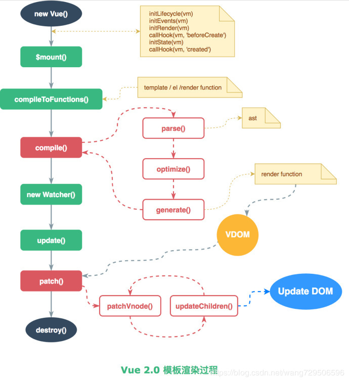
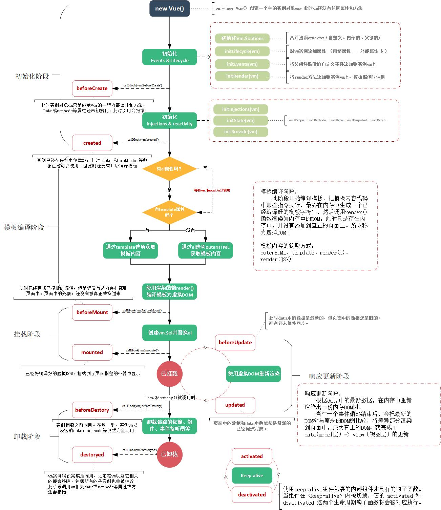
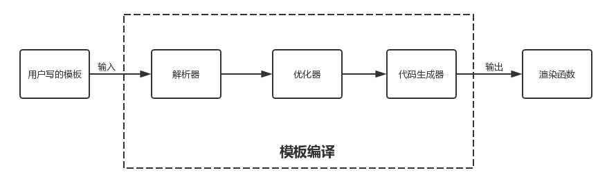
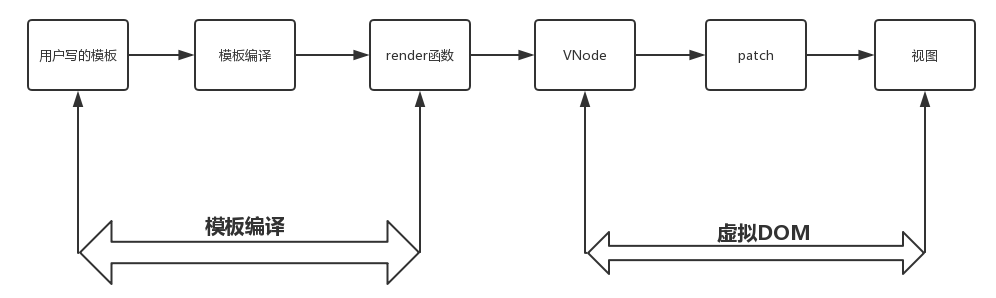
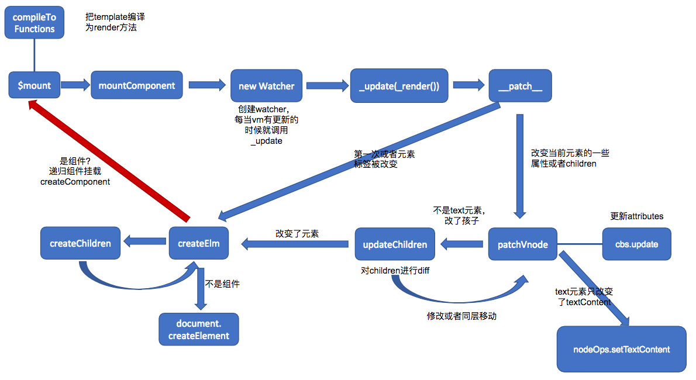
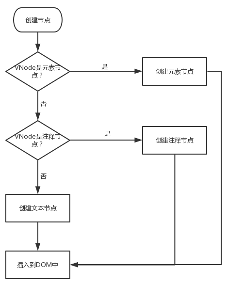
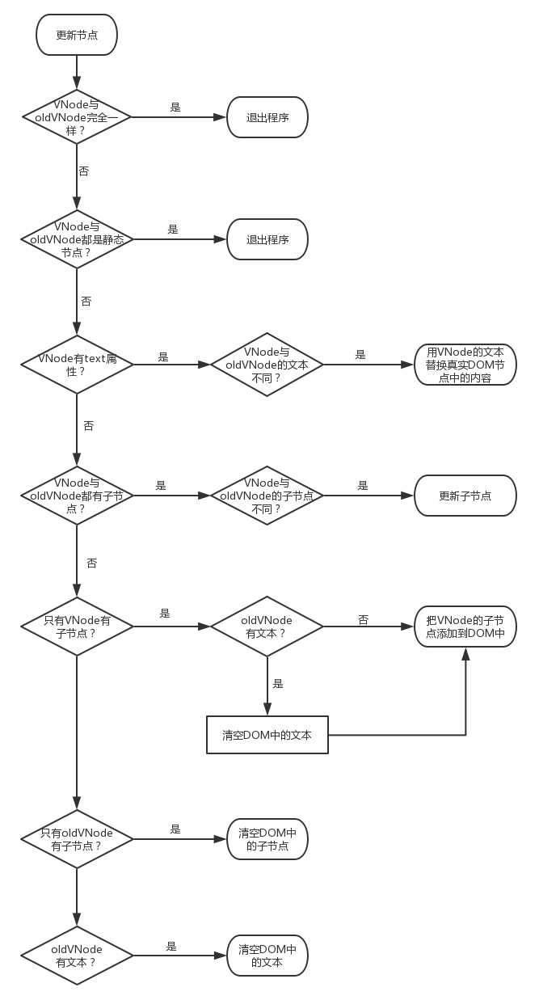
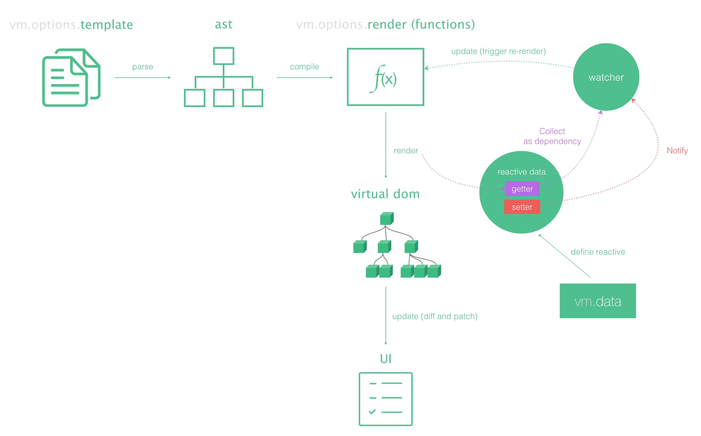

## Vue 渲染更新流程





## 源码构建，基于 Rollup 

### 运行时 Runtime Only

通常需要借助如 webpack 的 vue-loader 工具把 .vue 文件编译成JavaScript，因为是在编译阶段做的，所以它只包含运行时的 Vue.js 代码，因此代码体积也会更轻量。

### 运行加编译 Runtime + Compiler

没有对代码做预编译，但又使用了 Vue 的 template 属性并传入一个字符串，则需要在客户端编译模板，这里就需要内置编译器代码量会比Runtime Only要多。
Vue.js 2.0 中，最终渲染都是通过 render 函数，如果写 template 属性，则需要编译成 render 函数，那么这个编译过程会发生运行时，所以需要带有编译器的版本。  

## Vue 的本质

vue 本质上就是一个用 Function 实现的 Class，然后在它的原型 prototype 以及它本身上扩展了一系列的方法和属性。

Vue 不用 ES6 的 Class 去实现的原因：按功能区分，把功能扩展分散到多个模块中去实现，然后挂载中 vue 的原型 prototype 上，也有在 Vue 这个对象本身上。                                                       
而不是在一个模块里实现所有，这种方式是用 Class 难以实现的。这么做的好处是非常方便代码的维护和管理。

## new Vue

通过 new 关键字初始化，然后会调用 this._init 方法
```js
function Vue (options) {
  if (process.env.NODE_ENV !== 'production' &&
    !(this instanceof Vue)
  ) {
    warn('Vue is a constructor and should be called with the `new` keyword')
  }
  this._init(options)
}
```
合并配置，初始化生命周期，初始化事件中心，初始化渲染，初始化 data、props、computed、watcher

- options 会合并挂载到$options
```js
Vue.prototype._init = function (options?: Object) {
  const vm: Component = this
  // a uid
  vm._uid = uid++

  let startTag, endTag
  /* istanbul ignore if */
  if (process.env.NODE_ENV !== 'production' && config.performance && mark) {
    startTag = `vue-perf-start:${vm._uid}`
    endTag = `vue-perf-end:${vm._uid}`
    mark(startTag)
  }

  // a flag to avoid this being observed
  vm._isVue = true
  // merge options
  if (options && options._isComponent) {
    // optimize internal component instantiation
    // since dynamic options merging is pretty slow, and none of the
    // internal component options needs special treatment.
    initInternalComponent(vm, options)
  } else {
    vm.$options = mergeOptions(
      resolveConstructorOptions(vm.constructor),
      options || {},
      vm
    )
  }
  /* istanbul ignore else */
  if (process.env.NODE_ENV !== 'production') {
    initProxy(vm)
  } else {
    vm._renderProxy = vm
  }
  // expose real self
  vm._self = vm
  initLifecycle(vm)//初始化生命周期
  initEvents(vm)//初始化事件中心
  initRender(vm)// 初始化渲染
  callHook(vm, 'beforeCreate')//调用生命周期钩子函数
  initInjections(vm) // resolve injections before data/props
  initState(vm)// 初始化props,methods,data,computed,watch（响应式的关键
  initProvide(vm) // 初始化 provide
  callHook(vm, 'created') // 这里创建完了再调用钩子函数

  /* istanbul ignore if */
  if (process.env.NODE_ENV !== 'production' && config.performance && mark) {
    vm._name = formatComponentName(vm, false)
    mark(endTag)
    measure(`vue ${vm._name} init`, startTag, endTag)
  }

  if (vm.$options.el) {
    vm.$mount(vm.$options.el)
  }
}
```


## Vue 实例挂载 $mount

$mount 这个方法的实现是和平台、构建方式都相关的。我们分析带 compiler 版本的 $mount 实现。在 Vue 2.0 版本中，所有 Vue 的组件最终都会转换成 render 方法。
```
const mount = Vue.prototype.$mount
Vue.prototype.$mount = function (
  el?: string | Element,
  hydrating?: boolean
): Component {
  el = el && query(el)
  if (el === document.body || el === document.documentElement) {
    process.env.NODE_ENV !== 'production' && warn(
      `Do not mount Vue to <html> or <body> - mount to normal elements instead.`
    )
    return this
  }
  const options = this.$options
  if (!options.render) {
    let template = options.template
    if (template) {
      if (typeof template === 'string') {
        if (template.charAt(0) === '#') {
          template = idToTemplate(template)
          /* istanbul ignore if */
          if (process.env.NODE_ENV !== 'production' && !template) {
            warn(
              `Template element not found or is empty: ${options.template}`,
              this
            )
          }
        }
      } else if (template.nodeType) {
        template = template.innerHTML
      } else {
        if (process.env.NODE_ENV !== 'production') {
          warn('invalid template option:' + template, this)
        }
        return this
      }
    } else if (el) {
      template = getOuterHTML(el)
    }
    if (template) {
      if (process.env.NODE_ENV !== 'production' && config.performance && mark) {
        mark('compile')
      }
      const { render, staticRenderFns } = compileToFunctions(template, {
        shouldDecodeNewlines,
        shouldDecodeNewlinesForHref,
        delimiters: options.delimiters,
        comments: options.comments
      }, this)
      options.render = render
      options.staticRenderFns = staticRenderFns
      if (process.env.NODE_ENV !== 'production' && config.performance && mark) {
        mark('compile end')
        measure(`vue ${this._name} compile`, 'compile', 'compile end')
      }
    }
  }
  return mount.call(this, el, hydrating)
}
```
- 1. 它对 el 做了限制，Vue 不能挂载在 body、html 这样的根节点上。
- 2. 如果没有定义 render 方法，则会调用 compileToFunctions 方法把 el 或者 template 字符串转换成 render 方法。
- 3. mountComponent：核心就是先实例化一个渲染Watcher，在它的回调函数中会调用 updateComponent 方法，在此方法中调用 vm._render 方法先生成虚拟 Node，最终调用 vm._update 更新 DOM。
- 4. 将 vm._isMounted 设置为 true，表示已经挂载
- 5. 执行 mounted 钩子函数：callHook(vm, 'mounted')


$mount 方法实际上会去调用 mountComponent 方法，这个方法定义在 src/core/instance/lifecycle.js 文件中：

```
export function mountComponent (
  vm: Component,
  el: ?Element,
  hydrating?: boolean
): Component {
  vm.$el = el
  if (!vm.$options.render) {
    vm.$options.render = createEmptyVNode
    if (process.env.NODE_ENV !== 'production') {
      /* istanbul ignore if */
      if ((vm.$options.template && vm.$options.template.charAt(0) !== '#') ||
        vm.$options.el || el) {
        warn(
          'You are using the runtime-only build of Vue where the template ' +
          'compiler is not available. Either pre-compile the templates into ' +
          'render functions, or use the compiler-included build.',
          vm
        )
      } else {
        warn(
          'Failed to mount component: template or render function not defined.',
          vm
        )
      }
    }
  }
  callHook(vm, 'beforeMount')

  let updateComponent
  /* istanbul ignore if */
  if (process.env.NODE_ENV !== 'production' && config.performance && mark) {
    updateComponent = () => {
      const name = vm._name
      const id = vm._uid
      const startTag = `vue-perf-start:${id}`
      const endTag = `vue-perf-end:${id}`

      mark(startTag)
      const vnode = vm._render()
      mark(endTag)
      measure(`vue ${name} render`, startTag, endTag)

      mark(startTag)
      vm._update(vnode, hydrating)
      mark(endTag)
      measure(`vue ${name} patch`, startTag, endTag)
    }
  } else {
    updateComponent = () => {
      vm._update(vm._render(), hydrating)
    }
  }


  new Watcher(vm, updateComponent, noop, {
    before () {
      if (vm._isMounted) {
        callHook(vm, 'beforeUpdate')
      }
    }
  }, true /* isRenderWatcher */)
  hydrating = false

 
  if (vm.$vnode == null) {
    vm._isMounted = true
    callHook(vm, 'mounted')
  }
  return vm
}
```

mountComponent 核心就是先实例化一个渲染Watcher，在它的回调函数中会调用 updateComponent 方法，在此方法中调用 vm._render 方法先生成虚拟 Node，最终调用 vm._update 更新 DOM。

Watcher 在这里起到两个作用，一个是初始化的时候会执行回调函数，另一个是当 vm 实例中的监测的数据发生变化的时候执行回调函数

在初始化阶段各项工作做完之后调用了vm.$mount方法，该方法的调用标志着初始化阶段的结束和进入下一个阶段，从官方文档给出的生命周期流程图中可以看到，下一个阶段就进入了模板编译阶段，该阶段所做的主要工作是获取到用户传入的模板内容并将其编译成渲染函数。


## compile

在 Vue 2.0 版本中，所有 Vue 的组件的渲染最终都需要 render 方法，无论我们是用单文件 .vue 方式开发组件，还是写了 el 或者 template 属性，最终都会转换成 render 方法，那么这个过程是 Vue 的一个“在线编译”的过程，它是调用 compileToFunctions 方法实现的。

Vue对象上有一个全局函数compile，在src/entries/web-runtime-with-compiler.js中。




compile 编译可以分成 parse-解析器、optimize-优化器 与 generate-生成器 三个阶段，最终需要得到 render function。

- parse:Vue使用HTML的Parser将HTML模板解析为AST
- optimizer:对AST进行一些优化static静态节点的标记处理，提取最大的静态树，当_update更新界面时，会有一个patch的过程，diff算法会直接跳过静态节点，从而减少了patch的过程，优化了patch的性能
- generateCode:根据 AST 生成 render 函数


## 抽象语法树（AbstractSyntaxTree，AST）

简称语法树（Syntax tree），是源代码语法结构的一种抽象表示。它以树状的形式表现编程语言的语法结构，树上的每个节点都表示源代码中的一种结构。之所以说语法是“抽象”的，是因为这里的语法并不会表示出真实语法中出现的每个细节。比如，嵌套括号被隐含在树的结构中，并没有以节点的形式呈现；而类似于if-condition-then这样的条件跳转语句，可以使用带有两个分支的节点来表示。
如下的html结构
```
<div :class="c" class="demo" v-if="isShow">
    <span v-for="item in sz">{{item}}</span>
</div>
```
首先会转化成字符：
```
var html = '<div :class="c" class="demo" v-if="isShow"><span v-for="item in sz">{{item}}</span></div>';
```
parse后：
- 字符串解析为AST可以使用正则来实现

通常模板内会包含如下内容：
```
文本，例如“难凉热血”
HTML注释，例如<!-- 我是注释 -->
条件注释，例如<!-- [if !IE]> -->我是注释<!--< ![endif] -->
DOCTYPE，例如<!DOCTYPE html>
开始标签，例如<div>
结束标签，例如</div>
```
这几种内容都有其各自独有的特点，也就是说我们要根据不同内容所具有的不同的的特点通过编写不同的正则表达式将这些内容从模板字符串中一一解析出来，然后再把不同的内容做不同的处理。

- 标签的的匹配可以用栈来实现,这样就确保的AST层级的关系
- 属性存入attrsMap
- 内部会有专门解析v-if等指令的函数，然后解析挂载ifConditions，forProcessed等属性
```
{
    /* 标签属性的map，记录了标签上属性 */
    'attrsMap': {
        ':class': 'c',
        'class': 'demo',
        'v-if': 'isShow'
    },
    /* 解析得到的:class */
    'classBinding': 'c',
    /* 标签属性v-if */
    'if': 'isShow',
    /* v-if的条件 */
    'ifConditions': [
        {
            'exp': 'isShow'
        }
    ],
    /* 标签属性class */
    'staticClass': 'demo',
    /* 标签的tag */
    'tag': 'div',
    /* 子标签数组 */
    'children': [
        {
            'attrsMap': {
                'v-for': "item in sz"
            },
            /* for循环的参数 */
            'alias': "item",
            /* for循环的对象 */
            'for': 'sz',
            /* for循环是否已经被处理的标记位 */
            'forProcessed': true,
            'tag': 'span',
            'children': [
                {
                    /* 表达式，_s是一个转字符串的函数 */
                    'expression': '_s(item)',
                    'text': '{{item}}'
                }
            ]
        }
    ]
}

```

optimize后：
经过 optimize 这层的处理，每个节点会加上 static 属性，用来标记是否是静态的
```
{
    'attrsMap': {
        ':class': 'c',
        'class': 'demo',
        'v-if': 'isShow'
    },
    'classBinding': 'c',
    'if': 'isShow',
    'ifConditions': [
        'exp': 'isShow'
    ],
    'staticClass': 'demo',
    'tag': 'div',
    /* 静态标志 */
    'static': false,
    'children': [
        {
            'attrsMap': {
                'v-for': "item in sz"
            },
            'static': false,
            'alias': "item",
            'for': 'sz',
            'forProcessed': true,
            'tag': 'span',
            'children': [
                {
                    'expression': '_s(item)',
                    'text': '{{item}}',
                    'static': false
                }
            ]
        }
    ]
}
```
然后再调用代码生成函数generate把编译成AST的模板转化为render函数
```
<ul :class="bindCls" class="list" v-if="isShow">
    <li v-for="(item,index) in data" @click="clickItem(index)">{{item}}:{{index}}</li>
</ul>
```
const code = generate(ast, options)，生成的 render 代码串如下：
with的作用是缩短属性的访问，with里的变量全部都是从传入的上下文上去取。

```
with(this){
  return (isShow) ?
    _c('ul', {
        staticClass: "list",
        class: bindCls
      },
      _l((data), function(item, index) {
        return _c('li', {
          on: {
            "click": function($event) {
              clickItem(index)
            }
          }
        },
        [_v(_s(item) + ":" + _s(index))])
      })
    ) : _e()
}
```

这里还有很多工具函数比如 _c 函数定义在 src/core/instance/render.js 中。
这个是createElement的缩写，createElement会根据解析类型生成不同的虚拟DOM
```
vm._c = (a, b, c, d) => createElement(vm, a, b, c, d, false)
```
而 _l、_v 定义在 src/core/instance/render-helpers/index.js 中：
```
export function installRenderHelpers (target: any) {
  target._o = markOnce
  target._n = toNumber
  target._s = toString
  target._l = renderList
  target._t = renderSlot
  target._q = looseEqual
  target._i = looseIndexOf
  target._m = renderStatic
  target._f = resolveFilter
  target._k = checkKeyCodes
  target._b = bindObjectProps
  target._v = createTextVNode
  target._e = createEmptyVNode
  target._u = resolveScopedSlots
  target._g = bindObjectListeners
}

```

注意上面的只是代码串，是字符类型，现在需要转化为function才能调用

```
const compiled = compile(template, options)
res.render = createFunction(compiled.render, fnGenErrors)

function createFunction (code, errors) {
  try {
    return new Function(code)
  } catch (err) {
    errors.push({ err, code })
    return noop
  }
}
```
赋值给 vm.options.render，这样当组件通过 vm._render 的时候，就会执行这个 render 函数


## Render 函数

Vue 的 _render 方法是实例的一个私有方法，最终会把实例渲染成一个虚拟 Node。
vm._render 最终是通过执行 createElement 方法并返回的是 vnode，它是一个虚拟 Node。


## VNode类

VNode类中包含了描述一个真实DOM节点所需要的一系列属性，如tag表示节点的标签名，text表示节点中包含的文本，children表示该节点包含的子节点等。通过属性之间不同的搭配，就可以描述出各种类型的真实DOM节点。

```
// 源码位置：src/core/vdom/vnode.js

export default class VNode {
  constructor (
    tag?: string,
    data?: VNodeData,
    children?: ?Array<VNode>,
    text?: string,
    elm?: Node,
    context?: Component,
    componentOptions?: VNodeComponentOptions,
    asyncFactory?: Function
  ) {
    this.tag = tag                                /*当前节点的标签名*/
    this.data = data        /*当前节点对应的对象，包含了具体的一些数据信息，是一个VNodeData类型，可以参考VNodeData类型中的数据信息*/
    this.children = children  /*当前节点的子节点，是一个数组*/
    this.text = text     /*当前节点的文本*/
    this.elm = elm       /*当前虚拟节点对应的真实dom节点*/
    this.ns = undefined            /*当前节点的名字空间*/
    this.context = context          /*当前组件节点对应的Vue实例*/
    this.fnContext = undefined       /*函数式组件对应的Vue实例*/
    this.fnOptions = undefined
    this.fnScopeId = undefined
    this.key = data && data.key           /*节点的key属性，被当作节点的标志，用以优化*/
    this.componentOptions = componentOptions   /*组件的option选项*/
    this.componentInstance = undefined       /*当前节点对应的组件的实例*/
    this.parent = undefined           /*当前节点的父节点*/
    this.raw = false         /*简而言之就是是否为原生HTML或只是普通文本，innerHTML的时候为true，textContent的时候为false*/
    this.isStatic = false         /*静态节点标志*/
    this.isRootInsert = true      /*是否作为跟节点插入*/
    this.isComment = false             /*是否为注释节点*/
    this.isCloned = false           /*是否为克隆节点*/
    this.isOnce = false                /*是否有v-once指令*/
    this.asyncFactory = asyncFactory
    this.asyncMeta = undefined
    this.isAsyncPlaceholder = false
  }

  get child (): Component | void {
    return this.componentInstance
  }
}
```

## _update

Vue 的 _update 是实例的一个私有方法，它被调用的时机有 2 个，一个是首次渲染，一个是数据更新的时候；定义在src/core/instance/lifecycle.js

_update 方法的作用是把 VNode 渲染成真实的 DOM，也就是调用patch方法
```
Vue.prototype._update = function (vnode: VNode, hydrating?: boolean) {
  const vm: Component = this
  const prevEl = vm.$el
  const prevVnode = vm._vnode
  const prevActiveInstance = activeInstance
  activeInstance = vm
  vm._vnode = vnode
  // Vue.prototype.__patch__ is injected in entry points
  // based on the rendering backend used.
  if (!prevVnode) {
    // initial render
    vm.$el = vm.__patch__(vm.$el, vnode, hydrating, false /* removeOnly */)
  } else {
    // updates
    vm.$el = vm.__patch__(prevVnode, vnode)
  }
  activeInstance = prevActiveInstance
  // update __vue__ reference
  if (prevEl) {
    prevEl.__vue__ = null
  }
  if (vm.$el) {
    vm.$el.__vue__ = vm
  }
  // if parent is an HOC, update its $el as well
  if (vm.$vnode && vm.$parent && vm.$vnode === vm.$parent._vnode) {
    vm.$parent.$el = vm.$el
  }
  // updated hook is called by the scheduler to ensure that children are
  // updated in a parent's updated hook.
}
```

##  Virtual DOM（虚拟 dom）:  本质上是一个原生的 JS 对象

为什么要使用虚拟dom，首先可以减小开销，在虚拟dom相当于一层缓冲，所有的修改都现在虚拟dom上，也就是对js对象的操作，这开销很小，然后再根据差异一起更新到真实的DOM上。

因为使用了 Virtual DOM 的原因，Vue.js还具有了跨平台的能力



### 创建

```
<template>
  <span class="demo" v-show="isShow">
    This is a span.
  </span>
</template>
```
编译后在生成代码（简化了调用createElement然后return new VNode的逻辑）：
```
function render () {
    return new VNode(
        'span',
        {
            /* 指令集合数组 */
            directives: [
                {
                    /* v-show指令 */
                    rawName: 'v-show',
                    expression: 'isShow',
                    name: 'show',
                    value: true
                }
            ],
            /* 静态class */
            staticClass: 'demo'
        },
        [ new VNode(undefined, undefined, undefined, 'This is a span.') ]
    );
}
```
最后的返回：
```
{
    tag: 'span',
    data: {
        /* 指令集合数组 */
        directives: [
            {
                /* v-show指令 */
                rawName: 'v-show',
                expression: 'isShow',
                name: 'show',
                value: true
            }
        ],
        /* 静态class */
        staticClass: 'demo'
    },
    text: undefined,
    children: [
        /* 子节点是一个文本VNode节点 */
        {
            tag: undefined,
            data: undefined,
            text: 'This is a span.',
            children: undefined
        }
    ]
}
```


### 比对 - patch - diff

VNode最大的用途就是在数据变化前后生成真实DOM对应的虚拟DOM节点，然后就可以对比新旧两份VNode，找出差异所在，然后更新有差异的DOM节点，最终达到以最少操作真实DOM更新视图的目的。而对比新旧两份VNode并找出差异的过程就是所谓的DOM-Diff过程。

以新的VNode为基准，改造旧的oldVNode使之成为跟新的VNode一样，这就是patch过程要干的事。

整个patch无非就是干三件事（这是对比虚拟树后会对真实树做的事情）：

- 创建节点：新的VNode中有而旧的oldVNode中没有，就在旧的oldVNode中创建。
- 删除节点：新的VNode中没有而旧的oldVNode中有，就从旧的oldVNode中删除。
- 更新节点：新的VNode和旧的oldVNode中都有，就以新的VNode为准，更新旧的oldVNode。
- 新老节点均有children子节点，则对子节点进行diff操作，调用updateChildren，这个updateChildren也是diff的核心。

比较新旧节点，一边比对一边给真实DOM打补丁

当不是第一次渲染的时候，就会执行到另外的逻辑，然后oldVnode是否为真实的DOM，如果不是，并且新老VNode不相同，就执行patchVnode。如果符合sameVnode，就不会渲染vnode重新创建DOM节点，而是在原有的DOM节点上进行修补，尽可能复用原有的DOM节点。如果两个节点相同则直接返回.




### 创建节点 - createElm 

VNode的节点类型判断：
- 是否有tag属性 有就是元素节点
- isComment 判断是否是注释
- 前两个都不是那就是文本节点
确定类型了后调用不同的creatNode方法来往真实的DOM结构里插
```
// 源码位置: /src/core/vdom/patch.js
function createElm (vnode, parentElm, refElm) {
    const data = vnode.data
    const children = vnode.children
    const tag = vnode.tag
    if (isDef(tag)) {
      	vnode.elm = nodeOps.createElement(tag, vnode)   // 创建元素节点
        createChildren(vnode, children, insertedVnodeQueue) // 创建元素节点的子节点
        insert(parentElm, vnode.elm, refElm)       // 插入到DOM中
    } else if (isTrue(vnode.isComment)) {
      vnode.elm = nodeOps.createComment(vnode.text)  // 创建注释节点
      insert(parentElm, vnode.elm, refElm)           // 插入到DOM中
    } else {
      vnode.elm = nodeOps.createTextNode(vnode.text)  // 创建文本节点
      insert(parentElm, vnode.elm, refElm)           // 插入到DOM中
    }
  }
```



### 删除节点
如果某些节点再新的VNode中没有而在旧的oldVNode中有，那么就需要把这些节点从旧的oldVNode中删除。删除节点非常简单，只需在要删除节点的父元素上调用removeChild方法即可。源码如下：
```
function removeNode (el) {
    const parent = nodeOps.parentNode(el)  // 获取父节点
    if (isDef(parent)) {
      nodeOps.removeChild(parent, el)  // 调用父节点的removeChild方法
    }
  }
```

### 更新节点

更新节点就是当某些节点在新的VNode和旧的oldVNode中都有时，我们就需要细致比较一下，找出不一样的地方进行更新。

首先了解静态节点，也就是和数据无关，Vue通过数据驱动，更新的时候那些没有用到数据的自然就不会比对，因为不会变化如：
```
<p>我是不会变化的文字</p>
```

- 静态节点则直接跳过，无需处理。
- 文本节点不同（包括以前是元素）直接改成newNode的文本
- 新元素节点包含子节点：
  - 如果旧的节点里也包含了子节点，那就需要递归对比更新子节点（里面有很多优化处理主要是Key
  - 如果旧的节点里不包含子节点，那么这个旧节点有可能是空节点或者是文本节点
  - 如果旧的节点是空节点就把新的节点里的子节点创建一份然后插入到旧的节点里面
  - 如果旧的节点是文本节点，则把文本清空，然后把新的节点里的子节点创建一份然后插入到旧的节点里面。
-  新元素节点不包含子节点：说明该节点是个空节点，不管旧节点之前里面都有啥，直接清空即可。
  



## 响应式

首先我们说说什么是响应式。通过某种方法可以达到数据变了可以自由定义对应的响应就叫响应式。




## 与 React diff 对比

## 对比的颗粒度

周所周知，Vue通过数据绑定来修改视图，当某个数据被修改的时候，set方法会让闭包中的Dep调用notify通知所有订阅者Watcher，Watcher通过get方法执行vm._update(vm._render(), hydrating)。
在Vue1.0中采用了极高的细粒度，每一个属性绑定一个对应的watcher实例，进行观察状态的变化，但是当状态越多的节点被使用时，会有一些内存开销以及一些依赖追踪的开销。
Vue1X是所有使用劫持数据（data）里的元素都会绑定一个Watcher，但是这样Watcher多了后也会有性能问题。

Vue2X是一个组件对应一个watcher，那么自然data改变通知的是组件的watcher。
在Vue2.0以后，引入了虚拟DOM，为单个组件设置一个watcher实例，即使组件内有10个节点，里面状态发生变化时，只会通知到组件，然后组件内部通过虚拟DOM进行对比和渲染。

## 一些比较重要的点
为什么新老虚拟dom的diff算法，采用头尾4个指针，并向中间靠拢的这种方式来查找新老虚拟dom中相同的节点
因为我们在实际需求中，对页面进行的操作往往是在列表的开头或结尾增加了一个元素或者删除了一个元素，所以我们要查找新老两个虚拟dom中相同的节点的时候，可以先分别查一下：

新虚拟dom的开头节点和老虚拟dom的开头节点是否相同
新虚拟dom的结尾节点和老虚拟dom的结尾节点是否相同
新虚拟dom的开头节点和老虚拟dom的结尾节点是否相同
新虚拟dom的结尾节点和老虚拟dom的开头节点是否相同

一般通过以上的查找就能吵到相同的节点了，如果还查不到，则只能采用暴力循环的方法，将新虚拟dom中的开头节点与老虚拟dom中的节点一一比较，来查找相同的节点。所以采用两个双指针的方法可以减少很多循环，提升页面性能。


对比react ： https://juejin.im/post/5e9faa8fe51d4546fe263eda#heading-8

一些比较重要的点：https://juejin.im/post/5e34190a6fb9a02fef3a70d2#heading-2