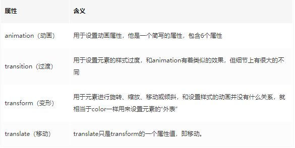
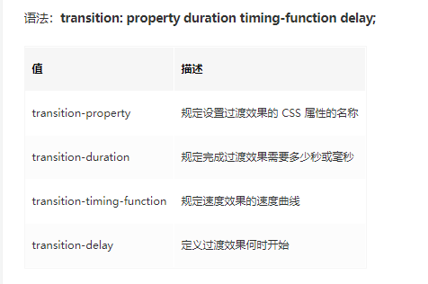
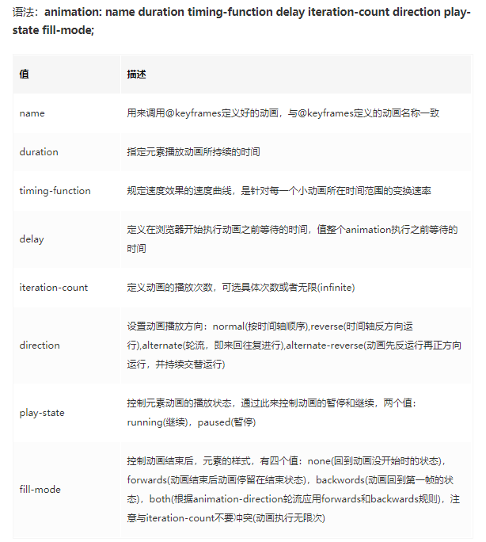
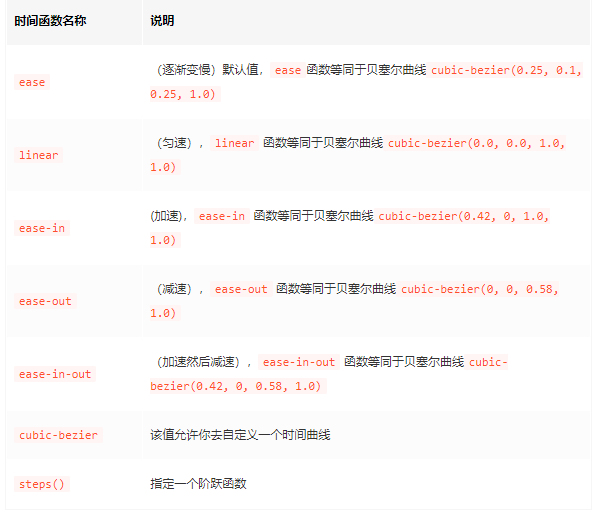
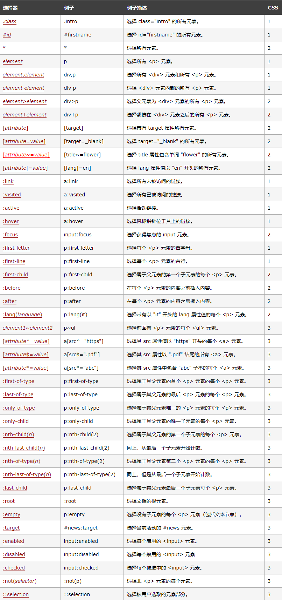
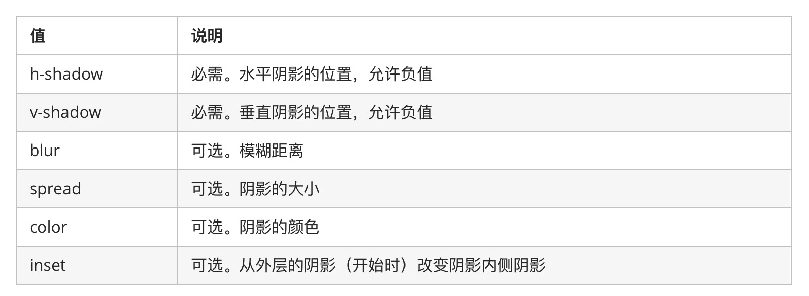

## 容易混淆的几个css属性



## transition
>一般结合transform、translate这些形变的来使用



- 需要事件触发，所以没法在网页加载时自动发生
- 是一次性的，不能重复发生，除非一再触发
- 只能定义开始状态和结束状态，不能定义中间状态，也就是说只有两个状态
- 一条transition规则，只能定义一个属性的变化，不能涉及多个属性。


## animation 



animation与transition 不同的是，keyframes提供更多的控制，尤其是时间轴的控制，这点让css animation更加强大


## 时间函数




## transform
transform并不是一个动态属性，他是一个静态的属性。专注于改变元素基于默认位置的以下值。注意，只是改变，并不是一个过程，只是针对css的各种特殊改变，完全可以看作是与width，height，position等同类的属性。


## 选择器



## box-shadow 阴影



- x-offset：阴影水平偏移量，它可以是正负值。如为正值，则阴影在元素的右边；如其值为负值，则阴影在元素的左边；
- y-offset：阴影垂直偏移量，它可以是正负值。如为正值，则阴影在元素的底部；如其值为负值时，则阴影在元素的顶部；
- blur-radius：阴影模糊半径，可选，它只能是正值。如值为0，则阴影不具有模糊效果；它的值越大，阴影的边缘就越模糊；
- spread-radius：阴影扩展半径，可选，它可以是正负值。如为正值，则扩大阴影的尺寸；如为负值，则缩小阴影的尺寸；
- color：阴影颜色，可选，如不设定颜色，浏览器会取默认色，但各浏览器默认取色不一致。（经测试，在Safari上是半透明的，在chrome、firefox、ie上都是黑色的）。不推荐省略颜色值。


## border-image 边框图片

border-image: 图片url 图像边界向内偏移 图像边界的宽度(默认为边框的宽度) 用于指定在边框外部绘制偏移的量（默认0） 铺满方式--重复（repeat）、拉伸（stretch）或铺满（round）（默认：拉伸（stretch））;

## border-radius

## Flex 弹性布局 

## Grid 栅格布局

## 媒体查询
```tsx
@media screen and (max-width: 960px) {
    body {
        background-color: darkgoldenrod;
    }
}
@media screen and (max-width: 480px) {
    body {
        background-color: lightgreen;
    }
}

```