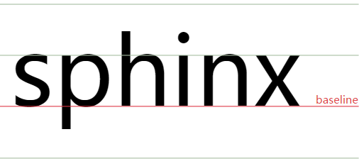
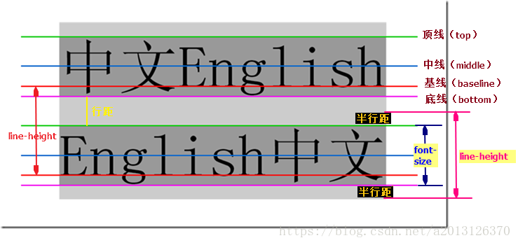
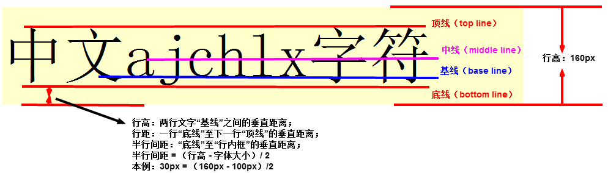
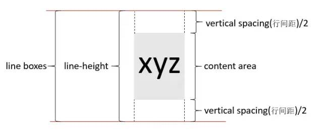
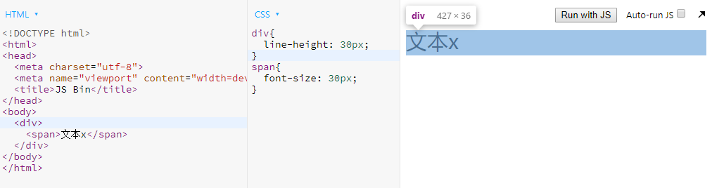
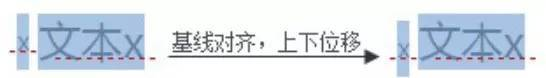
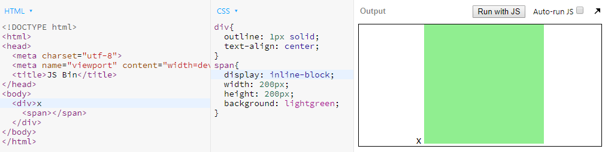
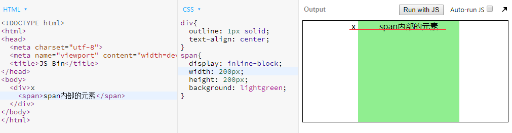
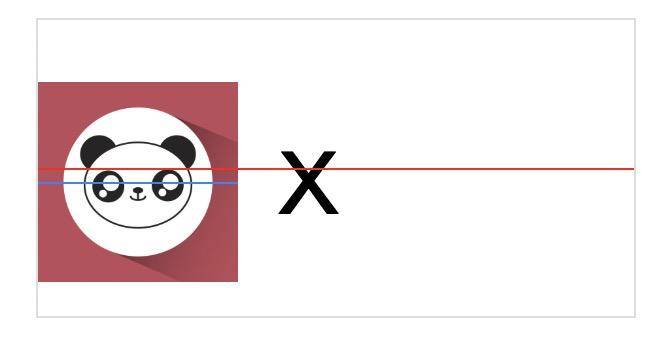

## 行内元素

## 字母’x’与 CSS 中的基线

在各种内联相关模型中，凡是涉及到垂直方向的排版或者对齐的，都离不开最最基本的基线(baseline)。例如，line-height 行高的定义就是两基线的间距；vertical-align 的默认值就是基线.

字母 x 的下边缘(线)就是我们的基线

## 字母’x’与 CSS 中的 x-height

CSS 中有一个概念叫做"x-height", 指的是字母'x'的高度。
"x-height"就是指的小写字母'x'的高度；
术语描述就是基线和等分线`[mean line](也称作中线[midline])`之间的距离。

## baseline 基线

inline-block  的基线是正常流中最后一个（行盒子） line box 的基线，但是，如果这个 line box 里面没有 inline boxes 或者其 overflow 属性值不是 visible，那么其基线就是 margin bottom 的边缘。

## middle 中线

对于内联元素指的是元素的垂直中心点与行框盒子基线往上 1/2x-height 处对齐，简单点说就是字母 X 的中心位置对齐，也就是上图中median和baseline的中间一半的位置。

对于 table-cell 元素，指的是单元格填充盒子相对于外面的表格行居中对齐。

## line-height

现在不少人认为，line boxes 的高度是由内部文字撑开的，但是实际上并不是文字撑开，而是由 line-height 来决定的。

- line-height 属性用于设置多行元素的空间量，如多行文本的间距。
- 对于非替代的 inline 元素，它用于计算行框盒子的高度。此时内联元素的行框盒子的高度完全由 line-height 决定，不受其他任何属性的影响。

line-height 属性值具有继承性，即上级设置的属性值会在子级中继承。

在看一个详细的

**如果是以middle line对齐，会受到字体的影响，如果X是那种斜体，X的交叉点就会偏低，所以是一种近似的居中，而且本来中线就不是指的顶线和底线中间一半的位置**

### 行高与字体的关系

当文字的行高为 0 时，就算它的字号大小很大，line box 的高度为 0。
相反，即使字体大小为 0，但如果行高不会 0，则会撑开标签的高度。

line-height = font-size+2倍的文字上下间距

如果字体大小为0，行高很大，那么由上下行间距来撑开

### line-height 实现垂直居中的本质：行距

如下图可以看到文字上下都有相等间距的半行距，就是文字垂直居中的本质

### 幽灵空白节点

在 HTML5 文档声明下，块状元素内部的内联元素的行为表现，就好像块状元素内部还有一个（更有可能两个-前后）看不见摸不着没有宽度没有实体的空白节点，这个假想又似乎存在的空白节点，我称之为“幽灵空白节点”。

### 高度和设置不一致

div 的实际高度比设定的行高大了

内联元素的默认对齐方式是 baseline(文字的底部)，所以此时此时 span 元素的基线是和父元素的基线相对齐的

父元素的基线其实就是行框盒子前的幽灵空白节点的基线。把幽灵空白节点具象化为字母 x 可能容易理解些：

由于 div 行高是 30px，所以字母 x 和 span 元素的高度都是 30px。但是字母 x 的 font-size 较小，span 元素的 font-size 较大，而行高一样的情况下 font-size 越大基线的位置越偏下，所以两者的基线不在同一水平线上。如下图左边部分：

### 一个设置了 display: inline-block 的元素如何确定基线：

> 这个寻找基线的策略就是导致图片下面有空隙原因

- 如果元素内部没有内联元素，则该元素基线就是该元素下边缘；
- 如果元素设置了 overflow 为 hidden auto scroll，则其基线就是该元素下边缘；
- 如果元素内部还有内联元素，则其基线就是内部最后一行内联元素的基线。

#### inline-block 示例一

下图的 x 是我们加进去模拟幽灵空白节点的，不加效果是一样的

span 的行框盒子前，还存在一个幽灵空白节点（用 x 显示代替）。由于 span 元素默认基线对齐，所以 span 元素的基线也就是其下边缘是和幽灵空白节点的基线对齐的。从而导致幽灵空白节点基线下面的半行距撑高了 div 元素，造成空隙。

#### inline-block 示例二

如果 span 元素中存在内联元素呢？

span 元素下边缘的空隙没了，因为此时 span 元素的基线是内部最后一行内联元素的基线。

### 如何避免幽灵空白节点造成的影响

- 给元素设置块状化display: block使vertical-align属性失效；
- 尝试不同的vertical-align值如bottom/middle/top；
- 直接修改line-height值；
- 如果line-height为相对值如1.4，设置font-size: 0间接改变line-height。
- 使用font-size，字体足够小时，基线和中线会重合在一起，什么时候字体足够小呢，就是0

## vertical-align

vertical-align 起作用的前提是元素为 inline 水平元素或 table-cell 元素，包括 span, img,input, button, td 以及通过 display 改变了显示水平为 inline 水平或者 table-cell 的元素。这也意味着，默认情况下，div, p 等元素设置 vertical-align 无效。

vertical-align 与 line-height 之间的基友关系

### 参数

- baseline： **默认的对齐方式，基线对齐，与父元素的基线对齐**；
- top： 与行中的最高元素的顶端对齐，一般是父级元素的最顶端对齐；
- middle： 与父元素中线对齐（近似垂直居中）；
- bottom： 与 top 相反，与父级元素的最低端对齐 ；
- text-top： 与父级元素 content area 的顶端对齐，不受行高以及周边其他元素的影响。
- text-bottom： 与 text-top 相反，始终与父级元素 content area 的低端对齐。同理可以与 bottom 进行对比区分。注意，从图中可以看到，貌似该值的表现行为与 baseline 一致，但仔细观察，可以看到，实际上 text-bottom 所在的线会比 baseline 低一点。

数值是百分比值： 如 10%，根据 line-height 作为基数进行计算(重要)后的值。

### vertical-align: middle 与 x 字高有关

middle 指的是基线往上 1/2 "x-height"高度。我们可以近似脑补成字母 x 交叉点那个位置。
vertical-align: middle 并不是绝对的垂直居中对齐，我们平常看到的 middle 效果只是一种近似的效果。原因很简单，因为不同的字体，其在行内盒子中的位置是不一样的，比方说’微软雅黑’就是一个字符下沉比较明显的字体，所有字符的位置相比其他字体要偏下一点。

相对于字符x的中心位置对齐，我们肉眼看上去就好像和文字居中对齐了，但其实并不是，只是一种**近似居中**

字体越大越明显
