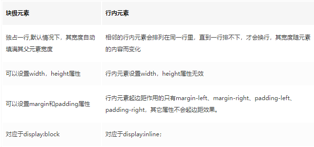
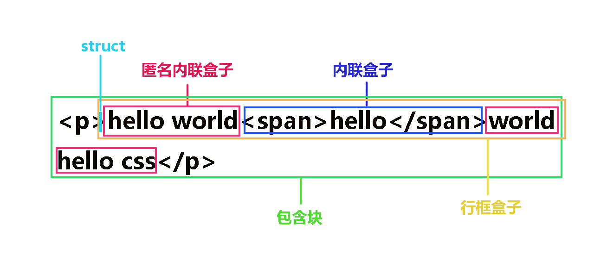
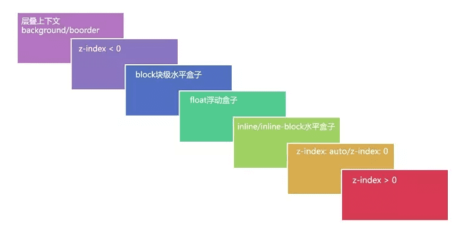

## 流体布局

“流”又叫文档流，是 css 的一种基本定位和布局机制。流是 html 的一种抽象概念，暗喻这种排列布局方式好像水流一样自然自动。“流体布局”是 html 默认的布局机制，如你写的 html 不用 css，默认自上而下（块级元素如 div）从左到右（内联元素如 span）堆砌的布局方式。

## 流体特性

块状水平元素，如 div 元素（下同），在默认情况下（非浮动、绝对定位等），水平方向会自动填满外部的容器；如果有 margin-left/margin-right, padding-left/padding-right, border-left-width/border-right-width 等，实际内容区域会响应变窄。

当一个绝对定位元素，其对立定位方向属性同时有具体定位数值的时候，流体特性就发生了。
具有流体特性绝对定位元素的 margin:auto 的填充规则和普通流体元素一模一样：
如果一侧定值，一侧 auto，auto 为剩余空间大小；
如果两侧均是 auto, 则平分剩余空间

```tsx
.father {

    width: 300px; height:150px;

    position: relative;

}

.son {
    position: absolute;

    top: 0; right: 0; bottom: 0; left: 0;

    width: 200px; height: 100px;

    margin: auto;

}

```

还有 flex 也会触发流体特性

通过 position:absolute 和 top:0 bottom:0 将元素设为流体特性的元素，这样该元素可自动填充父级元素的可用尺寸。

## 内联元素

实际开发中，我们经常把 display 计算值为 inline inline-block inline-table table-cell 的元素叫做内联元素

- 相邻的行内元素会排列在同一行里，直到一行排不下，才会换行，其宽度随元素的内容而变化
- 行内元素设置width，height属性无效
- 行内元素起边距作用的只有margin-left、margin-right、padding-left、padding-right，其它属性不会起边距效果。
- 对应于display:inline；


## 块级元素
而把 display 计算值为 block、table、list-item 的元素叫做块级元素。
width、 height、 margin的四个方向、 padding的四个方向都正常显示，遵循标准的css盒模型。例如：div



## 替换元素

content box 可以被替换的元素。如存在 src=""属性的` <audio> <video> <iframe>`元素和可以输入文本的`<input> <select> <textarea>`元素等。

替换元素一般有内在尺寸，所以具有width和height。

## 非替换元素

HTML 的大多数元素是不可替换元素，即其内容直接表现给用户端（例如浏览器）。段落div、span、p是不可替换元素，文字“段落的内容”全被显示。

## 行内替换元素

width、 height、 margin的四个方向、 padding的四个方向都正常显示，遵循标准的css盒模型。 例如：img


## 行内非替换元素

width、 height不起作用，用line-height来控制高度。度是其内容经过浏览器解释后实际的宽度，而不能通过设定width属性为非替换的行内元素设置宽度.

padding左右起作用，上下不会影响行高，但是对于有背景色和内边距的行内非替换元素，背景可以向元素上下延伸，但是行高没有改变。因此视觉效果就是与前面的行重叠。(《css权威指南》 P249)

margin左右作用起作用，上下不起作用，原因在于：行内非替换元素的外边距不会改变一个元素的行高（《css权威指南》 P227）。

## width: auto 和 height: auto

width、height 的默认值都是 auto。auto 是自适应的意思，auto 是很多尺寸值的默认值，也就是由浏览器自动计算。

块级元素：

- 块级元素默认 width 属性为 auto, 同时盒子的宽度会根据 margin、border、padding 的属性值，自动计算，等于父级标签的 width
- 父元素标签的 height 默认为 auto，初始默认高度值为 0，此时元素的高度完全由子标签的高度撑起来的

内联元素：

- 对于内联元素，width: auto 则呈现出包裹性，即由子元素的宽度决定。(块级元素的宽度是一行)
- 无论内联元素还是块级元素，height: auto 都是呈现包裹性，即高度由子级元素撑开。

## margin

margin 属性并不会参与盒子宽度的计算，但通过设置 margin 为负值，却能改变元素水平方向的尺寸
块级元素的垂直方向会发生 margin 合并，存在以下三种场景：

- 相邻兄弟元素之间 margin 合并；
- 父元素 margin-top 和子元素 margin-top，父元素 margin-bottom 和子元素 margin-bottom；
- 空块级元素自身的 margin-top 和 margin-botom 合并

## margin 0 auto

可以使的块级元素居中，因为这里是设置

## padding

padding 不可为负值，但是可以为百分比值。为百分比时水平和垂直方向的 padding 都是相对于父级元素宽度计算的

## border

属性的值有 none/solid/dashed/dotted/double 等

## position

- position：static, relative, absolute, fixed, sticky

  - 默认值:static
    - 设置为 static 的元素，它始终会处于页面流给予的位置(static 元素会忽略任何 top、 bottom、left 或 right 声明)。 - 有时候遇到继承的情况，我们不愿意见到元素所继承的属性影响本身，从而可以用 Position:static 取消继承，即还原元素定位的默认值
  - 相对定位 relative
    - 相对于自身原有位置进行偏移 - 仍处于标准文档流中
  - 固定定位 fixed
    - 一个固定定位（position 属性的值为 fixed）元素会相对于浏览器窗口来定位,这意味着即便页面滚动，它还是会停留在相同的位置。一个固定定位元素不会保留它原本在页面应有的空隙。
  - 绝对定位 absolute
    - 相对于最近的已定位的祖先元素, 有已定位(指 position 不是 static 的元素)祖先元素, 以最近的祖先元素为参考标准。如果无已定位祖先元素, 以 body 元素为偏移参照基准, 并且它会随着页面滚动而移动。
    - 完全脱离了标准文档流。
    - 随即拥有偏移属性和 z-index 属性。

## 外在盒子和内在盒子

外在盒子是决定元素排列方式的盒子，即决定盒子具有块级特性还是内联特性的盒子。外在盒子负责结构布局。


## 盒模型

元素的内在盒子是由 margin box、border box、padding box、content box 组成的，这四个盒子由外到内构成了盒模型。

w3c 标准模型）： box-sizing: content-box 此模式下，元素的宽度计算为 content 的宽度。
计算宽度的时候不包含 border pading 很烦人，而且又是默认值，业内一般采用以下代码重置样式：


```tsx
:root {
  box-sizing: border-box;
}
* {
  box-sizing: inherit;
}

```

IE 盒模型：
属性width,height包含border和padding，指的是content+padding+border。


## 内联盒子

> https://juejin.im/post/5adad4d8f265da0ba062ba46



### inline-box

inline-box 又名内联盒子，通常由一些标签包裹形成，最常用的如`<span>`标签包裹文字会形成内联盒子，那些没有标签包裹的文字默认自己形成一个盒子称为 anonymous inline box 匿名内联盒子。

### line-box

line-box 名为行框，从名字就可以看出，它是由单行内联元素形成的一个区域，注意是每一行都会形成，如果文字由五行，就会形成 5 个行框。行框的高度基本上是由行框中行高最大的内联盒子决定的。我使用基本上这个词，是因为还有其他情况，比如受到 vertical-align 属性的影响。

### container-box

container-box 就是包含块的意思，在内联元素中，包含块是由行框组成的。说白了就是包裹在所有行框外面的那层盒子。

### struct

这个词可能很多同学见的比较少，张鑫旭大神称之为”幽灵空白节点“，我们这里就用直译过来的词”支柱“。简单来说就是可以想象成行框前面有一个宽为 0 的空字符。

## CSS 简单的继承

> [https://github.com/chokcoco/iCSS/issues/13](https://github.com/chokcoco/iCSS/issues/13)

我们可以通过 inherit、initial 来控制元素是否继承属性
能够默认从父级继承来属性：相当于设置了 inherit
默认不继承的属性：相当于设置了 initial

涉及到**文本**相关的属性，绝大部分都是默认继承的
```tsx
最后罗列一下默认为 inherited: Yes 的属性：

所有元素可继承：visibility 和 cursor
内联元素可继承：letter-spacing、word-spacing、white-space、line-height、color、font、 font-family、font-size、font-style、font-variant、font-weight、text- decoration、text-transform、direction
块状元素可继承：text-indent和text-align
列表元素可继承：list-style、list-style-type、list-style-position、list-style-image
表格元素可继承：border-collapse
```


## @规则

```tsx
/*定义字符集*/
@charset "utf-8"
/*导入css文件*/
@import "base.css"
/*自定义字体*/
@font-face {}
/*声明CSS3 animation动画关键帧*/
@keyframes fadeIn {}
/*媒体查询*/
@media{}
```

## css 常用函数

calc() 函数用于动态计算长度值。

- 需要注意的是，运算符前后都需要保留一个空格，例如：width: calc(100% - 10px)；
- 任何长度值都可以使用 calc()函数进行计算；
- calc()函数支持 "+", "-", "\*", "/" 运算；
- calc()函数使用标准的数学运算优先级规则；

## 常见单位

1. px：绝对单位，页面按精确像素展示
2. em：相对单位，基准点为父节点字体的大小，如果自身定义了 font-size 按自身来计算（浏览器默认字体是 16px），整个页面内 1em 不是一个固定的值
3. rem：相对单位，可理解为”root em”, 相对根节点 html 的字体大小来计算，CSS3 新加属性，chrome/firefox/IE9+支持
4. vw：viewpoint width，视窗宽度，1vw 等于视窗宽度的 1%
5. vh：viewpoint height，视窗高度，1vh 等于视窗高度的 1%
6. vmin：vw 和 vh 中较小的那个
7. vmax：vw 和 vh 中较大的那个
8. %:百分比

## CSS 响应式布局

使用@media 查询可以针对不同的媒体类型定义不同的样式

```tsx
语法：@media 媒介类型 and | not | only (媒介特性) {
	css 代码
}
媒介类型：
	print: 用于打印机和打印预览
	screen: 用于电脑屏幕、平板电脑、只能手机等
	all: 用于所有媒体设备类型
媒介特性：
	device-height: 定义输出设备的屏幕可见高度
	device-width: 定义输出设备的屏幕可见宽度
	height：定义输出设备中的页面可见区域高度。
	width：定义输出设备中的页面可见区域宽度。
	max-device-height：定义输出设备的屏幕可见的最大高度。
	max-device-width：定义输出设备的屏幕可见的最大宽度。
	max-height：定义输出设备中的页面可见的最大高度。
	max-width：定义输出设备中的页面可见的最大宽度。
	min-device-height：定义输出设备的屏幕可见的最小高度。
	min-device-width：定义输出设备的屏幕可见的最小宽度。
	min-height：定义输出设备中的页面可见的最小高度。
	min-width：定义输出设备中的页面可见的最小宽度。

```

## PostCSS、Sass、Less 的异同

- 编译环境不一样，Sass 的安装需要 Ruby 环境，是在服务端处理的，而 Less 是需要引入 less.js 来处理 Less 代码输出 css 到浏览器
- 变量符号不一样，Less 是@，而 Scss 是\$；
- 输出设置，Less 没有输出设置，Sass 提供 4 中输出选项：nested, compact, compressed 和 expanded；
- 处理条件语句，Sass 支持条件语句，可以使用 if{}else{},for{}循环等等。 LESS 的条件语句使用有些另类，他不是我们常见的关键词 if 和 else if 之类，而其实现方式是利用关键词“when”；
- 引用外部文件，文件名如果以下划线\_开头的话，Sass 会认为该文件是一个引用文件，不会将其编译为 css 文件，less 引用外部文件和 css 中的@import 没什么差异；
- Less 有 UI 组件库 Bootstrap,Sass 有工具库 Compass, 简单说，Sass 和 Compass 的关系有点像 Javascript 和 jQuery 的关系

PostCSS 介绍：PostCSS 的主要功能只有两个：第一个就是前面提到的把 CSS 解析成 JavaScript 可以操作的 AST，第二个就是调用插件来处理 AST 并得到结果。因此，不能简单的把 PostCSS 归类成 CSS 预处理或后处理工具。PostCSS 所能执行的任务非常多，同时涵盖了传统意义上的预处理和后处理。
PostCSS 一般不单独使用，而是与已有的构建工具进行集成。PostCSS 与主流的构建工具，如 Webpack、Grunt 和 Gulp 都可以进行集成。

## 浏览器私有属性

有时我们需要针对不同的浏览器或不同版本写特定的 CSS 样式，这种针对不同的浏览器/不同版本写相应的 CSS code 的过程，叫做 CSS hack!

```tsx
-moz代表firefox浏览器私有属性
-ms代表IE浏览器私有属性
-webkit代表chrome、safari私有属性
-o代表opera私有属性
```

## overflow auto 和 scroll

- overflow: scroll 将隐藏所有溢出的内容并使滚动条出现在相关元素上。如果内容没有溢出，滚动条仍然可见，但被禁用。
- overflow: auto 非常相似，但滚动条仅在内容溢出时出现。
  overflow: auto 很适合用来创建 BFC

- 参数是 scroll 时候，必会出现滚动条。
- 参数是 auto 时候，子元素内容大于父元素时出现滚动条。
- 参数是 visible 时候，溢出的内容出现在父元素之外。
- 参数是 hidden 时候，溢出隐藏。

默认是 visible

## relative 和 absolute

relative 相对自身原本位置定位，absolute 相对 父的 relative 节点定位


## Window.getComputedStyle()

Window.getComputedStyle()方法返回一个对象，该对象在应用活动样式表并解析这些值可能包含的任何基本计算后报告元素的所有 CSS 属性的值。 私有的 CSS 属性值可以通过对象提供的 API 或通过简单地使用 CSS 属性名称进行索引来访问。

注意：**返回的 style 是一个实时的 CSSStyleDeclaration 对象，当元素的样式更改时，它会自动更新本身。**

```tsx
let style = window.getComputedStyle(element, [pseudoElt]);
```

- element:用于获取计算样式的 Element。
- pseudoElt (可选) 指定一个要匹配的伪元素的字符串。必须对普通元素省略（或 null）。

## 隐藏元素常用的方法与区别

display: none;

- DOM 结构：浏览器不会渲染 display 属性为 none 的元素，不占据空间；
- 事件监听：无法进行 DOM 事件监听；
- 性能：动态改变此属性时会引起重排，性能较差；
- 继承：不会被子元素继承，毕竟子类也不会被渲染；
- transition：transition 不支持 display。

visibility: hidden;

- DOM 结构：元素被隐藏，但是会被渲染不会消失，占据空间；
- 事件监听：无法进行 DOM 事件监听；
- 性 能：动态改变此属性时会引起重绘，性能较高；
- 继 承：会被子元素继承，子元素可以通过设置 visibility: visible; 来取消隐藏；
- transition：transition 不支持 display。

opacity: 0;

- DOM 结构：透明度为 100%，元素隐藏，占据空间；
- 事件监听：可以进行 DOM 事件监听；
- 性 能：提升为合成层，不会触发重绘，性能较高；
- 继 承：会被子元素继承,且，子元素并不能通过 opacity: 1 来取消隐藏；
- transition：transition 不支持 opacity。

## CSS 选择器权重

从右往左解析，也就是!important会覆盖前面的
```tsx
!important>行内样式>ID选择器 > 类选择器 | 属性选择器 | 伪类选择器 > 元素选择器
```

权重的优先级根据特殊性进行分布，使用四个纬度进行判断，用 0.0.0.0 进行表示。

- 标签选择器，伪类元素表示为 0.0.0.1
- 类，伪类，属性选择器表示为 0.0.1.0
- ID 选择器为 0.1.0.0
- 行内选择器为 1.0.0.0

权重的基本规则：

- 不推荐使用!important
- 行内样式总会覆盖外部样式表的任何样式,会被!important 覆盖
- 相同的权重：以后面出现的选择器为最后规则
- 单独使用一个选择器的时候，不能跨等级使 css 规则生效
- 如果两个权重不同的选择器作用在同一元素上，权重值高的 css 规则生效
- 如果两个相同权重的选择器作用在同一元素上：以后面出现的选择器为最后规则
- 权重相同时，与元素距离近的选择器生效（里的越近，越到最后才解析，就可以覆盖前面的）


## 层叠上下文表


