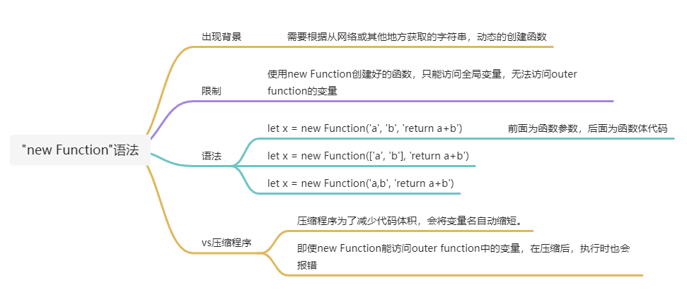

## 简介

eval和new Function都可以将一段字符串解析成一段JS脚本并执行。

## eval

### 调用模式
eval 分为直接调用和间接调用两种，通常间接调用的性能会好于直接调用。

- 直接调用时，eval 运行于其调用函数的作用域下；
- 而间接调用时，eval 运行于全局作用域。

### 作用域
```tsx
function test() {
  var x = 2, y = 4;
  console.log(eval('x + y'));  // 直接调用，使用本地作用域，结果是 6
  var geval = eval; // 等价于在全局作用域调用
  console.log(geval('x + y')); // 间接调用，使用全局作用域，throws ReferenceError 因为`x`未定义
  (0, eval)('x + y'); // 另一个间接调用的例子
​}
```

### 严格模式

eval可以访问外部变量、更改外部变量，但是严格模式下，eval 有属于自己的词法环境，因此我们不能从外部访问在 eval 中声明的函数和变量

### 尽量不要直接使用eval

如果 eval 中的代码没有使用外部变量，请以 window.eval(...) 的形式调用 eval：

通过这种方式，该代码便会在全局作用域内执行：

```tsx
let x = 1;
{
  let x = 5;
  window.eval('alert(x)'); // 1（全局变量）
}
```
如果 eval 中的代码需要访问局部变量，我们可以使用 new Function 替代 eval，并将它们作为参数传递：

```tsx
let f = new Function('a', 'alert(a)');

f(5); // 5
```

## new Function

直接调用此构造函数可以动态创建函数（任意字符串变为函数），但会遇到和 eval() 类似的的安全问题和（相对较小的）性能问题。然而，与 eval() 不同的是，Function 构造函数创建的函数只能在全局作用域中运行。



new Function() 可以接n个参数，最后一个参数作为函数体。
```tsx
let func = new Function ([arg1[, arg2[, ...argN]],] functionBody);


let sum = new Function('a', 'b', 'return a + b');

alert( sum(1, 2) ); // 3


let sayHi = new Function('alert("Hello")');

sayHi(); // Hello
```

## with 关键字
> MDN: JavaScript 查找某个未使用命名空间的变量时，会通过作用域链来查找，作用域链是跟执行代码的 context 或者包含这个变量的函数有关。'with'语句将某个对象添加到作用域链的顶部，如果在 statement 中有某个未使用命名空间的变量，跟作用域链中的某个属性同名，则这个变量将指向这个属性值。如果沒有同名的属性，则将拋出ReferenceError异常

简单讲with 块可以将一个对象处理为词法作用域，但with 是一个不推荐使用的语法，因为它的作用是改变上下文（欺骗词法作用域），而上下文环境对开发者影响很大。

下面的with语句指定Math对象作为默认对象。with语句里面的变量，分別指向Math对象的PI 、cos 和 sin 函数，不用在前面添加命名空间。后续所有引用都指向Math对象。

```tsx
var a, x, y;
var r = 10;

with (Math) {
  a = PI * r * r;
  x = r * cos(PI);
  y = r * sin(PI / 2);
}
```
弊端:注入的上下文可能与已有上下文产生冲突，导致输出结果为 NaN
```tsx
function getAverage(min, max) {
  with (Math) {
    return round((min + max) / 2);
  }
}

getAverage(1, 5); // NaN
```

## 应用

尽管上面提到eval、Function、with有一些不安全的属性，但是现在很多流行的库里在大量使用
- Vue 也用 new Function 和 eval 这队好基友，来实现模板内嵌表达式的计算，还用with来缩短调用链
- 现在各种低代码平台使用UIschema描述UI，使用联动或者动态注入功能时，也会使用eval来计算JSON里的string code

### with 和 vue的Render

因为with 的作用域和模板的作用域正好契合，可以极大地简化模板编译过程。

而with的代码量很少，把作用域的处理交给JS引擎来做也更可靠。


```tsx
function render() {
  with (this) { // this 就是 vue 的vm实例 含有很多方法
    return _c("p", { on: { click: change } }, [
      _c("span", [_v(_s(number))]), // 创建元素节点
      _v(" "), // 创建文本节点
      _c("span", [_v(_s(name))]),
    ]);
  }
}
```

当然，最理想的情况还是要去掉with的使用，预编译的时候会自动把第一遍编译生成的代码进行一次额外处理，用完整的AST分析来处理作用域，把with拿掉，顺便支持ES6语法。换句话说，如果用 webpack + vue 的时候，最终生成的代码是没有 with 的。

### 用  Function + with 实现 JS 沙箱
> https://juejin.cn/post/7088581480552595492

Vue 在在解析v-if和v-for等指令时我们会看到通过evaluate执行指令值中的JavaScript表达式，而且能够读取当前作用域上的属性。而evaluate的实现如下：

```tsx
// 简化版
export const evaluate = (scope: any, exp: string, el?: Node) => {
  return (new Function(`$data`, `$el`, `with($data){return(${exp})}`))(scope, el)
}
```
就是通过with+new Function构建一个简单的沙箱，为v-if和v-for指令提供一个可控的JavaScript表达式的执行环境。

更加安全和完整的沙箱可移步[/常用功能实现/JS沙箱](../../编程练习/常用功能实现/JS沙箱/README.md)