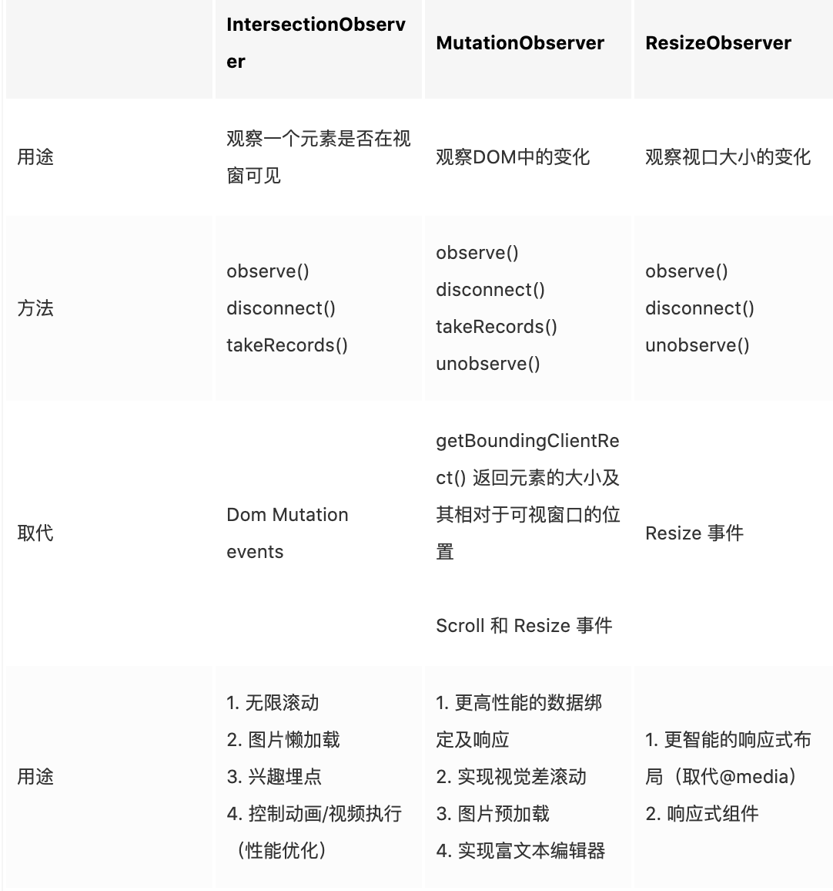
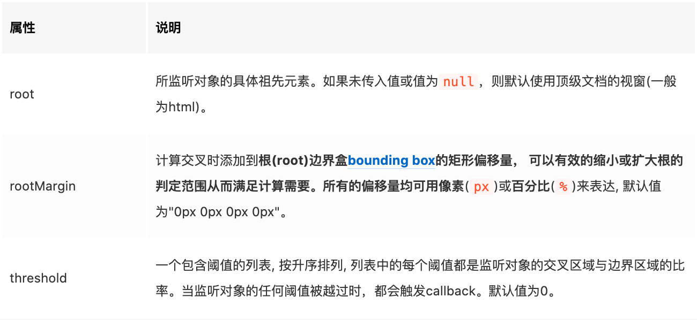
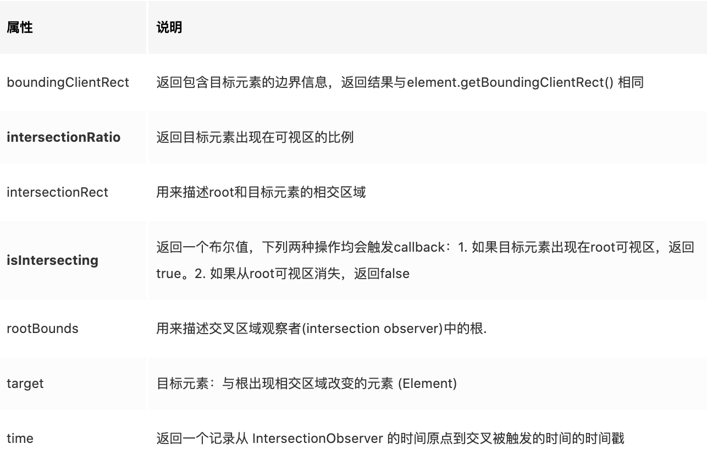

## Intersection Observer 交叉观察者


Intersection Observer API通过为开发人员提供一种新方法来异步查询元素相对于其他元素或全局视口的位置，从而解决了上述问题:

异步处理消除了昂贵的DOM和样式查询，连续轮询以及使用自定义插件的需求。
通过消除对这些方法的需求，可以使应用程序显着降低CPU，GPU和资源成本。




## options 参数



**threshold默认值是0(意味着只要有一个target像素出现在root元素中，回调函数将会被执行)**

## callback参数

callback是添加监听后，当目标元素与根元素通过阈值相交时，就会触发回调函数。接收一个参数entries，这个数组里的每个对象就是当前进入可视区域或者离开可视区域的对象，即IntersectionObserverEntry实例。

描述了目标元素与root的交叉状态，如果同时**有两个被观察的对象的可见性**发生变化，entries数组就会有**两个**成员。具体参数如下：



表格中加粗的两个属性是比较常用的判断条件：isIntersecting和intersectionRatio


### 应用1 图片懒加载

```js


```
```js
let observer = new IntersectionObserver((entries, observer) => { 
    entries.forEach(entry => {
      if(entry.isIntersecting){ // 目标元素开始出现在 root 可视区，返回 true
        /* 替换属性 */
        entry.target.src = entry.target.dataset.src;
        observer.unobserve(entry.target);
      }
      });
    }, 
    {
      rootMargin: "0px 0px 200px 0px" // 手机往上画，增加底部的感应范围，预加载图片
    }
  );

document.querySelectorAll('img').forEach(img => { observer.observe(img) });

```

### 应用2 兴趣埋点

```js
const boxList = [...document.querySelectorAll('.box')]

var io = new IntersectionObserver((entries) =>{
  entries.forEach(item => {
    // intersectionRatio === 1说明该元素完全暴露出来，符合业务需求
    if (item.intersectionRatio === 1) {
      // 。。。 埋点曝光代码
      io.unobserve(item.target)
    }
  })
}, {
  root: null,
  threshold: 1, // 阀值设为1，当只有比例达到1时才触发回调函数
})

// observe遍历监听所有box节点
boxList.forEach(box => io.observe(box))
```

### 更多应用


- 吸顶
- 吸底
- 加载更多
- 无线滚动
- https://juejin.cn/post/6844904121833619469#heading-3