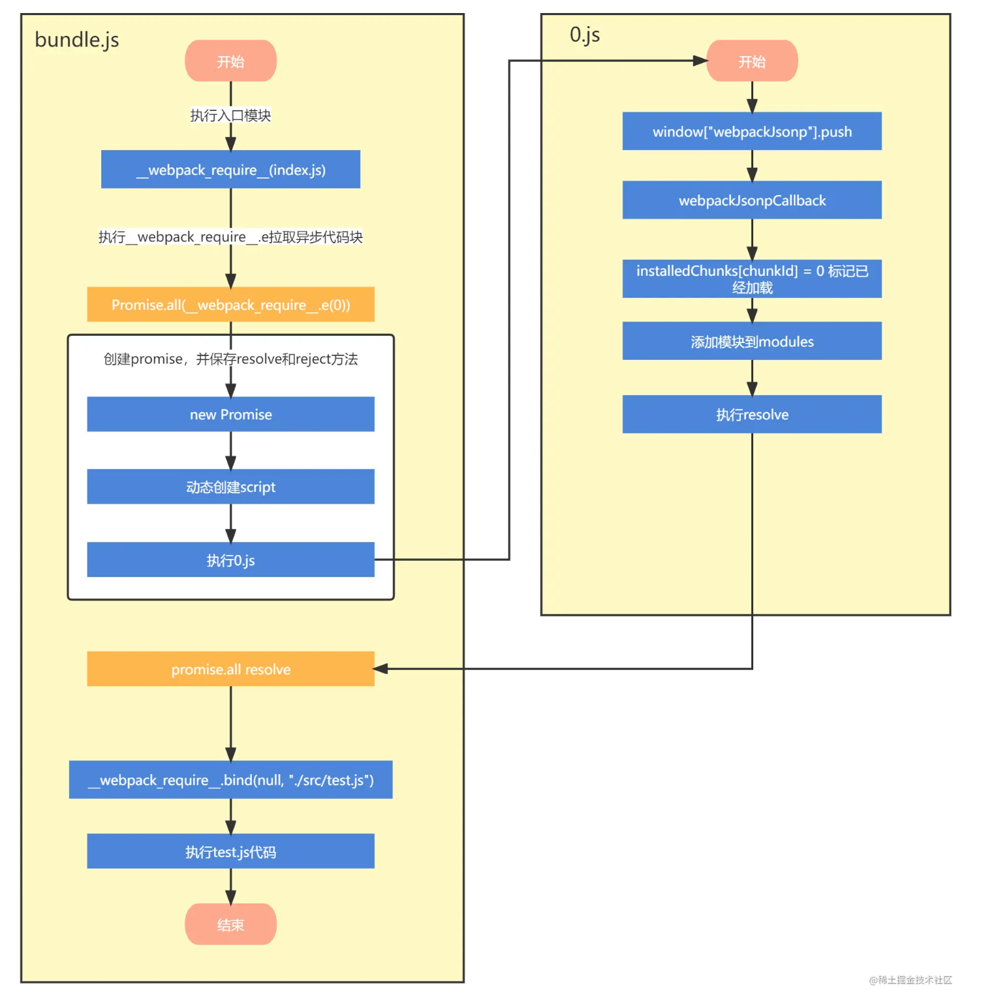

## ESmodule import() 原理
> https://github.com/tc39/proposal-dynamic-import

import() 函数是由TS39提出的一种动态加载模块的规范实现，其返回是一个 promise。在浏览器宿主环境中一个import()的参考实现如下：

```tsx

function importModule(url) {
  return new Promise((resolve, reject) => {
    const script = document.createElement("script");
    const tempGlobal = "__tempModuleLoadingVariable" + Math.random().toString(32).substring(2);
    script.type = "module";
    script.textContent = `import * as m from "${url}"; window.${tempGlobal} = m;`;

    script.onload = () => {
      resolve(window[tempGlobal]);
      delete window[tempGlobal];
      script.remove();
    };

    script.onerror = () => {
      reject(new Error("Failed to load module script with URL " + url));
      delete window[tempGlobal];
      script.remove();
    };

    document.documentElement.appendChild(script);
  });
}
```

```tsx
<!DOCTYPE html>
<nav>
  <a href="books.html" data-entry-module="books">Books</a>
  <a href="movies.html" data-entry-module="movies">Movies</a>
  <a href="video-games.html" data-entry-module="video-games">Video Games</a>
</nav>

<main>Content will load here!</main>

<script>
  const main = document.querySelector("main");
  for (const link of document.querySelectorAll("nav > a")) {
    link.addEventListener("click", e => {
      e.preventDefault();

      import(`./section-modules/${link.dataset.entryModule}.js`)
        .then(module => {
          module.loadPageInto(main);
        })
        .catch(err => {
          main.textContent = err.message;
        });
    });
  }
</script>
```

## 与Webpack配合

当 Webpack 解析到该import()语法时，会自动进行代码分割。webpack 扫描源文件识别 import/export ，再根据识别结果重新打包组装生成新的文件，新生成的文件代码就已经按照浏览器能识别的方式重新组装了。

具体原理参考[Webpack原理系列（一）动态import原理](https://juejin.cn/post/7087488024883232799)




## 使用 import() 执行简单的代码

首先，我们创建了所谓的 数据 URI。这种类型的 URI 协议是 data:。URI 的剩余部分中包含了所有资源的编码，而不是指向资源本身的地址。这样，数据 URI 就包含了一个完整的 ECMAScript 模块 —— 它的 content 类型是 text/javascript。
然后我们动态引入模块，于是代码被执行。

注意：这段代码只能在浏览器中运行

```tsx
const js = `console.log('Hello everyone!');`;
const encodedJs = encodeURIComponent(js);
const dataUri = 'data:text/javascript;charset=utf-8,'
  + encodedJs;
import(dataUri);

// 输出：
// 'Hello everyone!'
```
