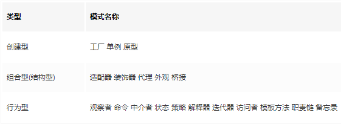

## 设计模式简介

设计模式是解决某个特定场景下对某种问题的解决方案。因此，当我们遇到合适的场景时，我们可能会条件反射一样自然而然想到符合这种场景的设计模式。

设计模式代表了最佳的实践，通常被有经验的面向对象的软件开发人员所采用。设计模式是软件开发人员在软件开发过程中面临的一般问题的解决方案。这些解决方案是众多软件开发人员经过相当长的一段时间的试验和错误总结出来的。

## 设计模式原则

### S – Single Responsibility Principle 单一职责原则

- 一个程序只做好一件事（如 hooks 里提倡一个 effects 做一件事）
- 如果功能过于复杂就拆分开，每个部分保持独立(我们可以有多个 hooks)

### O – OpenClosed Principle 开放/封闭原则

- 对扩展开放，对修改封闭
- 增加需求时，扩展新代码，而非修改已有代码(新增功能可以采用新的 useEffects)

### L – Liskov Substitution Principle 里氏替换原则

- 子类能覆盖父类
- 父类能出现的地方子类就能出现

### I – Interface Segregation Principle 接口隔离原则

- 保持接口的单一独立
- 类似单一职责原则，这里更关注接口

### D – Dependency Inversion Principle 依赖倒转原则

- 面向接口编程，依赖于抽象而不依赖于具体
- 使用方只关注接口而不关注具体类的实现

## 模式分类



## 1.工厂模式

### 基本特征

- 主要用于隐藏创建实例的复杂度，只需对外提供一个接口；
- 实现构造函数和创建者的分离，满足开放封闭的原则；

### 适用场景

- 如果你不想让某个子系统与较大的那个对象之间形成强耦合，而是想运行时从许多子系统中进行挑选的话，那么工厂模式是一个理想的选择
- 将 new 操作简单封装，遇到 new 的时候就应该考虑是否用工厂模式；
- 需要依赖具体环境创建不同实例，这些实例都有相同的行为,这时候我们可以使用工厂模式，简化实现的过程，同时也可以减少每种对象所需的代码量，有利于消除对象间的耦合，提供更大的灵活性

### 优点

- 创建对象的过程可能很复杂，但我们只需要关心创建结果。
- 构造函数和创建者分离, 符合“开闭原则”
- 一个调用者想创建一个对象，只要知道其名称就可以了。
- 扩展性高，如果想增加一个产品，只要扩展一个工厂类就可以。

### 缺点

添加新产品时，需要编写新的具体产品类,一定程度上增加了系统的复杂度
考虑到系统的可扩展性，需要引入抽象层，在客户端代码中均使用抽象层进行定义，增加了系统的抽象性和理解难度

```tsx
class User {
  constructor(name = '', viewPage = []) {
    this.name = name;
    this.viewPage = viewPage;
  }
}

class UserFactory extends User {
  constructor(name, viewPage) {
    super(name, viewPage)
  }
  create(role) {
    switch (role) {
      case 'superAdmin':
        return new UserFactory( '超级管理员', ['首页', '通讯录', '发现页', '应用数据', '权限管理'] );
        break;
      case 'admin':
        return new UserFactory( '管理员', ['首页', '通讯录'] );
        break;
      default:
        throw new Error('params error');
    }
  }
}
let userFactory = new UserFactory();
let superAdmin = userFactory.create('superAdmin');
let admin = userFactory.create('admin');
let user = userFactory.create('user');
```

## 2.单例模式

### 基本特征

- 系统中被唯一使用
- 一个类只有一个实例（注意只能有一个实例，必须是强相等===）

### 应用场景

- 登录框
- 熟知的 React 中的 redux 中的 store;
- 路由的监听也算是，单页面应用如 React 的 Router 内部应该有一个唯一的 history 实例来控制（猜测

### 优点

- 划分命名空间，减少全局变量
- 增强模块性，把自己的代码组织在一个全局变量名下，放在单一位置，便于维护
- 且只会实例化一次。简化了代码的调试和维护

### 缺点

- 由于单例模式提供的是一种单点访问，所以它有可能导致模块间的强耦合 从而不利于单元测试。无法单独测试一个调用了来自单例的方法的类，而只能把它与那个单例作为一个单元一起测试。

### 实例

instance 通过闭包存一个起来判断全局是不是只有一个实例

```tsx
class Modal {
    login() {
        console.log('login...');
    }
}
Modal.create = (function() {
    let instance
    return function() {
        if(!instance) {
           instance = new Modal();
        }
        return instance
    }
})()
let m1 = Modal.create();
let m2 = Modal.create();
console.log(m1 === m2) // true
```

## 3.适配器模式

### 基本特征

适配器模式（Adapter）将一个接口转换成客户端需要的接口而不需要去修改客户端代码，使得不兼容的代码可以一起工作，适配器模式必须包含目标（Target）、源（Adaptee）和适配器（Adapter）三个角色。

### 应用场景

- 整合第三方 SDK
- 封装旧的接口

### 优点

- 可以让任何两个没有关联的类一起运行。
- 提高了类的复用。
- 适配对象，适配库，适配数据

### 缺点

- 额外对象的创建，非直接调用，存在一定的开销（且不像代理模式在某些功能点上可实现性能优化)
- 如果没必要使用适配器模式的话，可以考虑重构，如果使用的话，尽量把文档完善

### 实例

这里举一个适配充电器的例子

- 目标角色（Target）：大陆的电器插头
- 源角色（Adaptee）: 港式的电器插头
- 适配器角色（Adapter）: 把港式的电器插头转成更小大陆的电器插头，来适配大陆插座

Adapter 类继承了 Target，重写 small 函数，最后通过适配器，把港式 big 转成了大陆的 small 了。

```tsx
// 目标角色实现 大陆的小头
class Target {
    small(){
        throw new Error('This method must be overwritten!');
    }
}
// 源角色实现 港式的大头
class Adaptee {
    big(){
        console.log("港式的电器插头可用咯~~");
    }
}
class Adapter extends Target {
    constructor(adaptee) {
        super();
        this.adaptee = adaptee;
    }
    small() {
        this.adaptee.big();
    }
}

let adaptee=new Adaptee();
let adapter=new Adapter(adaptee);
// adapter 来到大陆了 只能调用small方法
// 而small 方法已经可用，且表现和之前的big相同 因为就是对big封装了一下 套了个small转接口
adapter.small();
// 港式的电器插头可用咯~~
```

## 4. 装饰者模式

### 基本特征

- 动态地给某个对象添加一些额外的职责，是一种实现继承的替代方案
- 在不改变原对象的基础上，通过对其进行包装扩展，使原有对象可以满足用户的更复杂需求，而不会影响从这个类中派生的其他对象

### 场景例子

- ES7 Decorator
- React 中的高阶函数感觉也算是

### 优点

- 装饰类和被装饰类都只关心自身的核心业务，实现了解耦。
- 方便动态的扩展功能，且提供了比继承更多的灵活性。

### 缺点

- 多层装饰比较复杂。
- 常常会引入许多小对象，看起来比较相似，实际功能大相径庭，从而使得我们的应用程序架构变得复杂起来

### 实例

```tsx
class Circle {
    draw() {
        console.log('画一个圆形');
    }
}

class Decorator {
    constructor(circle) {
        this.circle = circle;
    }
    draw() {
        this.circle.draw();
        this.setRedBorder(circle);
    }
    setRedBorder(circle) {
        console.log('画一个红色边框');
    }
}

let circle = new Circle();
let decorator = new Decorator(circle);
decorator.draw(); //画一个圆形，画一个红色边框
```

## 5.代理模式

> 装饰者模式： 扩展功能，原有功能不变且可直接使用
> 代理模式： 显示原有功能，但是经过限制之后的

### 基本特征

- 使用者无权访问目标对象；
- 中间加代理，通过代理做授权和控制。

### 使用场景

- ES6 proxy
- HTML 元素事件代理 addEventListener
- （感觉事件委托也算）

### 优点

- 代理模式能将代理对象与被调用对象分离，降低了系统的耦合度。代理模式在客户端和目标对象之间起到一个中介作用，这样可以起到保护目标对象的作用
- 代理对象可以扩展目标对象的功能；通过修改代理对象就可以了，符合开闭原则；

### 缺点

- 处理请求速度可能有差别，非直接访问存在开销

## 6. 状态模式

### 基本特征

- 一个对象的行为取决于它的状态，并且它必须在运行时刻根据状态改变它的行为
- 一个操作中含有大量的分支语句，而且这些分支语句依赖于该对象的状态

### 使用场景

- 一个第三方认证的流程可能存在很多状态，每个状态完了都应该去下一个状态，直到认证成功
- 常见的就是上面红绿灯的切换，或者开关的开启

### 优点

- 定义了状态与行为之间的关系，封装在一个类里，更直观清晰，增改方便
- 状态与状态间，行为与行为间彼此独立互不干扰
- 用对象代替字符串来记录当前状态，使得状态的切换更加一目了然

### 缺点

- 会在系统中定义许多状态类
- 逻辑分散

### 实例

```tsx
// 红灯
class RedLight {
    constructor (state) {
        this.state = state;
    }
    light () {
        console.log('turn to red light');
        this.state.setState(this.state.greenLight)
    }
}
// 绿灯
class greenLight {
    constructor (state) {
        this.state = state;
    }
    light () {
        console.log('turn to green light');
        this.state.setState(this.state.yellowLight)
    }
}
// 黄灯
class yellowLight {
    constructor (state) {
        this.state = state;
    }
    light () {
        console.log('turn to yellow light');
        this.state.setState(this.state.redLight)
    }
}
class State {
    constructor () {
        this.redLight = new RedLight(this)
        this.greenLight = new greenLight(this)
        this.yellowLight = new yellowLight(this)
        this.setState(this.redLight) // 初始化为红灯
    }
    setState (state) {
        this.currState = state;
    }
}
const state = new State();
state.currState.light() // turn to red light
setInterval(() => {
    state.currState.light() // 每隔3秒依次打印红灯、绿灯、黄灯
}, 3000)

```

## 7.策略模式

### 基本特征

- 定义一系列的算法，把它们一个个封装起来，并且使它们可以相互替换。

### 场景例子

- 如果在一个系统里面有许多类，它们之间的区别仅在于它们的'行为'，那么使用策略模式可以动态地让一个对象在许多行为中选择一种行为。
- 一个系统需要动态地在几种算法中选择一种。
- 根据一个条件来执行不同的方法，如果条件有很多种可以使用策略模式，让每个条件具有一种行为

### 优点

- 利用组合、委托、多态等技术和思想，可以有效的避免多重条件选择语句
- 提供了对开放-封闭原则的完美支持，将算法封装在独立的 strategy 中，使得它们易于切换，理解，- 易于扩展
- 利用组合和委托来让 Context 拥有执行算法的能力，这也是继承的一种更轻便的代替方案

### 缺点

- 会在程序中增加许多策略类或者策略对象
- 要使用策略模式，必须了解所有的 strategy，必须了解各个 strategy 之间的不同点，这样才能选择一个合适的 strategy

### 实例

```tsx
/*策略类*/
var levelOBJ = {
    "A": function(money) {
        return money * 4;
    },
    "B" : function(money) {
        return money * 3;
    },
    "C" : function(money) {
        return money * 2;
    }
};
/*环境类*/
var calculateBouns =function(level,money) {
    return levelOBJ[level](money);
};
console.log(calculateBouns('A',10000)); // 40000
```

## 8.观察者模式/发布订阅模式

> 观察者模式相比发布订阅没有 Topic(可以理解为中心的调度器)

### 基本特征

观察者模式定义了对象间的一种一对多的依赖关系，当一个对象的状态发生改变时，所有依赖于它的对象都将得到通知，并自动更新。观察者模式属于行为型模式，行为型模式关注的是对象之间的通讯，观察者模式就是观察者和被观察者之间的通讯。

### 适应场景

- 广泛应用于异步编程中(替代了传递回调函数)
- 对象之间松散耦合的编写代码
- Promise 的实现中用到过来收集异步队列
- Vue 双向绑定收集依赖
- React 跨组件通信
- React15Diff 算法中收集比对的差异
- react-router 的 router 函数相当于订阅路由
- node 的 EventEmitter 模块
- 还有好多，真的很重要

### 优点

- 支持简单的广播通信，自动通知所有已经订阅过的对象
- 目标对象与观察者之间的抽象耦合关系能单独扩展以及重用
- 增加了灵活性
- 观察者模式所做的工作就是在解耦，让耦合的双方都依赖于抽象，而不是依赖于具体。从而使得各自的变化都不会影响到另一边的变化。

### 缺点

- 过度使用会导致对象与对象之间的联系弱化，会导致程序难以跟踪维护和理解

### 实例

```tsx
class EventEmitter{
    constructor(){
        this._events  = this._events||new Map()
    }

    addEventListener(type,fn){
        if(this._events.has(type)){
            this._events.set(type,this._events.get(type).concat([fn]))
        }else{
            this._events.set(type,[fn])
        }
    }

    removeListen(type,fn){
        const events = this._events.get(type)
        const index = events.indexOf(fn)
        if(index!==-1){
            events.splice(index,1)
        }
    }

    emit(type,...arg){
        const events = this._events.get(type)
        if(events&&events.length>0){
            events.forEach((fn)=>{
                fn.apply(undefined,arg)
            })
        }

    }

    once(type,fn){
        let _this = this;
        function warp(...arg){
            fn.apply(undefined,arg)
            _this.removeListen(type,warp)
        }
        this.addEventListener(type,warp)
    }
}

const event = new EventEmitter()
event.addEventListener('click',function(x){
    console.log('click',x);
})
event.addEventListener('click',function(x){
    console.log('click2',x);
})
event.addEventListener('move',function(x){
    console.log('click2',x);
})
event.emit('click','123')
event.emit('move','1234')

function a(){
    console.log('a')
}
function b(){
    console.log('b')
}

event.addEventListener('do',a)
event.addEventListener('do',b)

event.emit('do')
event.removeListen('do',a)
event.emit('do')

console.log('___________________')
event.once('once',a)
event.once('once',a)
event.emit('once')
```

## 参考

> 这两篇文章实在写的太好了，直接用来消化就行了，通俗易懂

- [JavaScript 设计模式 es6 23 种](https://juejin.im/post/5e021eb96fb9a01628014095#heading-0)
- [深入 JavaScript 设计模式，从此有了优化代码的理论依据](https://juejin.im/post/5d58ca046fb9a06ad0056cc7#heading-0)
