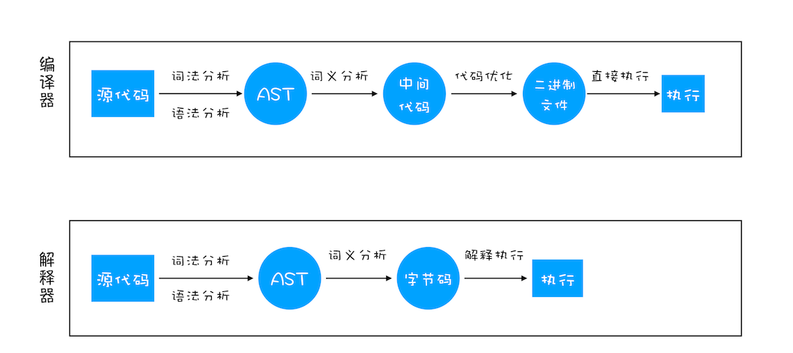
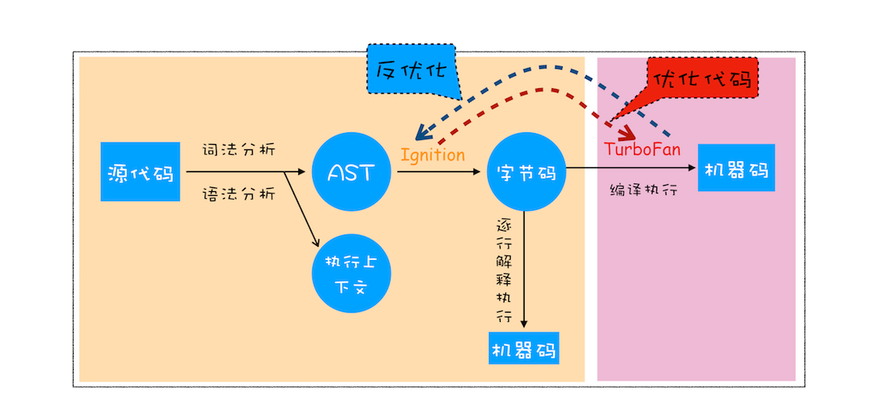
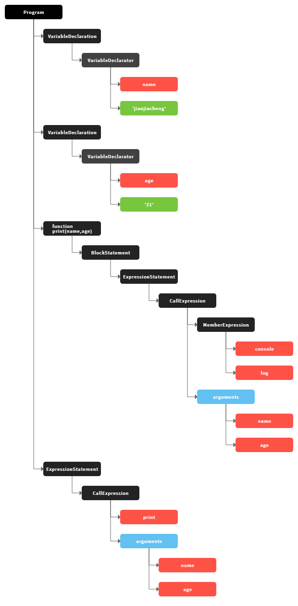
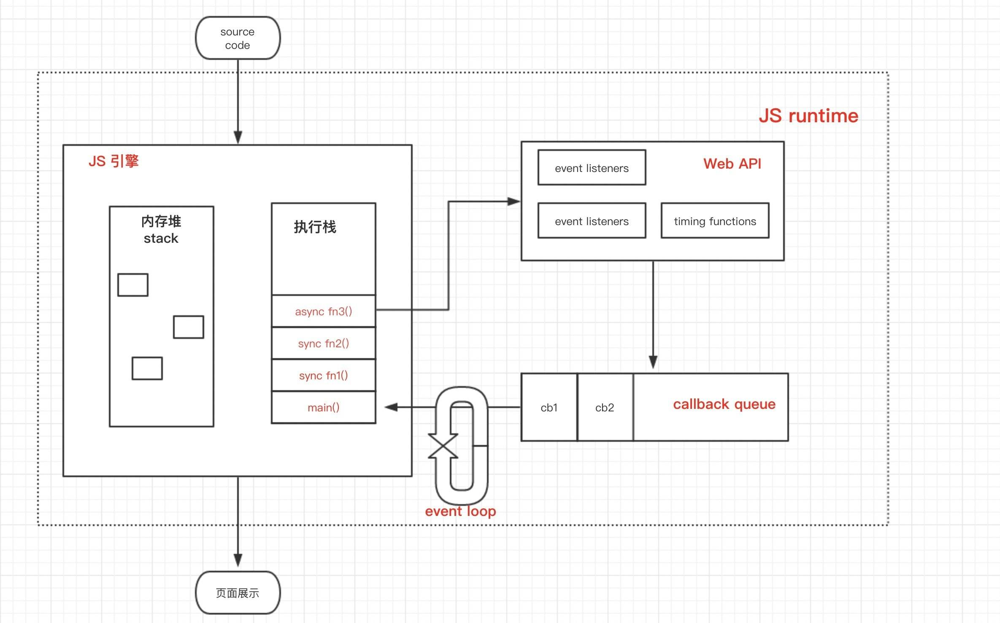
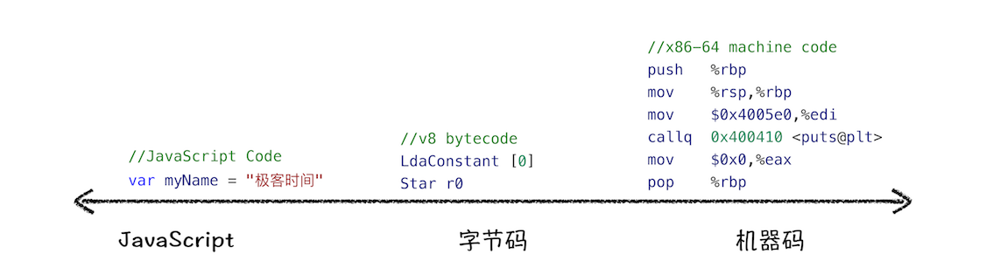
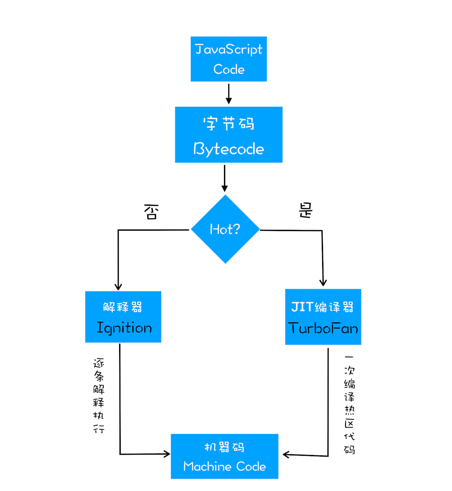

## 计算机语言

1、高级语言：语法和结构更类似汉字或者普通英文，且由于远离对硬件的直接操作，使得一般人更容易学习。

2、汇编语言：在汇编语言中，用助记符代替机器指令的操作码，用地址符号或标号代替指令或操作数的地址。在不同的设备中，汇编语言对应着不同的机器语言指令集，通过汇编过程转换成机器指令。特定的汇编语言和特定的机器语言指令集是一一对应的，不同平台之间不可直接移植。


3、机器语言：使用绝对地址和绝对操作码。不同的计算机都有各自的机器语言，即指令系统。从使用的角度看，机器语言是最低级的语言。

4、指令：指令就是把特定1653的0和1序列，简化成对应的指令（一般为英文简写，如mov，inc等），可读性稍好。汇编语言包括指令和伪指令。伪指令是为了编程方便，对部分指令做的封装
```tsx
操作：寄存器BX的内容送到AX中
  
1000100111011000  机器指令
  
mov ax,bx         汇编指令 
```

由于计算机并不认识“高级编程语言”写出来的东西，所以大部分“高级编程语言”在写好以后都需要经过一个叫做“编译”的过程，将“高级编程语言”翻译成“机器语言”，然后交给计算机来运行。但是，JavaScript 不一样，它没有“编译”的过程，那么机器是怎么认识这种语言的呢？


## 两种翻译方法将代码翻译成机器语言

“编译”类似于“全文翻译”，就是代码编写好后，一次性将所有代码全部编译成“机器语言”，然后直接交给计算机；而“解释”则类似于“实时翻译”，代码写好后不会翻译，运行到哪，翻译到哪。

### 解释器
使用解释器，翻译的过程基本上是一行一行及时生效的。

优点：
- 解释器很快的获取代码并且执行。您不需要在您可以执行代码的时候知道全部的编译步骤。因此，解释器感觉与 JavaScript 有着自然的契合。
- web 开发者能够立即得到反馈很重要。这也是浏览器最开始使用 JavaScript 解释器的原因之一。

缺点：
- 效率低下，因为代码每运行一次都要翻译一次
- 当你运行相同的代码的时候。比如，你执行了一个循环。然后你就会一遍又一遍的做同样的事情。

### 编译器

编译器是另外一种工作方式，它在执行前翻译。

优点：
- 使用“解释”的方法，程序每次运行时都需要重新“解释”一遍，而“编译”的方法则不需要了。
- 但是当运行一个循环的时候他会更快，因为他不需要重复的去翻译每一次循环里的代码。

缺点：
- 在程序开始的时候，要先花费一段时间等待整个代码编译完成后才可以执行

因为解释器必须在每次循环访问时不断重新转换代码，作为一个可以摆脱解释器低效率的方法，浏览器开始将编译器引入。
给 JavaScript 引擎添加了一个新的部分，称为监视器（也称为分析器）。该监视器在 JavaScript 运行时监控代码，并记录代码片段运行的次数以及使用了那些数据类型。
如果相同的代码行运行了几次，这段代码被标记为 “warm”。如果运行次数比较多，就被标记为 “hot”。
被标记为 “warm” 的代码被扔给基础编译器，只能提升一点点的速度。被标记为 “hot” 的代码被扔给优化编译器，速度提升的更多。

## 编程语言是如何运行的

编程语言完成的程序是通过处理器运行的。但是处理器不能直接理解我们通过高级语言（如 C++、Go、JavaScript 等）编写的代码，只能理解机器码，所以在执行程序之前，需要经过一系列的步骤，将我们编写的代码翻译成机器语言。这个过程一般是由编译器（Compiler） 或者解释器（Interpreter） 来完成。

## 编译器和解释器

- 在编译型语言的编译过程中，编译器首先会依次对源代码进行词法分析、语法分析，生成抽象语法树（AST），然后是优化代码，最后再生成处理器能够理解的机器码。如果编译成功，将会生成一个可执行的文件。但如果编译过程发生了语法或者其他的错误，那么编译器就会抛出异常，最后的二进制文件也不会生成成功。
- 在解释型语言的解释过程中，同样解释器也会对源代码进行词法分析、语法分析，并生成抽象语法树（AST），不过它会再基于抽象语法树生成字节码，最后再根据字节码来执行程序、输出结果。




## V8 是如何执行一段 JavaScript 代码的

V8 在执行过程中既有解释器 Ignition，又有编译器 TurboFan
Bytecode Compiler字节码编译器会生成引擎能够直接阅读、执行的字节码。
字节码进入翻译器，将字节码一行一行的翻译成效率十分高的Machine Code.



图片中的蓝线是逆向的，这的确有点奇怪，机器码（Optimized Machine Code） 会被还原为 字节码（Bytecode），这个过程叫做反优化 （Deoptimization）。这是因为 Ignition 收集的信息可能是错误的，比如 add 函数的参数之前是整数，后来又变成了字符串。生成的机器码 已经假定 add 函数的参数是整数，那当然是错误的，于是需要进行反优化。

```tsx
function add(x, y) {
    return x + y;
}

add(1, 2);
add("1", "2");
```

## Parser（解析器）生成抽象语法树（AST）

高级语言是开发者可以理解的语言，但是让编译器或者解释器来理解就非常困难了。对于编译器或者解释器来说，它们可以理解的就是AST了。所以无论你使用的是解释型语言还是编译型语言，在编译过程中，它们都会生成一个AST。这和渲染引擎将HTML格式文件转换为计算机可以理解的DOM树的情况类似。

在Chrome中开始下载Javascript文件后，Parser就会开始并行在单独的线程上解析代码。这意味着解析可以在下载完成后仅几毫秒内完成，并生成AST。
- 词法分析（lexical analysis）：主要是将字符流（char stream） 转换成标记流（token stream）
- 语法分析(parse)：将前面生成的token流根据语法规则，形成一个有元素层级嵌套的语法规则树，这个树就是AST。在此过程中，如果源代码不符合语法规则，则会终止，并抛出“语法错误”。

```tsx
var name='jianjiacheng'
var age = '21'
function print(name,age){
  console.log(name,age)
}
print(name,age)
```


AST的结构和代码的结构非常相似，其实你也可以把AST看成代码的结构化的表示，编译器或者解释器后续的工作都需要依赖于AST，而不是源代码。

AST是非常重要的一种数据结构，在很多项目中有着广泛的应用：
- Babel是一个被广泛使用的代码转码器，可以将ES6代码转为ES5代码
- ESLint也使用AST。ESLint是一个用来检查JavaScript编写规范的插件，其检测流程也是需要将源码转换为AST，然后再利用AST来检查代码规范化的问题

## 执行上下文

就是当前 JavaScript 代码被解析和执行时所在环境的抽象概念， JavaScript 中运行任何的代码都是在执行上下文中运行。
为了表示不同的运行环境，JavaScript 中有一个**执行上下文（Execution context，EC）**的概念。也就是说，当 JavaScript 代码执行的时候，会进入不同的执行上下文，这些执行上下文就构成了一个**执行上下文栈（Execution context stack，ECS）**




源代码进入JS引擎之后，顺序读取代码，按照变量声明、函数执行等不同规则，分配到堆、或者栈内。
- 内存堆 引用类型实际值、内存分配的地方
- 调用栈 基本类型存储、引用类型地址名存储、代码逻辑执行的地方


## 生成字节码

有了 AST 和执行上下文后，那接下来的第二步，解释器 Ignition 就登场了，它会根据 AST 生成字节码，并解释执行字节码。

**字节码是机器码的抽象**。如果字节码的设计与物理 CPU 的计算模型相同，那么将字节码编译成机器代码就会更加容易。这就是为什么解释器通常是寄存器或堆栈机器。Ignition 是一个带有累加器的寄存器。

字节码就是介于 AST 和机器码之间的一种代码。但是与特定类型的机器码无关，字节码需要通过解释器将其转换为机器码后才能执行。

其实一开始 V8 并没有字节码，而是直接将 AST 转换为机器码，由于执行机器码的效率是非常高效的，所以这种方式在发布后的一段时间内运行效果是非常好的。但是随着 Chrome 在手机上的广泛普及，特别是运行在 512M 内存的手机上，内存占用问题也暴露出来了，因为 V8 需要消耗大量的内存来存放转换后的机器码。为了解决内存占用问题，V8 团队大幅重构了引擎架构，引入字节码，并且抛弃了之前的编译器，最终花了将进四年的时间，实现了现在的这套架构。



机器码所占用的空间远远超过了字节码，所以使用字节码可以减少系统的内存使用。

## 执行代码

通常，如果有一段第一次执行的字节码，解释器 Ignition 会逐条解释执行。在执行字节码的过程中，如果发现有热点代码（HotSpot），比如一段代码被重复执行多次，这种就称为热点代码，那么后台的编译器 TurboFan 就会把该段热点的字节码编译为高效的机器码，然后当再次执行这段被优化的代码时，只需要执行编译后的机器码就可以了，这样就大大提升了代码的执行效率。

V8 的解释器和编译器的取名也很有意思。解释器 Ignition 是点火器的意思，编译器 TurboFan 是涡轮增压的意思，寓意着代码启动时通过点火器慢慢发动，一旦启动，涡轮增压介入，其执行效率随着执行时间越来越高效率，因为热点代码都被编译器 TurboFan 转换了机器码，直接执行机器码就省去了字节码“翻译”为机器码的过程。

其实字节码配合解释器和编译器是最近一段时间很火的技术，比如 Java 和 Python 的虚拟机也都是基于这种技术实现的，我们把这种技术称为即时编译（JIT）。具体到 V8，就是指解释器 Ignition 在解释执行字节码的同时，收集代码信息，当它发现某一部分代码变热了之后，TurboFan 编译器便闪亮登场，把热点的字节码转换为机器码，并把转换后的机器码保存起来，以备下次使用。

对于 JavaScript 工作引擎，除了 V8 使用了“字节码+JIT”技术之外，苹果的 SquirrelFish Extreme 和 Mozilla 的 SpiderMonkey 也都使用了该技术。

这么多语言的工作引擎都使用了“字节码+JIT”技术，因此理解 JIT 这套工作机制还是很有必要的。你可以结合下图看看 JIT 的工作过程：




- 如果函数没有被调用，则V8不会去编译它。
- 如果函数只被调用1次，则Ignition将其编译Bytecode就直接解释执行了。TurboFan不会进行优化编译，因为它需要Ignition收集函数执行时的类型信息。这就要求函数至少需要执行1次，TurboFan才有可能进行优化编译。
- 如果函数被调用多次，则它有可能会被识别为热点函数，且Ignition收集的类型信息证明可以进行优化编译的话，这时TurboFan则会将Bytecode编译为Optimized Machine Code，以提高代码的执行性能。

## JavaScript 的性能优化

虽然在 V8 诞生之初，也出现过一系列针对 V8 而专门优化 JavaScript 性能的方案，比如隐藏类、内联缓存等概念都是那时候提出来的。不过随着 V8 的架构调整，你越来越不需要这些微优化策略了，相反，对于优化 JavaScript 执行效率，你应该将优化的中心聚焦在单次脚本的执行时间和脚本的网络下载上，主要关注以下三点内容：

- 提升单次脚本的执行速度，避免 JavaScript 的长任务霸占主线程，这样可以使得页面快速响应交互；
- 避免大的内联脚本，因为在解析 HTML 的过程中，解析和编译也会占用主线程；
- 减少 JavaScript 文件的容量，因为更小的文件会提升下载速度，并且占用更低的内存。


## JS 就是一门解释器语言吗？

JS 就是一门解释器语言的时候，其实这个说法是有问题的。因为字节码不仅配合了解释器，而且还和编译器打交道，所以 JS 并不是完全的解释型语言。而编译器和解释器的 根本区别在于前者会编译生成二进制文件但后者不会。

## V8(基于栈) 对比 JScore(基于寄存器)

JSCore采用的是基于寄存器的指令集结构，相比于基于栈的指令集结构（比如有些JVM的实现），因为不需要把操作结果频繁入栈出栈，所以这种架构的指令集执行效率更高。但是由于这样的架构也造成内存开销更大的问题，除此之外，还存在移植性弱的问题，因为虚拟机中的虚拟寄存器需要去匹配到真实机器中CPU的寄存器，可能会存在真实CPU寄存器不足的问题。

V8是基于栈的一般都是零地址指令集，因为它的运算不依托于具体的寄存器，而是使用对操作数栈和具体运算符来完成整个运算。Ignition 是一个基于寄存器的解释器。这些寄存器不是传统意义的机器寄存器，而是在函数的栈帧中分配的寄存器文件(register file)中特定的 slot（译注：此处及后面所说的 slot，都指 V8 运行栈中的一小块内存）。根据字节码参数可以指定字节码操作的输入、输出寄存器，字节码参数在字节码数组(BytecodeArray)流中紧跟着字节码。

## 为什么使用栈实现指令集结构

### 考虑到可移植性

如果一个VM采用基于栈的架构，则无论在怎样的实际机器上，都很好实现——它的源架构里没有任何通用寄存器，所以实现VM时可以比较自由的分配实际机器的寄存器。于是这样的VM可移植性就比较高

作为优化，基于栈的VM可以用编译方式实现，“求值栈”实际上也可以由编译器映射到寄存器上，减轻数据移动的开销。

### 针对基于栈架构的指令集生成代码的编译器更容易实现

由于指令中不必显式指定源与目标，VM可以设计得很简单，不必考虑为临时变量分配空间的问题，求值过程中的临时数据存储都让求值栈包办就行。

### 该VM是为某类资源非常匮乏的硬件而设计的

这类硬件的存储器可能很小，每一字节的资源都要节省。零地址指令比其它形式的指令更紧凑，所以是个自然的选择。

基于栈的虚拟机更加适合内存和 CPU 处理速度等方面有限的系统。同样的源程序，在目标代码的体积上，面向栈虚拟机上生成的代码更加小。这是容易理解的：基于栈的虚拟机的指令默认对栈顶元素操作，因此指令只需为 OP 格式，无需 OP Reg1, Reg2, Reg3 等额外指定寄存器。这个设计也绕开了指令解码问题。平均上说，基于寄存器的虚拟机生成的指令的体积比基于栈的要大。

## V8引擎从单进程到多进程

>从单进程架构切换到多进程架构是一个非常复杂的过程，Firefox从2009年到2017年花了整整8年时间才完成切换。从这一点来说，Firefox落后了Chrome接近10年。这倒不是因为Chrome的工程师特别厉害，而是因为Chrome从一开始就设计了多进程架构，没有什么技术债。

### 曾经
- 你用 IE6或IE7 或者 firefox 的时候有遇到一个插件崩溃，而你打开的一系列页面全部崩溃
- 打开浏览器或某些页面总是弹出很多你不想打开的恶意窗，要一个一个手动叉掉
- 打开某个页面由于某种原因整个浏览器就卡住，连关闭按钮都点不动的时候，你是只能强制关掉整个浏览器

### 现在
Chrome的每一个Tab和插件，都使用独立的进程。这样可以提高浏览器的性能、安全性以及稳定性：
- 充分利用多核CPU，不同的进程可以使用不同的CPU核运行；
- 便于限制Tab与插件进程的权限，不共享数据，减少安全隐患；
- 当某一个Tab的页面崩溃了，不会导致其他Tab崩溃，整个浏览器还可以正常使用；
- 有专门处理插件的进程，不会影响页面
- 多进程架构借鉴了现代操作系统的设计思想，浏览器不再是一个简单的应用，它是一个平台，可以用于独立运行各种各样的Web应用。


## 总结一下

- 首先通过词法分析和语法分析生成 AST
- 不直接转为机器码而采用先将 AST 转换为抽象的字节码解决机器码占用内存很大的问题
- 由解释器逐行执行字节码,遇到多次执行的标记为热点代码
- 遇到热点代码启动编译器进行编译，生成对应的机器码, 以优化执行- 效率

## 浏览器又是如何渲染的呢

除了 V8这个JS引擎还有一个渲染引擎，Chrome现在用的blink。这两个引擎之间通过一些桥接的接口交互。


## 参考

- https://blog.fundebug.com/2019/07/16/how-does-v8-work/
- https://zhuanlan.zhihu.com/p/96502646
- https://github.com/ravencrown/blog/issues/62
- https://juejin.im/post/5d4b8acdf265da03bc126451
- https://resources.jointjs.com/demos/javascript-ast
- https://www.lagou.com/lgeduarticle/66864.html
- https://zhuanlan.zhihu.com/p/96957235

## 

mathias（v8 的开发者）的两篇文章：这篇（https://mathiasbynens.be/note...）讲的是shapes和inline caches。也就是本文所述内容，但更详实，而且浅显易懂。个人觉得本文将 shapes 翻译成隐藏类不是很准确，借用 js 原型链的概念可能更好理解（纯属个人理解）。
另一篇（https://mathiasbynens.be/note...）是将v8 是如何优化 prototype 的。