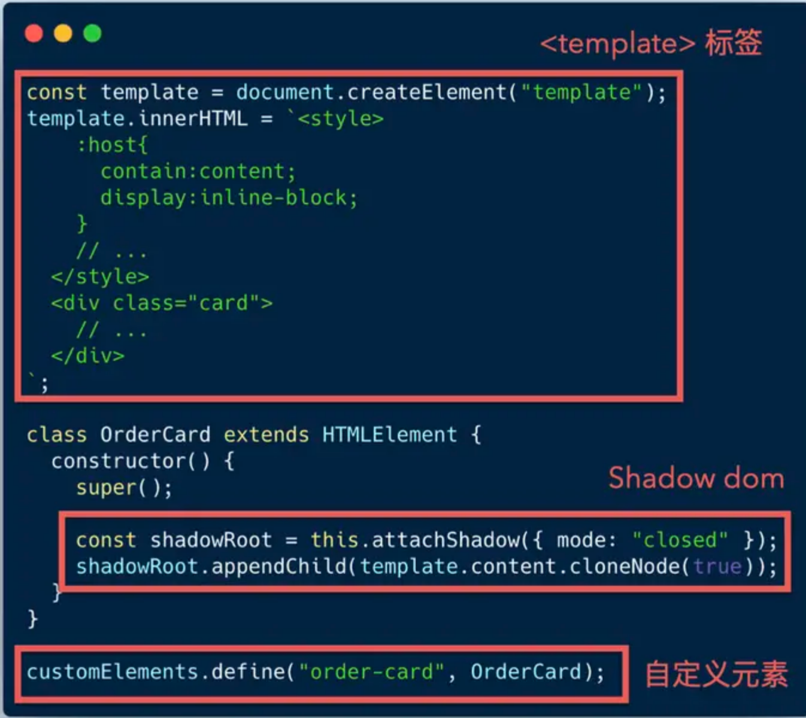
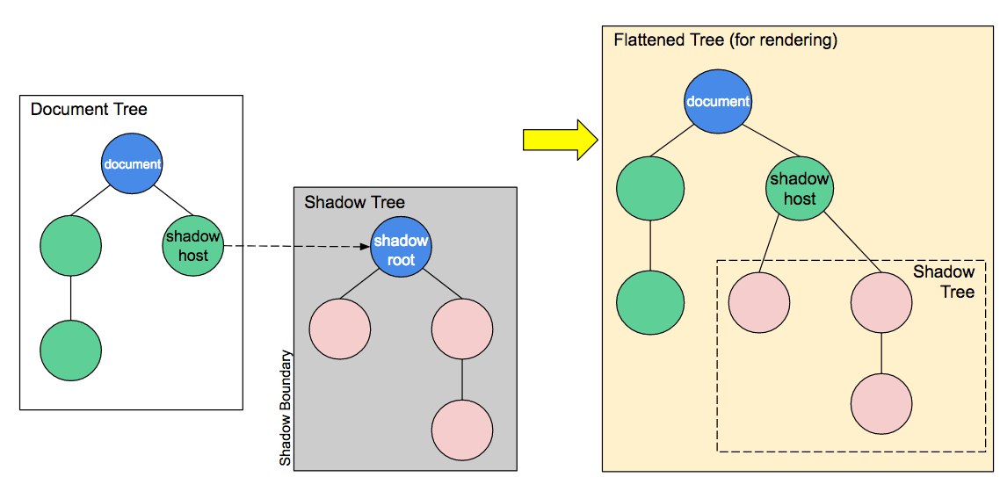

## WebComponents
> https://juejin.cn/post/7044055764532461605

Web Components 本身不是一个单独的规范，而是由一组DOM API 和 HTML 规范所组成，用于创建可复用的自定义名字的 HTML 标签，并且可以直接在你的 Web 应用中使用。

### 优点

它不依赖于任何框架，可实现跨框架使用，这也解决了项目重构时换框架即需要重新开发组件的痛点

- 标准化，一劳永逸
  - 组件拥有更长的寿命，它不需要适应新的技术而重写。
  - Web Components, 这套 API 规范成为标准被绝大多数浏览器支持后，我们就能开发更通用的组件了，不用花时间在框架的选择上，而是更聚焦在组件本身
- 非侵入式，语法简单易学
  - 组件仅由 html、css、javascript 三部分组成，使用它可以不像使用依赖库或者框架的组件一样去额外学习一些框架的特定语言。
  - Web Components 组件能够很好的组织好自身的 HTML 结构、 CSS 样式、JS 代码，而且不会干扰到页面中的其他代码
- 不依赖第三方库或框架，可移植性强，开箱即用
  - 组件可以在任何web应用中使用，因为很少甚至没有依赖，组件的使用障碍要明显低于依赖库或者框架的组件
- 自带 runtime，用于减少框架尺寸
  - 使用和 vue 对等的机制，是不可能做到 1kb 的……至少多出来一个 template compiler
- 丰富的应用场景
  - 能用在组件库，微前端，跨端等

### 组成

Web Components 中包含的几个规范，都已在 W3C 和 HTML 标准中进行了规范化，主要由三部分组成：

- Custom elements（自定义元素）：用来创建自定义的 HTML标签，并允许标签创建或销毁时进行一些操作；
- Shadow DOM（影子DOM）：用于将创建的 DOM Tree 插入到现有的元素中，且 DOM Tree 不能被外部修改，不用担心元素被其他地方影响；隔离CSS样式
- HTML templates（HTML模板）：通过 `<template>`、`<slot>` 直接在 HTML 文件中编写模板, 生成 DOM，然后通过 DOM API 获取。



### Custom Element 定制元素

Custom Elements 顾名思义，是提供一种方式让开发者可以自定义 HTML 元素，包括特定的组成，样式和行为。支持 Web Components 标准的浏览器会提供一系列 API 给开发者用于创建自定义的元素，或者扩展现有元素。

浏览器提供了一个方法： customElements.define()

Web Components 包含以下生命周期函数：

- connectedCallback: 当自定义元素第一次被加入到文档时被调用。
- disconnectedCallback: 当自定义元素与文档 DOM 断开连接时被调用。(从文档中移除)
- adoptedCallback: 当自定义元素被移动到新文档时被调用。(调用 adoptNode 方法)
- attributeChangedCallback: 当自定义元素的一个属性被增加、移除或更改时被调用。

#### 第一种手动创建元素

```
class CustomTitle extends HTMLElement {
    constructor() {
      super();

      //手动创建<p stype='color:red'></p>，后面可以用模板创建
      const pElem = document.createElement('p');
      pElem.textContent = this.textContent;
      pElem.style.color = 'red';
      //加入根节点
      const shadowRoot = this.attachShadow({mode: 'closed'});
      shadowRoot.appendChild(pElem);
  }

  connectedCallback() {
    //...
  }

  disconnectedCallback() {
    //...
  }

  attributeChangedCallback(attrName, oldVal, newVal) {
    //...
  }
}

customElements.define('custom-element', CustomTitle)

```

```
<custom-element>红色字体的段落！</custom-element>
```

#### 第二种可以使用字符串拼接

```
class CustomTitle extends HTMLElement {
    constructor() {
    super()
    this.attachShadow({ mode: 'open' })
    this.shadowRoot.innerHTML = `
      <style>
        h1 {
          font-size: 40px;
          color: #000;
        }
      </style>
            <h1>Hello WC!</h1>
        `
    this.addEventListener('click', e => {
        console.log('clicked')
    })
  }
}
customElements.define('custom-element', CustomTitle)

```

#### 最后可以通过 Templates 模板创建

```
//html

<template id="custom-title-template">
  <style>
    h1 {
      font-size: 40px;
            color: #000;
    }
  </style>
  <h1>Hello WC!</h1>
</template>

<custom-title></custom-title>

//js
class CustomTitle extends HTMLElement {
    constructor() {
    super()
    this.attachShadow({ mode: 'open' })
    const tmpl = ducument.querySelector('#custom-title-template')
    this.shadowRoot.appendChild(tmpl.content.cloneNode(true))
  }
}

window.customElements.define('custom-title', CustomTitle)
```

### HTML 模板(HTML Templates)

HTML 模板定义了新的元素，描述一个基于 DOM 标准用于客户端模板的途径。模板允许你声明标记片段，它们可以被解析为 HTML。这些片段在页面开始加载时不会被用到，之后运行时会被实例化。

```
<template id="custom-template>
     <h1>HTML Templates are rad</h1>
</template>

//借助 cloneNode 函数来复用这个模板
const template = document.getElementById("custom-template");
const templateContent = template.content;
const container = document.getElementById("container");
const templateInstance = templateContent.cloneNode(true);
container.appendChild(templateInstance);
```

slot 标签允许开发者通过特定接入点来动态替换模板中的 HTML 内容。它用 name 属性来作为唯一识别标志（译者注，就类似普通 DOM 节点的 id 属性）：

假设一个标签`<greeting-hello>`，属性传参允许指定 hello 的对象，像是这样：

```
<greeting-hello who="world">
<greeting-hello who="Reco">
```

Slot 插槽传参可以传递复杂的 HTML 片段，像是这样：

```
<greeting-hello>
	<b slot="who">Reco</b>
</greeting-hello>
```

### Shadow DOM（影子 DOM）

为了保证组件的隔离性，Web Components 组件借助了 Shadow DOM 技术。它和 DOM 基本相似，可以简单地理解为被隔离的 DOM。


区别在于：

- Shadow DOM 元素也呈树状结构，多个 Shadow DOM 元素构成一颗 Shadow tree 中，Shadow tree 必须添加到一个普通的 DOM 元素上（input 这类元素不支持），这个父元素称之为 Shadow host，Shadow tree 的根节点称之为 Shadow root。
- 访问 Shadow DOM 的时候必须通过 Shadow tree 中的 Shadow root 元素。
- 创建 Shadow tree 只能通过 attachShadow 函数。
- Shadow DOM 不再继承 DOM tree 中的样式，需要重新定义或引用。
- { mode: 'closed' }，表示 Shadow DOM 是封闭的，不允许外部访问。open 表示可以通过 JS 访问

可以这样将 Shadow DOM 附加到一个节点上：

```
element.attachShadow({mode: 'close'});
```

attachShadow 函数接受一个含 mode 属性的对象作为参数。Shadow DOM 可以打开或关闭。打开时使用 element.shadowRoot 就可以拿到 DOM 子树，反之如果关闭了则会拿到 null。接着创建一个 Shadow DOM 就会创建一个阴影的边界，在封装节点的同时封装样式。默认情况下该节点内部的所有样式会被限制仅在这个影子树里生效，于是样式选择器写起来就短得多了。Shadow DOM 通常可以和 HTML 模板结合使用：

```
const shadowRoot = element.attachShadow({mode: 'close'});
shadowRoot.appendChild(templateContent.cloneNode(true));
```

element 就有一个影子树，影子树的内容是模板的一个复制。Shadow DOM、 `<template>` 标签、`<slot>` 标签在这里和谐地应用在一起，构造出了可复用、封装良好的组件。

### HTML 引用(HTML Imports)

> 补充：这个接口 chrome73 后就废弃了。。。要添加垫片，我找了个加上去还是没有引入，太难了

HTML 模板(HTML Templates)允许你创建新的模板，同样的，HTML 引用(HTML imports)允许你从不同的文件中引入这些模板。通过独立的 HTML 文件管理组件，可以帮助你更好的组织代码。

之前在页面引入另一个页面或片段往往是通过 iframe 或者 ajax 异步加载，现在可以使用 HTMLLinkElement，原本的 link 标签在添加了 HTML Import 之后，多了一个只读的 import 属性，当出现下边两种情况时，这个属性为 null：

-该 link 不是用来 import 一个 HTML 的。

- 该 link 元素不在 document 中。

否则，这个属性会返回一个表示引入的 HTML 文件的文档对象，类似于 document。比如说，在上边的代码基础上，可以这样做：

```
// head
<link rel="import" href="/path/to/imports/stuff.html">
// js
const link = document.querySelector('link[rel=import]')
const header = link.import;
const pulse = header.querySelector('div.logo');
```

## Stencil.js => Web Component

Stencil 是 ionic 公司的一个开源框架，简单来说，它是一个构建 Web Component 的工具集。在 Stencil的框架下面，我们可以以一种类似 React 的方式去开发 Web Component 组件，它有更加便捷的语法糖、更高的渲染效率。而且集成了unit和e2e的测试框架，而且最需要注意的是，它只是一个构造器，最终的编译结果是标准的Web Component组件，所以它不会作为我们组件库的直接依赖。

它提供了以下的特性。

- Virtual DOM
- Async rendering
- Reactive data-binding
- TypeScript
- JSX
- 
为什么说它结合了最流行框架的最佳概念——它的代码看上去就像 Angular + React 的混合体，如下

```jsx
@Component({
 tag: 'my-component',
 styleUrl: 'my-component.css',
 shadow: true
})
export class MyComponent {
 @Prop() first: string;

 private getText(): string {
 return this.first;
 }

 render() {
 return <div>Hello, World! I'm {this.getText()}</div>;
 }
}
```

taro/component 就是用Stencil构建，以到达跨框架可用的目的（如React、Vue