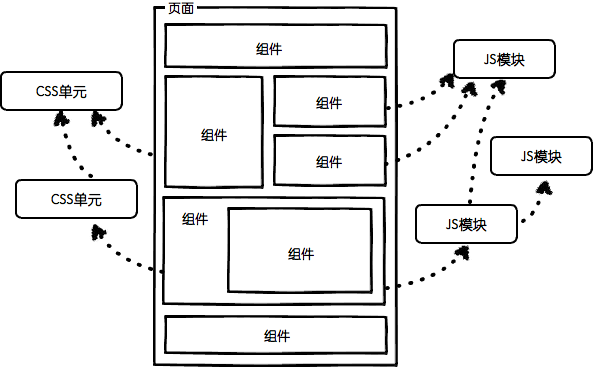
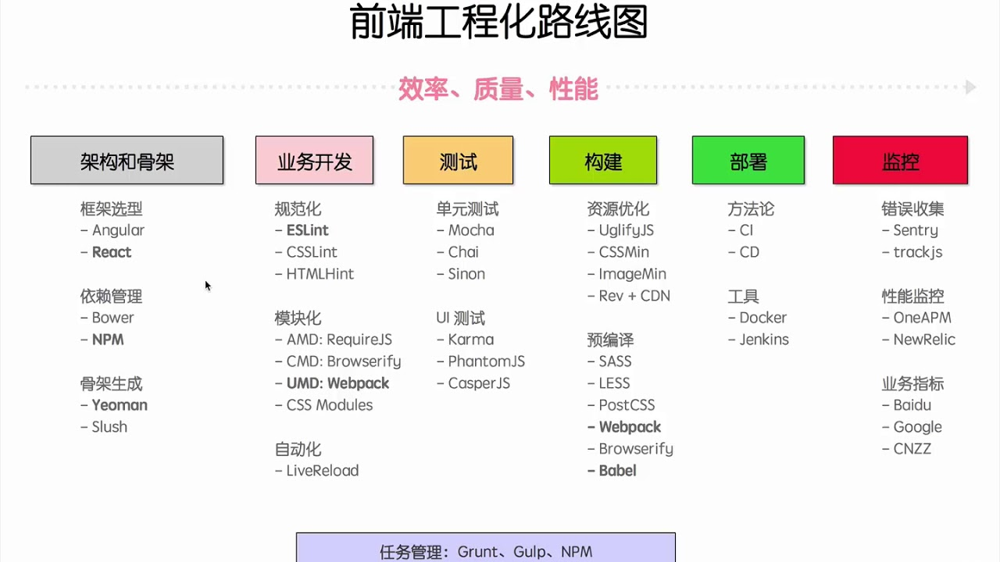
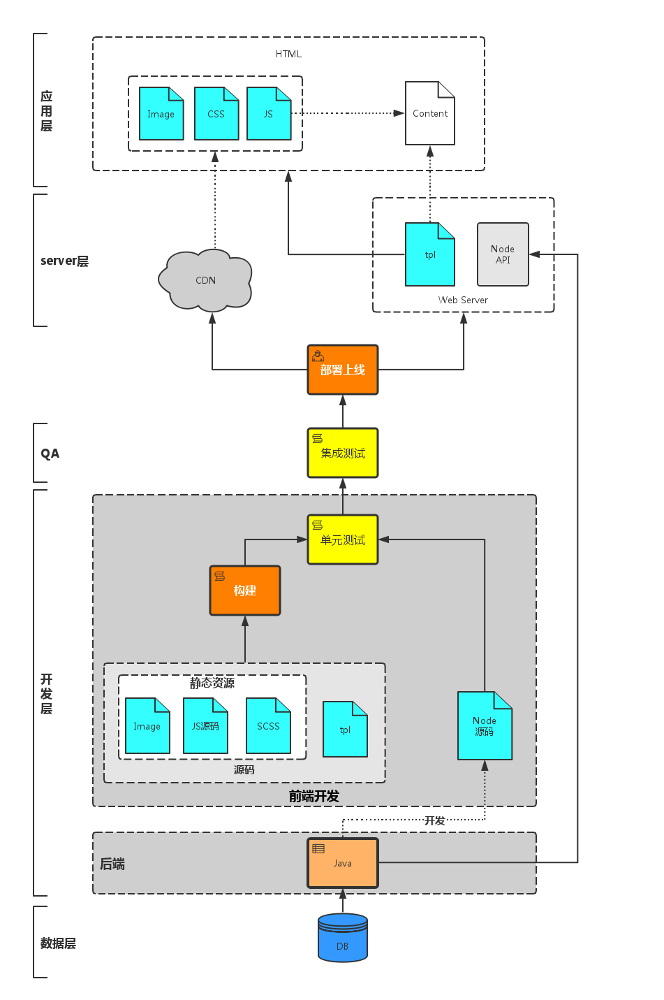
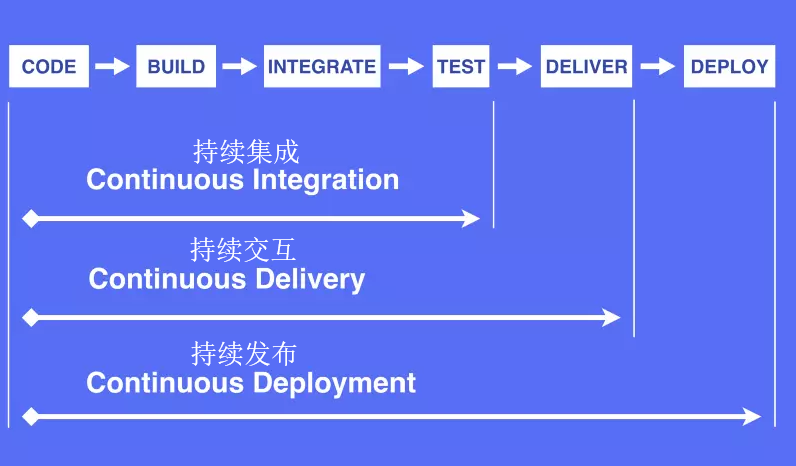
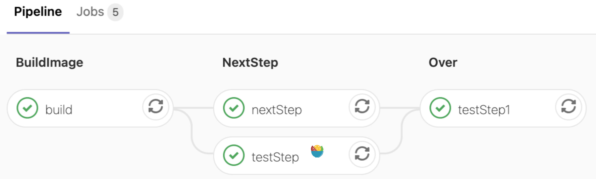

## 前端工程化
>"前端工程化"里面的工程指软件工程，和我们一般说的工程是两个完全不同的概念。软件工程的定义是: "应用计算机科学理论和技术以及工程管理原则和方法，按预算和进度，实现满足用户要求的软件产品的定义、开发、和维护的工程或进行研究的学科"

前端工程化是使用软件工程的技术和方法来进行前端的开发流程、技术、工具、经验等规范化、标准化，其主要目的为了提高效率和降低成本，即提高开发过程中的开发效率，减少不必要的重复工作时间，而前端工程本质上是软件工程的一种，因此我们应该从软件工程的角度来研究前端工程。

## 为什么需要前端工程化
- 现在的前端“太大”、“复杂”
  - 也就是说现在的前端不再是原来的html+css+js+jquery简单的写页面的阶段了
  - Web业务日益复杂化和多元化，前端开发已经由以WebPage模式为主转变为以WebApp模式为主了
  - 现在随便找个前端项目，都已经不是过去的拼个页面+搞几个jQuery插件就能完成的了
  - 现在框架越来越多，前端技术越来越复杂，项目越来越多大，急需一套规范来引导它
- 不再是后端的附属品
  - 现在的前端不在是原来的构建页面了，现在的大前端时代，一个前端可以做的事情太多太多了
  - 包括自动化打包，测试，部署，上线，甚至于后台我们也可以由前端开发人员来编写

## 前端工程化要解决的问题

- 开发角度
  - 提高开发生产效率
  - 提高代码质量
  - 优化性能
  - 降低维护难度
- 部署角度（主要问题是资源管理
  - 代码审查
  - 压缩打包
  - 增量更新
  - 单元测试
  - 自动化


## 前段工程化可以分成四个块来说


### 模块化


将一个文件拆分成多个相互依赖的文件，最后进行统一的打包和加载，这样能够很好的保证高效的多人协作。其中包含

- JS 模块化：CommonJS、AMD、CMD 以及 ES6 Module。
- CSS 模块化：Sass、Less、Stylus、BEM、CSS Modules 等。其中预处理器和 BEM 都会有的一个问题就是样式覆盖。而 CSS Modules 则是通过 JS 来管理依赖，最大化的结合了 JS 模块化和 CSS 生态，比如 Vue 中的 style scoped。
- 资源模块化：任何资源都能以模块的形式进行加载，目前大部分项目中的文件、CSS、图片等都能直接通过 JS 做统一的依赖关系处理。
- 然后就是模块的打包和加载问题( 用Webpack+Babel)


### 组件化

不同于模块化，模块化是对文件、对代码和资源拆分，而组件化则是对 UI 层面的拆分。

- 通常，我们会需要对页面进行拆分，将其拆分成一个一个的零件，然后分别去实现这一个个零件，最后再进行组装。
- 在我们的实际业务开发中，对于组件的拆分我们需要做不同程度的考量，其中主要包括细粒度和通用性这两块的考虑。
- 对于业务组件，你更多需要考量的是针对你负责业务线的一个适用度，即你设计的业务组件是否成为你当前业务的 “通用” 组件，比如我之前分析过的权限校验组件，它就是一个典型的业务组件。感兴趣的小伙伴可以点击 传送门 自行阅读。

组件化的好处主要有这么几点
- 管理方便，我们可以把一个独立功能相关的文件在工程目录中放在一起，这样代码管理起来会非常便利
- 组件复用，通过抽取公共组件，可以实现组件复用，从而减少工作量，创造价值
- 分而治之，这是组件化最重要的一点，将页面组件化，就是对页面功能的拆分，将一个大的工程拆成小的零件，我们只需要关注每一个零件的功能，极大地降低了页面的开发与维护的难度




### 规范化

正所谓无规矩不成方圆，一些好的规范则能很好的帮助我们对项目进行良好的开发管理。规范化指的是我们在工程开发初期以及开发期间制定的系列规范，其中又包含了

- 项目目录结构规范
- 编码规范：对于编码这块的约束，一般我们都会采用一些强制措施，比如 ESLint、StyleLint 等。
- 联调规范：这块可参考我以前知乎的回答，前后端分离，后台返回的数据前端没法写，怎么办？
- 文件命名规范
- 样式管理规范：目前流行的样式管理有 BEM、Sass、Less、Stylus、CSS Modules 等方式。
- 版本控制：git flow 工作流：其中包含分支命名规范、代码合并规范等。
- 定期 code review


### 自动化

从最早先的 grunt、gulp 等，再到目前的 webpack、parcel。这些自动化工具在自动化合并、构建、打包都能为我们节省很多工作。而这些前端自动化其中的一部分
- 持续集成
- 自动化测试
- 自动化构建
- 自动化部署
- 自动化测试
- 错误监控

## 什么是构建

### 生产环境
我们可能会用到es6、sass、jsx等，从而需要预编译
我们可能忘记写`</div>`，从而需要语法检查，各种lint，如HTMLlint Csslint eslit
我们可能用了react，他们有一些依赖，从而需要依赖管理
我们会更新代码，从而需要对文件进行版本管理

### 开发环境
我们希望内容能正确的呈现，从而希望生产环境代码生成之前能有单元测试
希望资源少且小，从而能更快的完成页面的渲染


### 综上

需要：预编译、语法检查、词法检查、依赖处理、文件合并、文件压缩、单元测试、版本管理等 一系列流程,在小型项目中，开发者往往手动调用构建过程，这样在大型的项目中很不实用，在构建过程中难以跟踪什么需要被构建、按照什么顺序构建以及项目中存在哪些依赖。使用自动化工具会使构建过程更为连续。

### 构建工具

比较流行的自动化构建工具用gulp和grunt，具体使用请参考gulp、 grunt。
比较流行打包构建工具webpack和parcel-bundler，具体使用请参考webpack、parcel-bundler。

构建工具和打包工具有什么区别呢？

构建工具，更注重的是前端的自动化流程，如gulp通过流式的文件管理和定制化的任务管理来实现对前端构建流程的管理。而打包工具更注重打包这一过程，主要包括依赖管理和版本管理。

## 前端工程化路线



## 项目上线



## 谈谈持续集成，持续交付，持续部署之间的区别
> https://segmentfault.com/a/1190000006166538

编码 -> 构建 -> 集成 -> 测试 -> 交付 -> 部署



### 持续集成 CI

>Continuous Integration (CI) https://www.redhat.com/zh/topics/devops/what-is-ci-cd

持续集成是指软件个人研发的部分向软件整体部分交付，频繁进行集成以便更快地发现其中的错误。

- 频繁的将代码集成到主干
- 快速发现错误
- 防止分支大幅偏离主干
- 同时还能保持高质量


### 持续交付/持续部署 CD
>“CD”指的是持续交付和/或持续部署:Continuous Delivery (CD) Continuous Deployment(CD)

#### 持续交付

频繁的将软件的新版本交付给质量团队或者用户.

持续交付在持续集成的基础上，将集成后的代码部署到更贴近真实运行环境的「类生产环境」（production-like environments）中。持续交付优先于整个产品生命周期的软件部署，建立在高水平自动化持续集成之上。

#### 持续部署 

持续部署是指当交付的代码通过评审之后，自动部署到生产环境中。

持续部署是持续交付的最高阶段。这意味着，所有通过了一系列的自动化测试的改动都将自动部署到生产环境。它也可以被称为“Continuous Release”。

## DevOps

上述的持续集成交互部署需要开发、测试、运维的支持，DevOps就是满足这些条件的系统，DevOps是一组过程、方法与系统的统称，用于促进开发、技术运营和质量保障（QA）部门之间的沟通、协作与整合

## GitLab CI

GitLab CI 是 GitLab Continuous Integration （Gitlab 持续集成）的简称。从 GitLab 的 8.0 版本开始，GitLab 就全面集成了 Gitlab-CI,并且对所有项目默认开启。只要在项目仓库的根目录添加 .gitlab-ci.yml 文件，并且配置了 Runner （运行器），那么每一次合并请求（MR）或者 push 都会触发 CI pipeline。

一次 Pipeline 其实相当于一次构建任务，里面可以包含多个流程，如安装依赖、运行测试、编译、部署测试服务器、部署生产服务器等流程。 任何提交或者 Merge Request 的合并都可以触发 Pipeline

GitLab Runner 是 CI 的执行环境，负责执行 gitlab-ci.yml 文件，并将结果返回给 GitLab 系统。Runner 具体可以有多种形式，docker、虚拟机或 shell，在注册 runner 时选定方式。


```tsx


+------------------+           +----------------+
|                  |  trigger  |                |
|   Commit / MR    +---------->+    Pipeline    |
|                  |           |                |
+------------------+           +----------------+

+--------------------------------------------------------+
|                                                        |
|  Pipeline                                              |
|                                                        |
|  +-----------+     +------------+      +------------+  |
|  |  Stage 1  |---->|   Stage 2  |----->|   Stage 3  |  |
|  +-----------+     +------------+      +------------+  |
|                                                        |
+--------------------------------------------------------+

+------------------------------------------+
|                                          |
|  Stage 1                                 |
|                                          |
|  +---------+  +---------+  +---------+   |
|  |  Job 1  |  |  Job 2  |  |  Job 3  |   |
|  +---------+  +---------+  +---------+   |
|                                          |
+------------------------------------------+
```
- 所有 Stages 会按照顺序运行，即当一个 Stage 完成后，下一个 Stage 才会开始
- 只有当所有 Stages 完成后，该构建任务 (Pipeline) 才会成功
- 如果任何一个 Stage 失败，那么后面的 Stages 不会执行，该构建任务 (Pipeline) 失败
- 相同 Stage 中的 Jobs 会并行执行
- 相同 Stage 中的 Jobs 都执行成功时，该 Stage 才会成功
- 如果任何一个 Job 失败，那么该 Stage 失败，即该构建任务 (Pipeline) 失败

```yml
include:
  - remote: "http://www.baidu.com/data/prod.yml" # 引入额外的yml配置文件的，并进行深度合并

variables:
  - buildImage: "http://hub.com/nginx"  # 变量

workflow: # 决定何时触发pipeline或者禁止pipeline
  rules:
    - if: '$CI-PIPELINE_SOURCE' == "push"'
      when: never
    - when: always

stages:
    - build
    - nextStep
    - testStep1

build-job:
  # 开始之前需要安装依赖
  stage: build
  script:
    - yarn install
    - yarn build
    - echo "finish build stage"
  only:
    - master
  artifacts: # 在当前 job 构建成功之后，将构建列表里的文件或者文件夹传递给其他的 job
    paths:
        - build/

test-job1:
  stage: nextStep
  script:
    - echo "This job tests something"
  except: # 除了某些内容，都会触发构建
    - master
  dependencies: # 依赖build-job里artifacts传来的文件
    - build-job

test-job2:
  stage: nextStep
  script:
    - echo "This job tests something, but takes more time than test-job1."
    - echo "After the echo commands complete, it runs the sleep command for 20 seconds"

deploy-prod:
  stage: testStep1
  script:
    - echo "This job deploys something from the $CI_COMMIT_BRANCH branch."

```

这份文件包含了四个可执行的Jobs，通过stages定义执行的顺序，test-job1、test-job2的stage名字相同都是nextStep, 此时这两个任务将并列执行。



## Gitlab Cache

使用Cache指定要在作业之间缓存的文件和目录列表。 您只能使用本地工作副本中的路径。缓存在不同的pipeline的jobs之间共享。 在artifacts之前恢复缓存。Cache 机制的引入就是为了加快 job 执行的时间。Cache 在使用时制定一系列的文件或者文件目录，使得其在不同的 job 之间被缓存下来。这样当某一个 job 需要依赖于之前步骤产生的一些文件结果，Cache 就帮助我们在上一个 job 将产生的结果缓存下来并且在当前的 job 进行使用。

Cache主要用来存储项目的dependencies，以使下次跑pipline的时候更快一些，第一次跑pipline的时候下载了外部的依赖了（比如说第三方包），这样下次跑pipline时，就不用再从网络上下载了。但是stage之间的中间产物的传递应该用artifacts。

```yml
  cache:
    key: binaries-cache
    paths:
      - binaries/*.apk
      - .config
    policy: pull
```
由于 cache 是被不同的 job 所共享，如果不同的 jobs采用了不同的 path 配置，那么 cache 会在每个 job 被执行的时候被覆盖。cache:key 就是为了解决这个问题，当我们给不同 job 定义了不同的 cache:key 时， 每个 job 都会有一个独立的 cache，不同的 key 下的缓存也不会相互影响。

在默认情况下，如果有 cache 的配置，那么每个 job 会在开始执行前将对应路径的文件下载下来，并在任务结束前重新上传，不管文件是否有变化都会如此操作。这个默认的配置是 cache:policy 中的 pull-push 策略。

使用了pull 策略，所以不会在 job 结束后进行文件的上传操作
## 参考

- [凹凸实验室:我们是如何做好前端工程化和静态资源管理](https://aotu.io/notes/2016/07/19/A-little-exploration-of-front-end-engineering/index.html)

- [前端小峰哥的学习笔记](http://www.xuefeng666.com/WebGCH/WebGCH/#%E5%9F%BA%E7%A1%80%E8%A6%81%E6%B1%82)

- [谁能介绍下web前端工程化？
](https://www.zhihu.com/question/24558375)