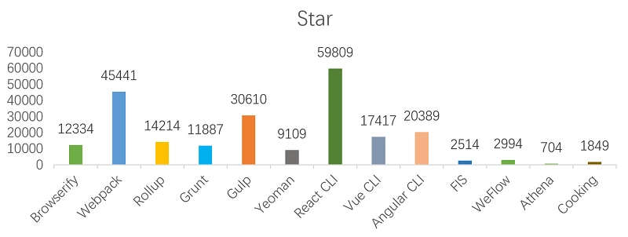
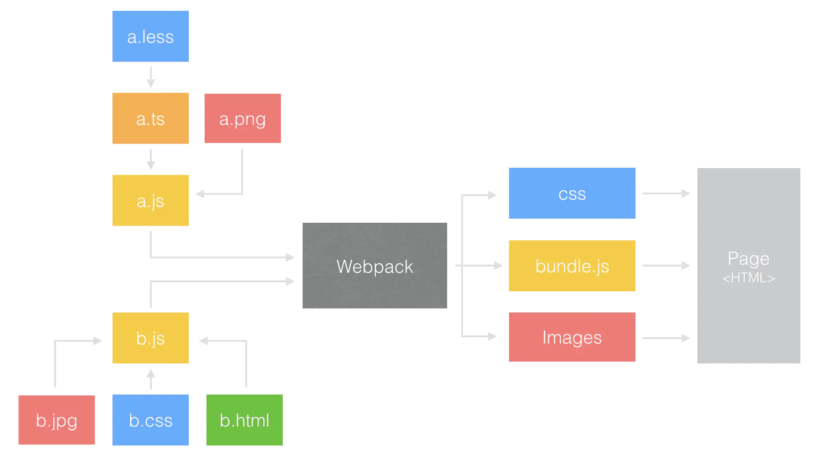
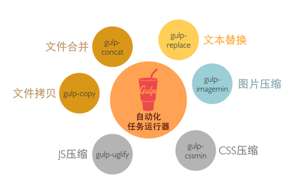
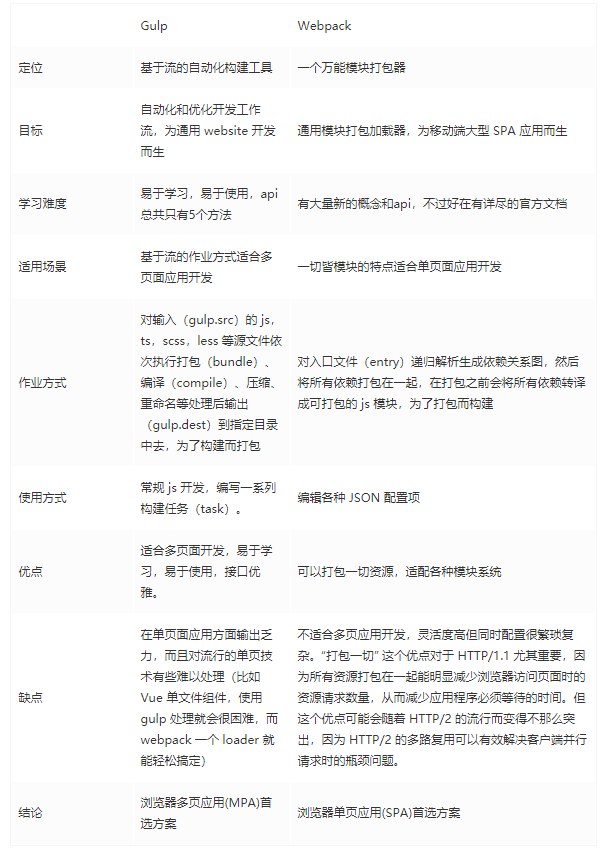

## 热门的构建工具的选型参考

构建工具可以分为三类：模块化打包类、任务流构建类和集合型工具类（脚手架）。其中最为突出的，当属用于模块化打包的 Webpack 和用于任务流构建的 Gulp。下面是2019年初时的start情况：


## 模块化打包类

有过 Node.js 开发经历的同学应该对模块很熟悉，需要引用组件直接一个 require 就 OK，这类工具就是这个模式，还可以实现按需加载、异步加载模块。

常用工具包括 Browserify、Webpack、rollup.js 等。Browserify 可以让你在浏览器端运行使用 require 加载的 js 代码，我们可以在控制台利用基于 node 环境中得 npm 命令进行安装，并将 js 文件编译成可以被浏览器识别得 js 语法

Webpack 的特点：

- 把一切都视为模块：不管是 CSS、JS、Image 还是 HTML 都可以互相引用，通过定义 entry.js，对所有依赖的文件进行跟踪，将各个模块通过 loader 和 plugins 处理，然后打包在一起。
- 按需加载：打包过程中 Webpack 通过 Code Splitting 功能将文件分为多个 chunks，还可以将重复的部分单独提取出来作为 commonChunk，从而实现按需加载。
- Webpack 也是通过配置来实现管理，与 Grunt 不同的时，它包含的许多自动化的黑盒操作所以配置起来会简单很多



### rollupjs


Rollup 是下一代 ES6 模块化工具，它最大的亮点是利用 ES6 模块设计，生成更简洁、更简单的代码。尽可能高效地构建出能够直接被其它 JavaScript 库引用的模块
- 基于权衡，Rollup 目前还不支持代码拆分（Code Splitting）和模块的热更新（HMR）
- **一般而言，对于应用使用 Webpack，对于类库使用 Rollup**；需要代码拆分(Code Splitting)，或者很多静态资源需要处理，再或者构建的项目需要引入很多 CommonJS 模块的依赖时，使用 webpack。代码库是基于 ES6 模块，而且希望代码能够被其他人直接使用，使用 Rollup
- Rollup 与 Webpack 有这不同的用途，因此会共同存在，并相互支持
- React 已经将构建工具从 Webpack 换成了 Rollup

rollup致力于打造性能出众的类库，有如下优势：

1. 编译出来的代码`可读性好`
2. rollup打包后生成的bundle内容十分`干净`，没有什么多余的代码，只是将各个模块按照依赖顺序拼接起来，所有模块构建在一个函数内（Scope Hoisting）, 执行效率更高。相比webpack(webpack打包后会生成__webpack_require__等runtime代码)，rollup拥有无可比拟的性能优势，这是由依赖处理方式决定的，`编译时依赖处理（rollup）自然比运行时依赖处理（webpack）性能更好`
3. 对于ES模块依赖库，rollup会静态分析代码中的 import，并将排除任何未实际使用的代码(tree-shaking，下文会有具体解释)
4. 支持程序流分析，能更加正确的判断项目本身的代码是否有副作用(配合tree-shaking)
5. 支持导出`es`模块文件（webpack不支持导出es模块）

缺点：
- 仅面向ES module，无法可靠的处理`commonjs以及umd依赖`
- 模块过于静态化，HMR很难实现
### rollupjs 对比 webpack

#### 打包机制不同
**rollupjs基于ES模块打包，webpack基于CommonJS打包**
ES module的设计思想是尽量的`静态化`，使得`编译时就能确定模块的依赖关系`，以及输入和输出的变量。CommonJS 和 AMD 模块，都只能在`运行时`确定这些东西，举例来说：

1. ES import只能作为模块顶层的语句出现，不能出现在 function 里面或是 if 里面。
2. ES import的模块名只能是字符串常量。
3. 不管 import 的语句出现的位置在哪里，在模块初始化的时候所有的 import 都必须已经导入完成。
4. import binding 是 immutable 的，类似 const。比如说你不能 import { a } from './a' 然后给 a 赋值个其他什么东西。

这些设计虽然使得灵活性不如`CommonJS的require`，但却保证了 ES modules 的依赖关系是确定的，和运行时的状态无关，从而也就保证了ES modules是可以进行可靠的静态分析的。


#### rollupjs 对比 webpack打包后的代码结构

```tsx
// 源文件：
// index.js
import a from './a.js'
import b from './b.js' 

export default () => {
  console.log(a()
}

// a.js
export default () => 'a'

// b.js
export default () => 'b'

```

webpack打包生成：

```tsx
(function(modules) { // webpackBootstrap
  // 大量的runtime代码
  // ...
})
({
  "./src/a.js":
  (function(module, __webpack_exports__, __webpack_require__) {

  "use strict";
  eval(`省略模块代码`);

  }),

  "./src/b.js":
  (function(module, __webpack_exports__, __webpack_require__) {

  "use strict";
  eval(`省略模块代码`);

  "./src/index.js":
  (function(module, __webpack_exports__, __webpack_require__) {

  "use strict";
  eval(`省略模块代码`);
  })
})
```
rollup打包生成：

```tsx
var test = (function () {
  'use strict';

  var a = () => 'a';

  var index = () => {
    console.log(a());
    
  };

  return index;

}());
```


## 任务流构建类

这是基于任务的构建行为，是不在乎操作对象是否为模块化的

这类工具的目标是通过配置来解放日常需要重复的工作——转化、合并压缩和单元测试等等。

疑问：这些操作 Webpack 和 Rollup 不是也能做吗，为什么还要用任务流呢？是的，的确这些操作 webpack 和 rollup 可以完成，但因任务流工具和模块化构建的出发点不同，任务流工具是十分纯粹的自动化行为，虽然在开发过程中很少用到，但多了解学习还是很必要的。

任务流构建工具常用的包括 Grunt、Gulp 两大工具。还有 Npm Script

### Npm Script

Npm Script（https://docs.npmjs.com/misc/scripts） 是一个任务执行者。Npm 是在安装 Node. js 时附带的包管理器，Npm Script 则是 Npm 内置的一个功能，允许在 package.json 文件里面使用 scripts 字段定义任务：

```tsx
{
  "scripts": {
    "dev": "node dev.js",
    "pub": "node build.js"
  }
}
```

里面的 scripts 字段是一个对象，每个属性对应一段 Shell 脚本，以上代码定义了两个任务：dev 和 pub。其底层实现原理是通过调用 Shell 去运行脚本命令，例如，执行 npm run pub 命令等同于执行 node build.js 命令。

Npm Script 的优点是内置，无须安装其他依赖。其缺点是功能太简单，虽然提供了 pre 和 post 两个钩子，但不能方便地管理多个任务之间的依赖。

### Grunt

作为老牌构建工具，它是通过配置驱动——通过获取到的 JSON 配置执行操作，来流水线式执行相应任务。虽然在学习成本和执行效率上不出众，但它依然被许多知名项目如 WordPress、Twitter 和 Jquery 等使用，也拥有持续更新的完整生态圈和中文文档

但同时特点也是缺点，Grunt 缺点也是配置驱动，当任务非常多的情况下，试图用配置完成所有事简直就是个灾难；再就是它的 I/O 操作也是个弊病，它的每一次任务都需要从磁盘中读取文件，处理完后再写入到磁盘，这样一来当资源文件较多，任务较复杂的时候性能就是个问题了。

### Gulp
> 实战：https://juejin.im/post/5ce92417f265da1ba328a0e0

作为一款新型的构建工具，虽与 Grunt 的功能相同，但其与 Grunt 相比，Gulp 无需写一大堆繁杂的配置参数，API 也非常简单，学习起来很容易，而且 Gulp 使用的是 nodejs 中 stream 来读取和操作数据，其速度更快。

如果你还没有使用过前端构建工具，或者想找一款简易入门的工具的话，那就尝试一下 Gulp 吧。相比较于 Grunt，Gulp 拥有以下三大优势。

- 代码驱动易于使用：代码驱动即通过执行实际代码驱动程序执行，与常见的配置驱动不同（Webpack、Rollup 和 Grunt 等都是配置驱动）。
  从任务流构建的角度上看，代码驱动相比配置驱动有三点好处：

  - 一是高度的灵活；
  - 二是没有过多的配置项，减少学习成本；
  - 三是更方便错误的断定和异常情况的调试。

- Node 流构建快速：Gulp 作为后来者，充分利用 NodeJS 流的思想进行 IO 操作，极大增加了大型项目的构建速度。一步到位，无需多次的 IO 操作。

```tsx
gulp.task('js', function () {
  return gulp.src('js/*.js')
    .pipe(jshint())
    .pipe(uglify())
    .pipe(concat('app.js'))
    .pipe(gulp.dest('build'));
});
```

- 易于学习简介明了：Gulp 有十分精简的 API。你能想到各种类型的任务，基本是通过仅有的五个可链式操作的方法实现的吗？不仅仅是学习和使用方便，编写后的功能也是一目了然。通过最少的 API，掌握 Gulp 毫不费力，构建工作尽在掌握。

### Gulp 常见 API

- src 和 dest：前者产生流，后者写入流

```tsx
gulp.src('./client/templates/*.jade')
 .pipe(jade())
 .pipe(gulp.dest('./build/templates'))
 .pipe(minify())
 .pipe(gulp.dest('./build/minified_templates'));
```

- task:用于定义具体任务，它的第一个参数是任务名，第二个参数是任务函数。task 方法还可以指定按顺序运行的一组任务。

```tsx
gulp.task('build', ['greet']);
```

- watch：watch 方法用于指定需要监视符合所提供的匹配模式（glob）或者匹配模式的数组（array of globs）的文件。一旦这些文件发生变动，就运行指定任务。

```tsx
gulp.task('watch', function () {
   gulp.watch('templates/*.tmpl.html', ['build']);
});
```
### Gulp 常见插件
gulp 是基于 Nodejs 的自动任务运行器， 她能自动化地完成 javascript、coffee、sass、less、html/image、css 等文件的测试、检查、合并、压缩、格式化、浏览器自动刷新、部署文件生成，并监听文件在改动后重复指定的这些步骤。在实现上，她借鉴了 Unix 操作系统的管道（pipe）思想，前一级的输出，直接变成后一级的输入，使得在操作上非常简单。




### Gulp 与 Webpack

常有人拿 gulp 与 webpack 来比较，知道这两个构建工具功能上有重叠的地方，可单用，也可一起用，但本质的区别就没有那么清晰。

#### Gulp
Gulp 强调的是前端开发的工作流程，我们可以通过配置一系列的 task，定义 task 处理的事务（例如文件压缩合并、雪碧图、启动 server、版本控制等），然后定义执行顺序，来让 gulp 执行这些 task，从而构建项目的整个前端开发流程。 简单说就一个 Task Runner，就是用来跑一个一个任务的。
Gulp 没发解决的是 js module 的问题，是你写代码时候如何组织代码结构的问题。

- 1.构建工具
- 2.自动化
- 3.提高效率用

#### Webpack
Webpack 是一个前端模块化方案，更侧重模块打包，我们可以把开发中的所有资源（图片、js 文件、css 文件等）都看成模块，通过 loader（加载器）和 plugins（插件）对资源进行处理，打包成符合生产环境部署的前端资源。

- 1.打包工具
- 2.模块化识别
- 3.编译模块代码方案用

#### 对比相同与不同
- 相同点：文件合并与压缩（css,js），sass/less 预编译，启动 server，版本控制。

- 不同点：虽然都是前端自动化构建工具，但看他们的定位就知道不是对等的。

  - gulp 严格上讲，模块化不是他强调的东西，他旨在规范前端开发流程。
  - webpack 更是明显强调模块化开发，而那些文件压缩合并、预处理等功能，不过是他附带的功能。

### 为什么现在Webpack使用较多

- 在 Npm Scripts 和 Grunt 时代，Web 开发要做的事情变多，流程复杂，自动化思想被引入，用于简化流程；
- 在 Gulp 时代，开始出现一些新语言用于提高开发效率，流程处理思想的出现是为了简化文件转换的流程，例如将 ES6 转换为 ES5；
- 在 Webpack 时代，由于单页应用的流行，网页的功能和实现代码变的复杂、庞大，Web 开发向模块化改进。

Webpack 已经成为构建工具中的首选，这是因为：

- 大多数团队在开发新项目时会采用紧跟时代的技术，这些技术几乎都会采用“模块化+新语言+新框架”来构建SPA, Webpack 可以为这些新项目提供一站式的解决方案；
- Webpack 有良好的生态和维护团队，能提供良好的开发体验并保证质量；
- Webpack 被全世界大量的 Web 开发者使用和验证，能找到各个层面所需要的教程和经验分享。

### 各个角度对 gulp 和 webpack 做的对比



## 集合型工具

集合型工具类便是常说的脚手架，也可以看作是以模块化或任务流工具为主体的，各类常用工具的高度封装。它是一个开箱即可用的集合体，类似前后端同构时代的后端框架。它会根据你的选择，生成一个完整的、已配置好各类工具的、具有某些特定代码约定的项目框架。这些配置几乎包揽前端开发的整个流程，甚至可以集成自动化部署等后端接口。

### 官方框架

React CLI | Vue CLI | Angular CLI
集合型工具一般为单页面应用服务，而单页面应用需要使用某个前端框架。无论你是用 React、Vue 或 Angular，还是其它框架，首先得想到它是否有官方脚手架。比如 Vue 有 Vue CLI。一般推荐有官方脚手架的直接使用官方的。因为现代前端框架一般不单独运行，需结合官方提供的其它工具，比如路由、状态管理等。而且各个框架及配件更新不断，每次更新都可能导致与其它插件的兼容问题，新的功能可能需要某些特定插件才能发挥作用。这是一项工程，仅靠个人或某些团体很难照顾周全的。而各个框架又都有意识的通过官方脚手架来充分展示新的特性，降低学习和使用的成本。

### Yeoman

Yeoman 是一个专为现代前端而生的、灵活通用的脚手架工具。
它的运作方式和其它脚手架不同。在安装好 CLI 后，需要找到一个符合要求的 Generator（一个 npm 包，相当于脚手架），使用 Yeoman 运行安装，生成初始化的项目。你也可以自行配置，使用 Yeoman 封装成符合特定需求的 Generator，并发布出去。等到下次，其他人或你自己，需要生成符合此要求的项目时，便可以直接安装并使用 Yeoman 生成。

这样有明显的两点好处：一是节省体力。在开始一个有特定需求的新项目时，如果有老项目可借鉴，一般会直接复制相关文件。但这样的复制文件可能不纯粹，即增加体积又带来安全隐患。二是在社区的支持下，很多有特殊要求的脚手架，早已有人解决并发布成 Generator，是没必要自己动手的。

### 国内其它

百度 - FIS
微信 - WeFlow
京东 - Athena
饿了么 - Cooking
腾讯 - feflow

## 参考

- [用 100 行代码，完成自己的前端构建工具！](https://segmentfault.com/a/1190000019274156)
- [web 前端必备构建工具合辑](https://youyou-tech.com/2020/01/07/web%E5%89%8D%E7%AB%AF%E5%AD%A6%E4%B9%A0%EF%BC%8Cweb%E5%89%8D%E7%AB%AF%E5%BF%85%E5%A4%87%E6%9E%84%E5%BB%BA%E5%B7%A5%E5%85%B7%E5%90%88/)
- [前端构建工具发展及其比较](https://xinyufeng.net/2019/09/15/%E5%89%8D%E7%AB%AF%E6%9E%84%E5%BB%BA%E5%B7%A5%E5%85%B7%E5%8F%91%E5%B1%95%E5%8F%8A%E5%85%B6%E6%AF%94%E8%BE%83/)
- [Webpack vs Gulp 谁会被拍死在沙滩上](https://juejin.im/entry/5a4470f85188252b145b5742)
