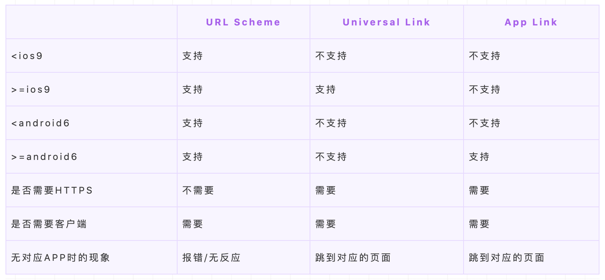

## 唤端

唤端就是在某些场景下通过一定的手段打开目标APP并且加载出希望展示给用户的内容。唤端技术我们也称之为deep link技术。

通常是指在手机上从一个 app 跳转到另一个 app，也就是 app 间的跳转。常见应用场景为投放到媒体的广告、用户分享、线下扫码等，比如从抖音的引流电商卡片点击直接跳转淘宝的商详页，亦或是点击一个淘宝链接直接打开淘宝app直达对应页面。

常用的方案为

- URL Scheme（双端通用）
- Universal Link （iOS）
- App Link、Chrome Intents（android）

## URL Scheme

- url是统一资源定位符，通俗的说就是网址，有时候也会叫链接、地址
- scheme是标识资源的访问方式，比如http、ftp、https都属于一种scheme

### 原理（scheme注册）

想让自己的 app 能通过 Scheme 的方式唤起，需要在 app 里事先向系统注册自己的 Scheme。安卓可以在manifest 里通过 intent-filter 配置，iOS 则可以在 info.plist 文件中添加 URL types 来注册一个 Scheme。系统只负责根据 Scheme 唤起对应的 app，至于打开 app 之后做什么，就需要  app 自己去实现解析 URL 参数，并作出相应处理的逻辑。

### 唤起方式

- 通过window.location.href 直接跳转链接，IOS中大多用该方案
- a标签点击跳转
- 通过iframe跳转链接，安卓中大多使用该方案
- 通过特定js bridge打开APP
 ```tsx
 // 1
 window.location.href = 'weixin://'

// 2
 <a href="taobao://m.taobao.com">打开淘宝</a>

// 3
iframe = document . createElement ( ' iframe ' ) ;
iframe.id =']_redirectNativeFrame';
iframe.style.display='none';
iframe.src='weixin://';
document . body . appendChild ( if rame ) ;

// 4

window.AlipayJSBridge.call('openInBrowser',{url:'weixin://'});

```

需要注意的是安卓的原生谷歌浏览器自从 chrome25 版本开始对于唤端功能做了一些变化，URL Scheme 无法再启动Android应用。 例如，通过 iframe 指向 weixin://，即使用户安装了微信也无法打开。所以，APP需要实现谷歌官方提供的 intent: 语法，或者实现让用户通过自定义手势来打开APP，当然这就是题外话了。

```tsx
 <a href="intent://scan/#Intent;scheme=zxing;package=com.google.zxing.client.android;S.browser_fallback_url=http%3A%2F%2Fzxing.org;end"> Take a QR code </a>
```

### 优缺点

优点：
- URL Scheme 这种方式兼容性好，无论安卓或者 iOS 都能支持
缺点：
- 无法准确判断是否唤起成功
- 很多浏览器和 webview 中会有一个弹窗提示你是否打开对应 APP，可能会导致用户流失
- 有 URL Scheme 劫持风险，比如某不知名 app 也向系统注册了 taobao:// 这个 scheme ，唤起流量可能就会被劫持到这个 app 里；

## Universal Links

Universal Links 是 iOS 9 中引入的功能，使用它可以直接通过 https 协议的链接来打开APP，如果没有安装则打开对应 H5 页面。

### 原理

当用户打开 universal links 时，iOS 会检查目标域名是否注册了任何已安装的设备。如果有，对应App 将立即启动，而不会再加载网页。如果无，则将在浏览器中继续加载对应的 Web 页面，这样保证了比较好的用户体验。universal links 需要客户端配合在系统中注册域名，所以此方案的前提是当前版本的客户端已完成域名注册。

- 在 APP 中注册自己要支持的域名；
- 在自己域名的根目录下配置一个 apple-app-site-associatio 文件即可。

[开发文档：Listing 6-1Creating an apple-app-site-association file](https://developer.apple.com/library/archive/documentation/General/Conceptual/AppSearch/UniversalLinks.html#//apple_ref/doc/uid/TP40016308-CH12-SW2)

```json
{
    "applinks": {
        "apps": [],
        "details": [
            {
                "appID": "9JA89QQLNQ.com.apple.wwdc",
                "paths": [ "/wwdc/news/", "/videos/wwdc/2015/*"]
            },
            {
                "appID": "ABCD1234.com.apple.wwdc",
                "paths": [ "*" ]
            }
        ]
    }
}

```
### 优缺点

优点：
- 体验好：universal links 有一个较大优点是它唤端时没有弹窗提示，可减少一部分流失
- 通用：app和网站都能解析，对于没有安装应用的用户，点击链接就会直接打开对应的web页面， 从整体的体验上说，universal links 要优于 URL Scheme
- 安全：Universal links是从服务器上查询是哪个app需要被打开，因此不存在Custom URL scheme那样名字被抢占、冲突的情况
缺点：
- 只能在 iOS 上用；
- 只能由用户主动触发，比如用浏览器扫码打开页面，就没有办法由页面直接唤起APP，而需要用户手动点击页面按钮才能唤起；


## App Link、Chrome Intents（Android）

### App Link

在2015年的Google I/O大会上，Android M宣布了一个新特性：App Links让用户在点击一个普通web链接的时候可以打开指定APP的指定页面，前提是这个APP已经安装并且经过了验证，否则会显示一个打开确认选项的弹出框，只支持Android M以上系统。
App Links的最大的作用，就是可以避免从页面唤醒App时出现的选择浏览器选项框;
前提是必须注册相应的Scheme，就可以实现直接打开关联的App。

- App links在国内的支持还不够，部分安卓浏览器并不支持跳转至App，而是直接在浏览器上打开对应页面。
- 系统询问是否打开对应App时，假如用户选择“取消”并且选中了“记住此操作”，那么用户以后就无法再跳转App。

### Chrome Intents

- Chrome Intent 是 Android 设备上 Chrome 浏览器中 URI 方案的深层链接替代品。
- 如果 APP 已安装，则通过配置的 URI SCHEME 打开 APP。
- 如果 APP 未安装，配置了 fallback url 的跳转 fallback url，没有配置的则跳转应用市场。


## 唤端方案兼容性

