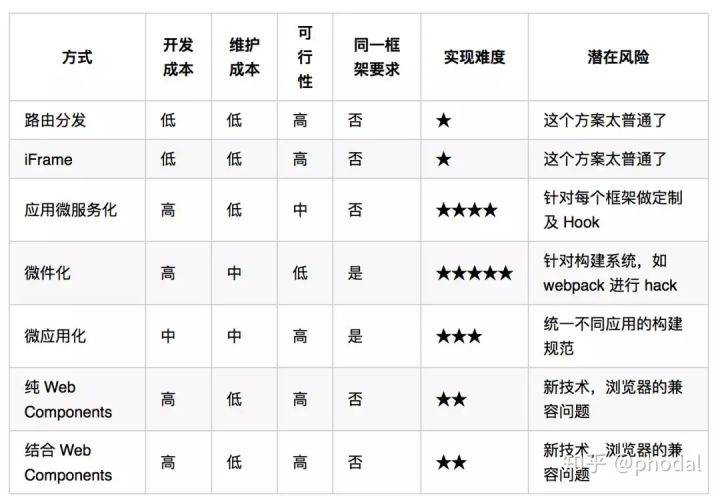
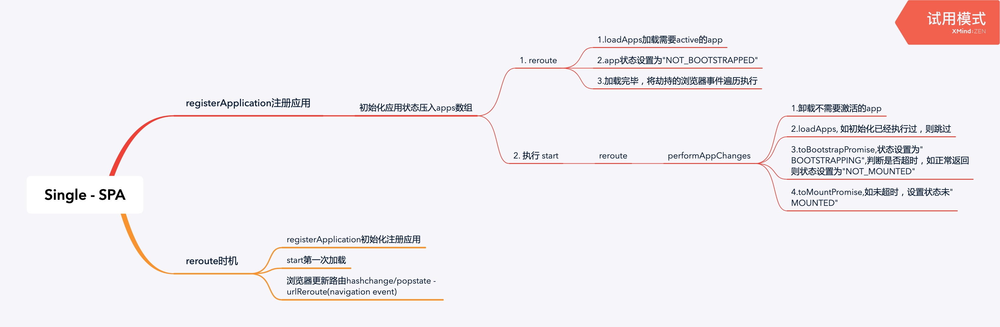

## 目前前端存在的问题

假设你想构建一个渐进式的Web应用程序，但是你很难将新的功能实现于现有的整体应用中。比如你想开始使用新的 JS 语法（或TypeScript），但是你无法在现有的构建过程中使用对应的构建工具。又或者，你只想扩展你的开发团队，以便多个团队可以同时处理一个产品，但是现有应用中的耦合和复杂度让每个开发者互相掣肘。这些都是真实存在的问题，这些问题极大地降低了大型团队的开发效率。

## 什么是微前端

一种由独立交付的多个前端应用组成整体的架构风格。具体的，将前端应用分解成一些更小、更简单的能够独立开发、测试、部署的小块，而在用户看来仍然是内聚的单个产品

## 微前端的价值

- 技术栈无关:主框架不限制接入应用的技术栈，子应用具备完全自主权
- 独立开发、独立部署:子应用仓库独立，前后端可独立开发，部署完成后主框架自动完成同步更新
- 独立运行时:每个子应用之间状态隔离，运行时状态不共享

## 微前端的优点

- 增量升级:对于许多团队而言，这是开始微前端之旅的首要原因。技术债阻碍了项目的发展，只能重写。为了避免完全重写的风险，我们更希望 逐个替换旧的模块。
- 简单、解耦的代码库:每个单独的微型前端应用的源代码都将比单个整体前端应用的源代码少得多。这些较小的代码库对于开发人员来说更容易维护。尤其是我们避免了组件间耦合所导致的复杂性。
- 独立部署:就像微服务一样，微前端的独立部署能力是关键。部署范围的减小，带来了风险的降低。每个微前端应用都应具有自己的持续交付途径，不停地构建、测试、部署。
- 团队自治:每个团队需要围绕业务功能垂直组建，而不是根据技术能力来组建。这为团队带来了更高的凝聚力。

## 技术选型



## single-spa

在single-spa中。通过reroute和路由控制不断地在调度子应用，加载子应用的代码，切话子应用，改变子应用的app.status。所以single-spa解决了一个子应用之间的调度问题。

single-spa 的核心思路是将每个子应用都打包成一个独立的 js 文件，通过 registerApplication 这个接口来约定子应用与主框架的交互行为.



### 容器和子应用


从架构上来讲可以分为两部分：子应用和容器应用。

子应用与传统的单页应用的区别在于
- 不需要 HTML 入口文件，
- js 入口文件导出的模块，必须包括 bootstrap、mount 和 unmount 三个方法。

容器应用主要负责注册应用，当 url 命中子应用的路由时激活并挂载子应用，或者当子应用不处于激活状态时，将子应用从页面中移除卸载。其核心方法有两个：

- registerApplication 注册并下载子应用
- start 启动处于激活状态的子应用。

```tsx
import * as singleSpa from 'single-spa';
const appName = 'app1';
const app1Url = 'http://app1.com/app1.js'
singleSpa.registerApplication(
  'app1',() => loadJS(app1Url), // loadJS 方法是伪代码，表示加载 app1.js。开发者需要自己实现，或者借助 systemJS 来实现。
  location => location.pathname.startsWith('/app1')
  )
singleSpa.start();
```
```tsx
//app1.js
let domEl;
export function bootstrap(props) {
    return Promise
        .resolve()
        .then(() => {
            domEl = document.createElement('div');
            domEl.id = 'app1';
            document.body.appendChild(domEl);
        });
}
export function mount(props) {
    return Promise
        .resolve()
        .then(() => {
            domEl.textContent = 'App 1 is mounted!'
        });
}
export function unmount(props) {
    return Promise
        .resolve()
        .then(() => {
            domEl.textContent = '';
        })
}
```

### systemjs

配置时候会发现都需要加载systemjs。systemjs是什么，简单来说，就是Dynamic ES module loader动态模块加载器，动态加载我们每个依赖的编译后的脚本文件。也正是因为system.js存在，你不会在代码中看到大量script脚本插入的痕迹。

SystemJS 是一个通用的模块加载器，它能在浏览器或者 NodeJS 上动态加载模块，并且支持 CommonJS、AMD、UMD、全局模块对象和 ES6 模块。通过使用插件，它不仅可以加载 JavaScript，还可以加载 CoffeeScript 和 TypeScript。借助运行时编译器，可以实现对 ES Modules 和 CJS 模块的直接加。

不过官方也不建议用在生产环境，会影响到页面的性能。


### 加载函数

就是single-spa对应子应用资源引入的入口地方。原因在于我们的前端框架最终打包都会变成app.js, vendor-chunk.js等js文件，变回原生的操作。我们从微前端的主应用去引入这些js文件去渲染出我们的子应用

### 加载函数需要自己实现

但是single-spa有一个开放的地方是需要用户自己去实现的，这个开放的地方就是registerApplication函数的加载函数

```tsx
singleSpa.registerApplication({ //注册微前端服务
    name: 'singleDemo',
    app: () => system.import('appName'),
    activeWhen: () => location.pathname.startsWith('xxx') // 配置微前端模块

});
```

这个地方的作用经过上面的分析，就是告诉single-spa，你需要如何去加载子应用的代码，同时让主应用获取到子应用的生命周期函数。

这个地方是开放的，但是这个地方的书写难度是比较高的，你需要找到一个合适的方案去解决上面这个问题。

那么qiankun的出现就是提供了一种解决方案帮住我们完成上述部分的代码，下面是qiankun源码的调用方式：

```tsx
registerApplication({
      name,
      app: async () => {
        loader(true);
        await frameworkStartedDefer.promise;

        const { mount, ...otherMicroAppConfigs } = (
          await loadApp({ name, props, ...appConfig }, frameworkConfiguration, lifeCycles)
        )();

        return {
          mount: [async () => loader(true), ...toArray(mount), async () => loader(false)],
          ...otherMicroAppConfigs,
        };
      },
      activeWhen: activeRule,
      customProps: props,
    });
```
这里有一个LodeApp函数，是qiankun实现加载资源的方案

```tsx
export async function loadApp<T extends object>(
  app: LoadableApp<T>,
  configuration: FrameworkConfiguration = {},
  lifeCycles?: FrameworkLifeCycles<T>,
): Promise<ParcelConfigObjectGetter> {  //从app参数中解构出子应用的入口entry，和子应用的名称。
  const { entry, name: appName } = app;  //定义了子应用实例的id
  const appInstanceId = `${appName}_${+new Date()}_${Math.floor(Math.random() * 1000)}`;

  const markName = `[qiankun] App ${appInstanceId} Loading`;
  if (process.env.NODE_ENV === 'development') {    //进行性能统计
    performanceMark(markName);
  }

  const { singular = false, sandbox = true, excludeAssetFilter, ...importEntryOpts } = configuration;

  //importEntry是import-html-entry库中的方法，这里就是qiankun对于加载子应用资源的策略
  const { template, execScripts, assetPublicPath } = await importEntry(entry, importEntryOpts);

  ...省略
}
```

### 生命周期

微前端的核心为app，微前端的场景主要是：将应用拆分为多个app加载，或将多个不同的应用当成app组合在一起加载。

为了更好的约束app和行为，要求每个app必须向外export完整的生命周期函数，使微前端框架可以更好地跟踪和控制它们。


## qiankun

如果有了解qiankun源码的读者可能知道，qiankun的编写是基于single-spa和import-html-entry两个库。

single-spa帮住qiankun如何调度子应用，import-html-entry提供了一种window.fetch方案去加载子应用的代码。

所以说qiankun这个微前端框架，就是帮助我们更加高效地使用single-spa。直接帮住用户解决了一个子应用代码加载的问题。


### html entry

html entry 本质上是一个应用静态资源表，可以理解成如下形式：

```tsx
{ 
html: '', 
scripts: ['//xxx.yyy.com/index.js'], 
css: ['//xxx.yyy.com/index.css']})
}
```
html entry 相较于 single-spa 的 js entry 而言更加灵活，可以直接将子应用打出来 html 作为入口，框架会将 HTML document 作为子节点塞到主框架的容器中。子应用接入成本几乎为零，开发体验与独立开发时保持不变。


### 样式隔离

由于微前端场景下，不同技术栈的子应用会被集成到同一个运行时中，子应用之间难免会出现样式互相干扰的问题，而且这种问题往往要等到非常后期才会被发现。样式隔离有两个思路，第一个是使用类似于 CSS Module 或者 BEM 的方案，本质上是通过约定来避免冲突，对于新项目来说，这种方案成本很低，但是如果涉及到与老项目一同运行，那改造成本将会非常高昂。第二个思路是在子应用卸载的时候同时卸载掉样式表。技术原理是浏览器会对所有的样式表的插入、移除做整个 CSSOM 的重构，从而达到 插入、卸载 样式的目的。这样即能保证，在一个时间点里，只有一个应用的样式表是生效的。

qiankun 框架采用的是第二种思路，使用 import-html-entry ，通过解析 html entry 中的 `<link> 和 <style>` 标签获取样式信息，下载样式文件，并最终以 `<style>` 标签的形式插入到主框架的容器中去，在子应用卸载时一并移除。

### js 运行时沙箱

相较于样式隔离来说，js 隔离显得更为重要。因为在 SPA 的场景下，类似内存泄漏、全局变量冲突等问题的影响会被放大，可能某个子应用内的问题会影响到其他应用的运行。而且这种问题通常非常难以排查和定位，一旦发生，解决成本非常高。
qiankun 框架为每个子应用启用了一个沙箱环境，子应用内所有的 js 代码都是在这个沙箱环境中执行，不会影响到全局。


qiankun 的沙箱环境基于 Proxy 实现，对浏览器有一定的要求，IE 无法兼容。 总体来说，微前端架构旨在解决单体应用过度庞大引起的开发维护困难的问题，将独立的子系统拆分出来，独立开发、独立部署，完成子系统间的解耦。同时也提供了将拆分出来的子应用重新组合成新应用的可能性。


## Garfish
>字节跳动内部自研微前端框架

### 加载器

Garfish内部的加载器实现可以简单概括为：
- fetch子应用js-bundle资源（不满足
- 获取子应用provider内容

所以Loader从下载资源到解析导出内容的能力变成了：
- fetch-html内容
- 去除不需要的节点、body、head...
- 将script、style标签提取
- 获取子应用provider内容

### JS沙箱

#### 借助Function隔离
>https://zh.javascript.info/new-function

new Function 形式 var student = new Function(arg1 , arg2 ,arg3 ,…, argN , body)
Function构造函数所有的参数都是字符串类型。除了最后一个参数, 其余的参数都作为生成函数的参数即形参。这里可以没有参数。最后一个参数, 表示的是要创建函数的函数体。
```tsx
  const func = new Function(a, b, 'return a+b');
  func(1, 2); // 3

  new Function('a,b', 'return a + b'); // 逗号分隔

```

实践中显得非常有用。想象一下，我们必须从字符串创建一个函数。在编写脚本时不知道该函数的代码（这就是我们不使用常规函数的原因），但在执行过程中将会知道。我们可能会从服务器或其他来源收到它。

使用new Function创建的函数，其`[[Environment]]`**引用全局词法环境**，而不是包含该函数的外部词法环境。**因此，他们不能使用外层的变量**。但这确实很好，因为它可以使我们免于错误。明确地传递参数在架构上是一种更好的方法，并且不会在使用minifiers时不会产生问题。(而vue中这么做是创建了一个和全局平行的作用域，可以隔离作用域)

Function 创建的函数无能在那个作用域运行都访问的是全局作用域。

```tsx

var x=2,y=4;
var func = new Function("alert(x+y);");
var test = function () {
    var x=1,y=2;
    func(); // 6
    var z = eval("x+y"); // 3
    console.log(z)
}
 
test();
```

如果这个函数能够访问外部（outer）变量会怎么样？

问题在于，在将 JavaScript 发布到生产环境之前，需要使用 压缩程序（minifier） 对其进行压缩 —— 一个特殊的程序，通过删除多余的注释和空格等压缩代码 —— 更重要的是，将局部变量命名为较短的变量。

例如，如果一个函数有 let userName，压缩程序会把它替换为 let a（如果 a 已被占用了，那就使用其他字符），剩余的局部变量也会被进行类似的替换。一般来说这样的替换是安全的，毕竟这些变量是函数内的局部变量，函数外的任何东西都无法访问它。在函数内部，压缩程序会替换所有使用了使用了这些变量的代码。压缩程序很聪明，它会分析代码的结构，而不是呆板地查找然后替换，因此它不会“破坏”你的程序。

但是在这种情况下，如果使 new Function 可以访问自身函数以外的变量，它也很有可能无法找到重命名的 userName，这是因为新函数的创建发生在代码压缩以后，变量名已经被替换了。

即使我们可以在 new Function 中访问外部词法环境，我们也会受挫于压缩程序。

此外，这样的代码在架构上很差并且容易出错。

当我们需要向 new Function 创建出的新函数传递数据时，我们必须显式地通过参数进行传递。

#### 构建vm环境

那子应用自己环境内的window和document属性在哪里来呢，目前子应用环境变量的来源主要由两个，第一个是创建iframe，将iframe的window、document作为子应用的环境变量，并假设白名单将部分主应用的环境变量穿透到子应用环境内或直接代理到子应用的window上。
```tsx
let iframe = document.createElement('iframe');
let proxyWindow = iframe.contentWndow;
let code = `...`; // 子应用代码
(new Function('document','window', code.toString))(fakeDocument, fakeWindow)
```
第二个方案是基于主应用的环境创建代理对象，将代理对象作为子应用的执行环境。由于Proxy的支持情况我们使用了ProxyPolyfill，Proxy的Polyfill只能覆盖到读操作和修改操作（PolyFill是基于Object.defineProperty做的），这对我们来说已经完全够用了！因为删除、新增操作都是基于新代理的对象，不会对主应用上的原始操作产生应用，而修改操作我们可以将其赋值到我们内部的一个暂存对象上，不让他影响主应用属性。不过基于主应用的环境缺点在于如果子应用通过对象深层次赋值，可能产生变量副作用逃逸的情况，因为劫持对象目前是惰性劫持。
```tsx
let proxyWindow = new Proxy(window,{})
let code = `...`; // 子应用代码
(new Function('document','window', code.toString))(fakeDocument, fakeWindow)
```
保证运行环境
子应用动态创建script运行，将会导致逃逸vm环境。需要劫持子应用所有创建script，将script中的内容放置沙箱内执行，主要思路是递归劫持document，劫持添加到dom的节点，如果是script，将放置沙盒内执行（目前存在跨域问题，目前没有更好的解决方案）。


### 路由

如果要支持路由托管，自动分发子应用我们做了哪些事情进行支持呢。主要集中在监听路由变化分发子应用、主应用能控制子应用路由跳转并视图更新、主应用和子应用路由同步。

要实现路由变化，框架自动挂载和销毁子应用。因此子应用需要暴露出渲染函数和销毁函数，由Garfish在路由发生变化时挂载和销毁子应用。比较麻烦的地方在于主应用需要控制子应用路由跳转和视图更新，并且保证主应用和子应用的路由是正常同步的。

```tsx
export function provider({ dom, basename }) {
  return {
    render() {
      ReactDOM.render(<App basename={basename} />, dom.querySelector('#app'));
    },
    destroy() {
      ReactDOM.unmountComponentAtNode(dom);
    },
  };
}
```

目前实现路由托管子应用通常有两个实现方向：
1.子应用具备自己的路由环境，利用iframe中的history来存储路由状态，路由发生变化时同步到主应用的浏览器地址中
2.与主应用使用同一个路由环境，通过basepath进行隔离，每个子应用激活时增加scope，并将当前路径作为basename传递给子应用，子应用将其作为路由初始化的basepath。

触发子应用更新视图

因为目前主流框架实现路由的方式并不是监听路由变化触发组件更新，而是通过内部的方法，触发组件更新，因为目前的框架router设计要监听浏览器后退事件触发组件更新，因此我们可以利用这个特性跳转子应用子路由。

## 参考
- 手撸微前端：https://github.com/YataoZhang/my-single-spa/issues/4
- https://bingoootang.github.io/blog/2019/11/01/micro-frontend/#js-%E8%BF%90%E8%A1%8C%E6%97%B6%E6%B2%99%E7%AE%B1
- https://www.cnblogs.com/synY/p/13958963.html
- https://zhuanlan.zhihu.com/p/144545551
- 微前端之import-html-entry：https://blog.csdn.net/daihaoxin/article/details/106250617

## 资料

- https://zhuanlan.zhihu.com/p/96464401
- https://tech.meituan.com/tags/%E5%BE%AE%E5%89%8D%E7%AB%AF.html
- https://segmentfault.com/a/1190000015566927
- https://segmentfault.com/a/1190000020122048
- https://juejin.im/post/5d8adb8ff265da5ba12cd173#heading-1
- https://juejin.im/post/5d1d8d426fb9a07efe2dda40#heading-0
- https://juejin.im/entry/5b511da06fb9a04f9a5cd2c9
- https://juejin.im/post/5d7f702ce51d4561f777e258