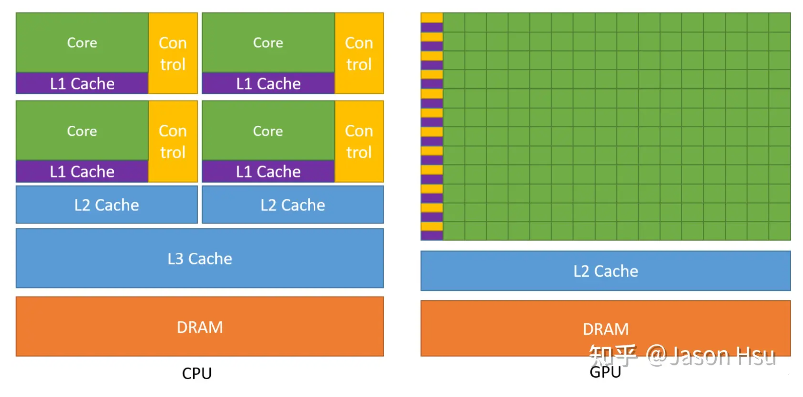

## CPU

cpu (central process) 是计算机的大脑，它提供了一套指令集，我们写的程序最终会通过 cpu 指令来控制的计算机的运行。

cpu 会对指令进行译码，然后通过逻辑电路执行该指令。整个执行的流程分为了多个阶段，叫做流水线。指令流水线包括取指令、译码、执行、取数、写回五步，这是一个指令周期。cpu 会不断的执行指令周期来完成各种任务。

指令和数据都会首先加载到内存中，在程序运行时依次取到 cpu 里。cpu 访问内存虽然比较快，但比起 cpu 执行速度来说还是比较慢的，为了缓解这种速度矛盾，cpu 设计了 3 级缓存，也就是 L1、L2、L3 的缓存。

## GPU

GPU，是Graphics ProcessingUnit的简写，是现代显卡中非常重要的一个部分，其地位与CPU在主板上的地位一致，主要负责的任务是加速图形处理速度。
和 cpu 的一个一个数据计算不同，gpu 是并行的，有成百上千个核心用于并行计算。

gpu 也是有着指令、译码、执行的流程，只不过，每个指令会并行执行 n 个计算，是单控制流多数据流的，而 cpu 是单控制流单数据流。
所以，对于 3d 渲染这种要计算成万个顶点数据和像素点的场景，GPU 会比 CPU 高效很多。

## CPU VS GPU

- Control是控制器
- Core = ALU = 算术逻辑单元 = 晶体管
- Cache是cpu内部缓存
- DRAM就是内存

cpu 是通用的，能够执行各种逻辑和运算，而 gpu 则是主要是用于并行计算大批量的重复任务，不能处理复杂逻辑。如上图，cpu 中控制器和缓存占据了很大一部分，而 gpu 中这两部分则很少，但是有更多的核心用于计算。两者对比的话

- cpu 相当于一个大学生，能够解决各种难题，但是计算 1 万个加法就没那么快
- gpu 就像一帮小学生，解决不了难题，但是计算加法这种就很快，因为人多。

也就是说如果逻辑复杂，那么只能用 cpu，如果只是计算量大，并且每个计算都比较重复，那就比较适合 gpu。3d 的渲染中有大量这种重复却简单的计算，比如顶点数据和光栅化的像素数据，通过 gpu 就可以并发的一次计算成百上千个。

## 普通图层和复合图层

前面<<如何渲染页面>>提到过Composite（渲染层合并）：按照合理的顺序合并图层然后显示到屏幕上。

某些特殊的渲染层会被提升为复合成层（Compositing Layers），复合图层拥有单独的 GraphicsLayer，而其他不是复合图层的渲染层，则和其第一个拥有 GraphicsLayer 父层共用一个

这里浏览器渲染的图层包含两大类：渲染图层（普通图层）以及复合图层

- 渲染图层：又称默认复合层，是页面普通的文档流。我们虽然可以通过绝对定位，相对定位，浮动定位脱离文档流，但它仍然属于默认复合层，共用同一个绘图上下文对象（GraphicsContext）。
- 复合图层：它会单独分配资源（当然也会脱离普通文档流，这样一来，不管这个复合图层中怎么变化，也不会影响默认复合层里的回流重绘）

## 硬件加速

一个元素开启硬件加速后会变成复合图层，可以独立于普通文档流中，改动后可以避免整个页面重绘，提升性能。常用的硬件加速方法有：
- 最常用的方式：translate3d、translateZ、filter、transform
- opacity 属性/过渡动画（需要动画执行的过程中才会创建合成层，动画没有开始或结束后元素还会回到之前的状态）
- will-change属性（这个知识点比较冷僻），一般配合 opacity 与 translate 使用（而且经测试，除了上述可以引发硬件加速的属性外，其它属性并不会变成复合层），作用是提前告诉浏览器要变化，这样浏览器会开始做一些优化工作（这个最好用完后就释放）
- `<video>、<iframe>、<canvas>、<webgl>`等元素
- opengl、webgl、css 硬件加速
- 其它，譬如以前的 flash 插件

依赖 GPU 实现图形绘制加速，软硬件加速的区别主要是图形的绘制究竟是 GPU 来处理还是 CPU，如果是 GPU，就认为是硬件加速绘制，反之，则为软件绘制。

chrome devtools 可以看到是 cpu 渲染还是 gpu 渲染，打开 rendering 面板，勾选 layer borders，会发现蓝色和黄色的框。蓝色的是 cpu 渲染的，而黄色的是 gpu 渲染的。

## 硬件加速的问题

- 内存：虽然硬件加速可以提高GPU的使用，但从layers中的信息可以看出，每个层都需要消耗一定的内存，过多的内存占用也会造成性能的下降；过多的层传输到GPU的过程也会消耗一定的时间，此外也造成合成阶段的时间占用较长
- 使用GPU渲染会影响字体的抗锯齿效果。这是因为GPU和CPU具有不同的渲染机制。即使最终硬件加速停止了，文本还是会在动画期间显示得很模糊。
- 开启了硬件加速后，就是用显卡看视频，不开就是用cpu看视频，默认由显卡承担视频播放的解码，因为GPU的专用内存是没有CPU的大的，解码高码率的视频和音频可能或因为内存数据达到阈值而崩掉，有时弹幕多了会导致卡顿，还有时会导致延迟

也可以选择关闭硬件加速能力

## 为什么3D适合GPU

## 参考

- https://juejin.cn/post/7097026594220277767
- https://juejin.cn/post/7001634685927292936