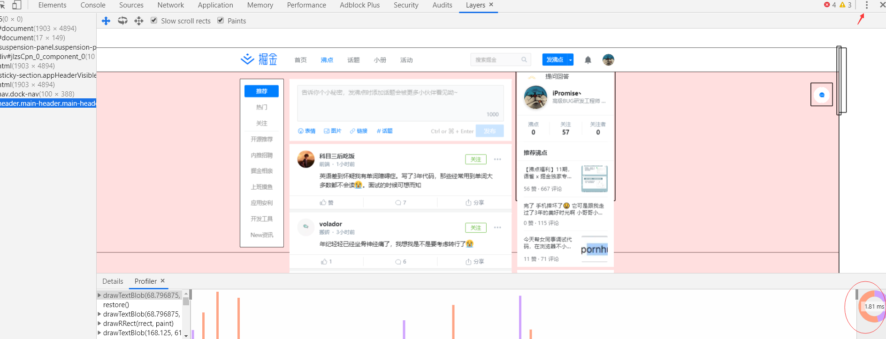
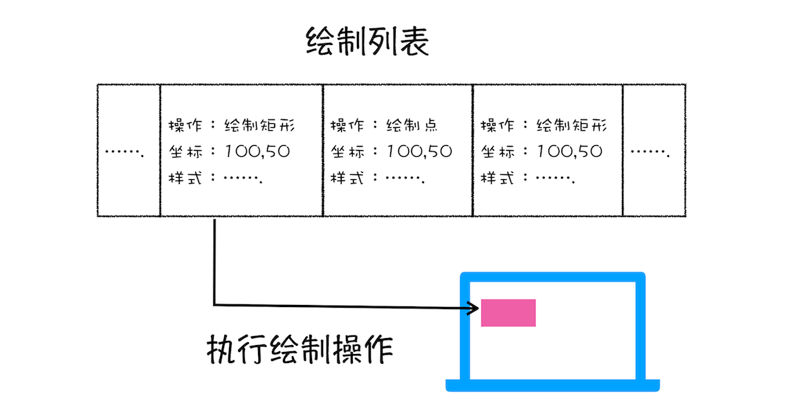
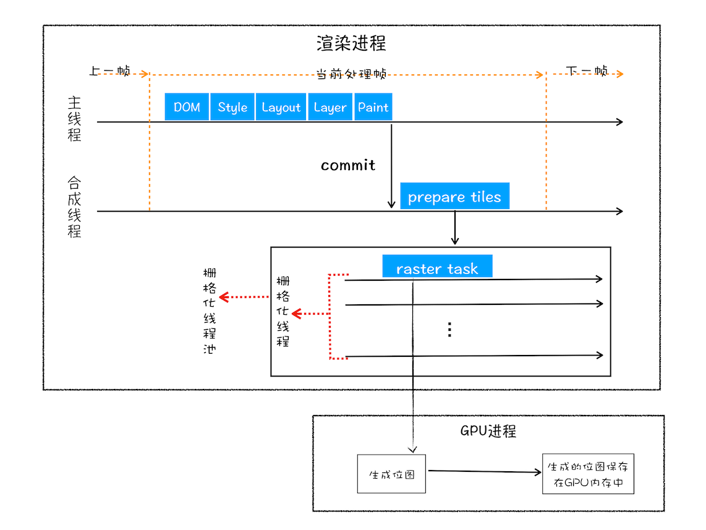
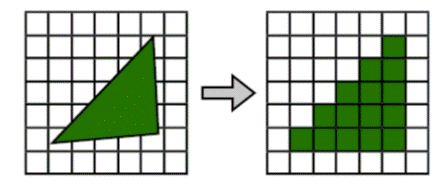

## 解析层面

> 详细可以看 readme 中的分析

DOM 生成、样式计算和布局：
在 HTML 页面内容被提交给渲染引擎之后，渲染引擎首先将 HTML 解析为浏览器可以理解的 DOM；然后根据 CSS 样式表，计算出 DOM 树所有节点的样式；接着又计算每个元素的几何坐标位置，并将这些信息保存在布局树中(。

## 构建图层树 LayerTree

渲染引擎还需要为特定的节点生成专用的图层，并生成一棵对应的图层树（LayerTree）。
在我们的抠图里，就是 PS，里面会有图层的概念，你最终的图片是有很多张图片叠加构成的。浏览器也不例外。

## Layout（render）布局树与图层树

并不是布局树的每个节点都包含一个图层，如果一个节点没有对应的层，那么这个节点就从属于父节点的图层

拥有层叠上下文属性的元素会被提升为单独的一层。以下也都拥有层叠上下文属性。
 - 明确定位属性的元素
 - 定义透明属性的元素
 - 使用 CSS 滤镜的元素等
 - z-index
剪裁（clip）的地方也提升为图层（就是元素内容超出了

## 图层绘制

图层的绘制拆分成很多小的绘制指令，然后再把这些指令按照顺序组成一个待绘制列表。

试想一下，如果给你一张纸，让你先把纸的背景涂成蓝色，然后在中间位置画一个红色的圆，最后再在圆上画个绿色三角形。你会怎么操作呢？
通常，你会把你的绘制操作分解为三步：

- 绘制蓝色背景；
- 在中间绘制一个红色的圆；
- 再在圆上绘制绿色三角形。
  
渲染引擎实现图层的绘制与之类似，会把一个图层的绘制拆分成很多小的绘制指令，然后再把这些指令按照顺序组成一个待绘制列表，如下图所示：

绘制列表只是用来记录绘制顺序和绘制指令的列表，而实际上绘制操作是由渲染引擎中的合成线程来完成的。你可以结合下图来看下渲染主线程和合成线程之间的关系：

## 栅格化（raster） 与 位图

**所谓栅格化，是指将图块转换为位图。**

viewport视口，即可视范围。但页面一般很大，超出可视范围，这是浏览器不会渲染全部页面（不然开销大），合成线程会按照视口附近的图块来优先生成位图。（ 位图图像也称为点阵图像，位图使用我们称为像素的一格一格的小点来描述图像。）

合成线程会将图层划分为图块（tile），这些图块的大小通常是 256x256 或者 512x512，如下图所示：

**合成线程会按照视口附近的图块来优先生成位图，实际生成位图的操作是由栅格化来执行的。所谓栅格化，是指将图块转换为位图。**

## GPU 加速
通常，栅格化过程都会使用 GPU 来加速生成，使用 GPU 生成位图的过程叫快速栅格化，或者 GPU 栅格化，生成的位图被保存在 GPU 内存中。

GPU 操作是运行在 GPU 进程中，如果栅格化操作使用了 GPU，那么最终生成位图的操作是在 GPU 中完成的，这就涉及到了跨进程操作。

## 合成和显示

所有图块都被光栅化（光栅化的目的，是找出一个几何单元（比如三角形）所覆盖的像素。就是将几何信息转换成一个个的栅格组成的图像的过程。），合成线程就会生成一个绘制图块的命令——“DrawQuad”，然后将该命令提交给浏览器进程。

浏览器进程里面有一个叫 viz 的组件，用来接收合成线程发过来的 DrawQuad 命令，然后根据 DrawQuad 命令，将其页面内容绘制到内存中，最后再将内存显示在屏幕上。到这里，经过这一系列的阶段，编写好的 HTML、CSS、JavaScript 等文件，经过浏览器就会显示出漂亮的页面了。

## 渲染流水线大总结

- 渲染进程将 HTML 内容转换为能够读懂的 DOM 树结构。
- 渲染引擎将 CSS 样式表转化为浏览器可以理解的 styleSheets，计算出 DOM 节点的样式。
- 创建布局树，并计算元素的布局信息。对布局树进行分层，并生成分层树。
- 为每个图层生成绘制列表，并将其提交到合成线程。
- 合成线程将图层分成图块，并在光栅化线程池中将图块转换成位图。
- 合成线程发送绘制图块命令 DrawQuad 给浏览器进程。
- 浏览器进程根据 DrawQuad 消息生成页面，并显示到显示器上。

