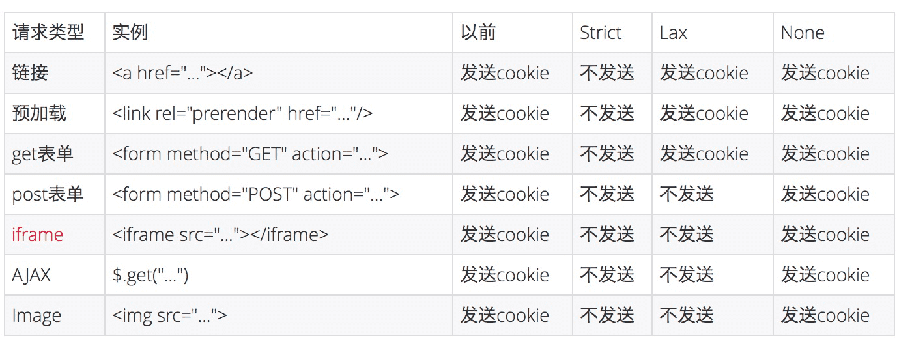

## 跨域和跨站
>顶级域名和公共后缀：https://juejin.im/post/5e74a11a6fb9a07c846b9391 

首先要理解的一点就是跨站和跨域是不同的。

- 跨域：请求 url 的协议、域名、端口三者之间任意一个与当前页面 url 不同即为跨域

- 同站(same-site)/跨站(cross-site)」：只要两个 URL 的 eTLD+1 相同即可，不需要考虑协议和端口。eTLD 表示有效顶级域名，eTLD+1 是有效顶级域名+二级域名
- 常见的顶级域名：.com、.co.uk、.github.io 等，有效顶级域名+二级域名如：baidu.com

  - www.taobao.com 和 www.baidu.com 是跨站
  - www.a.taobao.com 和 www.b.taobao.com 是同站
  - a.github.io 和 b.github.io 是跨站(注意是跨站，github.io 是整体，顶级域名)。

总结：跨域不一定跨站呀，二级域名相同就是同站的了，不管你后面的三级域名相不相同；

## XSS

Cross-Site Scripting（跨站脚本攻击）简称 XSS，是一种代码注入攻击。攻击者通过在目标网站上注入恶意脚本，使之在用户的浏览器上运行。利用这些恶意脚本，攻击者可获取用户的敏感信息如 Cookie、SessionID 等，进而危害数据安全。
为了和 CSS 区分，这里把攻击的第一个字母改成了 X，于是叫做 XSS。
XSS 的本质是：恶意代码未经过滤，与网站正常的代码混在一起；浏览器无法分辨哪些脚本是可信的，导致恶意脚本被执行。

### 反射型 XSS 攻击

当浏览器请求 `http://xxx/search?keyword="><script>alert('XSS');</script>` 时，服务端会解析出请求参数 `keyword`，得到 `"><script>alert('XSS');</script>`，拼接到 HTML 中返回给浏览器。形成了如下的 HTML：

```
<div>
  您搜索的关键词是："><script>sendToMe(document.cookie);</script>
</div>
```

这样浏览器就会执行我们注入的恶意代码，我们诱导他人访问我们构造的链接，就会把他人访问页面的部分信息发送给我的服务器

### 存储型 XSS 攻击

比如一个网站的文章可以发表评论。
你登录后获取了 cookie 然后评论。
然后输入评论内容: 2222`<script>alert(XSS)</script>`
恶意脚本未经转换，存储到了后台。任何用户访问此页面，都会执行恶意脚本。
导致每个用户在看这篇文章的时候就都弹出 XSS 弹框

### DOM 型 XSS 攻击

客户端的脚本程序可以动态地检查和修改页面内容，而不依赖于服务器端的数据。可能引起 dom 型 xss 的：使用 innerHTML, documen.write 属性...
DOM 型 XSS 跟前两种 XSS 的区别：DOM 型 XSS 攻击中，取出和执行恶意代码由浏览器端完成，属于前端 JavaScript 自身的安全漏洞，而其他两种 XSS 都属于服务端的安全漏洞。

```
<input type="text" id="input">
<button id="btn">Submit</button>
<div id="div"></div>
<script>
    const input = document.getElementById('input');
    const btn = document.getElementById('btn');
    const div = document.getElementById('div');

    let val;

    input.addEventListener('change', (e) => {
        val = e.target.value;
    }, false);

    btn.addEventListener('click', () => {
        div.innerHTML = `<a href=${val}>testLink</a>`
    }, false);
</script>
```

上面如果某个网站有这样的代码我们可以直接在输入框输入`onclick=alert(/xss/)`
提交之后，页面代码就变成了：
`<a href onlick="alert(/xss/)">testLink</a>`

## 如何防御 XSS 攻击

> [https://juejin.im/post/5bac9e21f265da0afe62ec1b](https://juejin.im/post/5bac9e21f265da0afe62ec1b)

### HttpOnly 防止劫取 Cookie

具体含义就是，如果某个 Cookie 带有 HttpOnly 属性，那么这一条 Cookie 将被禁止读取，也就是说，JavaScript 读取不到此条 Cookie，不过在与服务端交互的时候，Http Request 包中仍然会带上这个 Cookie 信息，即我们的正常交互不受影响。

### 输入检查

不要相信用户的任何输入。 对于用户的任何输入要进行检查、过滤和转义。建立可信任的字符和 HTML 标签白名单，对于不在白名单之列的字符或者标签进行过滤或编码。

在 XSS 防御中，输入检查一般是检查用户输入的数据中是否包含 <，> 等特殊字符，如果存在，则对特殊字符进行过滤或编码，这种方式也称为 XSS Filter。

### 输出检查-HTML 编码

不要以为在输入的时候进行过滤就万事大吉了，恶意攻击者们可能会层层绕过防御机制进行 XSS 攻击，一般来说，所有需要输出到 HTML 页面的变量，全部需要使用编码或者转义来防御。

针对 HTML 代码的编码方式是 HTMLEncode，它的作用是将字符串转换成 HTMLEntities。

**我把一些可能造成 XSS 攻击的符号用特殊的编码代替，比如`<>`用那么 XSS 的攻击者是无法得知**

为了对抗 XSS ，以下转义内容(实体编码在 html 里会显示正常的特殊符号)是必不可少的：


```
  function encodeForHTML(str, kwargs){
    return ('' + str)
      .replace(/&/g, '&amp;')
      .replace(/</g, '&lt;')     // DEC=> &#60; HEX=> &#x3c; Entity=> &lt;
      .replace(/>/g, '&gt;')
      .replace(/"/g, '&quot;')
      .replace(/'/g, '&#x27;')   // &apos; 不推荐，因为它不在HTML规范中
      .replace(/\//g, '&#x2F;');
  };

```

实例:

```
<input type="text" value="<%= encodeForHTML(getParameter("keyword")) %>">
<button>搜索</button>
<div>
  您搜索的关键词是：<%= encodeForHTML(getParameter("keyword")) %>
</div>

```

经过了转义函数的处理后，最终浏览器接收到的响应为：

```
<input type="text" value="&quot;&gt;&lt;script&gt;alert(&#x27;XSS&#x27;);&lt;&#x2F;script&gt;">
<button>搜索</button>
<div>
  您搜索的关键词是：&quot;&gt;&lt;script&gt;alert(&#x27;XSS&#x27;);&lt;&#x2F;script&gt;
</div>

```

恶意代码都被转义，不再被浏览器执行，而且搜索词能够完美的在页面显示出来。

### 禁止跳转连接中的 JavaScriptAPI

对于链接跳转，如 `<a href="xxx"` 或 `location.href="xxx"`，要检验其内容，禁止以 javascript: 开头的链接，和其他非法的 scheme。

```
// 禁止 URL 以 "javascript:" 开头
xss = getParameter("redirect_to").startsWith('javascript:');
if (!xss) {
  <a href="<%= escapeHTML(getParameter("redirect_to"))%>">
    跳转...
  </a>
} else {
  <a href="/404">
    跳转...
  </a>
}

```

但是这种方法很难判断因为还可以写成

```
http://xxx/?redirect_to=jAvascRipt:alert('XSS')

http://xxx/?redirect_to=%20javascript:alert('XSS')
```

经过 URL 解析后变成 javascript:alert('XSS')，还是有注入的风险
所以我们最好采取白名单法,只允许我们特点的请求头即可

```
// 根据项目情况进行过滤，禁止掉 "javascript:" 链接、非法 scheme 等
allowSchemes = ["http", "https"];

valid = isValid(getParameter("redirect_to"), allowSchemes);

if (valid) {
  <a href="<%= escapeHTML(getParameter("redirect_to"))%>">
    跳转...
  </a>
} else {
  <a href="/404">
    跳转...
  </a>
}

```

## CSRF 跨站点请求伪造

### 什么是 CSRF

跨站请求伪造（英语：Cross-site request forgery），也被称为 one-click attack 或者 session riding，通常缩写为 CSRF 或者 XSRF， 是一种挟制用户在当前已登录的 Web 应用程序上执行非本意的操作的攻击方法。如:攻击者诱导受害者进入第三方网站，在第三方网站中，向被攻击网站发送跨站请求。利用受害者在被攻击网站已经获取的注册凭证，绕过后台的用户验证，达到冒充用户对被攻击的网站执行某项操作的目的。

### CSRF 完成条件

完成一次 CSRF 攻击，受害者必须依次完成两个步骤：

- 1.登录受信任网站 A，并在本地生成 Cookie。
- 2.在不登出 A 的情况下，访问危险网站 B。
- 3.B 发请求到服务器，服务器无法分辨是 A 发的还是 B 发的
- 4.从而达到危险网站 B 来模拟 A 用户的操作，从而使 A 的用户成为受害者


### 防御 CSRF

- 不允许跨域请求，以为是第三方恶意网站，必定会跨域，所以如果满足同源策略的话 CSRF 无法
- 验证码；强制用户必须与应用进行交互，才能完成最终请求。此种方式能很好的遏制 csrf，但是用户体验比较差。也不可能每次都要验证码
- Referer check；请求来源限制，HTTP 头中有一个 Referer 字段，这个字段用以标明请求来源于哪个地址。通过在网站中校验请求的该字段，我们能知道请求是否是从本站发出的。我们可以拒绝一切非本站发出的请求，这样避免了 CSRF 的跨站特性。(我后台只接受 jianjiancheng.com 的请求)

```
const { parse } = require('url');
module.exports = class extends think.Logic {
  indexAction() {
    const referrer = this.ctx.referrer();
    const {host: referrerHost} = parse(referrer);
    if(referrerHost !== 'xxx') {
        return this.fail('REFERRER_ERROR');
    }
  }
}
```

- token；token 验证的 CSRF 防御机制是公认最合适的方案。恶意网站无法获取到我们的 token(你是登录了后才能见到 token，恶意网站想请求服务器 Cookie 会自动带，而 token 需要先获取到，但一般一个页面无法劫持另一个页面的变量，除非你的网站还有 XSS 漏洞，那就不用玩了，回家种田)
- SameSite:可以对 Cookie 设置 SameSite 属性。该属性设置 Cookie 不随着跨站请求发送，该属性可以很大程度减少 CSRF 的攻击，但是该属性目前并不是所有浏览器都兼容。
- 尽量使用 POST,限制 GET,GET 接口太容易被拿来做 CSRF 攻击，恶意网站只要构造一个 img 标签，而 img 标签又是不能过滤的数据。接口最好限制为 POST 使用，GET 则无效，降低攻击风险。当然 POST 并不是万无一失，攻击者只要构造一个 form 就可以，但需要在第三方页面做，这样就增加暴露的可能性。

Get 请求伪造如下，而已网站可以弄一个 img，src 即为服务器接口地址

```

```

Post 请求伪造：

```
<html>
    <head>
        <script type="text/javascript">
            function steal()
                {
                &emsp; iframe = document.frames["steal"];
                iframe.document.Submit("transfer");
            }
        </script>
    </head>

    <body onload="steal()">
        <iframe name="steal" display="none">
            <form method="POST" name="transfer"&emsp;action="http://www.myBank.com/Transfer.php">
                <input type="hidden" name="toBankId" value="11">
                <input type="hidden" name="money" value="1000">
            </form>
        </iframe>
    </body>
</html>

```

### Chrome80 SameSite 的问题

上文提到 SameSite 属性可以让 Cookie 在跨站请求时不会被发送，从而可以阻止跨站请求伪造攻击（CSRF），那 SameSite 的属性是如何设置的

- Strict 仅允许一方请求携带 Cookie，即浏览器将只发送相同站点请求的 Cookie，即当前网页 URL 与请求目标 URL 完全一致。这个规则过于严格，可能造成非常不好的用户体验。比如，当前网页有一个 GitHub 链接，用户点击跳转就不会带有 GitHub 的 Cookie，跳转过去总是未登陆状态。
- Lax 允许部分第三方请求携带 Cookie,链接，预加载请求，GET 表单等，可以防止CSRF的同时提供用户体验，在点击跳转的其它跨站网站时带上他们的Cookie是可以及时保持登录
- None 无论是否跨站都会发送 Cookie

Chrome80 之前默认是 None 的，Chrome80 后默认是 Lax。



如果对以前的页面造成影响最快的解决方法就是

```
Set-Cookie: SameSite=None;
```


Chrome 计划将Lax变为默认设置。这时，网站可以选择显式关闭SameSite属性，将其设为None。不过，前提是必须同时设置Secure属性（Cookie 只能通过 HTTPS 协议发送），否则无效。

下面的设置无效。

```
Set-Cookie: widget_session=abc123; SameSite=None
下面的设置有效。


Set-Cookie: widget_session=abc123; SameSite=None; Secure
```
## SQL 注入

### 什么是 SQL 注入

SQL 注入攻击指的是通过构建特殊的输入作为参数传入 Web 应用程序，而这些输入大都是 SQL 语法里的一些组合，来修改后台 SQL 语句达到通过执行 SQL 语句进而执行攻击者所要的操作。其主要原因是程序没有细致地过滤用户输入的数据，致使非法数据侵入系统。

### SQL 注入是怎么产生的

构造动态字符串是一种编程技术，它允许开发人员在运行过程中动态构造 SQL 语句。开发人员可以使用动态 SQL 来创建通用、灵活的应用。动态 SQL 语句是在执行过程中构造的，它根据不同的条件产生不同的 SQL 语句。当开发人员在运行过程中需要根据不同的查询标准来决定提取什么字段(如 SELECT 语句)，或者根据不同的条件来选择不同的查询表时，动态构造 SQL 语句会非常有用。

以 ThinkJS 为例，假设我们写了如下一个接口:

```
// user.js
module.exports = class extends think.Controller {
  async loginAction() {
    const { username, password } = this.post();
    const user = await this.model().query(
      `SELECT * FROM user WHERE name = "${username}" AND password= "${password}"`
    );

    if (think.isEmpty(user)) {
      return this.fail();
    }
    return this.success(user);
  }
}

```

username 就是动态构建的，当用户提交的 username 是 admin"; -- 的话，最终执行的 SQL 语句就会变成

```
SELECT * FROM user WHERE name = "admin"; --" AND password= "111"
```

最终攻击者就可以成功登录 admin 账号了，这就是最简单的 SQL 注入了。从上面这个简单示例中，我们发现漏洞成因可以归结为以下两个原因叠加造成的：

- 程序编写者在处理应用程序和数据库交互时，使用字符串拼接的方式构造 SQL 语句。
- 未对用户可控参数进行足够的过滤便将参数内容拼接进入到 SQL 语句中。

### 常见的注入点

GET 请求：该请求在 URL 中发送参数。
POST 请求：数据被包含在请求体中。
其他注入型数据：HTTP 请求的头部字段也可能会触发 SQL 注入漏洞

### SQL 注入的危害

如果网站存在 SQL 注入漏洞，相当于将数据库直接暴露在攻击者面前，可想而知危害会有多大了。攻击者利用 SQL 注入漏洞能实现以下攻击：

- 跳过账户权限验证达到越权
- 获取数据库关键信息从而进行脱库
- 在特别情况下还可以修改数据库内容或者插入内容到数据库，如果数据库权限分配存在问题，或者数据库本身存在缺陷，那么攻击者可以通过 SQL 注入漏洞直接获取 webshell 或者服务器系统权限。

### 防御方法

> Web 应用为了防御包括 SQL 注入在内的攻击，常常使用输入过滤器，这些过滤器可以在应用的代码中，也可以通过外部实现，比如 Web 应用防火墙和入侵防御系统。

#### URL 编码

#### 输入验证

输入验证是指要验证所有应用程序接收到的输入是否合法。有两中不同类型的输入验证方法：白名单和黑名单验证

- 白名单验证：比如 id 值，那么我们判断它是否为数字。
- 黑名单验证：使用正则表达式禁止使用某些字符和字符串

应该尽量使用白名单，对于无法使用白名单的，使用黑名单提供局部限制。在 ThinkJS 中提供了强大的 Logic 功能可以方便的对数据进行格式校验。

#### 编码输出

使用数据库特定的敏感字符转义函数把用户提交上来的非数字数据进行转义。在 ThinkJS 中封装了 escapeString() 方法可以对敏感字符进行转义，其原理则和 PHP 的 mysql_escape_string() 方法是一致的。

## 点击劫持

点击劫持是一种视觉欺骗的攻击手段。攻击者将需要攻击的网站通过 iframe 嵌套的方式嵌入自己的网页中，并将 iframe 设置为透明，在页面中透出一个按钮诱导用户点击。

### 特点

- 隐蔽性较高，骗取用户操作
- "UI-覆盖攻击"
- 利用iframe或者其它标签的属性

### 点击劫持的原理

用户在登陆 A 网站的系统后，被攻击者诱惑打开第三方网站，而第三方网站通过 iframe 引入了 A 网站的页面内容，用户在第三方网站中点击某个按钮（被装饰的按钮），实际上是点击了 A 网站的按钮。

### 实例

- 首先比如我再微博热搜下评论一条“想知道真真相就点我www.thirdparty.com”
- 然后浏览者进入thirdparty网页后通过iframe嵌入原来微博我的主页，并设置为透明。
- thirdparty在关注我的按钮相同的位置展示一个诱导图片，或者按钮，用户点击后其实是触发外层透明的iframe里关注我的按钮
- 此时如果CSRF存在，那么点击关注我的按钮发送请求会带上用户登录的cookie，然后就能正常调用后台关注的借口
- 这样就完成了点击的劫持


```
iframe {
width: 1440px;
height: 900px;
position: absolute;
top: -0px;
left: -0px;
z-index: 2;
-moz-opacity: 0;
opacity: 0;
filter: alpha(opacity=0);
}
button {
position: absolute;
top: 270px;
left: 1150px;
z-index: 1;
width: 90px;
height:40px;
}
</style>
......
<button>点击脱衣</button>

<iframe src="http://i.youku.com/u/UMjA0NTg4Njcy" scrolling="no"></iframe>

```


### 如何防御 -  X-Frame-Options

The X-Frame-Options HTTP 响应头是用来给浏览器 指示允许一个页面 可否在 `<frame>, <iframe>, <embed> 或者 <object>` 中展现的标记。站点可以通过确保网站没有被嵌入到别人的站点里面，从而避免 clickjacking 攻击。
Nginx的'http', 'server' 或者 'location' 的配置中均可。

- add_header X-Frame-Options ALLOWALL; #允许所有域名iframe
- add_header X-Frame-Options DENY; #不允许任何域名iframe,包括相同的域名
- add_header X-Frame-Options SANEORIGIN; #允许相同域名iframe,如a.test.com允许b.test.com
- add_header X-Frame-Options ALLOW-FROM uri; #允许指定域名iframe,

## 请求劫持


请求劫持分为两种，一种是DNS劫持，一种是HTTP劫持。
DNS服务器也就是域名服务器，他会把域名转换为ip地址，如果这个被篡改了，那跳转的网站就不是意向中的网站了。我们电脑中以一个host文件，那就是本地DNS，如果遇到DNS劫持可以查看本地host文件是否被篡改了。
HTTP劫持比较常见，HTTP本身是明文传输，并且传输的工程中很可能中间的某一环节被篡改。比如我们经常遇到这样的情况，我们再火车站链接了火车站的wifi，这个时候我们无论打开什么页面出现的都是登录wifi的页面。这个其实就是在路由器层对你访问的站点做了篡改，都没到运营商那一环。
HTTP劫持只能升级HTTPS了，因为他本身就是明文传输。

