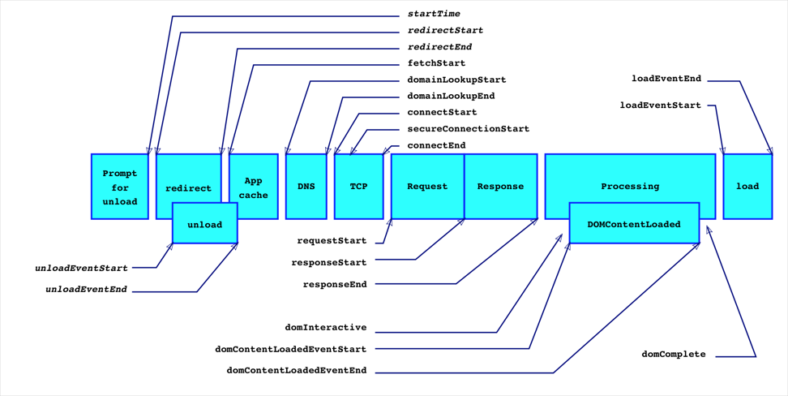

## 前端监控

在线上项目中,需要统计产品中用户行为和使用情况，从而可以从用户和产品的角度去了解用户群体，从而升级和迭代产品，使其更加贴近用户。用户行为数据可以通过前端数据监控的方式获得，除此之外，前端还需要实现性能监控和异常监控。

性能监控包括：
- 首屏加载时间
- 白屏时间
- http请求时间和http响应时间。
- 异常监控包括前端脚本执行报错等。

实现前端监控有三个步骤：
- 前端埋点和上报
- 数据处理
- 数据分析

## 为什么需要前端监控

获取用户行为以及跟踪产品在用户端的使用情况，并以监控数据为基础，指明产品优化的方向。
虽然页面性能很重要，但是在实际使用中，页面性能差的情况并不少见。首先，在产品的迭代演进过程中，页面性能可能会被忽略，性能随着版本迭代而有所衰减；其次，性能优化是一项复杂而挑战的事情，需要明确的优化方向和具体的优化手段才能快速落地取效。
所以我们需要一个性能监控系统，持续监控和预警页面性能的状况，并且在发现瓶颈的时候指导优化工作。


## 常用前端埋点方案总结
>也就是数据的收集阶段

### 代码埋点

以嵌入代码的形式进行埋点，比如需要监控用户的点击事件，会选择在用户点击时，插入一段代码，保存这个监听行为或者直接将监听行为以某一种数据格式直接传递给server端。此外比如需要统计产品的PV和UV的时候，需要在网页的初始化时，发送用户的访问信息等。

- 优点：可以在任意时刻，精确的发送或保存所需要的数据信息。
- 缺点：工作量较大，每一个组件的埋点都需要添加相应的代码

### 可视化埋点

用一个可视化系统来实现手动插入代码埋点的过程。
将业务代码和埋点代码分离，提供一个可视化交互的页面，输入为业务代码，通过这个可视化系统，可以在业务代码中自定义的增加埋点事件等等，最后输出的代码耦合了业务代码和埋点代码。

- 缺点：可视化埋点可以埋点的控件有限，不能手动定制。

### 无埋点

并不是说不需要埋点，而是全部埋点，前端的任意一个事件都被绑定一个标识，所有的事件都别记录下来。通过定期上传记录文件，配合文件解析，解析出来我们想要的数据，并生成可视化报告供专业人员分析因此实现“无埋点”统计。

通常是提前在框架层面就预制SDK的方式，然后监听通用的事件。

- 优点：由于采集的是全量数据，所以产品迭代过程中是不需要关注埋点逻辑的，也不会出现漏埋、误埋等现象
- 缺点：无埋点采集全量数据，给数据传输和服务器增加压力
-  缺点：无法灵活的定制各个事件所需要上传的数据

## 如何监控一些指标

Performance.timing 是一个只读属性，返回 PerformanceTiming 对象，该对象包括了页面相关的性能信息。更多解释参见 W3C Recommendation - NavigationTiming 


利用上面的这个API我们可以计算出一些基础的性能指标


## 何时触发上报数据
>感觉这应该属于代码埋点

性能监控只是辅助功能，不应阻塞页面加载，因此只有当页面完成加载后，我们才进行数据获取和上报（实际上，页面加载完成前也获取不到必要信息）：

```
 window.onload = e => {
    if (oldOnload && typeof oldOnload === 'function') {
      oldOnload(e)
    }
    // 尽量不影响页面主线程
    if (window.requestIdleCallback) {
      window.requestIdleCallback(pMonitor.logPackage)
    } else {
      setTimeout(pMonitor.logPackage)
    }

```

## 需上报的错误类型

- 静态资源加载失败
- AJAX请求失败
- JavaScript异常
  - 运行时报错
    - 同步错误
    - 异步错误
  - 语法错误
- promise异常

## 捕获错误有几种方式

- onerror全局监听
- addEventListener全局监听
- try...catch主动捕获
- promise...catch主动捕获
- 重写XMLHttpRequest对象方法
- MVVM框架例如VUE和React中的官方错误处理方法

## 错误上报

两种主流上报方式：

- 通过Ajax发送数据：因为Ajax请求本身也有可能会发生异常，而且有可能会引发跨域问题，一般情况下更推荐使用动态创建img标签的形式进行上报。

- 动态创建 img 标签的形式
  
```
new Image().src = reportUrl + '?msg=' + msg;
```
或者
```
var i = new Image();
i.onload = i.onerror = i.onabort = function () {
  i = i.onload = i.onerror = i.onabort = null;
}
i.src = url;

```

## 一般的优化方法

- 页面内容
  - 减少HTTP请求数
  - 减少DNS查询
  - 避免重定向
  - 缓存Ajax请求
  - 延迟加载
  - 预先加载
  - 减少dom元素数量
  - 划分不同内容到不同域名
  - 尽量减少使用iframe
  - 避免404错误


- 服务器
  - 使用CDN
  - 添加Expires或者Cache-Control响应头
  - 启用Gzip
  - 配置Etag
  - 尽早输出缓冲
  - Ajax请求使用get方法
  - 避免图片src为空


- Cookie

  - 减少cookie大小
  - 静态资源使用无cookie域名


- Css

  - 把样式表放在`<head>`中
  - 不要使用CSS表达式
  - 使用`<link代替@import`
  - 不要使用filter


- JavaScript

  - 把脚本放在页面底部
  - 使用外部JavaScript和Css
  - 压缩JavaScript和Css
  - 避免重复脚本
  - 减少dom操作
  - 使用高效的时间处理


- 图片

  - 优化图片
  - 优化CSS Sprite
  - 不要再HTML中缩放图片
  - 使用体积小、可缓存的favicon.ico


- 移动端

  - 保持单个文件小于25KB
  - 打包内容为分段（multipart）文档

