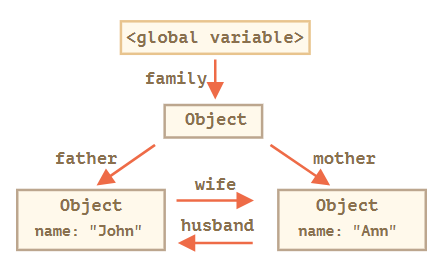
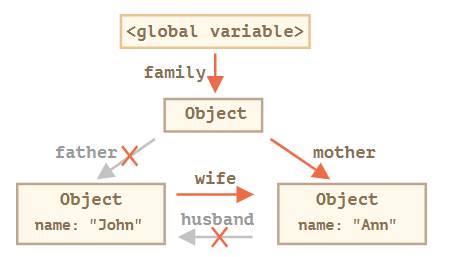
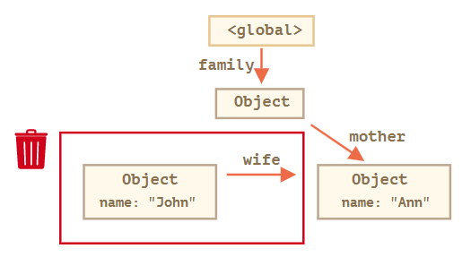
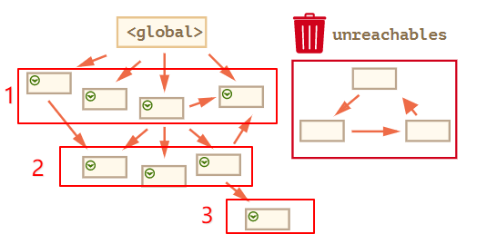

> 标记清除图片与实例来自：[图解 JavaScript 垃圾回收](https://juejin.im/post/5e0ddc24f265da5d1805ee6f#heading-0)

## 垃圾回收

全局变量声明之后，其生命周期会一直存在，直到全局被销毁（浏览器退出、系统关闭等）。
函数声明之后，在每一次的运行时，系统会开辟一个新的内存区去运行函数，当函数执行完毕之后该区域会被回收，此为“函数运行完后变量就被回收”，实际上是运行函数的内存区被回收。

## [V8 引擎的垃圾回收机制](V8引擎的垃圾回收机制.md)

## 标记清除

### 可达性（Reachability）

“可达”值是那些以某种方式可访问或可用的值。它们一定是存储在内存中的。

### 固有的可达值

这些值被称作 根（roots）：

- 当前函数的局部变量和参数。
- 嵌套调用时，当前调用链上所有函数的变量与参数。
- 全局变量。
- 等等

如果一个值可以通过引用或引用链从根访问任何其他值，则认为该值是可达的。

### 看一个相互关联对象实例

```
function marry(man, woman) {
  woman.husband = man;
  man.wife = woman;

  return {
    father: man,
    mother: woman
  }
}

let family = marry({
  name: "John"
}, {
  name: "Ann"
});

```



现在让我们移除两个引用：

```
delete family.father;
delete family.mother.husband;
```




### 基本算法

- 垃圾收集器找到所有的根，并“标记”（记住）它们。
- 然后它遍历这些根的引用，并“标记”他们。
- 引用的引用，一直往下
- 所有被遍历到的对象都会被记住，以免将来再次遍历到同一个对象。
- 知道所有能到达的全被标记就结束

如下图经过三次遍历到达所有的节点，没有标记的将会被清除


## 古老的引用计数算法

### 基本方法

引用计数（reference counting）是现在不太常见的垃圾收集策略，好像在老版的 IE 里面再用这个方法。 所谓"引用计数"是指语言引擎有一张"引用表"，保存了内存里面所有的资源（通常是各种值）的引用次数。

- 当声明了一个变量并将一个引用类型值赋给该变量时，则这个值的引用次数就是 1。
- 如果同一个值又被赋给另一个变量，则该值的引用次数加 1。
- 相反，如果包含对这个值引用的变量又取得了另外一个值，则这个值的引用次数减 1。
- 当这个值的引用次数变成 0 时，则说明没有办法再访问这个值了，因而就可以将其占用的内存空间回收回来。

```
function test(){
        var a = {} ; // a的引用次数为0
        var b = a ; // a的引用次数加1，为1
        var c = a; // a的引用次数再加1，为2
        var b = {}; // a的引用次数减1，为1
        }

```

这里当 test 函数执行结束时（个人猜想，没有考证）：
b 的引用计数是 0，c 也是 0，b，c 被清除，那 a 的次数又会被-2 变成 0，所有的表量都被回收

### 致命缺陷：循环引用

如果两个对象相互引用，尽管他们已不再使用，垃圾回收不会进行回收，导致内存泄露。

```
function f(){
  var o = {};
  var o2 = {};
  o.a = o2; // o 引用 o2
  o2.a = o; // o2 引用 o  这里

  return "azerty";
}

f();

```

在采用 标记清除 策略的实现中，由于函数执行之后，这两个对象都离开了作用域，作用域内的变量都会被清除标记，因此这种相互引用不是个问题。

但在采用 引用计数 策略的实现中，当函数 f 执行完毕后，对象 o1 和 o2 还将继续存在，因为它们的引用次数永远不会是 0。假如这个函数 f 被重复多次调用，就会导致大量内存得不到回收。

为此，新一代浏览器都放弃了引用计数方式，转而采用标记清除来实现其垃圾收集机制。

## 四种常见的 JS 内存泄漏

### 意外的全局变量

```
function foo(arg) {
    bar = "this is a hidden global variable";
}

```

```
function foo() {
    this.variable = "potential accidental global";
}

// Foo 调用自己，this 指向了全局对象（window）
// 而不是 undefined
foo();

```

解决方法：

在 JavaScript 文件头部加上 'use strict'，使用严格模式避免意外的全局变量，此时上例中的 this 指向 undefined。如果必须使用全局变量存储大量数据时，确保用完以后把它设置为 null 或者重新定义。

### 被遗忘的计时器或回调函数

在节点 node 或者数据不再需要时，定时器依旧指向这些数据。所以哪怕当 node 节点被移除后，interval 仍旧存活并且垃圾回收器没办法回收，它的依赖也没办法被回收，除非终止定时器。

```
var someResource = getData();
setInterval(function() {
    var node = document.getElementById('Node');
    if(node) {
        // 处理 node 和 someResource
        node.innerHTML = JSON.stringify(someResource));
    }
}, 1000);

```

### 脱离 DOM 的引用

在数据结构中存储 DOM 节点。假设你想快速更新表格中几行的内容。如果在字典或数组中存储对每个 DOM 行的引用，就会产生两个对同一个 DOM 元素的引用：一个在 DOM 树中，另一个在字典中。如果你决定删除这些行，你需要记住让两个引用都无法访问。

```
var elements = {
    button: document.getElementById('button'),
    image: document.getElementById('image')
}

function doStuff() {
    image.src = 'http://some.url/image';
    button.click();
    console.log(text.innerHTML);
}

function removeButton() {
    document.body.removeChild(document.getElementById('button'));
  // 虽然我们用removeChild移除了button, 但是还在elements对象里保存着#button的引用
 // 换言之, DOM元素还在内存里面.
}
```

### 不规范的闭包

> 闭包本身并不会造成内存泄漏，只是会增加内存的消耗，是可控的，你的不规范使用才导致闭包造成了内存泄漏

JavaScript 开发的一个关键方面是闭包：一个内部函数可以访问外部（封闭）函数的变量。由于 JavaScript 运行时的实现细节，可能以如下方式泄漏内存：

```
var theThing = null;
var replaceThing = function () {
  var originalThing = theThing;
  var unused = function () {
    if (originalThing) // a reference to 'originalThing'
      console.log("hi");
  };
  theThing = {
    longStr: new Array(1000000).join('*'),
    someMethod: function () {
      console.log("message");
    }
  };
};
setInterval(replaceThing, 1000);
```

每次调用 replaceThing ，theThing 得到一个包含一个大数组和一个新闭包（someMethod）的新对象。同时，变量 unused 是一个引用 originalThing 的闭包（先前的 replaceThing 又调用了 theThing ）。someMethod 可以通过 theThing 使用，someMethod 与 unused 分享闭包作用域，尽管 unused 从未使用，它引用的 originalThing 迫使它保留在内存中（防止被回收）。

## IE 的事件监听创建的闭包

> js 高程原文这样说的：由于 IE9 之前的版本对 JScript 对象和 COM 对象使用不同的垃圾收集。因此闭包在 IE 的这些版本中会导致一些特殊的问题。具体来说，如果闭包的作用域链中保存着一个 HTML 元素，那么就意味着该元素将无法被销毁。

意思就是闭包造成的内存泄漏是旧版本 IE 的 bug，真正情况下的闭包不会造成内存泄漏。
这段代码创建了一个元素，当它被点击的时候变红，但同时它也会发生内存泄露。为什么？因为对 el 的引用不小心被放在一个匿名内部函数中。这就在 JavaScript 对象（内部监听函数）和本地对象之间（el）创建了一个循环引用。el.onclick->function function[scope].el->el

```
 function addHandler() {
     var el = document.getElementById('el');
     el.onclick = function() {
         el.style.backgroundColor = 'red';
     }
 }
```

## 如何避免内存泄漏

记住一个原则：不用的东西，及时归还。

减少不必要的全局变量，使用严格模式避免意外创建全局变量。
在你使用完数据后，及时解除引用（闭包中的变量，dom 引用，定时器清除）。
组织好你的逻辑，避免死循环等造成浏览器卡顿，崩溃的问题。
