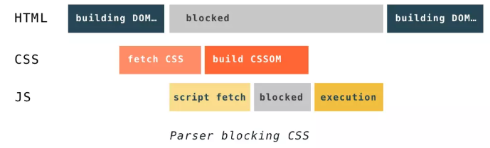
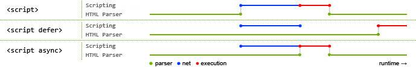
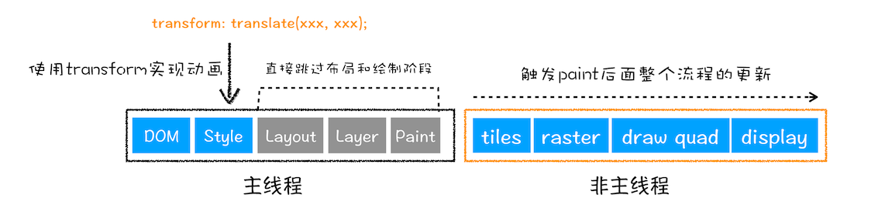

## 浏览器是多进程的

总结图：


最后下面的渲染进程可能有多个（每个 tab 页面浏览器都会启动一个渲染进程）

### Browser 进程：

浏览器的主进程（负责协调、主控），只有一个。

负责浏览器界面显示，与用户交互。如前进，后退等

负责各个页面的管理，创建和销毁其他进程

将 Renderer 进程得到的内存中的 Bitmap，绘制到用户界面上

网络资源的管理，下载等

### 第三方插件进程：

每种类型的插件对应一个进程，仅当使用该插件时才创建

### GPU 进程：

最多一个，用于 3D 绘制等

### 浏览器渲染进程（浏览器内核）（Renderer 进程，内部是多线程的）：

默认每个 Tab 页面都会产生一个渲染进程，互不影响。主要作用为
页面渲染，脚本执行，事件处理等

##怎么查看浏览器进程情况
打开 Chrome Shift+Esc；我们可以看到进程情况，Chrome 图标就是 Browser 主进程


## 多线程优缺点

避免单个 page crash 影响整个浏览器

避免第三方插件 crash 影响整个浏览器

多进程充分利用多核优势

方便使用沙盒模型隔离插件等进程，提高浏览器稳定性

简单点理解：如果浏览器是单进程，那么某个 Tab 页崩溃了，就影响了整个浏览器，体验有多差；同理如果是单进程，插件崩溃了也会影响整个浏览器；而且多进程还有其它的诸多优势，当然内存等资源消耗也会更大

## 重点是浏览器内核（渲染进程）该进程有多个线程完成

### GUI 渲染线程

负责渲染浏览器界面，解析 HTML，CSS，构建 DOM 树和 RenderObject 树，布局和绘制等。
当界面需要重绘（Repaint）或由于某种操作引发回流(reflow)时，该线程就会执行
注意，GUI 渲染线程与 JS 引擎线程是互斥的，当 JS 引擎执行时 GUI 线程会被挂起（相当于被冻结了），GUI 更新会被保存在一个队列中等到 JS 引擎空闲时立即被执行。
为什么互斥：由于 JS 是可以操作 DOM 的，如果同时修改元素属性并同时渲染界面(即 JS 线程和 UI 线程同时运行)， 那么渲染线程前后获得的元素就可能不一致了（简单说就是 js 修改 dom 后没有重新渲染成功）

### JS 引擎线程

也称为 JS 内核，负责处理 Javascript 脚本程序。（例如 V8 引擎）
JS 引擎线程负责解析 Javascript 脚本，运行代码。
JS 引擎一直等待着任务队列中任务的到来，然后加以处理，一个 Tab 页（renderer 进程）中无论什么时候都只有一个 JS 线程在运行 JS 程序
同样注意，GUI 渲染线程与 JS 引擎线程是互斥的，所以如果 JS 执行的时间过长，这样就会造成页面的渲染不连贯，导致页面渲染加载阻塞。

### 事件触发线程

归属于浏览器而不是 JS 引擎，用来控制事件循环（可以理解，JS 引擎自己都忙不过来，需要浏览器另开线程协助）
当 JS 引擎执行代码块如 setTimeOut 时（也可来自浏览器内核的其他线程,如鼠标点击、AJAX 异步请求等），会将对应任务添加到事件线程中
当对应的事件符合触发条件被触发时，该线程会把事件添加到待处理队列的队尾，等待 JS 引擎的处理
注意，由于 JS 的单线程关系，所以这些待处理队列中的事件都得排队等待 JS 引擎处理（当 JS 引擎空闲时才会去执行）

### 定时触发器线程

传说中的 setInterval 与 setTimeout(这些 API 却不是引擎提供的而是浏览器提供的 Web API，比如说 DOM、AJAX、setTimeout) 所在线程浏览器定时计数器并不是由 JavaScript 引擎计数的,（因为 JavaScript 引擎是单线程的, 如果处于阻塞线程状态就会影响记计时的准确）
因此通过单独线程来计时并触发定时（计时完毕后，添加到事件队列中，等待 JS 引擎空闲后执行）
注意，W3C 在 HTML 标准中规定，规定要求 setTimeout 中低于 4ms 的时间间隔算为 4ms。

### 异步 http 请求线程

在 XMLHttpRequest 在连接后是通过浏览器新开一个线程请求
将检测到状态变更时，如果设置有回调函数，异步线程就产生状态变更事件，将这个回调再放入事件队列中。再由 JavaScript 引擎执行。

## 进程间的通信过程

1. Browser 进程收到用户请求，首先需要获取页面内容（譬如通过网络下载资源），随后将该任务通过 RendererHost 接口传递给 Render 进程
2. Renderer 进程的 Renderer 接口收到消息，简单解释后，交给渲染线程，然后开始渲染
3. 渲染线程接收请求，加载网页并渲染网页，这其中可能需要 Browser 进程获取资源和需要 GPU 进程来帮助渲染
4. 当然可能会有 JS 线程操作 DOM（这样可能会造成回流并重绘）
5. 最后 Render 进程将结果传递给 Browser 进程
6. Browser 进程接到结果并将结果绘制出来
   

## 渲染进程（浏览器内核）线程的关系

### GUI 渲染线程与 JS 引擎线程互斥

由于 JavaScript 是可操纵 DOM 的，如果在修改这些元素属性同时渲染界面（即 JS 线程和 UI 线程同时运行），那么渲染线程前后获得的元素数据就可能不一致了。
因此为了防止渲染出现不可预期的结果，浏览器设置 GUI 渲染线程与 JS 引擎为互斥的关系，当 JS 引擎执行时 GUI 线程会被挂起，
GUI 更新则会被保存在一个队列中等到 JS 引擎线程空闲时立即被执行。

### JS 阻塞页面加载

从上述的互斥关系，可以推导出，JS 如果执行时间过长就会阻塞页面。
譬如，假设 JS 引擎正在进行巨量的计算，此时就算 GUI 有更新，也会被保存到队列中，等待 JS 引擎空闲后执行。
然后，由于巨量计算，所以 JS 引擎很可能很久很久后才能空闲，自然会感觉到巨卡无比。
所以，要尽量避免 JS 执行时间过长，这样就会造成页面的渲染不连贯，导致页面渲染加载阻塞的感觉。

## WebWorker，JS 的多线程

JavaScript 引擎是单线程运行的，JavaScript 中耗时的 I/O 操作都被处理为异步操作，它们包括键盘、鼠标 I/O 输入输出事件、窗口大小的 resize 事件、定时器(setTimeout、setInterval)事件、Ajax 请求网络 I/O 回调等。当这些异步任务发生的时候，它们将会被放入浏览器的事件任务队列中去，等到 JavaScript 运行时执行线程空闲时候才会按照队列先进先出的原则被一一执行，但终究还是单线程。

创建 Worker 时，JS 引擎向浏览器申请开一个子线程（子线程是浏览器开的，完全受主线程控制，而且不能操作 DOM）
JS 引擎线程与 worker 线程间通过特定的方式通信（postMessage API，需要通过序列化对象来与线程交互特定的数据）

```
//主线程 main.js
var worker = new Worker("worker.js");
worker.onmessage = function(event){
    // 主线程收到子线程的消息
};
// 主线程向子线程发送消息
worker.postMessage({
    type: "start",
    value: 12345
});

//web worker.js
onmessage = function(event){
   // 收到
};
postMessage({
    type: "debug",
    message: "Starting processing..."
});
```

## 浏览器渲染流程

### 拿到内容

- 浏览器根据 DNS 服务器得到域名的 IP 地址
- 向这个 IP 的机器发送 HTTP 请求
- 服务器收到、处理并返回 HTTP 请求
- 浏览器得到返回内容

### 解析内容建立 Rendering Tree

#### 解析 HTML 构建 dom

1. dom 作用: HTMLDOM 是 HTML Document Object Model(文档对象模型)的缩写，HTML DOM 则是专门适用于 HTML/XHTML 的文档对象模型。熟悉软件开发的人员可以将 HTML DOM 理解为网页的 API。它将网页中的各个元素都看作一个个对象，从而使网页中的元素也可以被计算机语言获取或者编辑。
2. dom 规定

- 整个文档是一个文档节点
- 每个 HTML 标签是一个元素节点
- 包含在 HTML 元素中的文本是文本节点
- 每一个 HTML 属性是一个属性节点（属性节点是另一个层面的理解，在浏览器后台打印的时候，不存在属性节点）
- 注释属于注释节点

3. 解析过程：浏览器会自动把 HTML 文档解析为一个“文档对象模型”，即 Document Object Model，简称 DOM，这是一个树形结构，树根是 Document 对象，树干是网页的根元素`<html>`，然后分出两个枝丫，一个是`<head>`，一个是`<body>`，然后网页上的其他标签就是这棵树上的树叶和树枝了，通过这个结构，就可以查找和控制网页上的任何一个元素了。因此，可以这么说，网页上的任何元素都是 Document 对象的子对象。
   

#### 解析 CSS 产生 CSS 规则树，css 是由单独的下载线程异步下载的,本身不会阻塞 Dom 加载，它和 DOM 结构比较像然后结合 DOM 生成 RenderTree

#### Javascript 解析， 通过 DOM API 和 CSSOM API 来操作 DOM Tree 和 CSS Rule Tree。

#### 布局 render 树（Layout/reflow），负责各元素尺寸、位置的计算

#### 绘制 render 树（paint），绘制页面像素信息

#### 浏览器会将各层的信息发送给 GPU，GPU 会将各层合成（composite），显示在屏幕上


## 渲染过程中的问题

### DOMContentLoaded 与 onload

- 当 DOMContentLoaded 事件触发时，仅当 DOM 加载完成，不包括样式表，图片
- 当 onload 事件触发时，页面上所有的 DOM，样式表，脚本，图片都已经加载完成了。 （渲染完毕了）
- DOMContentLoaded -> load

### 浏览器如果渲染过程中遇到 JS 文件怎么处理？

- 上面说过 GUI 渲染线程与 JS 引擎线程是互斥的，所以渲染过程中，如果遇到`<script>`就停止渲染，执行 JS 代码，也就是说，在构建 DOM 时，HTML 解析器若 遇到了 JavaScript，那么它会暂停构建 DOM，将控制权移交给 JavaScript 引擎，等 JavaScript 引擎运行完毕，浏览器再从中断的地方恢复 DOM 构建。
- 首屏渲染的越快，就越不应该在首屏就加载 JS 文件，这也是都建议将 script 标签放在 body 标签底部的原因

### JS 文件不只是阻塞 DOM 的构建，它会导致 CSSOM 也阻塞 DOM 的构建。

- 因为 JavaScript 不只是可以改 DOM，它还可以更改样式，也就是它可以更改 CSSOM。因为不完整的 CSSOM 是无法使用的，如果 JavaScript 想访问 CSSOM 并更改它，那么在执行 JavaScript 时，必须要能拿到完整的 CSSOM。
- 所以就导致了一个现象，如果浏览器尚未完成 CSSOM 的下载和构建，而我们却想在此时运行脚本，那么浏览器将延迟脚本执行和 DOM 构建，直至其完成 CSSOM 的下载和构建。也就是说，在这种情况下，浏览器会先下载和构建 CSSOM



### `<script src="script.js"></script>`

- 没有 defer 或 async，浏览器会立即加载并执行指定的脚本，也就是说不等待后续载入的文档元素，读到就加载并执行。

### `<script defer src="script.js"></script>`(延迟执行)

- defer 属性表示延迟执行引入的 JavaScript，即这段 JavaScript 加载时 HTML 并未停止解析，这两个过程是并行的。整个 document 解析完毕且 defer-script 也加载完成之后（这两件事情的顺序无关），会执行所有由 defer-script 加载的 JavaScript 代码，然后触发 DOMContentLoaded 事件。
- defer 与相比普通 script，有两点区别：载入 JavaScript 文件时不阻塞 HTML 的解析，执行阶段被放到 HTML 标签解析完成之后。

### `<script async src="script.js"></script>` (异步下载)

- 加载和渲染后续文档元素的过程将和 script.js 的加载与执行并行进行（异步）。
- async 属性表示异步执行引入的 JavaScript

### defer 和 async 总结

- defer 和 async 在网络读取（下载）这块儿是一样的,都是异步的（相较于 HTML 解析）
- defer的script.js 的执行要在所有元素解析完成之后
- async如果已经加载好，就会开始执行。也就是加载不阻塞，执行会阻塞。
- 在加载多个 JS 脚本的时候，async 是无顺序的加载，而 defer 是有顺序的加载。
- async 对于应用脚本的用处不大,因为它完全不考虑依赖（哪怕是最低级的顺序执行）,不过它对于那些可以不依赖任何脚本或不被任何脚本依赖的脚本来说却是非常合适的



- 蓝色线代表网络读取script,红色线代表script执行时间,这俩都是针对脚本的。
- 绿色线代表 HTML 解析。

**注意：下载的时候才是并行，执行的时候js肯定是要阻塞**


## 浏览器的回流与重绘 (Reflow & Repaint)

浏览器使用流式布局模型 (Flow Based Layout)。
有了 RenderTree，我们就知道了所有节点的样式，然后计算他们在页面上的大小和位置，最后把节点绘制到页面上。

### 回流

当 Render Tree 中部分或全部元素的尺寸、结构、或某些属性发生改变时，浏览器重新渲染部分或全部文档的过程称为回流。

- 页面首次渲染
- 浏览器窗口大小发生改变
- 元素尺寸或位置发生改变
- 元素内容变化（文字数量或图片大小等等）
- 元素字体大小变化
- 添加或者删除可见的 DOM 元素
- 激活 CSS 伪类（例如：:hover）
- 查询某些属性或调用某些方法


### 重绘

当页面中元素样式的改变并不影响它在文档流中的位置时（例如：color、background-color、visibility 等），浏览器会将新样式赋予给元素并重新绘制它，这个过程称为重绘。


### 既不要布局也不要绘制 - 直接合成

使用了 CSS 的 transform 来实现动画效果，这可以避开重排和重绘阶段，直接在非主线程上执行合成动画操作。这样的效率是最高的，因为是在非主线程上合成，并没有占用主线程的资源，另外也避开了布局和绘制两个子阶段，所以相对于重绘和重排，合成能大大提升绘制效率。



### 如何避免回流

CSS
- 避免使用 table 布局。
- 尽可能在 DOM 树的最末端改变 class。
- 避免设置多层内联样式。
- 将动画效果应用到 position 属性为 absolute 或 fixed 的元素上。
- 避免使用 CSS 表达式（例如：calc()）。

Javascript

- 避免频繁操作样式,最好一次性重写 style 属性,或者将样式列表定义为 class 并一次性更改 class 属性。
- 避免频繁操作 DOM,创建一个 documentFragment,在它上面应用所有 DOM 操作,最后再把它添加到文档中。
- 也可以先为元素设置 display: none,操作结束后再把它显示出来。因为在 display 属性为 none 的元素上进行的 DOM 操作不会引发回流和重绘。
- 避免频繁读取会引发回流/重绘的属性,如果确实需要多次使用,就用一个变量缓存起来。
对具有复杂动画的元素使用绝对定位,使它脱离文档流,否则会引起父元素及后续元素频繁回流。

### 实例1 合并样式
避免逐条改变样式，使用类名去合并样式
```
const container = document.getElementById('container')
container.style.width = '100px'
container.style.height = '200px'
container.style.border = '10px solid red'
container.style.color = 'red'
```

将这段代码用 类名去合并
```
.basic_style {
  width: 100px;
  height: 200px;
  border: 10px solid red;
  color: red;
}
const container = document.getElementById('container')
container.classList.add('basic_style')
```
### 实例2 将 DOM “离线”

```
let container = document.getElementById('container')
container.style.display = 'none'
container.style.width = '100px'
container.style.height = '200px'
container.style.border = '10px solid red'
container.style.color = 'red'
...（省略了许多类似的后续操作）
container.style.display = 'block'
```


### Flush 队列

实例二表面看导致了三次回流和一次重绘，其实是忽略了浏览器自身的优化处理！
这段代码实际上只进行了一次回流和一次重绘，

浏览器自己也清楚，如果每次 DOM 操作都即时地反馈一次回流或重绘，那么性能上来说是扛不住的。于是它自己缓存了一个 flush 队列，把我们触发的回流与重绘任务都塞进去，待到队列里的任务多起来、或者达到了一定的时间间隔，或者“不得已”的时候，再将这些任务一口气出队，这样就会让多次的回流、重绘变成一次回流重绘。。因此我们看到，上面就算我们进行了 4 次 DOM 更改，也只触发了一次 Layout 和一次 Paint。


虽然有了浏览器的优化，但有时候我们写的一些代码可能会强制浏览器提前flush队列，这样浏览器的优化可能就起不到作用了。当你请求向浏览器请求一些 style信息的时候，就会让浏览器flush队列，比如：

- offsetTop, offsetLeft, offsetWidth, offsetHeight
- scrollTop/Left/Width/Height
- clientTop/Left/Width/Height
- width,height
- 请求了getComputedStyle(), 或者 IE的 currentStyle

当你请求上面的一些属性的时候，浏览器为了给你最精确的值，需要flush队列，因为队列中可能会有影响到这些值的操作。即使你获取元素的布局和样式信息跟最近发生或改变的布局信息无关，浏览器都会强行刷新渲染队列。


### 实例3 不要经常去访问即时刷新flush的属性
要经常访问会引起浏览器flush队列的属性，如果你确实要访问，利用缓存

```
// 别这样写，大哥
for (let i = 0; i < 10; i++) {
  el.style.left = el.offsetLeft + 5 + "px";
  el.style.top = el.offsetTop + 5 + "px";
}

// 这样写好点
var left = el.offsetLeft,
  top = el.offsetTop,
  s = el.style;
for (let i = 0; i < 10; i++) {
  left += 10;
  top += 10;
}
  s.left = left + "px";
  s.top = top + "px";
```


## 参考文章

- https://segmentfault.com/a/1190000009313491
- https://juejin.im/post/5a6547d0f265da3e283a1df7
- https://juejin.im/post/5ca0c0abe51d4553a942c17d
- https://juejin.im/post/5a9923e9518825558251c96a
