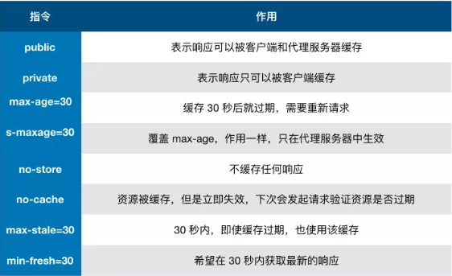
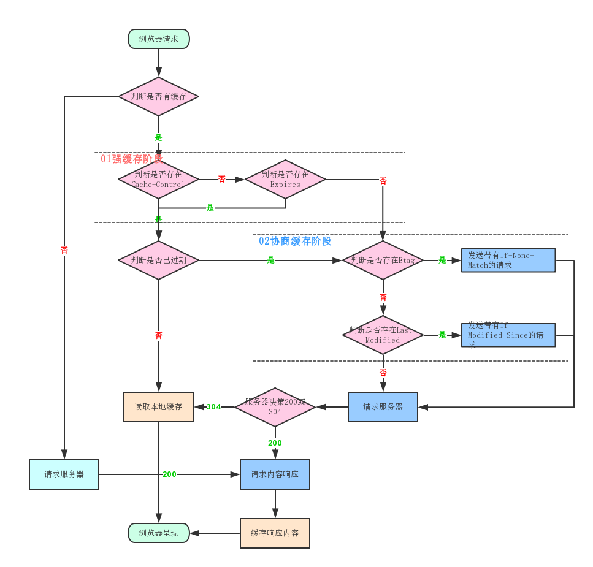

## 浏览器缓存

> https://juejin.im/post/5b9346dcf265da0aac6fbe57

（1）减少页面加载时间；（2）减少服务器负载；

当浏览器要请求资源时:

- 调用 Service Worker 的 fetch 事件响应
- 查看 memory cache
- 查看 disk cache。这里又细分：
  - 如果有强制缓存且未失效，则使用强制缓存，不请求服务器。这时的状态码全部是 200
  - 如果有强制缓存但已失效，使用对比缓存，比较后确定 304 还是 200
- 发送网络请求，等待网络响应
- 把响应内容存入 disk cache (如果 HTTP 头信息配置可以存的话)
- 把响应内容 的引用 存入 memory cache (无视 HTTP 头信息的配置)
- 把响应内容存入 Service Worker 的 Cache Storage (如果 Service Worker 的脚本调用了 cache.put())

## 按位置划分

### Service Worker

Service Worker 的缓存与浏览器其他内建的缓存机制不同，它可以让我们自由控制缓存哪些文件、如何匹配缓存、如何读取缓存，并且缓存是持续性的。

Service Worker 能够操作的缓存是有别于浏览器内部的 memory cache 或者 disk cache 的。我们可以从 Chrome 的 F12 中，Application -> Cache Storage 找到这个单独的“小金库”。除了位置不同之外，这个缓存是永久性的，即关闭 TAB 或者浏览器，下次打开依然还在(而 memory cache 不是)。有两种情况会导致这个缓存中的资源被清除：手动调用 API cache.delete(resource) 或者容量超过限制，被浏览器全部清空。

### memory cache

memory cache 是内存中的缓存，(与之相对 disk cache 就是硬盘上的缓存)。按照操作系统的常理：先读内存，再读硬盘

几乎所有的网络请求资源都会被浏览器自动加入到 memory cache 中。但是也正因为数量很大但是浏览器占用的内存不能无限扩大这样两个因素，memory cache 注定只能是个“短期存储”。 TAB 关闭后该次浏览的 memory cache 便告失效。

memory cache 内部可以分为两块：

- preloader：在解析执行的时候，网络请求是空闲的，这就有了发挥的空间：我们能不能一边解析执行 js/css，一边去请求下一个(或下一批)资源
- preload ：例如 `<link rel="preload">`。这些显式指定的预加载资源，也会被放入 memory cache 中。

memory cache 的优点：

- 快速读取：内存缓存会将编译解析后的文件，直接存入该进程的内存中，占据该进程一定的内存资源，以方便下次运行使用时的快速读取。

- 时效性：一旦该进程关闭，则该进程的内存则会清空。

memory cache 机制保证了一个页面中如果有两个相同的请求 (例如两个 src 相同的 ``，两个 href 相同的 `<link>`)都实际只会被请求最多一次，避免浪费。

在从 memory cache 获取缓存内容时，浏览器会忽视例如 max-age=0, no-cache 等头部配置。例如页面上存在几个相同 src 的图片，即便它们可能被设置为不缓存，但依然会从 memory cache 中读取。

但如果站长是真心不想让一个资源进入缓存，就连短期也不行，那就需要使用 no-store。存在这个头部配置的话，即便是 memory cache 也不会存储，自然也不会从中读取了

### disk cache

disk cache 也叫 HTTP cache，顾名思义是存储在硬盘上的缓存，因此它是持久存储的，是实际存在于文件系统中的。而且它允许相同的资源在跨会话，甚至跨站点的情况下使用，例如两个站点都使用了同一张图片。

disk cache 会严格根据 HTTP 头信息中的各类字段来判定哪些资源可以缓存，哪些资源不可以缓存；哪些资源是仍然可用的，哪些资源是过时需要重新请求的。当命中缓存之后，浏览器会从硬盘中读取资源，虽然比起从内存中读取慢了一些，但比起网络请求还是快了不少的。绝大部分的缓存都来自 disk cache。

浏览器会在 js 和图片等文件解析执行后直接存入内存缓存中，那么当刷新页面时只需直接从内存缓存中读取(from memory cache)；而 css 文件则会存入硬盘文件中，所以每次渲染页面都需要从硬盘读取缓存(from disk cache)。

实例：

- 打开页面看网络请求的控制面板的 Size 那栏，首次肯定都是大小
- 按 F5 刷新页面，发现 Size 那栏会变成 from memory，因为 Tab 没有关闭，资源在内存了
- 关了 Tab 再重新打开，发现变为了 from disk,内存清空从硬盘上取

### Push Cache

Push Cache（推送缓存）是 HTTP/2 中的内容，当以上三种缓存都没有命中时，它才会被使用。它只在会话（Session）中存在，一旦会话结束就被释放，并且缓存时间也很短暂，在 Chrome 浏览器中只有 5 分钟左右，同时它也并非严格执行 HTTP 头中的缓存指令。

Push Cache 在国内能够查到的资料很少，也是因为 HTTP/2 在国内不够普及。
所有的资源都能被推送，并且能够被缓存,但是 Edge 和 Safari 浏览器支持相对比较差

- 可以推送 no-cache 和 no-store 的资源
- 一旦连接被关闭，Push Cache 就被释放
- 多个页面可以使用同一个 HTTP/2 的连接，也就可以使用同一个 Push Cache。这主要还是依赖浏览器的实现而定，出于对性能的考虑，有的浏览器会对相同域名但不同的 tab 标签使用同一个 HTTP 连接。
- Push Cache 中的缓存只能被使用一次
- 浏览器可以拒绝接受已经存在的资源推送
- 你可以给其他域名推送资源

## 按策略划分

> memory cache 是浏览器为了加快读取缓存速度而进行的自身的优化行为，不受开发者控制，也不受 HTTP 协议头的约束，算是一个黑盒。Service Worker 是由开发者编写的额外的脚本，且缓存位置独立，出现也较晚，使用还不算太广泛。

所以我们平时最为熟悉的其实是 disk cache，也叫 HTTP cache (因为不像 memory cache，它遵守 HTTP 协议头中的字段)。平时所说的强缓存，协商缓存，以及 Cache-Control 等，也都归于此类。

## 浏览器缓存策略

> 缓存策略都是通过设置 HTTP Header 来实现的。

### 首先判断它是否命中强缓存

浏览器在加载资源时，先根据这个资源的一些 http header 判断它是否命中强缓存，强缓存如果命中，浏览器直接从自己的缓存中读取资源，不会发请求到服务器。

### 验证这个资源是否命中协商缓存

当强缓存没有命中的时候，浏览器一定会发送一个请求到服务器，通过服务器端依据资源的另外一些 http header 验证这个资源是否命中协商缓存，如果协商缓存命中，服务器会将这个请求返回，但是不会返回这个资源的数据，而是告诉客户端可以直接从缓存中加载这个资源，于是浏览器就又会从自己的缓存中去加载这个资源；

### 强缓存与协商缓存

强缓存与协商缓存的共同点是：如果命中，都是从客户端缓存中加载资源，而不是从服务器加载资源数据。
区别是：强缓存不发请求到服务器，协商缓存会发请求到服务器。

## 强缓存：Expires&Cache-Control

某个资源的请求命中了强缓存时，返回的 HTTP 状态为 200

浏览器对某个资源的请求命中了强缓存时，返回的 HTTP 状态为 200，在 chrome 的开发者工具的 network 里面 size 会显示为 from cache.

强缓存是利用 Expires 或者 Cache-Control 这两个 http response header 实现的，它们都用来表示资源在客户端缓存的有效期。

### Expires-绝对的到期时间

Expires 是 HTTP 1.0 提出的一个表示资源过期时间的 header，它描述的是一个绝对时间，由服务器返回，用 GMT 格式的字符串表示，如：Expires:Thu, 31 Dec 2037 23:55:55 GMT。

浏览器第一次跟服务器请求一个资源，服务器在返回这个资源的同时，在 response 的 header 加上 Expires
接收到这个资源后，会把这个资源连同所有 response header 一起缓存下来
浏览器再请求这个资源时，先从缓存中寻找，找到这个资源后，拿出它的 Expires 与当前日期对比，小于就命中这个强缓存

如果缓存没有命中，浏览器直接从服务器加载资源时，Expires Header 在重新加载的时候会被更新

#### 优点

浏览器都会直接使用该文件的本地缓存文件，而不必去服务器再次请求该文件，哪怕服务器文件发生了变化。Expires 是优化中最理想的情况，因为它根本不会产生请求。

#### 缺点

随意修改下客户端时间，就能影响缓存命中的结果。

### Cache-Control-相对时间

配置缓存的时候，以秒为单位，用数值表示，如：Cache-Control:max-age=315360000。

先从缓存中寻找，找到这个资源后，根据它第一次的请求时间和 Cache-Control 设定的有效期，计算出一个资源过期时间，再拿这个过期时间跟当前的请求时间比较，如果请求时间在过期时间之前，就能命中缓存，否则就不行；

如果缓存没有命中，浏览器直接从服务器加载资源时，**Cache-Control Header 在重新加载的时候会被更新**

Cache-Control 描述的是一个相对时间，在进行缓存命中的时候，都是利用客户端时间进行判断，所以相比较 Expires，Cache-Control 的缓存管理更有效，安全一些。

可以为 Cache-Control 指定 public 或 private 标记
private，则表示该资源仅仅属于发出请求的最终用户，这将禁止中间服务器（如代理服务器）缓存此类资源。
对于 public，则允许所有服务器缓存该资源。

Expires 和 Cache-Control 同时存在时，Cache-Control 优先级高于 Expires

- no-cache：客户端缓存内容，是否使用缓存则需要经过协商缓存来验证决定。表示不使用 Cache-Control的缓存控制方式做前置验证，而是使用 Etag 或者Last-Modified字段来控制缓存。需要注意的是，no-cache这个名字有一点误导。设置了no-cache之后，并不是说浏览器就不再缓存数据，只是浏览器在使用缓存数据时，需要先确认一下数据是否还跟服务器保持一致。

- no-store：所有内容都不会被缓存，即不使用强制缓存，也不使用协商缓存

## 协商缓存：Last-Modified&Etag

某个资源的请求没有命中强缓存，就会发一个请求到服务器，验证协商缓存是否命中，如果协商缓存命中，请求响应返回的 http 状态为 304(重定向)并且会显示一个 Not Modified 的字符串

### Last-Modified 与 If-Modified-Since

> 服务器资源最后修改时间

浏览器第一次跟服务器请求一个资源，服务器在返回这个资源的同时，在 response 的 header 加上 Last-Modified 的 header，这个 header 表示这个资源在服务器上的最后修改时间

浏览器再次跟服务器请求这个资源时，在 request 的 header 上加上 If-Modified-Since 的 header，这个 header 的值就是上一次请求时返回的 Last-Modified 的值

服务器再次收到资源请求时，根据浏览器传过来 If-Modified-Since 和资源在服务器上的最后修改时间判断资源是否有变化，如果没有变化则返回 304 Not Modified,表示让浏览器取缓存的。

response header 中不会再添加 Last-Modified 的 header，因为既然资源没有变化，那么 Last-Modified 也就不会改变

在没有调整服务器时间和篡改客户端缓存的情况下，这两个 header 配合起来管理协商缓存是非常可靠的，但是有时候也会服务器上资源其实有变化，但是最后修改时间却没有变化的情况，所以就有了另外一对 header 来管理协商缓存，这对 header 就是【ETag、If-None-Match】

### If-None-Match 与 ETag

> ETag 不一定算 hash，nginx 的 ETag 就是 last modified 加 content length

与 Last-Modified 参数类似，通过判断这个参数来判断文件是否改变，来选择命中哪里。

response 的 header 加上 ETag 的 header，这个 header 是服务器根据当前请求的资源生成的一个唯一标识，有点像 hash 的意思

这个唯一标识是一个字符串，只要资源有变化这个串就不同

在 request 的 header 上加上 If-None-Match 的 header，这个 header 的值就是上一次请求时返回的 ETag 的值

服务器再次收到资源请求时，根据浏览器传过来 If-None-Match 和然后再根据资源生成一个新的 ETag，进行对比，果没有变化则返回 304 Not Modified

## 总结

浏览器先去判断是否命中强缓存，然后才是协商缓存
强缓存就是给资源规定一个到期时间，在这段时间缓存一直有效不用请求服务器，资源的请求命中了强缓存时，返回的 HTTP 状态为 200
协商缓存就是在协商缓存失效后去发请求询问资源是否改变，一个是看时间是否改变另一个是看文件的 hash（更准确）是否改变，没有变我浏览器还可以使用缓存，返回的 HTTP 状态为 304

