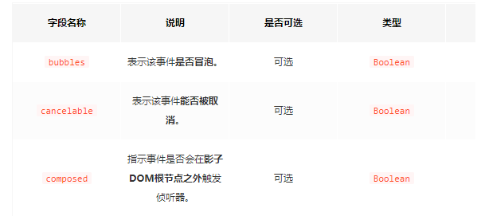

## Event

Event() 构造函数, 创建一个新的事件对象 Event。
```
let myEvent = new Event(typeArg, eventInit);
```
- typeArg  ： DOMString 类型，表示创建事件的名称；
- eventInit ：可选配置项，包括：



## CustomEvent

CustomEvent 与 Event 的主要区别是可以传递detail字段的参数

- eventInit ：可选配置项，包括：
``

## document.createEvent()
>MDN上说很多东西被废弃了，不建议使用

## 实例

- 创建一个事件
- 然后DOM去dispatchEvent这个事件
- 如果DOM有对监听这个类型的监听就会触发回调
```
// 创建事件
let myEvent = new CustomEvent("pingan", {
	detail: { name: "wangpingan" }
});

// 添加适当的事件监听器
window.addEventListener("pingan", e => {
	alert(`pingan事件触发，是 ${e.detail.name} 触发。`);
});
document.getElementById("leo2").addEventListener(
  "click", function () {
    // 派发事件
		window.dispatchEvent(myEvent);
  }
)

```