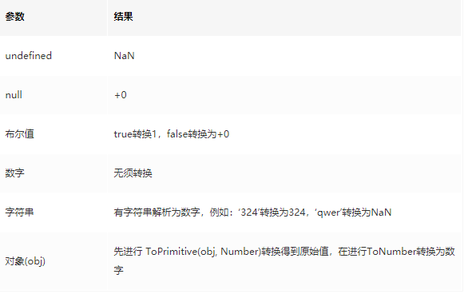
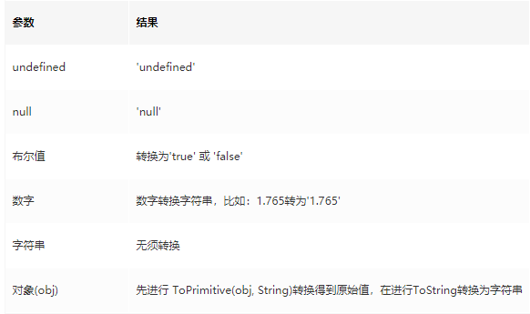
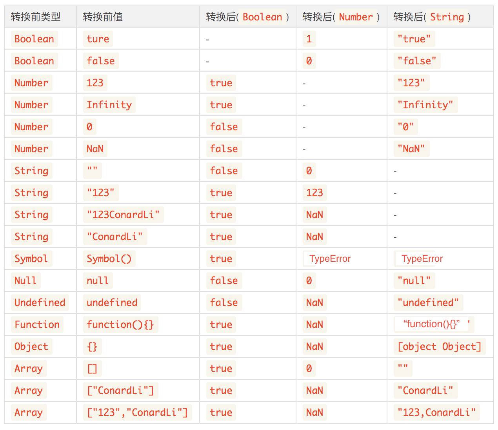
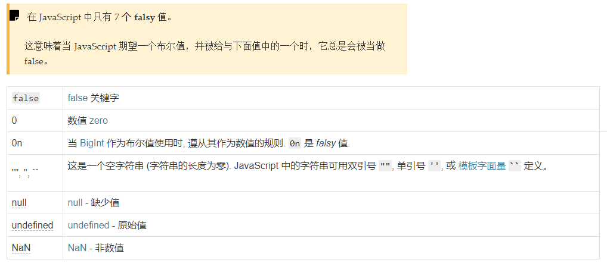
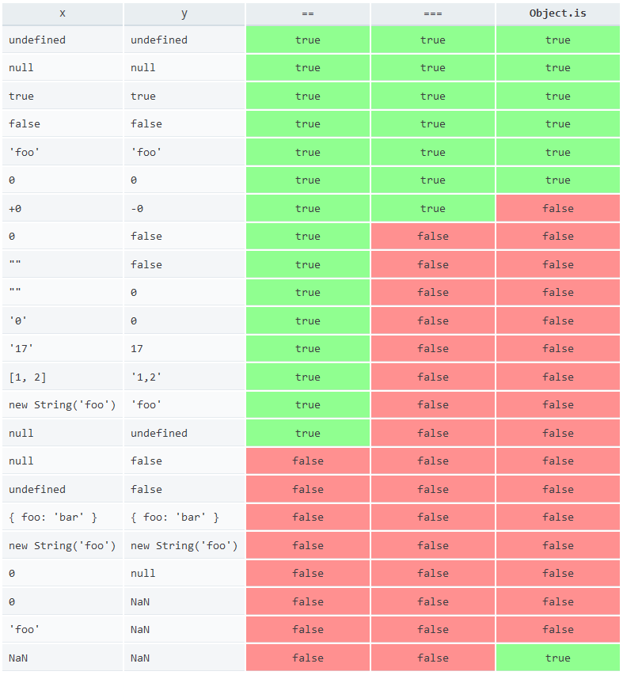

>注意：null只有和undefined隐式相等，其它任何数据类型和null对比都是false
## 隐式转换

- 将值转为原始值，ToPrimitive()。

- 将值转为数字，ToNumber()。

- 将值转为字符串，ToString()。

- 将其他类型转换为布尔类型的操作 ToBoolean().

### ToPrimitive 将引用值转换为原始值


#### 没有toPrimitive属性调用 valueOf  toString
>如果valueOf不存在或者valueOf方法返回的不是原始类型的值，就会尝试调用对象的toString方法，也就是会遵循对象的ToString规则，然后使用toString的返回值作为ToPrimitive的结果。

valueOf  toString方法返回值
```
var num = new Number('123');
num.valueOf(); // 123

var str = new String('12df');
str.valueOf(); // '12df'

var bool = new Boolean('fd');
bool.valueOf(); // true


var a = new Array();
a.valueOf() === a; // true

var b = new Object({});
b.valueOf() === b; // true


var obj = new Object({});
obj.toString(); // "[object Object]"

Math.toString(); // "[object Math]"

[1, undefined, 3].toString() // '1,,3'

[null].toString()// ''

```

- 1、在进行强转字符串类型时将优先调用toString方法，强转为数字时优先调用valueOf。
- 2、在有运算操作符的情况下，valueOf的优先级高于toString。

这两个方法一般是交由js去隐式调用，以满足不同的运算情况。

- 在数值运算里，会优先调用valueOf()，如 a + b;
- 在字符串运算里，会优先调用toString(),如alert(c).

```
// 一个没有提供 Symbol.toPrimitive 属性的对象，参与运算时的输出结果
var obj1 = {};
console.log(+obj1);     // NaN
console.log(`${obj1}`); // "[object Object]"
console.log(obj1 + ""); // "[object Object]"

```

- 第一个，+符号。可以看成是是把数据转化为数字类型，由于obj是个空对象，所以结果是NaN
- 第二个，是es6中的字符串的新语法，这里需要的结果是一个字符串，所以使用的是toString()方法，而toString()方法返回的是对象的类型。
- 第三个，这里是连接符连接obj。实际上也是需要字符串的结果，所以同理。

#### 有toPrimitive方法优先调用toPrimitive

对象的Symbol.toPrimitive属性。指向一个方法。该对象被转化为原始类型的值时，会调用这个办法，返回该对象对应的原始类型值。
Symbol.toPrimitive被调用时,会接受一个字符串参数，表示当前运算的模式，一个有三种模式。

- Number:该场合需要转成数值
- String:该场合需要转成字符串
- Default:该场合可以转成数值，也可以转成字符串。
```
// 接下面声明一个对象，手动赋予了 Symbol.toPrimitive 属性，再来查看输出结果
var obj2 = {
  [Symbol.toPrimitive](hint) {
    if (hint == "number") {
      return 10;
    }
    if (hint == "string") {
      return "hello";
    }
    return true;
  }
};
console.log(+obj2);     // 10      -- hint 参数值是 "number"
console.log(`${obj2}`); // "hello" -- hint 参数值是 "string"
console.log(obj2 + ""); // "true"  -- hint 参数值是 "default"
```

总结，一般情况下，+连接运算符传入的参数是default,而对于乘法等算数运算符传入的是number。对于String(str),${str}等情况，传入的参数是defalut。


### ToNumber 将值转换为数字



### 通过 ToString 将值转换为字符串



### TOBoolean

```
  Boolean(null) // false
  Boolean(undefined) // false
  Boolean('') // flase
  Boolean(NaN) // flase
  Boolean(0) // flase
  Boolean([]) // true
  Boolean({}) // true
  Boolean(Infinity) // true

```
### 汇总图
> 来源ConardLi



**我们可以稍微记一下,JavaScript中只有7个假值：**
>https://developer.mozilla.org/zh-CN/docs/Glossary/Falsy
falsy 值 (虚值) 是在 Boolean 上下文中认定为 false 的值。
JavaScript 在需要用到布尔类型值的上下文中使用强制类型转换(Type Conversion )将值转换为布尔值，例如条件语句和循环语句。


除了上面的这些值，其他的在转化为bool的时候都是true，有时候直接这样记要好一点

不然很可能绕晕,下面哪些值是 falsy?

```javascript
0
new Number(0)
('')
(' ')
new Boolean(false)
undefined
```

- A: `0`, `''`, `undefined`
- B: `0`, `new Number(0)`, `''`, `new Boolean(false)`, `undefined`
- C: `0`, `''`, `new Boolean(false)`, `undefined`
- D: All of them are falsy

<details><summary><b>答案</b></summary>
<p>

#### 答案: A

只有 7 种 [falsy](https://developer.mozilla.org/zh-CN/docs/Glossary/Falsy) 值:

</p>
</details>

---


## 数学算符转化

在对各种非Number类型运用数学运算符(- * /)时，会先将非Number类型转换为Number类型;

注意+是个例外，执行+操作符时：
- 1.当一侧为String类型，被识别为字符串拼接，并会优先将另一侧转换为字符串类型。
- 2.当一侧为Number类型，另一侧为原始类型，则将原始类型转换为Number类型。
- 3.当一侧为Number类型，另一侧为引用类型，将引用类型和Number类型转换成字符串后拼接。

```
1 - true // 0
1 - null //  1
1 * undefined //  NaN
2 * ['5'] //  10
123 + '123' // 123123   （规则1）
123 + null  // 123    （规则2）
123 + true // 124    （规则2）
123 + {}  // 123[object Object]    （规则3）

```


## 宽松相等（==）比较时的隐式转换规则

- NaN 和其他任何类型比较永远返回 false(包括和他自己)。
- Boolean 和其他任何类型比较，Boolean 首先被转换为 Number 类型。
- String 和 Number 比较，先将 String 转换为 Number 类型。
- ECMAScript 规范中规定 null 和 undefined 之间互相宽松相等，并且也与其自身相等，但和其他所有的值都不宽松相等
- 当原始类型和引用类型做比较时，对象类型会依照 ToPrimitive 规则转换为原始类型

```
  [] == ![] // true

  [] == 0 // true

  [2] == 2 // true

  ['0'] == false // true

  '0' == false // true

  [] == false // true

  [null] == 0 // true

  null == 0 // false

  [null] == false // true

  null == false // false

  [undefined] == false // true

  undefined == false // false

  '[object Object]' == {} // true

  '1,2,3' == [1, 2, 3] // true

```

### [] == ![]

`!的优先级高于==，![]首先会被转换为false，然后根据上面第二点，false转换成Number类型0，左侧[]按照ToPrimitive转换为'',然后因为与number比较，string要转为number->0，两侧比较相等。`

### 如何让：a == 1 && a == 2 && a == 3

重写valueOf方法
```
const a = {
   value:[3,2,1],
   valueOf: function () {return this.value.pop(); },
} 
```

## Object.js()

这个方法可以用于处理 NaN, -0 和 +0的比较
```
0 == ' ' //true
null == undefined //true
[1] == true //true
```

```
Object.is(0 , ' '); //false
Object.is(null, undefined); //false
Object.is([1], true); //false
Object.is(NaN, NaN); //true
```


