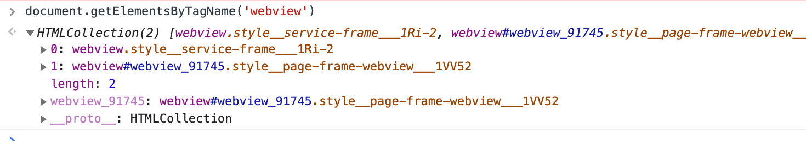

## 小程序优势

对于商家：
- 获客成本低：挂靠超级App，让超级App的用户成为自己的潜在用户。
- 用户访问流程成本低：通过扫一扫、附近的小程序、分享、App内搜索等即可直接访问。
- 更轻量触达：不必再记住网址，不必下载App，点击直达。
- 更方便：功能几乎和App一样全面，包括语音、支付、地理等。
- 用户负担更小：微信账号走天下，减轻个人负担，包括账号、会员、线上、线下。
- 更安全：安全无需自己维护，由超级App直接负责。

对于开发者：
- 快速的加载，性能高于h5（base app）
- 更强大的能力
- 原生的体验
- 易用且安全的微信数据开放
- 高效和简单地开发

## 为什么需要使用双线程

### 单线程阻塞问题

因为html文件是从上到下渲染的，如果中间插入js的话，则会中断HTML节点渲染，转而去执行js，js执行完后继续渲染节点。就是因为单线程阻塞问题才建议在下方插入script，并且配合window.onload可以拿到已经渲染完成的节点。

这种情况当然也可以通过一些手段来规避，比如async、defer等。这两个属性加上后，虽然不会阻塞DOM渲染，但是并不是根本上解决问题，而是合理地安排了资源解析而已。（整体页面的FMP基本不变）

## h5 + native SDK 的问题

### 微信SDK的js文件注入到H5中
> 微信中开发H5的话可以调用微信的JS-SDK。JS-SDK就是一套调用微信能力的工具包。微信SDK是一系列jsApi的集合，提供了微信的丰富原生能力和微信内部的方法，比如调用支付、扫一扫这样的微信功能。

在曾经开发微信公众号h5的时候我们需要手动的注入某个版本的微信SDK到自身的项目中去.

这样的话又为性能添加了一些负担，页面展示之前或多或少会有一段白屏过程，在移动端受限于设备的性能和网络速度。

这种方式的用户体验并不是很好，因为加载js，并且解析js逻辑的时候是会抢占渲染资源的，原因也就是上面刚讲过的单线程阻塞问题

### 微信 Web 资源离线存储

Web 开发者提供的基于微信内的 Web 加速方案，直接从微信本地加载 Web 资源而不需要再从服务端拉取，从而减少网页加载时间，为微信用户提供更优质的网页浏览体验。

每个公众号下所有 Web App 累计最多可缓存 5M 的资源。看看微信在手机中的占用空间，现在微信动不动总是占用十几个G的存储空间。80%都是缓存。

离线存储虽然能够解决一些问题，但对于一些复杂的页面依然会有白屏问题，例如页面加载了大量的 CSS 或者是 JavaScript 文件。除了白屏，影响 Web 体验的问题还有缺少操作的反馈，主要表现在两个方面：页面切换的生硬和点击的迟滞感。

## Native层注入到视图层

如果在我们有承接平台的时候，比如微信客户端，将微信SDK这样的资源放在客户端Native中，在加载页面的时候再进行动态的注入，由Native层注入到视图层。

这样的做法的好处很明显，首先会使包的体积变小，其次，减少了网络请求的发送。

小程序中也用到了微信SDK，当然不仅仅只有微信SDK做了这样的处理，由Native层注入到双线程中。还有底层基础库、Service等都是事先放在Native层中的，当页面进行加载的时候再进行动态的注入。

Native层除了做一些资源的动态注入，还负责着很多的事情，请求的转发，离线存储，组件渲染等等。

### JS线程的安全沙箱

### 防止获取敏感信息

javascript还可以通过操作DOM，直接获取小程序内部的一些敏感数据，比如用户的信息，商家信息等等，那么小程序将毫无安全可言。

### 禁用浏览器 API，只保留js runtime

为了解决安全管控问题，小程序阻止开发者使用一些浏览器提供的比如跳转页面、操作DOM、动态执行脚本的开放性接口。如果这些东西一个一个地去禁用，那么势必会进入一个糟糕的循环，因为javascript实在是太灵活了，浏览器的接口也太丰富了，很容易就遗漏一些危险的接口，而且就算是禁用掉了所有感觉到危险的接口，也势必防不住浏览器内核的下次更新。指不定又会出现一些漏洞。

### ServiceWorker、WebWorker不适合

因此，要彻底解决这个问题，必须提供一个沙箱环境来运行开发者的JavaScript 代码。这个沙箱环境不能有任何浏览器相关接口，只提供纯JavaScript 的解释执行环境，那么像HTML5中的ServiceWorker、WebWorker特性就符合这样的条件，这两者都是启用另一线程来执行 javaScript。但是考虑到小程序是一个多 webView 的架构，每一个小程序页面都是不同的webView 渲染后显示的，在这个架构下不好去用某个webView中的ServiceWorker去管理所有的小程序页面。

### 客户端环境自带JS引擎

得益于客户端系统有javaScript 的解释引擎（在iOS下使用内置的 javaScriptCore框架，在安卓则是用腾讯x5内核提供的JsCore环境），可以创建一个单独的线程去执行 javaScript，在这个环境下执行的都是有关小程序业务逻辑的代码，也就是我们前面一直提到的逻辑层。而界面渲染相关的任务全都在webview线程里执行，通过逻辑层代码去控制渲染哪些界面，那么这一层当然就是所谓的渲染层。这就是小程序双线程模型的由来。

**既然Android可以内置js引擎 为啥IOS不内置，这样不就没有跨端兼容性了吗 猜测是苹果的生态不允许，在ios必须使用苹果提供的**

### 渲染层webview

#### webview是什么

可以想象webview是一个嵌入式的浏览器，是嵌入在原生应用中的。webview 用来展示网页的 view 组件，该组件是你运行自己的浏览器或者在你的线程中展示线上内容的基础。使用 webkit 渲染引擎来展示，并且支持前进后退、浏览历史、放大缩小、等更多功能。简单来说 webview 是手机中内置了一款高性能 webkit 内核浏览器，在 SDK 中封装的一个组件。不过没有提供地址栏和导航栏，只是单纯的展示一个网页界面。

#### 多个webview

由于渲染层与逻辑层分开，一个小程序有多个界面，所以渲染层对应存在多个webview。这两个线程之间由Native层进行统一处理。无论是线程之间的通讯、数据的传递、网络请求都由Native层做转发。

为什么要做多个webview呢，为了更加接近原生应用APP的用户体验。多个webview可以理解为多页面应用，有别于单页面应用SPA，SPA渲染页面是通过路由识别随后动态将页面挂载到root节点中去，如果单页面应用打开一个新的页面，需要先卸载掉当前页面结构，并且重新渲染。很显然原生APP并不是这个样子，比较明显的特征为从页面右侧向左划入一个新的页面，并且我们可以同时看到两个页面

### 小程序双线程架构图解

大多数小程序通过更加定制化的 JSBridge，赋予了 Web 更大的权限，并使用双 WebView 双线程的模式隔离了 JS 逻辑 与 UI 渲染，形成了特殊的开发模式，加强了 H5 与 Native 混合程度，属于第一种方案的优化版本；

- 优势: 用户体验好于常规 Webview 方案，且通常依托的平台也能提供更为友好的开发调试体验以及功能；
- 劣势: 需要依托于特定的平台的规范限定

小程序不同的架构：

- 在 iOS 上，小程序的 javascript 代码是运行在 JavaScriptCore 中，是由 WKWebView 来渲染的，环境有 iOS8、iOS9、iOS10
- 在 Android 上，小程序的 javascript 代码是通过 X5 JSCore来解析，是由 X5 基于 Mobile Chrome 37 内核来渲染的在 
- 开发工具上（如微信）， 小程序的 javascript 代码是运行在 nwjs 中，是由 Chrome Webview 来渲染的

### 微信小程序架构

微信小程序的框架包含两部分View视图层(可能存在多个)、App Service逻辑层(一个)，View层用来渲染页面结构

- AppService层用来逻辑处理、数据请求、接口调用，它们在两个线程里运行。
- 视图层使用WebView渲染，逻辑层使用JSCore运行。
- 视图层和逻辑层通过系统层的WeixinJsBridage进行通信，逻辑层把数据变化通知到视图层，触发视图层页面更新，视图层把触发的事件通知到逻辑层进行业务处理。

## IDE的Webview
> 选择IDE的调试，可以调试IDE容器

可以发现ELement面板里会有几个Webview，视图层的webview，业务逻辑层webview。 如果在打开一个页面，就会多了一个视图层webview:pages/xxx/xxx，可以见得，页面得载入是通过创建并插入webview来实现的。 

如果打开页面过多会有严重的内存问题。所以在这方面，微信小程序做了限制，在微信小程序中打开的页面不能超过10个，达到10个页面后，就不能再打开新的页面。这时候有可能会卡死，不知道的话会以为是bug。

## pageframe.html

### pageFrame记录编译信息
进入page-frame的webview后可以发现这里没有rpx，这里就是单纯的css，css选择器，css的px。显然是经过编译的。

WXML 文件描述页面的结构，WXSS 文件描述页面的样式，WXML文件会被编译为虚拟DOM，WXSS会被编译为js。那么每个独立的页面都会经过这样的编译，如何快速的生成webview，或者说如何快速的打开一个页面。会成为一个问题。

首先可以看到通过script标签引入一些js代码，这些会提供小程序的基础能力，这些内置好的基础模块，配合webview进行渲染。文件中包含了所有页面的编译路径，这个编译路径有什么作用呢，编译WXML后生成的`$gwx`函数需要的参数就是这个路径。此文件中就进行了保存。

内部记录的属性有：

- decodePathName
- .json配置
- .wxml编译后的`$gwx`函数。`$gwx`函数会在virtualDOM重点讲解。
- .wxss编译后的eval函数。

这里就可以想象出来，如果小程序需要打开某个页面的时候，只需要从这里提取出页面特有的这几个属性，配合pageFrame模板就可以快速生成一个新的webview。

### 如何快速启动

pageFrame快速启动技术，就像一个工厂一样，可以快速生成webview的基础格式。在这其中pageFrame就是业务webview的模板。

在小程序启动前，微信会提前准备好一个页面层级用于展示小程序的首页。除此以外，每当一个页面层级被用于渲染页面，微信都会提前开始准备一个新的页面层级，使得每次调用wx.navigateTo都能够尽快展示一个新的页面。 
页面层级的准备工作分为三个阶段。
- 第一阶段是启动一个WebView，在iOS和Android系统上，操作系统启动WebView都需要一小段时间。
- 第二阶段是在WebView中初始化基础库，此时还会进行一些基础库内部优化，以提升页面渲染性能。
- 第三阶段是注入小程序WXML结构和WXSS样式，使小程序能在接收到页面初始数据之后马上开始渲染页面（这一阶段无法在小程序启动前执行）

初始时webview的src会被指定为空页面地址，空页面地址webview加载完毕后执行事件中的reload方法，即设置webview的src为pageframe地址

那么，既然每个视图层页面由pageframe模板生成，那么小程序每个页面独有的页面内容如dom和样式等如何生成呢，这主要是利用nw.js的executeScript方法来执行一段js脚本来注入只与当前页面相关的代码，包括当前页面的配置，注入当前页的css以及当前页面的virtual dom的生成.

每次小程序进入除了当前页面,Native预先额外加载一个WebView当打开指定页面时，用默认数据直接渲染，请求数据回来时局部更新，返回显示历史View
退出小程序，View状态不销毁