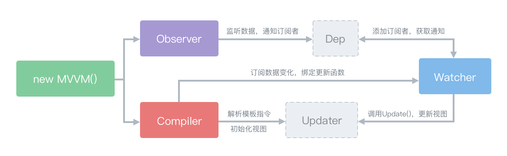

## MVVM

MVVM是Model-View-ViewModel的缩写。mvvm是一种设计思想。Model 层代表数据模型，也可以在Model中定义数据修改和操作的业务逻辑；View 代表UI 组件，它负责将数据模型转化成UI 展现出来，ViewModel 是一个同步View 和 Model的对象。

在MVVM架构下，View 和 Model 之间并没有直接的联系，而是通过ViewModel进行交互，Model 和 ViewModel 之间的交互是双向的， 因此View 数据的变化会同步到Model中，而Model 数据的变化也会立即反应到View 上。

## 如何实现一个MVVM框架

>我们可以借鉴Vue中双向绑定的思想来实现

#### 首先可以使用Observe（Object.defineProperty实现）来递归深度劫持我们的数据Data

#### 然后在Compile编译阶段，扫描html中的{{data.key}}，替换成真是的数据

#### data随时都可以变化，所以我们需要收集所有在括号内所用的属性

#### 如何收集我们需要用一个发布订阅的设计模式来做，每当扫描替换的时候用Watcher进行监听，Watcher(key)就相当于一个订阅者

#### Watcher访问Data即可触发劫持的get函数，get函数里将这些订阅者通通推入一个交Sub中心管理者的地方，来统一收集和发布订阅

#### 最后如果Data改变会触发set然后内部调用Sub中函数发布所有订阅update即可（感觉可以加上key来发布指定的订阅，不用全部刷新）

####  由于每个订阅的函数都把要操作的节点的堆地址缓存了起来，vue好像就不用想react那样diff节点，而是类似于依赖追踪的感觉，直接能找到需要更新的节点

## 实例来源
>由于不太了解Vue，这里的代码参考这位大佬的例子，不求甚解，只分析了流程 用`//*`标注了断点调试值得注意的地方
- https://juejin.im/post/5abdd6f6f265da23793c4458#heading-0