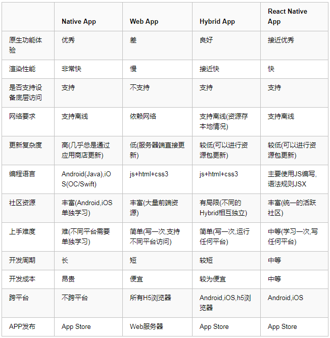
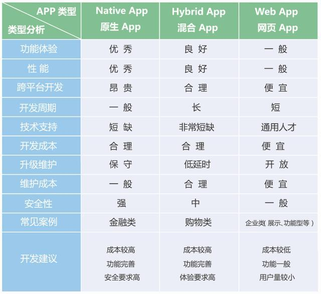
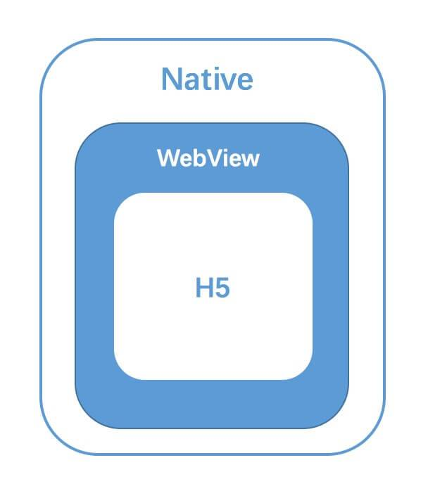

## App 开发三大主流框架

- WebApp:就是在浏览器中运行的 web 应用
- NativeApp:用 android 和 Object-C 等原生语言开发的应用
- HybridApp:就是外面是原生的壳，里面是 webapp 应用，兼具 2 者的优势
  
  综合评价
  

## Hybrid APP 是什么

Hybrid App（混合模式移动应用）是指介于 web-app、native-app 这两者之间的 app，兼具“Native App 良好用户交互体验的优势”和“Web App 跨平台开发的优势”。

hybrid app 允许开发者仅使用一套网页语言代码（HTML5+CSS+JavaScript），即可开发能够在不同平台上部署的类原生应用 。由于 hybrid app 结合了 native app 良好用户交互体验和 web app 跨平台开发的优势，能够显著节省移动应用开发的时间和成本，hybrid app 得到越来越多公司的青睐。

## 交互原理 JSBridge

Hybrid 技术 中最核心的点就是 Native 端 与 H5 端 之间的 双向通讯层，其实这里也可以理解为我们需要一套 跨语言通讯方案，便是我们常听到的 JSBridge。

整套方案需要 Web 与 Native 两部分共同来完成:

- Native: 负责实现 URL 拦截与解析、环境信息的注入、拓展功能的映射、版本更新等功能；
- JavaScirpt: 负责实现功能协议的拼装、协议的发送、参数的传递、回调等一系列基础功能。

大概过程：JavaScript 是运行在一个单独的 JS Context 中（例如，WebView 的 Webkit 引擎、JSCore）。由于这些 Context 与原生运行环境的天然隔离，我们可以将这种情况与 RPC（Remote Procedure Call，远程过程调用）通信进行类比，将 Native 与 JavaScript 的每次互相调用看做一次 RPC 调用。
在 JSBridge 的设计中，可以把前端看做 RPC 的客户端，把 Native 端看做 RPC 的服务器端，从而 JSBridge 要实现的主要逻辑就出现了：通信调用（Native 与 JS 通信） 和 句柄解析调用。（如果你是个前端，而且并不熟悉 RPC 的话，你也可以把这个流程类比成 JSONP 的流程）

## Hybrid 技术原理

Native 端 与 H5 端 之间的双向通讯层，其实这里也可以理解为我们需要一套跨语言通讯方案，来完成 Native(Java/Objective-c/...) 与 JavaScript 的通讯。这个方案就是我们所说的 JSBridge，而实现的关键便是作为容器的 WebView，一切的原理都是基于 WebView 的机制。

Webview 是 Native App 中内置的一款基于 Webkit 内核 的浏览器，主要由两部分组成:

- WebCore 排版引擎；
- JSCore 解析引擎；

在原生开发 SDK 中 Webview 被封装成了一个组件，用于作为 Web 页面 的容器。因此，作为宿主的客户端中拥有更高的权限，可以对 Webview 中的 Web 页面 进行配置和开发。

## Hybrid APP 实现方案

### Webview UI:

通过 JSBridge 完成 H5 与 Native 的双向通讯，并 基于 Webview 进行页面的渲染；

- 优势: 简单易用，架构门槛/成本较低，适用性与灵活性极强；
- 劣势: Webview 性能局限，在复杂页面中，表现远不如原生页面；

### Native UI:

通过 JSBridge 赋予 H5 原生能力，并进一步将 JS 生成的虚拟节点树(Virtual DOM)传递至 Native 层，并使用 原生系统渲染。

- 优势: 用户体验基本接近原生，且能发挥 Web 技术 开发灵活与易更新的特性；
- 劣势: 上手/改造门槛较高，最好需要掌握一定程度的客户端技术。相比于常规 Web 开发，需要更高的开发调试、问题排查成本；

### 小程序

大多数小程序通过更加定制化的 JSBridge，赋予了 Web 更大的权限，并使用双 WebView 双线程的模式隔离了 JS 逻辑 与 UI 渲染，形成了特殊的开发模式，加强了 H5 与 Native 混合程度，属于第一种方案的优化版本；

- 优势: 用户体验好于常规 Webview 方案，且通常依托的平台也能提供更为友好的开发调试体验以及功能；
- 劣势: 需要依托于特定的平台的规范限定

小程序不同的架构：

- 在 iOS 上，小程序的 javascript 代码是运行在 JavaScriptCore 中，是由 WKWebView 来渲染的，环境有 iOS8、iOS9、iOS10
- 在 Android 上，小程序的 javascript 代码是通过 X5 JSCore来解析，是由 X5 基于 Mobile Chrome 37 内核来渲染的在 
- 开发工具上（如微信）， 小程序的 javascript 代码是运行在 nwjs 中，是由 Chrome Webview 来渲染的

### 微信小程序架构

微信小程序的框架包含两部分View视图层(可能存在多个)、App Service逻辑层(一个)，View层用来渲染页面结构

- AppService层用来逻辑处理、数据请求、接口调用，它们在两个线程里运行。
- 视图层使用WebView渲染，逻辑层使用JSCore运行。
- 视图层和逻辑层通过系统层的WeixinJsBridage进行通信，逻辑层把数据变化通知到视图层，触发视图层页面更新，视图层把触发的事件通知到逻辑层进行业务处理。

### 小程序特有的双线程设计
H5 下我们所有资源通常都会打到一个 bundle.js 文件里（不考虑分包加载），而小程序编译后的结果会有两个bundle，index.js封装的是小程序项目的 view 层，以及 index.worker.js 封装的是项目的业务逻辑，在运行时，会有两条线程来分别处理这两个bundle，一个是主渲染线程，它负责加载并渲染 index.js 里的内容，另外一个是 Service Worker线 程，它负责执行 index.worker.js 里封装的业务逻辑，这里面会有很多对底层api调用。

## 参考
- Hybrid:https://juejin.im/post/5cc26dfef265da037b611738#heading-2
- Hybrid App 技术解析 -- 原理篇:https://juejin.im/post/5b4ff3bee51d4519721b9986
- Hybrid 实现原理 https://juejin.im/post/5abca877f265da238155b6bc
- 常见问题 ：https://juejin.im/post/5d293da1e51d455d88219f83#heading-34
- 微信小程序两万字攻略：https://juejin.im/post/5b8fd1416fb9a05cf3710690
- 微信小程序运行流程：https://juejin.im/post/5afd136551882542682e6ad7
- [阿里前端攻城狮们写了一份前端面试题答案](https://juejin.im/post/5e7426d15188254967069c00)