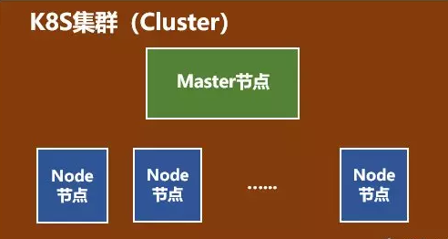
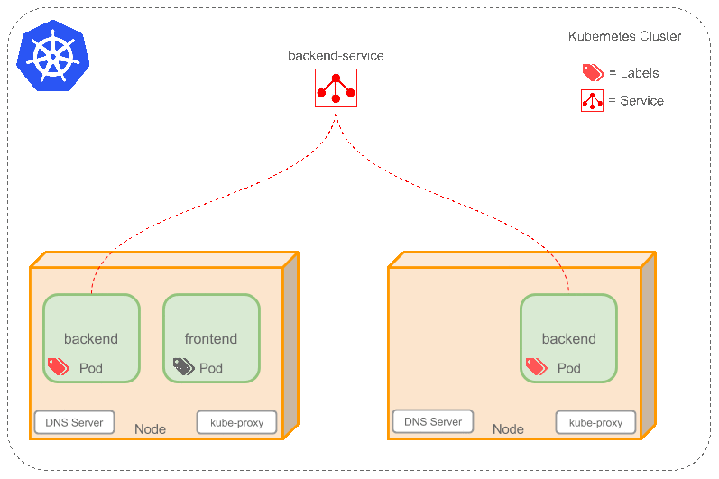

## Kubernetes概述编辑
>百度百科

Kubernetes是Google开源的一个容器编排引擎，它支持自动化部署、大规模可伸缩、应用容器化管理。在生产环境中部署一个应用程序时，通常要部署该应用的多个实例以便对应用请求进行负载均衡。
在Kubernetes中，我们可以创建多个容器，每个容器里面运行一个应用实例，然后通过内置的负载均衡策略，实现对这一组应用实例的管理、发现、访问，而这些细节都不需要运维人员去进行复杂的手工配置和处理。

## Docker 的不足

在小规模场景下使用 Docker 可以一键部署应用确实很方便，达到了一键部署的目的，但是当出现需要在几百台主机上进行多副本部署，需要管理这么多主机的运行状态以及服务的故障时需要在其他主机重启服务，想象一下就知道手动的方式不是一种可取的方案，这时候就需要利用 Kubernetes 这种更高维度的编排工具来管理了

## Kubernetes 来弥补

Kubernetes 简称 K8S， 简单说 K8S 就是抽象了硬件资源，将 N 台物理机或云主机抽象成一个资源池，容器的调度交给 K8S 就像亲妈一样照顾我们的容器，CPU 不够用就调度到一台足够使用的机器上，内存不满足要求就会寻找一台有足够内存的机器在上面创建对应的容器，服务因为某些原因挂了， K8S 还会帮我们自动迁移重启，  简直无微不至，至尊享受。我们作为开发者只关心自己的代码，应用的健康由 K8S 保证。

## K8S 调度

K8S 调度的基本单位为 pod， 一个 pod 表示一个或多个容器。引用一本书里所说

之所以没有使用容器作为调度单位，是因为单一的容器没有构成服务的概念；例如 Web 应用做了前后端分例，需要一个 NodeJS 与 Tomcat 才能组成一个完整的服务，这样就需要部署两个容器来实现一个完整的服务，虽然也可以把他们都放到一个容器里，但这显然违反了一个容器即一个进程的核心思想

K8S 与传统 IaaS 系统的不同:
IaaS 就是 Infrastructure as a service， 所谓基础设施即服务，开发者想要上线一个新应用需要申请主机，ip， 域名等一系列资源，然后登录主机自行搭建所需环境，部署应用上线，这样不仅不利于大规模操作，而且还增加了出错的可能，运维或开发这常常自己写脚本自动化完成，遇到一些差异再手动修改脚本，非常痛苦。
K8S 则是将基础设施可编程化，由原来的人工申请改为一个清单文件自动创建，开发者只需要提交一份文件，K8S 将会自动为你分配创建所需的资源。对这些设施的 CRUD 都可以通过程序的方式自动化操作。

## K8S集群（Cluster）

集群主要包括两个部分：

- 一个Master节点（主节点）

- 一群Node节点（计算节点）

常见的名词：
- Container（容器）
- Label(label)（标签）
- Replication Controller（复制控制器）
- Service（enter image description here）（服务）
- Node（节点）
- Kubernetes Master（Kubernetes主节点）

- Kubelet，主要负责监视指派到它所在Node上的Pod，包括创建、修改、监控、删除等。

- Kube-proxy，主要负责为Pod对象提供代理。

- Fluentd，主要负责日志收集、存储与查询。

Pod是Kubernetes最基本的操作单元。一个Pod代表着集群中运行的一个进程，它内部封装了一个或多个紧密相关的容器。除了Pod之外，K8S还有一个Service的概念，一个Service可以看作一组提供相同服务的Pod的对外访问接口。同一个Pod里的容器共享同一个网络命名空间，可以使用localhost互相通信。Pod是短暂的，不是持续性实体。

Service
如果Pods是短暂的，那么重启时IP地址可能会改变，怎么才能从前端容器正确可靠地指向后台容器呢？

Service是定义一系列Pod以及访问这些Pod的策略的一层抽象。Service通过Label找到Pod组。因为Service是抽象的，所以在图表里通常看不到它们的存在，这也就让这一概念更难以理解。

## Kubernetes 特点编辑
可移植: 支持公有云，私有云，混合云，多重云（multi-cloud）
可扩展: 模块化，插件化，可挂载，可组合
自动化: 自动部署，自动重启，自动复制，自动伸缩/扩展

## 参考 

- 前端领域的 K8S - https://juejin.im/post/5dddd15b6fb9a071576dbd7a#heading-0
- https://www.kubernetes.org.cn/docs
- http://dockone.io/article/932
- https://my.oschina.net/jamesview/blog/2994112