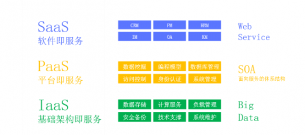
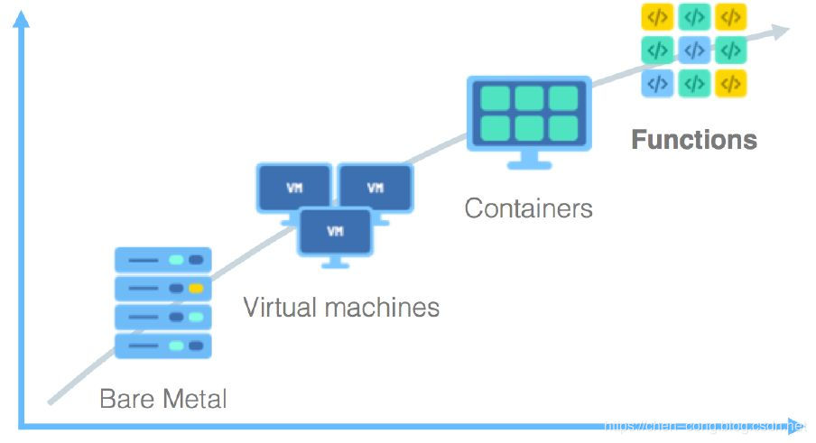

## Serverless 简介
根据 CNCF 的定义，Serverless 是指构建和运行不需要服务器管理的应用程序的概念。

Serverless 架构即“无服务器”架构，它是一种全新的架构方式，是云计算时代一种革命性的架构模式。
Serverless 不是具体的一个编程框架、类库或者工具。简单来说，Serverless 是一种软件系统架构思想和方法，它的核心思想是用户无须关注支撑应用服务运行的底层主机。这种架构的思想和方法将对未来软件应用的设计、开发和运营产生深远的影响。

## “无服务器”?

云计算的发展从IaaS，PaaS，SaaS，到最新的BaaS，FasS，在这个趋势中serverless(去服务器化）越来越明显。

所谓“无服务器”，并不是说基于 Serverless 架构的软件应用不需要服务器就可以运行，其指的是用户无须关心软件应用运行涉及的底层服务器的状态、资源（比如 CPU、内存、磁盘及网络）及数量。软件应用正常运行所需要的计算资源由底层的云计算平台动态提供。

CDN: 相信大家都使用过 CDN，我们开发完成之后，直接将静态文件部署到 CDN 上，通过 CDN 进行内容分发、网络加速，在这个过程中，前端不需要关心 CDN 有多少个节点、如何做负载均衡，也不需要知道 CDN 的 QPS 是多少。所以从这个角度来说，CDN 是一种 serverless 的实现。

## 名词解释

### IAAS：
IaaS(Infrastructure as a Service) 基础设施即服务，__服务商提供底层/物理层基础设施资源（服务器，数据中心，环境控制，电源，服务器机房），用户需要通过IaaS提供的服务平台购买虚拟资源，选择操作系统，安装软件，部署程序，监控应用。
目前知名的IaaS平台有AWS，Azure，Google Cloud Plantform，腾讯云服务，阿里云以及开源的OpenStack等。
### PAAS：
PaaS(Platform as a Service) 平台即服务，服务商提供基础设施底层服务，提供操作系统（Windows，Linux）、数据库服务器、Web服务器、负载均衡器和其他中间件，相对于IaaS客户仅仅需要自己控制上层的应用程序部署与应用托管的环境。
目前知名的PaaS平台有 Amazon Elastic Beanstalk，Azure，Google App Engine，腾讯容器服务，VMware Cloud Foundry等。
### BAAS：
BaaS(Backend as a Service) 后端即服务，服务商为客户(开发者)提供整合云后端的服务，如提供文件存储、数据存储、推送服务、身份验证服务等功能，以帮助开发者快速开发应用。
### FAAS：
FaaS(Function as a Service) 函数即服务，服务商提供一个平台，允许客户开发、运行和管理应用程序功能，而无需构建和维护基础架构。 按照此模型构建应用程序是实现“无服务器”体系结构的一种方式，通常在构建微服务应用程序时使用。
### SaaS
Software as a Service（软件即服务）
SaaS处于最上层，服务商提供基于软件的解决方案，满足客户最终需求；如OA、CRM、MIS、ERP、HRM、CM、Office 365、iCloud、G Suite等应用，客户不需考虑任何形式的专业技术知识，获得完整的软件包，使他们的日常工作和生活变得更轻松。

## 架构 演进

随着软件的发展和容器技术的兴起，计算环境由 VM 发展到更小粒度的容器，在容器中可以运行不同的软件服务，PaaS（Platform-as-a-Service） 和 CaaS（Container-as-a-Service） 也开始映入眼帘。用户使用平台基础软件如 Database、消息等开发自己的应用，使用容器镜像构建和部署应用，最后托管给平台。此时基础设施的运维更加下沉，开发者只需关注基础软件和容器。

继续向前发展，应用的运行演变为更细粒度函数的运行，用户开发特定业务的处理函数，托管给函数平台，按需使用相关的后端服务，通过特定条件的触发完成开发者业务逻辑函数的计算。用户无需为应用持续付费，只需支付函数运行时产生的资源消耗费用，而这，就是 Serverless 服务的模型。

FAAS（函数即服务） + BAAS（后台即服务） 可以称为一个完整的 Serverless 的实现。

### FAAS具体步骤

- 开发者编写函数代码，可以在线编辑或者本地上传，完成后，FaaS 平台为我们部署应用，创建函数服务
- 客户端通过设置的触发器，通知函数服务
- 若存在函数实例，则直接在该执行环境中调用函数；没有，则先经过冷启动（调度实例、下载代码、启动实例、启动运行时），再执行函数
- 函数根据用户请求量动态扩容响应请求，将内容返回给用户。函数执行完后，若一段时间内无事件触发，函数实例就会被销毁，FaaS 应用快速缩容到 0

## Serverless 的主要特点

- 事件驱动：函数在 FaaS 平台中，需要通过一系列的事件来驱动函数执行。
- 无状态：因为每次函数执行，可能使用的都是不同的容器，无法进行内存或数据共享。如果要- 共享数据，则只能通过第三方服务，比如 Redis 等。
- 无运维：使用 Serverless 我们不需要关心服务器，不需要关心运维。这也是 Serverless 思想的核心。
- 低成本：使用 Serverless 成本很低，因为我们只需要为每次函数的运行付费。函数不运行，则不花钱，也不会浪费服务器资源

## 具体优缺点

Serverless 的优势
- 降低启动成本

  - 减少运营成本
  - 降低开发成本
- 实现快速上线
  - 更快的部署流水线
  - 更快的开发速度
- 系统安全性更高
- 适应微服务架构
- 自动扩展能力

Serverless 的缺点

- 不适合有状态的服务
- 不适合长时间运行应用
- 完全依赖于第三方服务
- 冷启动时间较长
- 缺乏调试和开发工具

Serverless 的适用场景

- 发送通知
- WebHook
- 轻量级 API
- 物联网
- 数据统计分析
- Trigger 及定时任务
- 精益创业
- Chat 机器人

## Serverless SSR 技术内幕

- https://zhuanlan.zhihu.com/p/92112490

## 资料
- https://juejin.im/post/5d1c9380f265da1bc94f098e
- https://juejin.im/post/5d42945ff265da03a715b2f0
- https://www.jianshu.com/p/92632d6c2269
- https://juejin.im/post/5cdc3dc2e51d453b6c1d9d3a
- https://juejin.im/post/5d1c9380f265da1bc94f098e