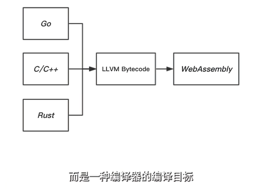
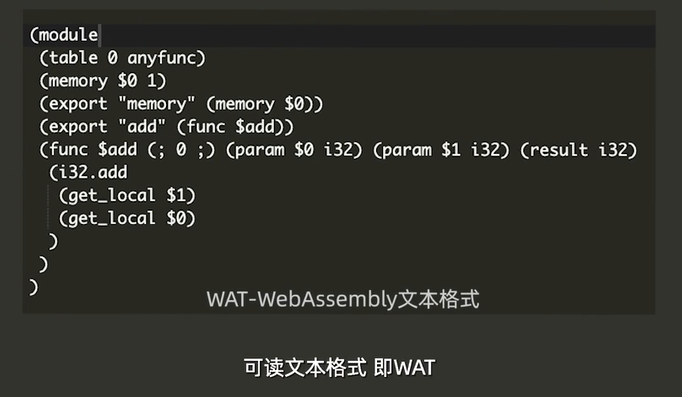
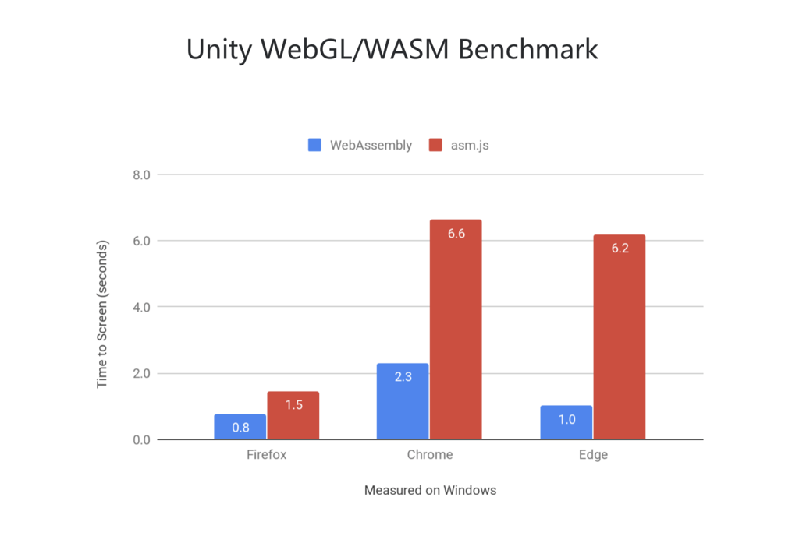
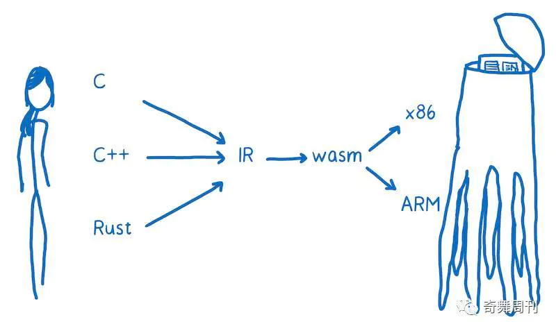

## [V8引擎如何执行JS](V8引擎如何执行JS.md)

## JIT（Just-in-time）技术-即时编译

JIT（Just-in-time）技术，它综合了“解释”与“编译”的优点，它的原理实际上就是在“解释”运行的同时进行跟踪，如果某一段代码执行了多次，就会对这一段代码进行编译优化，这样，如果后续再运行到这一段代码，则不用再解释了。
JIT 似乎是一个好东西，但是，对于 JavaScript 这种动态数据类型的语言来说，要实现一个完美的 JIT 非常难。为什么呢？因为 JavaScript 中的很多东西都是在运行的时候才能确定的。 大部分时间，JIT 编译器其实是在猜测 Javascript 中的类型，如果猜错了，JIT 编译器只能推倒重来。JIT 带来的性能提升，有时候还没有这个重编的开销大。

事实上，大部分时间 JIT 都不会生成优化代码，有字节码的，直接字节码，没有字节码的，粗粗编译下就结了，因为 JIT 自己也需要时间，除非是一个函数被使用过很多遍，否则不会被编译成机器码，因为编译花的时间可能比直接跑字节码还多。

虽说 JavaScript 自身的“特性”为 JIT 的实现带来了一些困难，但是不得不说 JIT 还是为 JavaScript 带来了非常可观的性能提升。

## WebAssembly
>https://juejin.im/post/5b76862b51882533380543d4

为了能让代码跑得更快，WebAssembly 出现了（并且现在主流浏览器也都开始支持了），它能够允许你预先使用“编译”的方法将代码编译好后，直接放在浏览器中运行，这一步就做得比较彻底了，不再需要 JIT 来动态得进行优化了，所有优化都可以在编译的时候直接确定。


WebAssembly 或者 wasm 是一个可移植、体积小、加载快并且兼容 Web 的全新格式，是一种新的字节码格式（格式是用于对字节码进行格式验证）。它的缩写是".wasm"， .wasm 为文件名后缀，是一种新的底层安全的二进制语法。它被定义为“精简、加载时间短的格式和执行模型”，并且被设计为Web 多编程语言目标文件格式。


这种格式非常利于V8引擎中的 Liftoff （基线编译器）和TurboFan编译器的解析和执行。

 Liftoff 旨在通过尽可能快地生成代码来减少基于 WebAssembly 的应用的启动时间。Liftoff 避免了构造 IR 的时间和内存开销，并通过 WebAssembly 函数的字节码一次性生成机器代码。

## 支持多语言

WASM 让你在其中使用除 JavaScript 的语言以外的语言（比如 C, C++, Rust 及其它）来编写应用程序，然后编译成（提早） WebAssembly。

也就说WebAssembly其实不是一门编程语言，是编译器对不同语言的一种编译目标



## 中间代码（Intermediate representation，IR）

世界上的机器太多了，它们都说着不同的语言（架构不同），所以很多情况下都是为各种不同的机器架构专门生成对应的机器代码。但是要为各种机器都生成的话，太复杂了，每种语言都要为每种架构编写一个编译器。为了简化这个过程，就有了“中间代码（Intermediate representation，IR）”，只要将所有代码都翻译成 IR，再由 IR 来统一应对各种机器架构。

实际上，WebAssembly 和 IR 差不多，就是用于充当各种机器架构翻译官的角色。WebAssembly 并不是直接的物理机器语言，而是抽象出来的一种虚拟的机器语言。从 WebAssembly 到机器语言虽说也需要一个“翻译”过程，但是在这里的“翻译”就没有太多的套路了，属于机器语言到机器语言的翻译，所以速度上已经非常接近纯机器语言了。

WebAssembly 是一种“虚拟机器语言”，所以它也有对应的“汇编语言”版本，也就是 *.wat 文件。

## WebAssembly的 wat文件

由于字节码对宿主环境的编译器友好，但对于编程开发人员却无法分析解读，所以提供的一种可读的文本格式


## Java虚拟机 与 WebAssembly

虚拟机是一种抽象化的计算机，通过在实际的计算机上仿真模拟各种计算机功能来实现的。Java虚拟机有自己完善的硬体架构，如处理器、堆栈、寄存器等，还具有相应的指令系统。Java虚拟机屏蔽了与具体操作系统平台相关的信息，使得Java程序只需生成在Java虚拟机上运行的目标代码（字节码），就可以在多种平台上不加修改地运行。

WebAssembly既然是字节码也需要一个虚拟机来执行，但WebAssembly是一种虚拟机器语言，它并不直接依赖于虚拟机的体系类型，而是需要被对应的宿主上实现的具体虚拟机程序来解析和执行。比如Chrome内部的V8引擎就提供了Liftoff来快速解析执行WebAssembly，V8引擎根据WebAssembly的规范来分析字节码的实际组成然后转化成宿主对应平台的机器码，比如linux，window。

## 编译


### AOT(预编译)

必须是强类型语言，编译在执行之前，编译直接生成CPU能够执行的二进制文件，执行时CPU不需要做任何编译操作，直接执行，性能最佳。

### JIT(动态编译)

Google推出了自家的JavaScript引擎V8，试图使用JIT技术提升JavaScript的执行速度，并且它真的做到了。

执行时根据上下文生成二进制汇编代码，灌入CPU执行。JIT执行时，可以根据代码编译进行优化，代码运行时，不需要每次都翻译成二进制汇编代码，V8就是这样优化JavaScript性能的。

得益于 JIT（Just-in-time）技术，JavaScript 的运行速度比原来快了 10 倍，这也是 JavaScript 被运用得越来越广泛的原因之一。

### Mozilla：asm.js

和TypeScript比较相似的是，asm.js同样也是强类型的JavaScript，但是他的语法则是JavaScript的子集，是为了JIT性能优化而专门打造的。试图利用标注的方法，加上变量类型。然后有一个能够识别这些符号的JS引擎，你就可以不用猜类型了.

asm.js强制静态类型，举个例子。
```
function asmJs() {
    'use asm';
    
    let myInt = 0 | 0; // myInt:int
    let myDouble = +1.1;
}

```
因为像0 | 0这样的，代表这是一个Int的数据，而+1.1则代表这是一个Double的数据。可以看到，asm.js使用了按位或0的操作，来声明x为整形。从而确保JIT在执行过程中尽快生成相应的二进制代码，不用再去根据上下文判断变量类型。

但是无论asm.js对静态类型的问题做的再好，它始终逃不过要经过Parser(解析构建AST)，要经过ByteCode Compiler（生成字节码），而这两步是JavaScript代码在引擎执行过程当中消耗时间最多的两步。而WebAssembly不用经过这两步。这就是WebAssembly比asm.js更快的原因。


### asm.js To WebAssembly(AOT)

自从Mozilla提出了asm.js，Google、MicroSoft、Apple都觉得asm.js的思路不错，于是联合起来，一同共建WebAssembly生态。

同asm.js不同的是，WebAssembly是一份字节码标准，以字节码的形式依赖虚拟机在浏览器中运行。

为了能让代码跑得更快，WebAssembly 出现了（并且现在主流浏览器也都开始支持了），它能够允许你预先使用“编译”的方法将代码编译好后，直接放在浏览器中运行，这一步就做得比较彻底了，不再需要 JIT 来动态得进行优化了，所有优化都可以在编译的时候直接确定。



### WebAssembly并不是Assembly（汇编）

可以依赖Emscripten等编译器将C++/Golang/Rust/Kotlin等强类型语言编译成为WebAssembly字节码（.wasm文件）。所以WebAssembly并不是Assembly（汇编），它只是看起来像汇编而已，只是种新约定的字节码，也是需要解释器运行的。这种解释器肯定比 JS 解释器快得多，但自然也达不到真正的原生机器码水平。一份典型的.wasm文件如下所示：

```wasm
00000000: 0061 736d 0100 0000 0108 0260 017f 0060  .asm.......`...`
00000010: 0000 0215 0203 656e 7603 6d65 6d02 0001  ......env.mem...
00000020: 026a 7303 6c6f 6700 0003 0201 0107 0b01  .js.log.........
00000030: 0765 7861 6d70 6c65 0001 0a23 0121 0041  .example...#.!.A
00000040: 0042 c8ca b1e3 f68d c8ab ef00 3703 0041  .B..........7..A
00000050: 0841 f2d8 918b 0236 0200 4100 1000 0b    .A.....6..A....
```

### 另外一种目标汇编语言

您可能会将 WebAssembly 当做是另外一种目标汇编语言。这是真的，这些机器语言（x86，ARM等）中的每一种都对应于特定的机器架构。

当你的代码运行在用户的机器的 web 平台上的时候，你不知道你的代码将会运行在那种机器结构上。

所以 WebAssembly 和别的汇编语言是有一些不同的。它不依赖于具体的物理机器，所以以抽象地理解成一个**概念机**上的机器语言，不是在一个真正存在的物理机上运行的机器语言。

正因如此，WebAssembly 指令有时候被称为虚拟指令。它比 JavaScript 代码更快更直接的转换成机器代码，但它们不直接和特定硬件的特定机器代码对应。

在浏览器下载 WebAssembly后，使 WebAssembly 的迅速转换成目标机器的汇编代码。




## WebAssembly实践

- https://segmentfault.com/a/1190000008402872

-  WebAssembly.compile 可以用来编译 wasm 的二进制源码，它接受 BufferSource 格式的参数，返回一个 Promise
-  WebAssembly.Instance 将模块对象转成 WebAssembly 实例
  
```
WebAssembly.compile(new Uint8Array(`
  00 61 73 6d  01 00 00 00  01 0c 02 60  02 7f 7f 01
  7f 60 01 7f  01 7f 03 03  02 00 01 07  10 02 03 61
  64 64 00 00  06 73 71 75  61 72 65 00  01 0a 13 02
  08 00 20 00  20 01 6a 0f  0b 08 00 20  00 20 00 6c
  0f 0b`.trim().split(/[\s\r\n]+/g).map(str => parseInt(str, 16))
)).then(module => {
  const instance = new WebAssembly.Instance(module)
  const { add, square } = instance.exports

  console.log('2 + 4 =', add(2, 4))
  console.log('3^2 =', square(3))
  console.log('(2 + 5)^2 =', square(add(2 + 5)))

})
// 结果
2 + 4 = 6
3^2 = 9
(2 + 5)^2 = 49

```


- fetch 函数加载我们编译好的 test.wasm 文件
- new 了一个 WebAssembly.Memory 对象，通过这个对象，可以实现 JavaScript 与 WebAssembly 之间互通数据
- 使用了 WebAssembly.instantiateStreaming 来实例化加载的 WebAssembly 模块

```
// main.js

const file = await fetch('./test.wasm');
const memory = new window.WebAssembly.Memory({ initial: 1 });
const mod = await window.WebAssembly.instantiateStreaming(file, {
  env: {
    mem: memory,
  },
});
let result;
result = mod.instance.exports.get();  // 调用 WebAssembly 模块导出的 get 函数
console.log(result);  // 1
memory.grow(2);
result = mod.instance.exports.get();  // 调用 WebAssembly 模块导出的 get 函数
console.log(result);  // 3

```


## WebAssembly的意义

- 标准：对于JS的意义WebAssembly 具有巨大的意义——它提供了一条途径，以使得以各种语言编写的代码都可以以接近原生的速度在 Web 中运行。在这种情况下，以前无法以此方式运行的客户端软件都将可以运行在 Web 中。
- 高效：支持WebAssembly的浏览器可以识别二进制格式的文本，它有能力编译比JS文本小得多的二进制包。 这将给web应用带来类似与本地应用的性能体验！
- 安全：对安全方面的意义传统从 JS 代码，在浏览器端运行，是有被拿到源代码的可能（即使你加密了）；

## 应用场景

以前用JS实现非常耗时的任务都可以使用WebAssembly来提升
- 视频
- 音频
- 图像编解码
- AI深度学习
- 机器训练与计算过程
- 多端的计算与渲染过程
- 用相关工具链将一些著名的C、C++、Rust库（算法库，加密解密库，甚至是游戏引擎）直接无痛迁移到WebAssembly，然后可以运行与多个平台。在这些环境中, 我们则需要支持WASI(WebAssembly System Interface, WASM系统接口)的runtime来执行我们编译运行的wasm模块
## 文献
- https://www.cnblogs.com/detectiveHLH/p/9928915.html
- https://juejin.im/post/5b76862b51882533380543d4
- https://juejin.im/post/5d367656f265da1b904c2126#heading-0
- [几张图让你看懂WebAssembly](https://www.jianshu.com/p/bff8aa23fe4d)