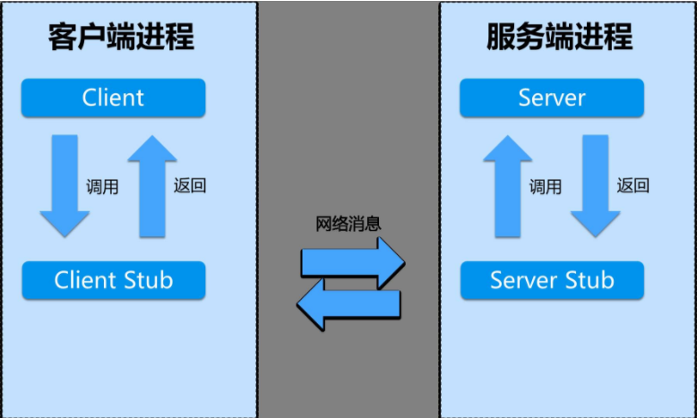

## RPC

进程间通信（IPC，Inter-Process Communication），指至少两个进程或线程间传送数据或信号的一些技术或方法。进程是计算机系统分配资源的最小单位。每个进程都有自己的一部分独立的系统资源，彼此是隔离的。为了能使不同的进程互相访问资源并进行协调工作，才有了进程间通信。这些进程可以运行在同一计算机上或网络连接的不同计算机上。 进程间通信技术包括消息传递、同步、共享内存和远程过程调用。 IPC是一种标准的Unix通信机制。
有两种类型的进程间通信(IPC)。

- 本地过程调用(LPC)LPC用在多任务操作系统中，使得同时运行的任务能互相会话。这些任务共享内存空间使任务同步和互相发送信息。
- 远程过程调用(RPC)RPC类似于LPC，只是在网上工作。RPC开始是出现在Sun微系统公司和HP公司的运行UNIX操作系统的计算机中。

## RPC的作用

RPC的核心并不在于使用什么协议。RPC的目的是让你在本地调用远程的方法，而对你来说这个调用是透明的，你并不知道这个调用的方法是部署哪里。通过RPC能解耦服务，这才是使用RPC的真正目的。RPC的原理主要用到了动态代理模式，至于http协议，只是传输协议而已。

- RPC就是从一台机器（客户端）上通过参数传递的方式调用另一台机器（服务器）上的一个函数或方法（可以统称为服务）并得到返回的结果。
- RPC 会隐藏底层的通讯细节（不需要直接处理Socket通讯或Http通讯） RPC 是一个请求响应模型。
客户端发起请求，服务器返回响应（类似于Http的工作方式） RPC 在使用形式上像调用本地函数（或方法）一样去调用远程的函数（或方法）。


## RPC 基本实现

- 1)客户端（Client），服务的调用方。
- 2)服务端（Server），真正的服务提供者。
- 3)客户端存根，存放服务端的地址消息，再将客户端的请求参数打包成网络消息，然后通过网络远程发送给服务方。
- 4)服务端存根，接收客户端发送过来的消息，将消息解包，并调用本地的方法。


## RPC 结合代码实现

* Call ID映射：Call ID映射可以直接使用函数字符串，也可以使用整数ID。映射表一般就是一个哈希表。
* 序列化和反序列化：序列化反序列化可以自己写，也可以使用Protobuf或者FlatBuffers之类的。
* 网络传输：网络传输库可以自己写socket，或者用asio，ZeroMQ，Netty之类。


```
// Client端 
//    int l_times_r = Call(ServerAddr, Multiply, lvalue, rvalue)
1. 将这个调用映射为Call ID。这里假设用最简单的字符串当Call ID的方法
2. 将Call ID，lvalue和rvalue序列化。可以直接将它们的值以二进制形式打包
3. 把2中得到的数据包发送给ServerAddr，这需要使用网络传输层
4. 等待服务器返回结果
5. 如果服务器调用成功，那么就将结果反序列化，并赋给l_times_r

// Server端
1. 在本地维护一个Call ID到函数指针的映射call_id_map，可以用std::map<std::string, std::function<>>
2. 等待请求
3. 得到一个请求后，将其数据包反序列化，得到Call ID
4. 通过在call_id_map中查找，得到相应的函数指针
5. 将lvalue和rvalue反序列化后，在本地调用Multiply函数，得到结果
6. 将结果序列化后通过网络返回给Client

```

## HTTP和RPC的优缺点传输协议


## 传输协议

RPC，可以基于TCP协议，也可以基于HTTP协议
HTTP，基于HTTP协议

## 传输效率

RPC，使用自定义的TCP协议，可以让请求报文体积更小，或者使用HTTP2协议，也可以很好的减少报文的体积，提高传输效率
HTTP，如果是基于HTTP1.1的协议，请求中会包含很多无用的内容，如果是基于HTTP2.0，那么简单的封装以下是可以作为一个RPC来使用的，这时标准RPC框架更多的是服务治理

## 性能消耗，主要在于序列化和反序列化的耗时

RPC，可以基于thrift实现高效的二进制传输
HTTP，大部分是通过json来实现的，字节大小和序列化耗时都比thrift要更消耗性能

## 负载均衡

RPC，基本都自带了负载均衡策略
HTTP，需要配置Nginx，HAProxy来实现

## 服务治理（下游服务新增，重启，下线时如何不影响上游调用者）

RPC，能做到自动通知，不影响上游
HTTP，需要事先通知，修改Nginx/HAProxy配置


## 应用

RPC服务和HTTP服务还是存在很多的不同点的，一般来说，RPC服务主要是针对大型企业的，而HTTP服务主要是针对小企业的，因为RPC效率更高，而HTTP服务开发迭代会更快。
RPC主要用于公司内部的服务调用，性能消耗低，传输效率高，服务治理方便。HTTP主要用于对外的异构环境，浏览器接口调用，APP接口调用，第三方接口调用等。