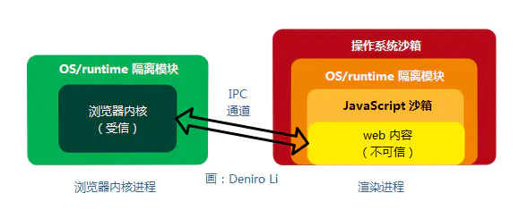
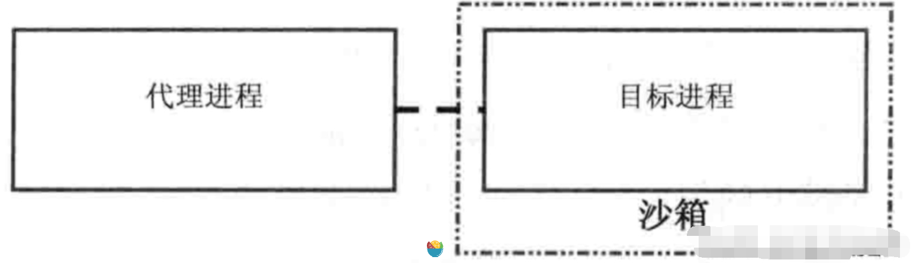

## 操作系统层面

操作系统层面的沙盒的含义就是操作系统对进程的可访问的内存地址所做的限制，限制进程可访问的内存在其被分配的内存地址区间内，而不允许操作其他的内存地址，从而提供安全层面的防护。

## 到浏览器层面

本质原理没多大变化，实践层面可能会根据浏览器环境有所变化，比如限制脚本操作本页面之外的其他页面的DOM，限制访问非同源文档，限制向非同源服务器发送ajax等等，目的依然是安全。Chrome 中的每一个标签页都是一个沙箱（sandbox）

## 以chromium为例

chromium是多进程架构，浏览器前端界面由browser进程管理，各个web page的tab属于renderer进程管理。chromium的sandbox是将renderer进程作为防护对象。browser进程会给每个renderer进程分配资源，但这些renderer进程只能访问被分配的资源，不能访问未被分配的资源。这里资源的概念比较广泛，具体到可访问的DOM（对应内存中的对象），或抽象到origin scope等。

渲染进程被沙箱（Sandbox）隔离，网页 web 代码内容必须通过 IPC 通道才能与浏览器内核进程通信，通信过程会进行安全的检查。

沙箱设计的目的是为了让不可信的代码运行在一定的环境中，从而限制这些代码访问隔离区之外的资源。如果因为某种原因，确实需要访问隔离区外的资源，那么就必须通过的指定的通道，这些通道会进行严格的安全检查，来判断请求的合法性。通道会采取默认拒绝的策略，一般采用封装 API 的方式来实现。

## 如何实现的沙箱

因为沙箱模型严重依赖操作系统提供的技术，而不同操作系统提供的安全技术是不一样的，所以不同操作系统上的实现是不一致的。不管是 LInux、Windows、还是其他平台， 以Chromium为例，它是在进程的粒度下来实现沙箱模型，也就是说需要运行在沙箱下的操作都在一个单独的进程中。所以，对于使用沙箱模型至少需要两个进程。
实现层面的话，可以类比Linux下文件系统的权限位，浏览器会对每个web page实现对应的权限位.

代理进程是需要负责创建目标进程并为目标进程设置各种安全策略，同时建立 IPC 连接【附1】，接受目标进程的各种请求，因为目标进程是不能访问过多资源的。

IPC(Internet Process Connection)是共享"命名管道"的资源，它是为了让进程间通信而开放的命名管道，通过提供可信任的用户名和口令，连接双方可以建立安全的通道并以此通道进行加密数据的交换，从而实现对远程计算机的访问。

## 沙箱的理解 - 具备回滚能力

在一个装满了平整细沙的盒子里，我们可以尽情随意地在上面作画、涂写，无论画的好坏，最后轻轻一抹，沙盒又回到了原来的平整状态。沙盒的魅力就在于他允许你出错，还可以给你改正的机会。google chrome 的沙盒不具备判断病毒的能力，而具备将痕迹和动作抹去，恢复系统到正常状态的能力。

“沙盒”技术与主动防御技术原理截然不同。主动防御是发现程序有可疑行为时立即拦截并终止运行。“沙盒”技术则是发现可疑行为后让程序继续运行，当发现的确是病毒时才会终止。“沙盒”技术的实践运用流程是：让疑似病毒文件的可疑行为在虚拟的“沙盒”里充分表演，“沙盒”会记下它的每一个动作；当疑似病毒充分暴露了其病毒属性后，“沙盒”就会执行“回滚”机制：将病毒的痕迹和动作抹去，恢复系统到正常状态。

沙箱其实就是一个硬盘过滤文件驱动，具体来说，就是你把要写的东西写到了硬盘上，但实际上并没有写到硬盘，而是到了一个转存处，读取内容需要判断是沙箱开启之前就存在的内容还是开沙箱之后写入的内容，要分别从不同的地方读取内容，重启之后把转存的地方清零。

## 总结

沙箱模型则是利用了 Chromium 实现的，利用代理进程 来创建独立的环境让 目标进程在当中安全运行。沙箱机制极大地降低了网页中各种破坏操作系统的潜在风险，将网页执行置于一个孤立（Isolated）和受限制（Strict）的环境中。不能写，不能读，不给看操作系统层面的东西。
