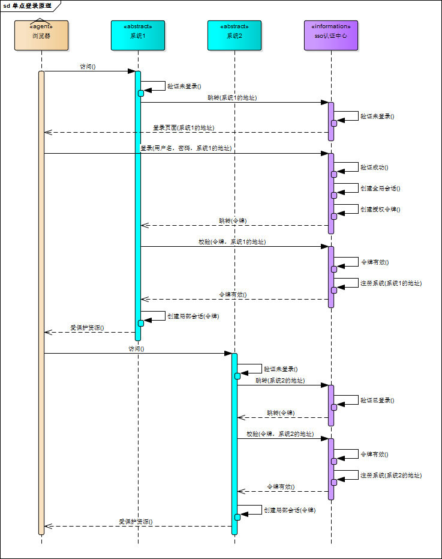
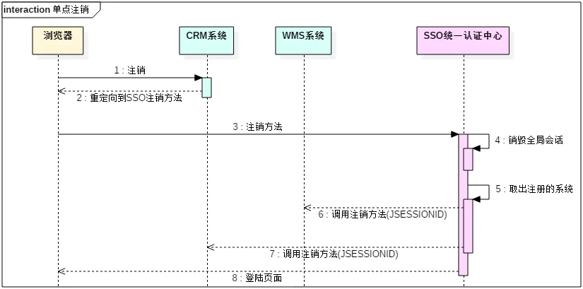
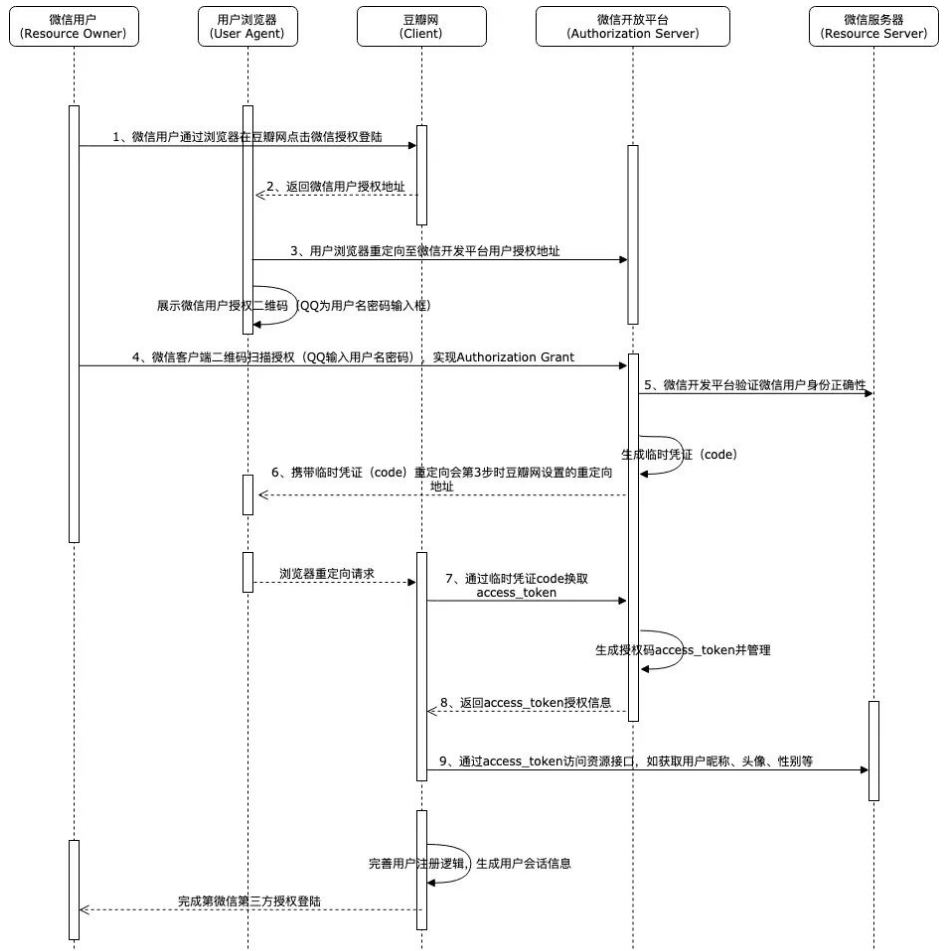
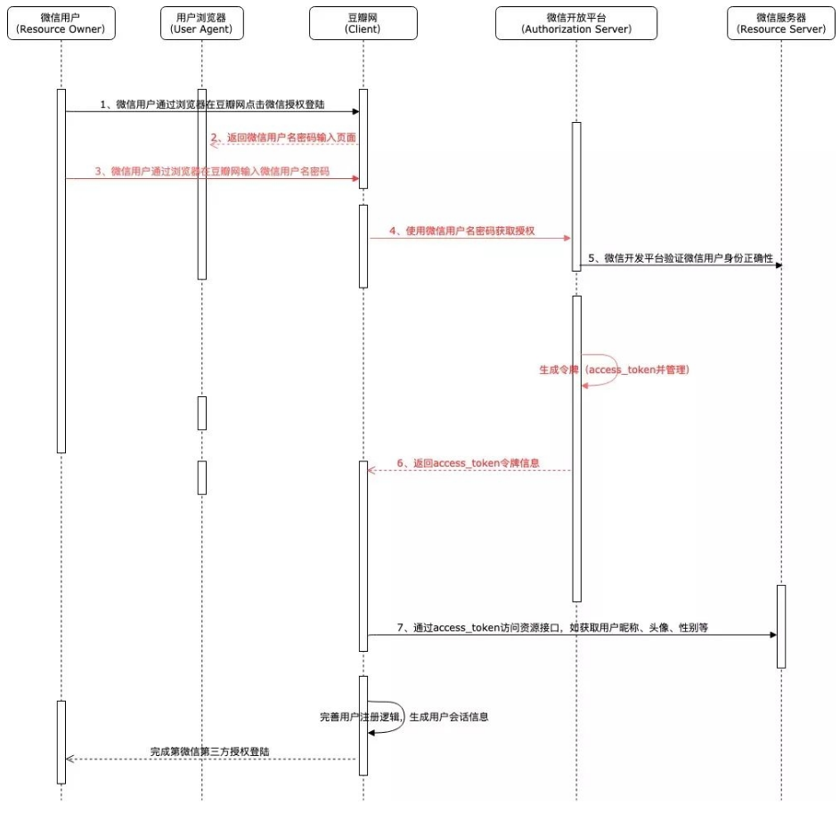

## 单点登录( Single Sign On ，简称 SSO）

用于多个应用系统间，用户只需要登录一次就可以访问所有相互信任的应用系统。

举个例子，比如淘宝、天猫都属于阿里旗下的产品，当用户登录淘宝后，再打开天猫，系统便自动帮用户登录了天猫，这种现象背后就是用单点登录实现的。

## 单点登录原理

SSO即Single Sign On，是指在多系统应用群中登录一个系统，便可在其他所有系统中得到授权而无需再次登录。 SSO一般都需要一个独立的认证中心（passport），子系统的登录均得通过passport，子系统本身将不参与登录操作，当一个系统成功登录以后，passport将会颁发一个令牌给各个子系统，子系统可以拿着令牌会获取各自的受保护资源，为了减少频繁认证，各个子系统在被passport授权以后，会建立一个局部会话，在一定时间内可以无需再次向passport发起认证。

## 不同子域名

子域名间 Cookie 是不共享的，但各子域名均可获取到父级域名的 Cookie，即app.demo.com与news.demo.com均可以获取 demo.com域名下的 Cookie。所以可以通过将 Cookie 设置在父级域名上，可以达到子域名共享的效果，即当用户在 app.demo.com 域名下登录时，在demo.com域名下设置名为 SessionID 的 Cookie，当用户之后访问news.demo.com时，后台服务也可以获取到该 SessionID，从而识别用户。

## CAS - 解决完全不同域名

CAS是Central Authentication Service的缩写，中央认证服务，一种独立开放指令协议。CAS 是 Yale 大学发起的一个开源项目，旨在为 Web 应用系统提供一种可靠的单点登录方法。CAS 包含两个部分： CAS Server 和 CAS Client。CAS Server 需要独立部署，主要负责对用户的认证工作；CAS Client 负责处理对客户端受保护资源的访问请求，需要登录时，重定向到 CAS Server。

简单利用 CAS 进行单点登录： 

- 1. 访问 Origin（a.com） 页面，被一个智能网关重定向 302 到 SSO.com，并在URL上带上Origin路径
- 2. SSO.com 提交表单登录，POST请求后，拿到ticket,然后重定向到原有域名的一个接口（接口的路径上有ticket
- 3. 现在在这个接口里，已经是和原有域名同域了，现在就可以再这个接口里去url上拿ticket去set-cookie（已经和origin同域了，这个接口应该是有某个智能网关来代理
- 4. set-cookie后再重定向回到原来的页面即可，现在原来的页面你重新进入已经是有cookie的了

1,2,4都设计到重定向，所以一次ioa的单点登录涉及到了三次重定向，还有一次接口的代理处理。

- 5.现在我们访问Origin2：b.com,也是通过中间转发层转发到sso.com,这里就会带上sso.com这个domain下的cookie（登录a.com的时候已经有了）
- 6.好了现在cookie有了,sso.com再重定向到了b.com，访问b.com就得到了认证
- 只要经过上面的操作，登录一个域名，然后所有得到sso.com认证的域名都不需要登录了

总结 a.com 和 b.com 如果没有登录都跳到sso.com, 如果sso.com存有同一个用户的登录信息，然后再跳转会原页面时带上这个用户的登录信息就行了

## 单点注销

单点登录自然也要单点注销，在一个子系统中注销，所有子系统的会话都将被销毁，用下面的图来说明:

- 1.用户在CRM系统中点击注销按钮.会重定向到统一认证中心的注销方法
- 2.统一认证中心接受到注销请求之后,会销毁全局的会话.
- 3.统一认证中心会拿到之前在该系统中注册的子系统集合.
- 4.依次的调用子系统的登出方法,销毁局部会话.
- 5.每个系统中的会话都已经销毁之后,跳转到登陆页面.

## Atuth2.0

OAuth 协议为用户资源的授权提供了一个安全又简易的标准。与以往的授权方式不同之处是 OAuth的授权不会使第三方触及到用户的帐号信息（如用户名与密码），即第三方无需使用用户的用户名与密码就可以申请获得该用户资源的授权，因此 OAuth是安全的。OAuth 是 Open Authorization 的简写

简单说，OAuth 就是一种授权机制。数据的所有者告诉系统，同意授权第三方应用进入系统，获取这些数据。系统从而产生一个短期的进入令牌（token），用来代替密码，供第三方应用使用。

## 简单步骤

- 第三方要求用户给予授权
- 用户同意授权
- 根据上一步获得的授权，第三方向认证服务器请求令牌（token）
- 认证服务器对授权进行认证，确认无误后发放令牌
- 第三方使用令牌向资源服务器请求资源
- 资源服务器使用令牌向认证服务器确认令牌的正确性，确认无误后提供资源

## OAuth2.0是为了解决什么问题
>任何身份认证，本质上都是基于对请求方的不信任所产生的。同时，请求方是信任被请求方的，例如用户请求服务时，会信任服务方。所以，身份认证就是为了解决身份的可信任问题。

在OAuth2.0中，简单来说有三方：用户（这里是指属于服务方的用户）、服务方（如微信、微博等）、第三方应用（豆瓣，采用微信登录）:

- 服务方不信任用户，所以需要用户提供密码或其他可信凭据
- 服务方不信任第三方应用，所以需要第三方提供自已交给它的凭据（如微信授权的code,AppID等）
- 用户部分信任第三方应用，所以用户愿意把自已在服务方里的某些服务交给第三方使用，但不愿意把自已在服务方的密码等交给第三方应用

### 令牌与密码

在OAuth 2.0协议中，第三方应用程序获取的凭证并不等同于资源拥有者持有的用户名和密码，以上面例子来说，微信是不会直接将用户的用户名、密码等信息作为凭证返回给该论坛的。这种授权访问凭证一般来说就是一个表示特定范围、生存周期和其访问权限的一个由字符串组成的访问令牌，也就是我们常说的token。在这种模式下OAuth 2.0协议中通过引入一个授权层来将第三方应用程序与资源拥有者进行分离，而这个授权层也就是常说的“auth认证服务/sso单点登录服务器”。 

令牌（token）与密码（password）的作用是一样的，都可以进入系统，但是有三点差异。

- （1）令牌是短期的，到期会自动失效，用户自己无法修改。密码一般长期有效，用户不修改，就不会发生变化。
- （2）令牌可以被数据所有者撤销，会立即失效。以上例而言，屋主可以随时取消快递员的令牌。密码一般不允许被他人撤销。
- （3）令牌有权限范围（scope），比如只能进小区的二号门。对于网络服务来说，只读令牌就比读写令牌更安全。密码一般是完整权限。

上面这些设计，保证了令牌既可以让第三方应用获得权限，同时又随时可控，不会危及系统安全。这就是 OAuth 2.0 的优点。

## OAuth2.0成员

- Resource Owner（资源拥有者：用户）
- Client （第三方接入平台：请求者）
- Resource Server （服务器资源：数据中心）
- Authorization Server （认证服务器）

### 1）resource owner（资源拥有者）

即能够有权授予对保护资源访问权限的实体。例如我们使用通过微信账号登录论坛，而微信账号信息的实际拥有者就是微信用户，也被称为最终用户。

### 2）resource server（资源服务器）

承载受保护资源的服务器，能够接收使用访问令牌对受保护资源的请求并响应，它与授权服务器可以是同一服务器(下述的“简化模式”)，也可以是不同服务器(下述的“授权码模式”)。在上述例子中该角色就是微信服务器。 

### 3）client（客户端）

代表资源所有者及其授权发出对受保护资源请求的应用程序。在上面的例子中的用户要注册的论坛就是该角色。 

### 4）authorization server（授权服务器）
认证服务器，即服务提供商专门用来处理认证授权的服务器。例如微信开放平台提供的认证服务的服务器。

## 授权码模式-微信授权登录举例
> 授权码模式（authorization code）是功能最完整、流程最严密的授权模式。它的特点就是通过客户端的后台服务器(下图是客户端重定向到后台服务豆瓣网)与"服务提供商"（如微信开放平台）的认证服务器进行互动。

**这种模式下授权代码并不是客户端直接从资源所有者获取，而是通过授权服务器（authorization server）作为中介来获取**，授权认证的过程也是资源所有者直接通过授权服务器进行身份认证，避免了资源所有者身份凭证与客户端共享的可能，因此是十分安全的。 

1. 首先微信用户点击豆瓣网论坛的微信授权登录按钮后，豆瓣网论坛会将请求通过URL重定向的方式跳转至微信用户授权界面；

2. 此时微信用户实际上是在微信上进行身份认证，与豆瓣网论坛并无交互了，这一点非常类似于购物后，使用网银支付的场景；

3. 用户使用微信客户端扫描二维码认证或者输入用户名密码后，微信会验证用户身份信息的正确性，如正确，则认为用户确认授权微信登录豆瓣网论坛，此时会先生成一个临时凭证，并携带此凭证通过用户浏览器将请求重定向回豆瓣网在第一次重定向时携带的callBackUrl地址；

4. 之后用户浏览器会携带临时凭证访问豆瓣网服务，豆瓣网则通过此临时凭证再次调用微信授权接口，获取正式的访问凭据access_token；

5. 在豆瓣网获取到微信授权访问凭据access_token后，此时用户的授权基本上就完成了，后续豆瓣网要做的只是通过此token再访问微信提供的相关接口，获取微信允许授权开发的用户信息，如头像，昵称等，并据此完成自身的用户逻辑及用户登录会话逻辑。

**注意浏览器端只对零时code有感知，对token完全没有感知，是服务端去请求的**

## 简化模式（implicit grant type） 

可以看出，与授权码模式的不同之处在于：在第4步用户完成授权后，认证服务器是直接返回了access_token令牌至用户浏览器端，而并没有先返回临时授权码code，然后由客户端的后端服务去通过授权码再去获取access_token令牌，从而省去了一个跳转步骤，提高了交互效率。 

但是由于这**种方式访问令牌access_token会在URL片段中进行传输**，因此可能会导致访问令牌被其他未经授权的第三方截取，所以安全性上并不是那么的强壮。

## Openid 和 OAuth

OpenID 和 OAuth 很像。但本质上来说它们是截然不同的两个东西：

- OpenID: 只用于 身份认证（Authentication），允许你以 同一个账户 在 多个网站登陆。它仅仅是为你的 合法身份 背书，当你以 Facebook 账号登陆某个站点之后，该站点 无权访问 你的在 Facebook 上的 数据。

- OAuth: 用于 授权（Authorisation），允许 被授权方 访问 授权方 的 用户数据。

## 参考

- http://www.ruanyifeng.com/blog/2019/04/oauth_design.html
- https://blog.yoodb.com/yoodb/article/detail/1535
- https://juejin.im/post/5b73c71fe51d45666016655a
- https://juejin.im/post/5e11a6e96fb9a048411a4eca
- https://juejin.im/post/5b51f39b5188251a9f24a264