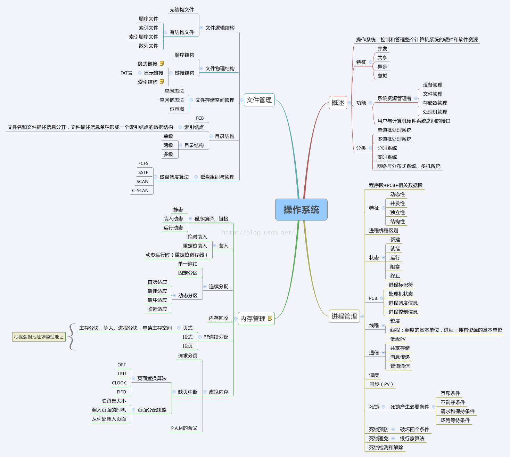
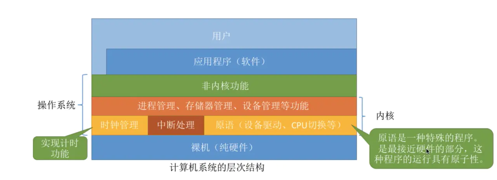
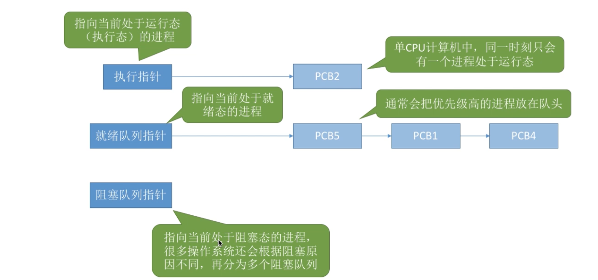
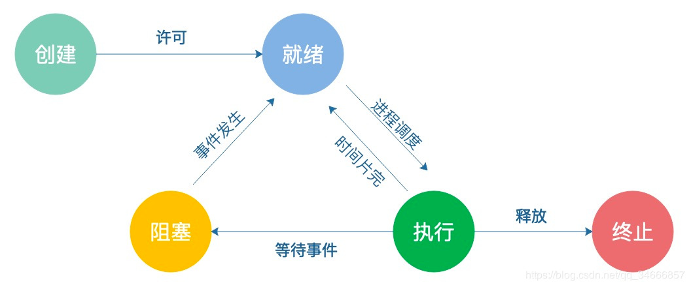
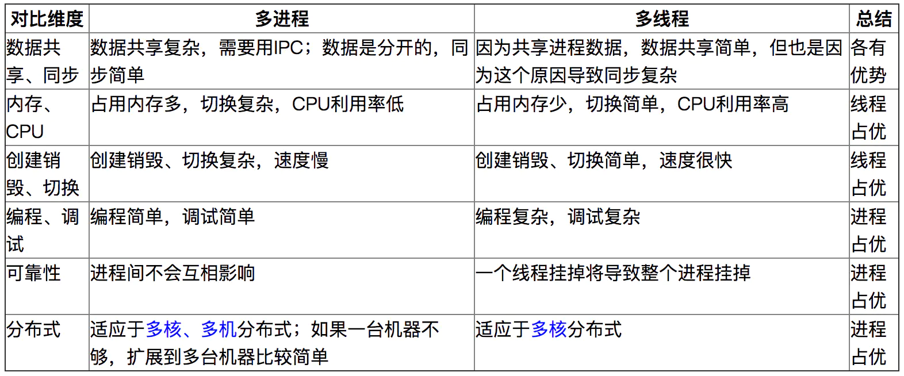
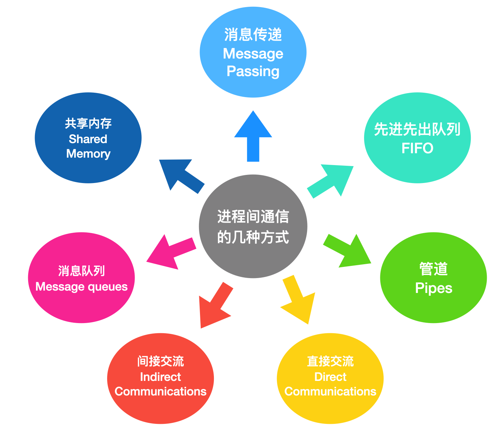
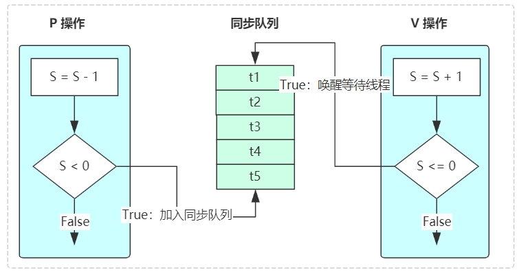
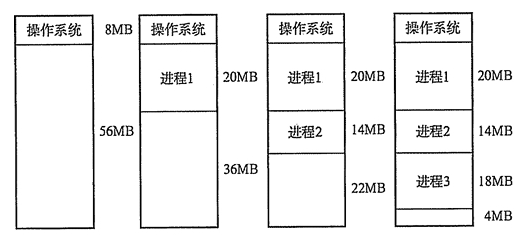
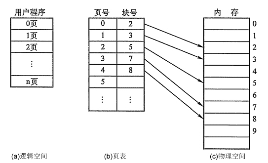
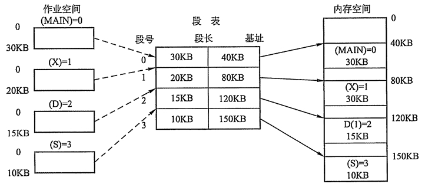

## 操作系统

操作系统是一种介于硬件和用户之间的特殊的软件。操作系统(Operating System，简称OS)是管理计算机硬件与软件资源的计算机程序。操作系统需要处理如管理与配置内存、决定系统资源供需的优先次序、控制输入设备与输出设备、操作网络与管理文件系统等基本事务。操作系统也提供一个让用户与系统交互的操作界面。

- 是现代计算机系统中 最基本和最重要 的系统软件
- 主要作用是管理好硬件设备，并为用户和应用程序提供一个简单的接口，以便于使用
- 而其他的诸如驱动程序、编译程序、数据库管理系统，以及大量的应用软件，都直接依赖于操作系统的支持

## 思维导图

> https://blog.csdn.net/L664675249/article/details/47271941

## 操作系统

## 操作系统的四个特性

- 并发：同一段时间内多个程序执行(注意区别并行和并发，前者是同一时刻的多个事件，后者是同一时间段内的多个事件)
- 共享：系统中的资源可以被内存中多个并发执行的进线程共同使用
- 虚拟：通过时分复用（如分时系统）以及空分复用（如虚拟内存）技术实现把一个物理实体虚拟为多个
- 异步：系统中的进程是以走走停停的方式执行的，且以一种不可预知的速度推进。内存中的每个进程何时执行,何时暂停,以怎样的速度向前推进,每道程序总共需要多少时间才能完成等,都是不可预知的。如进程提出打印请求,你不知道打印机何时打完，打印机是临界资源只有等打完后空闲状态才分配给该进程。

## 进程

进程是进程实体的运行过程，是系统进行资源分配和调度的一个独立单位（具有动态、并发、独立、异步的特性，以及就绪、执行、阻塞 3 种状态）；引入进程是为了使多个程序可以并发的执行，以提高系统的资源利用率和吞吐量。

进程的工作被分片(时间片轮转？)，由操作系统的进程调度来决定现在执行哪个片断。
所以是各个进程交替执行，但在每一个时刻，只有一个进程被执行。(与中断有关)

## 进程控制块 PCB
>https://blog.csdn.net/slx3320612540/article/details/80721950

进程控制块(Processing Control Block),是操作系统核心中一种数据结构，主要表示进程状态，其作用是使一个程序成为一个能够独立运行的基本单位，并且可以并发执行的进程。或者说，OS 是根据 PCB 来对并发执行的进程进行控制和管理。PCB 通常是占用系统内存中一块连续的内存空间，存放着操作系统用于描述进程情况及控制进程运行的全部信息。

## 进程控制块 PCB 的作用

PCB 可以被操作系统中的多个模块读或修改，如被调度程序、资源分配 程序、中断处理程序以及监督和分析程序等读或修改。 OS 是根据 PCB 来对 并发执行的进程进行控制和管理，所以说 PCB 是操作系统中最重要的记录型数据结构,操作系统是通过感知PCB来感知进程的.

### PCB组成

Linux操作系统下的PCB是task_struct，重点需要掌握的就是这个结构体中的部分内容
在task_struct中，内容被大致分成几类：

- 标示符: 描述本进程的唯一标示符，用来区别其他进程
- 状态: 任务状态，退出代码，退出信号等。
- 优先级: 相对于其他进程的优先级。
- 程序计数器: 程序中即将被执行的下一条指令的地址。
- 内存指针: 包括程序代码和进程相关数据的指针，还有和其他进程共享的内存块的指针
- 上下文数据: 进程执行时处理器的寄存器中的数据
- I／O状态信息: 包括显示的I/O请求,分配给进程的I／O设备和被进程使用的文件列表。
- 记账信息: 可能包括处理器时间总和，使用的时钟数总和，时间限制，记账号等
- 其他信息

### PCB其作主要作用如下：

- 1、作为独立运行基本单位的标志
- 2、能实现间断性运行方式
- 3、提供进程管理所需要的信息
- 4、提供进程调度所需要的信息
- 5、实现与其他进程的同步与通信

## 进程的并发

### 时间片轮转法
CPU在任何一个时间点都只能运行一个进程，但是对于现代操作系统来说，“同时”都有很多进程在运行，比如我们可以在聊QQ的同时听音乐，这是如何做到的？答案就是CPU的运行机制之一——时间片轮转机制(RR调度)：

时间片轮转法（Round-Robin，RR）主要用于分时系统中的进程调度。为了实现轮转调度，系统把所有就绪进程按先入先出的原则排成一个队列。新来的进程加到就绪队列末尾。每当执行进程调度时，进程调度程序总是选出就绪队列的队首进程，让它在CPU上运行一个时间片的时间。时间片是一个小的时间单位，通常为10~100ms数量级。当进程用完分给它的时间片后，系统的计时器发出时钟中断，调度程序便停止该进程的运行，把它放入就绪队列的末尾；然后，把CPU分给就绪队列的队首进程，同样也让它运行一个时间片，如此往复。

### 保存CPU状态

所以这需要CPU硬件状态从一个进程换到另一个，运行的进程硬件状态保存在CPU寄存器上，不运行时保存在PCB中，之后可推送至CPU寄存器.

当OS要调度某进程执行时，要从该进程的PCB中查处其现行状态及优先级；在调度到某进程后，要根据其PCB中所保存的处理机状态信息，设置该进程恢复运行的现场，并根据其PCB中的程序和数据的内存始址，找到其程序和数据；进程在执行过程中，当需要和与之合作的进程实现同步，通信或者访问文件时，也都需要访问PCB；当进程由于某种原因而暂停执行时，又须将器断点的处理机环境保存在PCB中。

## 进程的组织

在一个系统中，通常由数十、数百乃至数千个PCB。为了对他们加以有效的管理，应该用适当的方式把这些PCB组织起来。这里介绍一种组织方式，类似数据结构里的链表。

## 进程的切换

> https://blog.csdn.net/jirongzi_cs2011/article/details/9397341

### 进程上下文

进程上下文：一个进程在执行的时候，CPU的所有寄存器中的值、进程的状态以及堆栈上的内容。内核在进行进程的切换时，需要保存当前进程的所有状态，即保存当前进程的上下文，以便再次执行该进程时，能够恢复切换时的状态，继续执行。

一个进程的上下文可以分为三个部分:用户级上下文、寄存器上下文以及系统级上下文。

- （1）用户级上下文: 正文、数据、用户堆栈以及共享存储区；
- （2）寄存器上下文: 通用寄存器、程序寄存器(IP)、处理器状态寄存器(EFLAGS)、栈指针(ESP)；
- （3）系统级上下文: **PCB进程控制块task_struct**、内存管理信息(mm_struct、vm_area_struct、pgd、pte)、内核栈。

进程切换指从正在运行的进程中收回处理器， 让待运行进程来占有处理器运行；当发生进程调度时，进行进程切换就是上下文切换(context switch).操作系统必须对上面提到的全部信息进行切换，新调度的进程才能运行。

进程切换实质上就是被中断运行进程与待运行进程的上下文切换， 处理过程是：
- 保存被中断进程的上下文；
- 转向进程调度；
- 恢复待运行进程的上下文；

进程上下文切换的切换过程涉及由谁来保护和获取进程的正文的问题，也就是如何使寄存器和堆栈等中的数据流入流出 **PCB** 的存储区。 另外，进程上下文切换还涉及系统调度和分配程序，这些都比较耗费CPU时间。   

进程切换一定发生在中断/异常/系统调用处理过程中， 常见的情况是：
- 1.系统资源不足：进程在系统资源不足（比如内存不足）时，要等到资源满足后才可以运行，这个时候进程也会被挂起，并由系统调度其他进程运行。
- 2.时间片中断：当某个进程的时间片耗尽了，就会被系统挂起，切换到其它正在等待 CPU 的进程运行。
- 3.I/O中断：操作系统确定是否发生了I/O 活动。如果I/O 活动是一个或多个进程正在等待的事件，操作系统就把所有相应的阻塞态进程转换到就绪态（阻塞/挂起态进程转换到就绪/挂起态），操作系统必须决定是继续执行当前处于运行态的进程，还是让具有高优先级的就绪态进程抢占这个进程。
- 4.优先级调度：当有优先级更高的进程运行时，为了保证高优先级进程的运行，当前进程会被挂起，由高优先级进程来运行
- 5.发生硬件中断时，CPU 上的进程会被中断挂起，转而执行内核中的中断服务程序。
- 6.当进程通过睡眠函数 sleep 这样的方法将自己主动挂起时，自然也会重新调度。
- 7.终止用系统调用、 不能继续执行的异常导致被中断进程进入终止态；

显然，进程的切换可以用中断技术来实现，进程切换是一个完整的软中断处理过程，只不过在保护现场和恢复现场工作中，保护的是被中止 运行进程的现场，恢复的是待运行进程的现场，这一切都依赖于堆栈指针的切换。

### IO中断的中断上下文

### 中断上下文

程序在执行过程中通常有用户态和内核态两种状态。
linux下每个进程的栈有两个，一个是用户态栈，一个是内核态栈。在需要从用户态栈切换到内核的时候（发生系统调用时），需要进行执行栈的转换，保存用户态的状态，包括寄存器状态，然后执行内核态操作，操作完成后要恢复现场，切换到用户态，这个过程是耗时的

CPU对处于内核态根据上下文环境进一步细分，因此有了下面三种状态：
（1）内核态，运行于进程上下文，内核代表进程运行于内核空间。
（2）内核态，运行于中断上下文，内核代表硬件运行于内核空间。
（3）用户态，运行于用户空间。

所谓的“ 中断上下文”，其实也可以看作就是硬件传递过来的这些参数和内核需要保存的一些其他环境（主要是当前被打断执行的进程环境）。中断时，内核不代表任何进程运行，它一般只访问系统空间，而不会访问进程空间，内核在中断上下文中执行时一般不会阻塞。

### 中断上下文切换

为了快速响应硬件的事件，中断处理会打断进程的正常调度和执行，转而调用中断处理程序，响应设备事件。而在打断其他进程时，就需要将进程当前的状态保存下来，这样在中断结束后，进程仍然可以从原来的状态恢复运行。

跟进程上下文不同，**中断上下文切换并不涉及到进程的用户态**（**原本进程的切换是需要从用户态到内核态再到用户态，但中断是取处理一些硬件的事情与用户无关，所以不要用户态**）。所以，即便中断过程打断了一个正处在用户态的进程，也不需要保存和恢复这个进程的虚拟内存、全局变量等用户态资源。中断上下文，其实只包括内核态中断服务程序执行所必需的状态，包括 CPU 寄存器、内核堆栈、硬件中断参数等。

### 中断比普通调度优先级更高
对同一个 CPU 来说，中断处理比进程拥有更高的优先级，所以中断上下文切换并不会与进程上下文切换同时发生。同样道理，由于中断会打断正常进程的调度和执行，所以大部分中断处理程序都短小精悍，以便尽可能快的执行结

## 中断与系统调用

> https://www.jianshu.com/p/eac05373f30f

所谓的中断就是在计算机执行程序的过程中，由于出现了某些特殊事情，使得 CPU 暂停对程序的执行，转而去执行处理这一事件的程序。等这些特殊事情处理完之后再回去执行之前的程序。中断一般分为三类：

- 由计算机硬件异常或故障引起的中断，称为内部异常中断；
- 由程序中执行了引起中断的指令（时间片轮转）而造成的中断，称为软中断（这也是和我们将要说明的系统调用相关的中断）；
- 由外部设备请求引起的中断，称为**外部中断**。简单来说，对中断的理解就是对一些特殊事情的处理。

中断紧密相连的一个概念就是中断处理程序了。当中断发生的时候，系统需要去对中断进行处理，对这些中断的处理是由操作系统内核中的特定函数进行的，这些处理中断的特定的函数就是我们所说的中断处理程序了。

也就是说**中断是多程序并发执行的前提条件**。多道程序的并发执行，提高了系统资源的利用率。

## 进程状态转换图

首先是进程的创建，进程的创建是一个较为复杂的过程，首先需要由进程申请一个空白的进程控制块，并向PCB中填写用于控制和管理进程的信息；然后为该进程分配运行时必要的资源；最后把该进程转为就绪态并插入到就绪队列中。其次是进程的终止，进程的终止分为两个步骤：首先是等待OS进行善后处理（停止执行、终止子孙进程、归还资源等），然后将其PCB清零，并将PCB空间返还给系统。

​ 从上述进程的创建和终止的过程中，我们可以得知，创建态就是处于进程创建的第一步完成时的状态，终止态就是进程无法被调度或执行，但是还需等待别的进程来收集信息，也就是终止态同样处于第一步完成的状态，只有当进程归还了PCB后，才算是真正的被OS删除，生命周期才算结束。

- 运行：当一个进程在处理机上运行时，则称该进程处于运行状态。
- 就绪：当一个进程获得了除处理机以外的一切所需资源，一旦得到处理机即可运行，则称此进程处于就绪状态。
- 阻塞：也称为等待或睡眠状态，一个进程正在等待某一事件发生（例如请求 I/O 而等待 I/O 完成等）而暂时停止运行，这时即使把处理机分配给进程也无法运行，故称该进程处于阻塞状态。

## 线程

是比进程更小的可独立运行的基本单位，可以看做是轻量级的进程（具有轻型实体，独立调度分派单位，可并发执行，共享进程资源等属性）；引入目的是为了减少程序在并发执行过程中的开销，使 OS 的并发效率更高。

## 进程和线程的区别

- 调度方面：在引入线程的 OS 中，线程是独立的调度和分派单位，而进程作为资源的拥有单位(相当于把未引入线程的传统 OS 中的进程的两个属性分开了)。由于线程不拥有资源，因此可以显著的提高并发度以及减少切换开销。

- 并发性：引入了线程的 OS 中，进程间可以并发，而且一个进程内部的多个线程之间也是可以并发的，这就使 OS 具有更好的并发性，有效的提高了系统资源利用率和吞吐量。

- 拥有资源：无论 OS 是否支持线程，进程都是基本的资源拥有单位，线程只拥有很少的基本的资源，但是线程可以访问所隶属的进程的资源（进程的代码段，数据段和所拥有的系统资源如 fd）

- 系统开销：创建或者撤销进程的时候，系统要为之创建或回收 PCB，系统资源等，切换时也需要保存和恢复 CPU 环境。而线程的切换只需要保存和恢复少量的寄存器，不涉及存储器管理方面的工作，所以开销较小。此外，统一进程中的多个线程由于共享地址空间，所以通信同步等都比较方便。

##  线程上下文切换

线程与进程最大的区别在于：线程是调度的基本单位，而进程则是资源拥有的基本单位。说白了，所谓内核中的任务调度，实际上的调度对象是线程；而进程只是给线程提供了虚拟内存、全局变量等资源。

所以，对于线程和进程，我们可以这么理解： 
- 当进程只有一个线程时，可以认为进程就等于线程。 
- 当进程拥有多个线程时，这些线程会共享相同的虚拟内存和全局变量等资源。这些资源在上下文切换时是不需要修改的。 
- 另外，线程也有自己的私有数据，比如栈和寄存器等，这些在上下文切换时也是需要保存的。

发生线程上下文切换的场景
- 前后两个线程属于不同进程。此时，因为资源不共享，所以切换过程就跟进程上下文切换是一样。
- 前后两个线程属于同一个进程。此时，因为虚拟内存是共享的，所以在切换时，虚拟内存这些资源就保持不动，只需要切换线程的私有数据、寄存器等不共享的数据

## 多进程 VS 多线程

## 线程切换对比进程切换的消耗

### 用户态，内核态
简单理解内核态特权级（0级）比用户态特权级高（3级）。主要是限制不同的程序访问资源的权限。通过 软中断 切换。几乎所有的程序都要切换到内核态运行再返回用户态，用中断完成的，因为在内核下封装了一些东西，用户态下只是传入某些参数后调用内核态下的函数罢了。
用户态：能运行在用户态就运行在用户态，涉及用户数据和应用的操作。
内核态：牵扯到计算机本体的操作，对时序要求比较高的操作。

用户态是指进程在用户代码中运行。内核态是指进程进入内核代码，执行内核的代码。从用户态到核态的转换情况一般有以下三种切换用户栈到内核栈：

- （1）发生系统调用；
- （2）CPU执行异常；
- （3）外围设备发来中断请求

### 上下文的切换（包含PCB

每个进程都有独立的代码和数据空间（程序上下文），程序之间的切换会有较大的开销；线程可以看做轻量级的进程，同一类线程共享代码和数据空间，每个线程都有自己独立的运行栈和程序计数器（PC），线程之间切换的开销小。

进程切换涉及虚拟地址空间的切换而线程不会。因为每个进程都有自己的虚拟地址空间，而线程是共享所在进程的虚拟地址空间的，因此同一个进程中的线程进行线程切换时不涉及虚拟地址空间的转换。

进程：
0、用户态与内核态的切换
1、切换页表全局目录
2、切换内核态堆栈
3、切换硬件上下文（进程恢复前，必须装入寄存器的数据统称为硬件上下文）
4、刷新TLB（Translation Lookaside Buffer页表缓存）
5、系统调度器的代码执行

线程：
0.线程切换只能在内核态完成，如果当前用户处于用户态，则必然引起用户态与内核态的切换
1.切换内核栈
2.切换硬件上下文

隐藏的损耗是上下文的切换会扰乱处理器的缓存机制。简单的说，一旦去切换上下文，处理器中所有已经缓存的内存地址一瞬间都作废了。

### 虚拟地址切换很慢

虚拟内存是操作系统为每个进程提供的一种抽象，每个进程都有属于自己的、私有的、地址连续的虚拟内存，当然我们知道最终进程的数据及代码必然要放到物理内存上，那么必须有某种机制能记住虚拟地址空间中的某个数据被放到了哪个物理内存地址上，这就是所谓的地址空间映射，也就是虚拟内存地址与物理内存地址的映射关系，那么操作系统是如何记住这种映射关系的呢，答案就是页表，页表中记录了虚拟内存地址到物理内存地址的映射关系。有了页表就可以将虚拟地址转换为物理内存地址了，这种机制就是虚拟内存。

虚拟地址转换为物理地址需要查找页表，页表查找是一个很慢的过程，因此通常使用Cache来缓存常用的地址映射，这样可以加速页表查找，这个cache就是TLB，Translation Lookaside Buffer，我们不需要关心这个名字只需要知道TLB本质上就是一个cache，是用来加速页表查找的。由于每个进程都有自己的虚拟地址空间，那么显然每个进程都有自己的页表，那么当进程切换后页表也要进行切换，页表切换后TLB就失效了，cache失效导致命中率降低，那么虚拟地址转换为物理地址就会变慢，表现出来的就是程序运行会变慢，而线程切换则不会导致TLB失效，因为线程线程无需切换地址空间，因此我们通常说线程切换要比较进程切换块，原因就在这里。

## 进程通讯（IPC）的几种方式
>进程间通信(IPC,Inter-Process Communication)指至少两个进程或线程间传送数据或信号的一些技术或方法。https://www.jianshu.com/p/5788fb2345ce

由于多个进程可以并发执行，所以进程间必然存在资源共享和相互合作的问题。进程通信是指各个进程交换信息的过程。

同步是合作进程间直接制约问题，互斥是申请临界资源进程间的间接制约问题。（临界资源（Critical Resource, CR）：在同一时间只能供一个进程使用的资源，例如：打印机，磁带机等硬件资源）

共享存储：

- 低级方式：基于数据结构的共享
- 高级方式：基于存储区的共享

消息传递：

- 直接通信方式：直接把消息挂到接收进程的消息队列。
- 间接通信方式：挂到某个中间实体，接收进程找实体接收消息，类似电子邮件。

管道(特殊的文件)通信：

- 利用一种特殊的 pipe 文件连接两个进程

- 消息传递：消息传递是进程间实现通信和同步等待的机制，使用消息传递，进程间的交流不需要共享变量，直接就可以进行通信；消息传递分为发送方和接收方
- 先进先出队列：先进先出队列指的是两个不相关联进程间的通信，两个进程之间可以彼此相互进程通信，这是一种全双工通信方式
- 管道：管道用于两个相关进程之间的通信，这是一种半双工的通信方式，如果需要全双工，需要另外一个管道。
- 直接通信：在这种进程通信的方式中，进程与进程之间只存在一条链接，进程间要明确通信双方的命名。
- 间接通信：间接通信是通信双方不会直接建立连接，而是找到一个中介者，这个中介者可能是个对象等等，进程可以在其中放置消息，并且可以从中删除消息，以此达到进程间通信的目的。
- 消息队列：消息队列是内核中存储消息的链表，它由消息队列标识符进行标识，这种方式能够在不同的进程之间提供全双工的通信连接。
- 共享内存：共享内存是使用所有进程之间的内存来建立连接，这种类型需要同步进程访问来相互保护。

## 进程同步

多进程虽然提高了系统资源利用率和吞吐量，但是由于进程的异步性可能造成系统的混乱。进程同步的任务就是对多个相关进程在执行顺序上进行协调，使并发执行的多个进程之间可以有效的共享资源和相互合作，保证程序执行的可再现性。

进程同步的基本概念：临界资源、同步和互斥

### 临界资源：

打印机这类资源一次只允许一个进程使用的资源称为临界资源。
对于临界资源的访问，必须是互斥进行。也就是当临界资源被占用时，另一个申请临界资源的进程会被阻塞，直到其所申请的临界资源被释放。而进程内访问临界资源的代码被成为临界区。

### 互斥：

互斥亦称间接制约关系。当一个进程进入临界区使用临界资源时，另一个进程必须等待, 当占用临界资源的进程退出临界区后，另一进程才允许去访问此临界资源。

### 同步：

是指在互斥的基础上（大多数情况），通过其它机制实现访问者对资源的有序访问。在大多数情况下，同步已经实现了互斥，特别是所有写入资源的情况必定是互斥的。少数情况是指可以允许多个访问者同时访问资源。

同步机制需要遵循的原则：
- 空闲让进：当没有进程处于临界区的时候，应该许可其他进程进入临界区的申请
- 忙则等待：当前如果有进程处于临界区，如果有其他进程申请进入，则必须等待，保证对临界区的互斥访问
- 有限等待：对要求访问临界资源的进程，需要在有限时间内进入临界区，防止出现死等
- 让权等待：当进程无法进入临界区的时候，需要释放处理机，边陷入忙等

经典的进程同步问题：

#### 生产者-消费者问题；

这里生产者和消费者是既同步又互斥的关系，首先只有生产者生产了，消费着才能消费，这里是同步的关系。但他们对于临界区的访问又是互斥的关系。因此需要三个信号量empty和full用于同步缓冲区，而mut变量用于在访问缓冲区时是互斥的。

#### 读者-写者问题

一个数据文件或记录，统称数据对象，可被多个进程共享，其中有些进程只要求读称为”读者”，而另一些进程要求写或修改称为”写者”。
规定:允许多个读者同时读一个共享对象，但禁止读者、写者同时访问一个共享对象，也禁止多个写者访问一个共享对象，否则将违反Bernstein并发执行条件。
通过描述可以分析，这里的读者和写者是互斥的，而写者和写者也是互斥的，但读者之间并不互斥。

#### 信号量实现方式

信号中包括一个整形变量，和两个原子操作 P 和 V。其原子性由操作系统保证，这个整形变量只能通过 P 操作和 V 操作改变。

- 信号量由一个整形变量 S 和两个原子操作 PV 组成。S表示可用资源的数量
- P(Prolaag，荷兰语尝试减少)：信号量值减 1，如果信号量值小于 0，则说明资源不够用的，把进程加入等待队列。
- V (Verhoog，荷兰语增加)：信号量值加 1，如果信号量值小于等于 0，则说明等待队列里有进程，那么唤醒一个等待进程。
- 共享变量 S 只能由 PV 操作，PV 的原子性由操作系统保证。P 相当获取锁，可能会阻塞线程，而 V 相当于释放锁，不会阻塞线程。根据同步队列中唤醒线程的先后顺序，可以分为公平和非公平两种。

## 线程的通信方式

- 锁机制：包括互斥锁、条件变量、读写锁

  - 互斥锁提供了以排他方式防止数据结构被并发修改的方法。
  - 读写锁允许多个线程同时读共享数据，而对写操作是互斥的。
  - 条件变量可以以原子的方式阻塞进程，直到某个特定条件为真为止。对条件的测试是在互斥锁的保护下进行的。条件变量始终与互斥锁一起使用。

- 信号量机制(Semaphore)：包括无名线程信号量和命名线程信号量

- 信号机制(Signal)：类似进程间的信号处理
- 事件:事件分为手动置位事件和自动置位事件。事件 Event 内部它包含一个使用计数（所有内核对象都有），一个布尔值表示是手动置位事件还是自动置位事件，另一个布尔值用来表示事件有无触发。由 SetEvent()来触发，由 ResetEvent()来设成未触发。

线程间的通信目的主要是用于线程同步，所以线程没有像进程通信中的用于数据交换的通信机制。

## 死锁

死锁是指两个或两个以上的进程在执行过程中,因争夺资源而造成的一种互相等待的现象,若外力用,它们都将无法推进下去.此时称系统处于死锁状态或系统产生了死锁,这些永远在互相等待的进称为死锁进程.

### 死锁原因：

- 竞争资源但是系统资源不足：请求同一有限资源的进程数多于可用资源数
- 进程推进顺序非法：进程执行中，请求和释放资源顺序不合理，如资源等待链
- 资源分配不当
- 最后导致循环等待:若干进程之间形成一种头尾相接的循环等待资源关系。

### 死锁产生的必要条件：

- 互斥条件:进程对所分配的资源进行排他性的使用
- 请求和保持条件：进程被阻塞的时候并不释放锁申请到的资源
- 不可剥夺条件：进程对于已经申请到的资源在使用完成之前不可以被剥夺
- 环路等待条件：发生死锁的时候存在的一个 进程-资源 环形等待链

### 死锁处理：

- 预防死锁：破坏产生死锁的 4 个必要条件中的一个或者多个；实现起来比较简单，但是如果限制过于严格会降低系统资源利用率以及吞吐量
- 避免死锁：在资源的动态分配中，防止系统进入不安全状态(可能产生死锁的状态)-如银行家算法

## 进程调度算法

进程调度的实质是资源的分配，如何使系统能够保持较短的响应时间和较高的吞吐量，如何在多个可运行的进程中选取一个最值得运行的进程投入运行是调度器的主要任务。进程调度包括两个方面的内容：何时分配CPU 时间（调度时机）即调度器什么时候启动；如何选择进程（调度算法）即调度器该怎么做。进程调度主要可以分为非剥夺方式与剥夺方式两种。

### 非剥夺方式与剥夺方式（又称抢占方式

- 非剥夺方式：调度程序一旦把处理机分配给某进程后便让它一直运行下去，直到进程完成或发生某事件而阻塞时，才把处理机分配给另一个进程。 

- 剥夺方式：当一个进程正在运行时，系统可以基于某种原则，剥夺已分配给它的处理机，将之分配给其它进程。剥夺原则有：优先权原则、短进程优先原则、时间片原则。所谓剥夺式,就是可以让当前进程放弃运行,让出处理机给其他进程,即其他进程剥夺当前进程

### 非剥夺方式
- 先来先服务调度算法 FCFS：既可以作为作业调度算法也可以作为进程调度算法；按作业或者进程到达的先后顺序依次调度；因此对于长作业比较有利；

- 短作业优先调度算法 SJF：作业调度算法，算法从就绪队列中选择估计时间最短的作业进行处理，直到得出结果或者无法继续执行；缺点：不利于长作业；未考虑作业的重要性；运行时间是预估的，并不靠谱 ；

- 高响应比算法 HRN：响应比=(等待时间+要求服务时间)/要求服务时间；

- 时间片轮转调度 RR：按到达的先后对进程放入队列中，然后给队首进程分配 CPU 时间片，时间片用完之后计时器发出中断，暂停当前进程并将其放到队列尾部，循环 ;

- 多级反馈队列调度算法（Unix）：目前公认较好的调度算法；设置多个就绪队列并为每个队列设置不同的优先级，第一个队列优先级最高，其余依次递减。优先级越高的队列分配的时间片越短，进程到达之后按 FCFS 放入第一个队列，如果调度执行后没有完成，那么放到第二个队列尾部等待调度，如果第二次调度仍然没有完成，放入第三队列尾部…。只有当前一个队列为空的时候才会去调度下一个队列的进程。

### 剥夺方式

#### Linux：抢占式调度

Linux 从整体上区分实时进程和普通进程，因为实时进程和普通进程度调度是不同的，它们两者之间，实时进程应该先于普通进程而运行，然后，对于同一类型的不同进程，采用不同的标准来选择进程。对普通进程的调度策略是动态优先调度，对于实时进程采用了两种调度策略，FIFO(先来先服务调度)和RR（时间片轮转调度）。

#### Windows：基于优先级的抢占式多处理器调度

Windows 系统其调度方式比较复杂，它的处理器调度的调度单位是线程而不是进程，是基于优先级的抢占式多处理器调度，依据优先级和分配时间片来调度。Windows操作系统的调度系统总是运行优先级最高的就绪线程。在同一优先级的各线程按时间片轮转算法进行调度。如果一个高优先级的线程进入就绪状态，当前运行的线程可能在用完它的时间片之前就被抢占处理机。

## 怎样通俗的理解操作系统中内存管理分页和分段？

> https://www.zhihu.com/question/50796850

这两个技术都是为了利用和管理好计算机的资源--内存。
内存的分段和分页管理方式和由此衍生的一堆段页式等都属于内存的不连续分配。什么叫不连续分配？

就是把程序分割成一块一块的装入内存，在物理上不用彼此相连，在逻辑上使用段表或者页表将离散分布的这些小块串起来形成逻辑上连续的程序。在基本的分页概念中，我们把程序分成等长的小块。这些小块叫做“页（Page）”，同样内存也被我们分成了和页面同样大小的”页框（Frame）“，一个页可以装到一个页框里。在执行程序的时候我们根据一个页表去查找某个页面在内存的某个页框中，由此完成了逻辑到物理的映射。

分段和分页有很多类似的地方，但是最大的区别在于分页对于用户来说是没什么逻辑意义的，分页是为了完成离散存储，所有的页面大小都一样，对程序员来说这就像碎纸机一样，出来的东西没有完整意义。但是分段不一样，分段不定长，分页由系统完成，分段有时在编译过程中会指定划分，因此可以保留部分逻辑特征，容易实现分段共享。

## 内存连续分配

> https://juejin.im/entry/592257b62f301e006b183b95

主要是指动态分区分配时所采用的几种算法。
动态分区分配又称为可变分区分配，是一种动态划分内存的分区方法。这种分区方法不预先将内存划分，而是在进程装入内存时，根据进程的大小动态地建立分区，并使分区的大小正好适合进程的需要。因此系统中分区的大小和数目是可变的。

- 首次适应(First Fit)算法：空闲分区以地址递增的次序链接。分配内存时顺序查找，找到大小能满足要求的第一个空闲分区。
- 最佳适应(Best Fit)算法：空闲分区按容量递增形成分区链，找到第一个能满足要求的空闲分区。
- 最坏适应(Worst Fit)算法：又称最大适应(Largest Fit)算法，空闲分区以容量递减的次序链接。找到第一个能满足要求的空闲分区，也就是挑选出最大的分区。

## 基本分页储存管理方式

把主存空间划分为大小相等且固定的块，块相对较小，作为主存的基本单位。每个进程也以块为单位进行划分，进程在执行时，以块为单位逐个申请主存中的块空间。

因为程序数据存储在不同的页面中，而页面又离散的分布在内存中，因此需要一个页表来记录逻辑地址和实际存储地址之间的映射关系，以实现从页号到物理块号的映射。

由于页表也是存储在内存中的，因此和不适用分页管理的存储方式相比，访问分页系统中内存数据需要两次的内存访问(一次是从内存中访问页表，从中找到指定的物理块号，加上页内偏移得到实际物理地址；第二次就是根据第一次得到的物理地址访问内存取出数据)。

## 基本分段储存管理方式

分页是为了提高内存利用率，而分段是为了满足程序员在编写代码的时候的一些逻辑需求(比如数据共享，数据保护，动态链接等)。

分段内存管理当中，地址是二维的，一维是段号，一维是段内地址；其中每个段的长度是不一样的，而且每个段内部都是从 0 开始编址的。由于分段管理中，每个段内部是连续内存分配，但是段和段之间是离散分配的，因此也存在一个逻辑地址到物理地址的映射关系，相应的就是段表机制。段表中的每一个表项记录了该段在内存中的起始地址和该段的长度。段表可以放在内存中也可以放在寄存器中。

## 分段分页方式的比较

- 页是信息的物理单位，是出于系统内存利用率的角度提出的离散分配机制；
- 段是信息的逻辑单位，每个段含有一组意义完整的信息，是出于用户角度提出的内存管理机制
- 页的大小是固定的，由系统决定；
- 段的大小是不确定的，由用户决定

- 分页的作业地址空间是维一的，即单一的线性空间，程序员只须利用一个记忆符，即可表示一地址。
- 分段的作业地址空间是二维的，程序员在标识一个地址时，既需给出段名，又需给出段内地址。

## 虚拟内存

基于局部性原理，在程序装入时，可以将程序的一部分装入内存，而将其余部分留在外存，就可以启动程序执行。在程序执行过程中，当所访问的信息不在内存时，由操作系统将所需要的部分调入内存,然后继续执行程序。另一方面，操作系统将内存中暂时不使用的内容换出到外存上，从而腾出空间存放将要调入内存的信息。这样，系统好像为用户提供了一个比实际内存大得多的存储器，称为虚拟存储器。它通常是被分隔成多个物理内存碎片，还有部分**暂时存储在外部磁盘存储器上，在需要时进行数据交换**。目前，大多数操作系统都使用了虚拟内存

- 多次性：一个作业可以分多次被调入内存。多次性是虚拟存储特有的属性
- 对换性：作业运行过程中存在换进换出的过程(换出暂时不用的数据换入需要的数据)
- 虚拟性：虚拟性体现在其从逻辑上扩充了内存的容量(可以运行实际内存需求比物理内存大的应用程序)。虚拟性是虚拟存储器的最重要特征也是其最终目标。虚拟性建立在多次性和对换性的基础上行，多次性和对换性又建立在离散分配的基础上

虚拟内存是操作系统为每个进程提供的一种抽象，每个进程都有属于自己的、私有的、地址连续的虚拟内存，当然我们知道最终进程的数据及代码必然要放到物理内存上，那么必须有某种机制能记住虚拟地址空间中的某个数据被放到了哪个物理内存地址上，这就是所谓的地址空间映射，也就是虚拟内存地址与物理内存地址的映射关系，那么操作系统是如何记住这种映射关系的呢，答案是\color{red}{页表,页表中记录了虚拟内存地址到物理内存地址的映射关系。}，有了页表就可以将虚拟地址转换为物理内存地址了，这种机制就是虚拟内存。

**虚拟页式内存管理技术=页式内存管理+请求调页+页面置换功能。**

## 页面置换算法

> https://blog.csdn.net/huyang0304/article/details/82694526

在地址映射过程中，若在页面中发现所要访问的页面不在内存中，则产生**缺页中断**。当发生缺页中断时，如果操作系统内存中没有空闲页面，则操作系统必须在内存选择一个页面将其移出内存，以便为即将调入的页面让出空间。而用来选择淘汰哪一页的规则叫做页面置换算法。

### 最佳置换算法（OPT）

从主存中移出永远不再需要的页面；如无这样的页面存在，则选择最长时间不需要访问的页面。于所选择的被淘汰页面将是以后永不使用的，或者是在最长时间内不再被访问的页面，这样可以保证获得最低的缺页率。**即被淘汰页面是以后永不使用或最长时间内不再访问的页面,但是现实中无法实现，无法预知那个页面不在需要**

### 先进先出置换算法（FIFO）

当需要淘汰一个页面时，总是选择驻留主存时间最长的页面进行淘汰，即先进入主存的页面先淘汰。其理由是：最早调入主存的页面不再被使用的可能性最大。 **即优先淘汰最早进入内存的页面**

### 最近最久未使用算法 （LRU）

利用局部性原理，根据一个作业在执行过程中过去的页面访问历史来推测未来的行为。它认为过去一段时间里不曾被访问过的页面，在最近的将来可能也不会再被访问。所以，这种算法的实质是：当需要淘汰一个页面时，总是选择在最近一段时间内最久不用的页面予以淘汰。 **即淘汰最近最长时间未访问过的页面。**

### 时钟(CLOCK)置换算法

LRU 算法的性能接近于 OPT,但是实现起来比较困难，且开销大；FIFO 算法实现简单，但性能差。所以操作系统的设计者尝试了很多算法，试图用比较小的开销接近 LRU 的性能，这类算法都是 CLOCK 算法的变体。又称为最近未用(Not Recently Used, NRU)算法。

给每个页帧关联一个使用位。当该页第一次装入内存或者被重新访问到时，将使用位置为 1。每次需要替换时，查找使用位被置为 0 的第一个帧进行替换。在扫描过程中，如果碰到使用位为 1 的帧，将使用位置为 0，在继续扫描。如果所谓帧的使用位都为 0，则替换第一个帧。

### OPT、LRU、FIFO 与 Clock 的比较

> https://zhuanlan.zhihu.com/p/47814764

LRU 和 FIFO 本质都是先进先出的思路，但 LRU 是针对页面的最近访问时间来进行排序，所以需要在每一次页面访问的时候动态的调整各个页面之间的先后顺序（每一个页面的最近访问时间变了）；

而 FIFO 针对页面进入内存的时间来进行排序，这个时间是固定不变的，所以页面之间的先后顺序是固定不变的。如果程序局部性，则 LRU 会很好。如果内存中所有页面都没有被访问过会退化为 FIFO（如页面进入内存后没有被访问，最近访问时间与进入内存的时间相同）。

LRU 算法性能较好，但系统开销较大；FIFO 算法的系统的开销较小，但可能发生 Belady 现象。因此，择衷的办法就是 Clock 算法，在每一次页面访问时，它不必去动态调整页面在链表中的顺序，而仅仅是做一个标记，等待发生缺页中断的时候，再把它移动到链表的末尾。对于内存当中未被访问的页面，Clock 算法的表现与 LRU 一样好，而对于那些曾经访问过的页面，它不能像 LRU 那样记住它们的准确访问顺序。

## 参考文章

- https://juejin.im/post/59a7b8c9f265da24777a07da
- https://segmentfault.com/a/1190000011028633
- https://juejin.im/entry/592257b62f301e006b183b95
- https://blog.csdn.net/wangsifu2009/article/details/6757352
- https://www.cnblogs.com/jinanxiaolaohu/p/11777030.html
- https://juejin.im/post/6844904112803282957#heading-16
