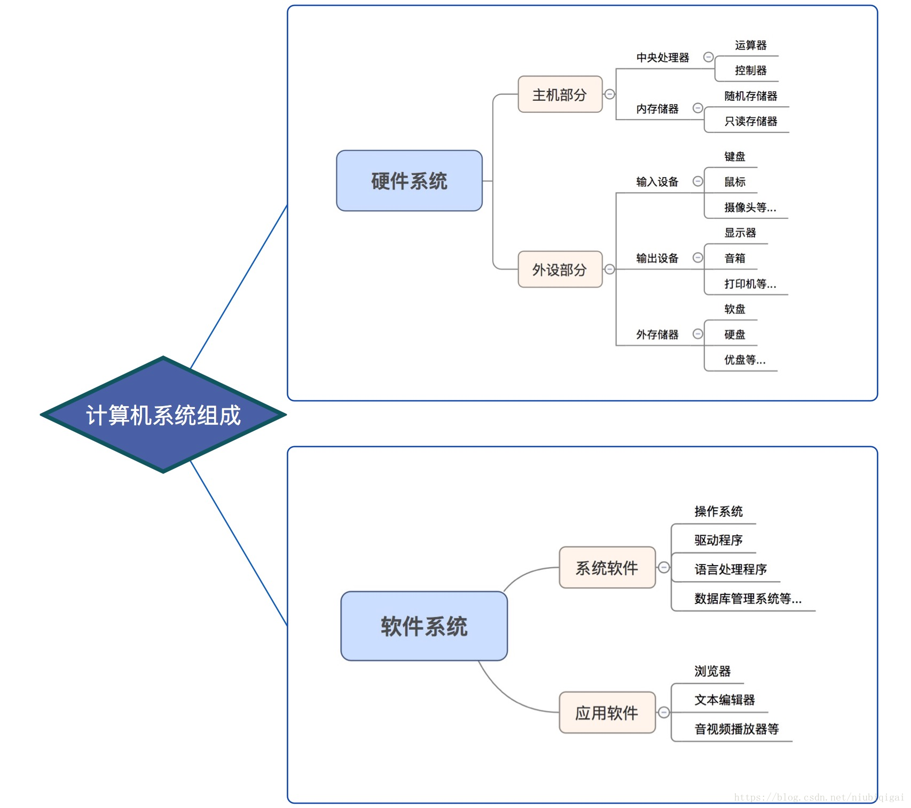
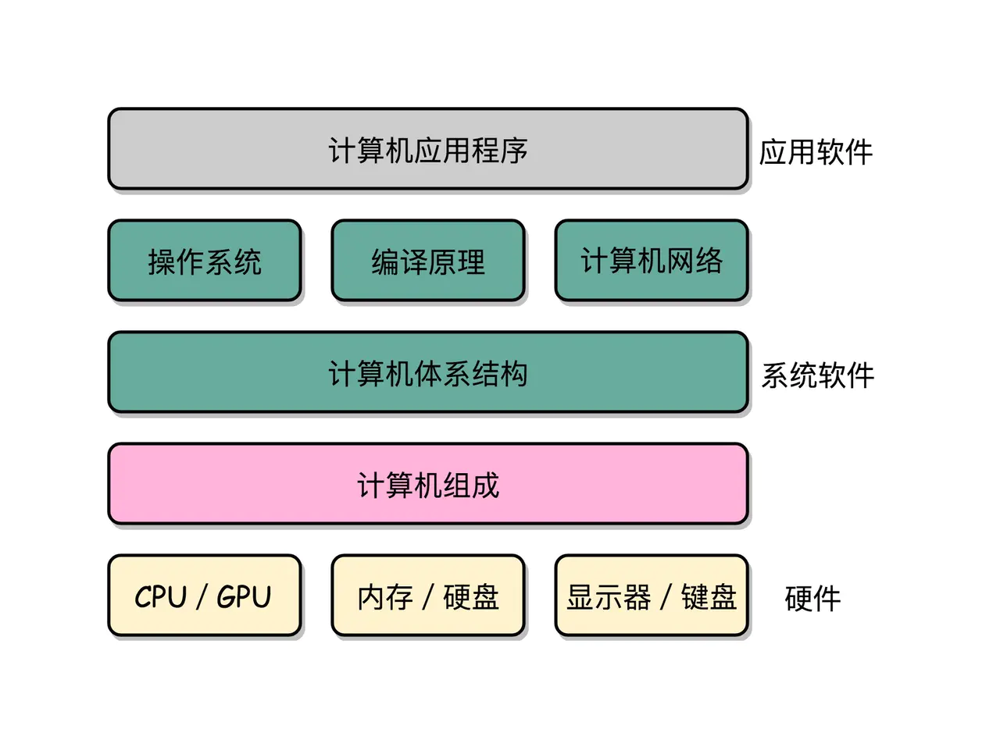
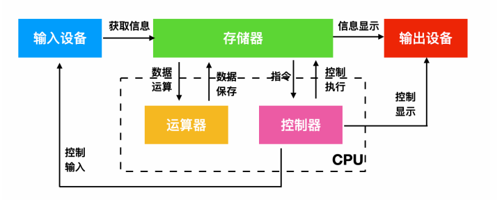
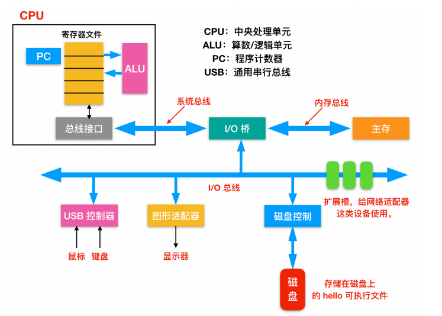
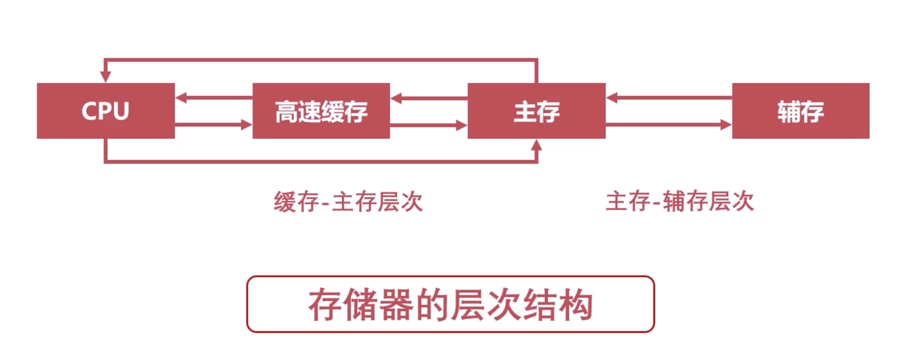

## 计算机是由什么组成的？

一个完整的计算机系统，是由硬件系统和软件系统两大部分组成的。

## 计算机组成原理

计算机组成原理的英文叫 Computer Organization。这里的 Organization 是“组织机构”的意思。计算机由很多个不同的部件放在一起，变成了一个“组织机构”。这个组织机构最终能够进行各种计算、控制、读取输入，进行输出，达成各种强大的功能。

计算机组成指的是系统结构的逻辑实现，包括机器机内的数据流和控制流的组成及逻辑设计等.

在这张图里面，我们把整个计算机组成原理的知识点拆分成了四大部分，分别是计算机的基本组成、计算机的指令和计算、处理器设计，以及存储器和 I/O 设备。

## 计算机的基本硬件组成

现代计算机的基本组成部分其实主要由三部分组成：CPU，内存，主板。

你撰写的程序，打开的任何PC端应用。都要加载到内存中才能运行，存放在内存中的程序及其数据需要被CPU读取，CPU计算完之后还要把对应的数据写回到内存。主板的作用就是承载二者，因为他们不能互相嵌入到对方中。

主板上的芯片组和总线解决了CPU及内存之间如何通信的问题。芯片组控制了数据传输的流转，也就是数据从哪里到哪里的问题。总线则是实际数据传输的高速公路。

具体流程：CPU读取内存中的二进制指令，然后译码，通过控制信号操作对应的运算原件以及存储单元进行操作。。

## 计算机体系结构

计算机体系结构是对计算机组成的一种抽象性描述，表明计算机应包含哪些部分，如指令集、数据类型、存储器寻址技术、I/O 机理等。不同厂家的具体实现不尽相同，但是对高级语言的开发者来说，这些都是透明的，即底层实现不同不会影响到上层应用。

## 冯·诺依曼体系
>美籍匈牙利数学家冯·诺伊曼于1946年提出存储程序原理，把程序本身当作数据来对待，程序和该程序处理的数据用同样的方式储存。 冯·诺依曼体系结构冯·诺伊曼理论的要点是：计算机的数制采用二进制；计算机应该按照程序顺序执行。人们把冯·诺伊曼的这个理论称为冯·诺伊曼体系结构。

核心设计思想主要体现在如下三个方面：

- 程序、数据的最终形态都是二进制编码，程序和数据都是以二进制方式存储在存储器中的，二进制编码也是计算机能够所识别和执行的编码。（可执行二进制文件：.bin文件）
- 程序、数据和指令序列，都是事先存在主（内）存储器中，以便于计算机在工作时能够高速地从存储器中提取指令并加以分析和执行。
- 确定了计算机的五个基本组成部分：运算器、控制器、存储器、输入设备、输出设备

## 冯诺依曼结构的五个主要组成部分

计算机硬件是计算机的重要组成部分，其中包含了 5 个重要的组成部分：运算器、控制器、存储器、输入设备、输出设备。

- 运算器：运算器最主要的功能是对数据和信息进行加工和运算。它是计算机中执行算数和各种逻辑运算的部件。运算器的基本运算包括加、减、乘、除、移位等操作，这些是由 算术逻辑单元(Arithmetic&logical Unit) 实现的。而运算器主要由算数逻辑单元和寄存器构成。
- 控制器：指按照指定顺序改变主电路或控制电路的部件，它主要起到了控制命令执行的作用，完成协调和指挥整个计算机系统的操作。控制器是由程序计数器、指令寄存器、解码译码器等构成。
- 存储器：存储器就是计算机的记忆设备，顾名思义，存储器可以保存信息。存储器分为两种，一种是主存，也就是内存，它是 CPU 主要交互对象，还有一种是外存，比如硬盘软盘等。下面是现代计算机系统的存储架构
- 输入设备：输入设备是给计算机获取外部信息的设备，它主要包括键盘和鼠标。
- 输出设备：输出设备是给用户呈现根据输入设备获取的信息经过一系列的计算后得到显示的设备，它主要包括显示器、打印机等。

**运算器和控制器共同组成了 CPU**

## 冯·诺依曼计算机的特点

- 计算机由运算器、存储器、控制器、输入设备和输出设备组成
- 指令由操作码（表示操作的性质）和地址码（表示操作数在存储器中的位置）组成
- 指令和数据皆用二进制表示
- 指令和数据以同等地位存放于存储器内，并可按地址寻访
- 指令在存储器内按顺序存放，通常是顺序执行的。但也可根据运算结果或设定的条件，改变执行顺序
- 机器以运算器为中心，输入输出设备与存储器之间的数据传送通过运算器完成

## 总线传输
总线（Bus）是计算机各种功能部件之间传送信息的公共通信干线，它是由导线组成的传输线束。

按照计算机所传输的信息种类，计算机的总线可以划分为数据总线、地址总线和控制总线，分别用来传输数据、数据地址和控制信号。

## 存储器的层次结构

存储器的主要功能是存储程序和各种数据，并且能够在计算机运行过程高速、自动地完成程序或者数据的存储，存储器是有记忆的设备，而且采用俩种稳定状态的物理器件来记录存储信息，所以计算机中的程序和数据都要转换为二进制代码才可以存储和操作。

### 缓存 CPU

原理：局部性原理
实现：在CPU与主存之间增加一层速度快，容量小的Cache
目的：解决主存速度不足的问题

### 主存-内存

随机存取存储器，通过电容存储数据，必须隔一段时间刷新一次，断电一段时间后将丢失数据

### 辅存 - 磁盘
物理配置及特征：磁道，扇区，磁头方向，磁头位置
读写算法：先来先服务算法（无脑算法），最短寻道时间优先（找花费时间最短的），扫描算法（电梯算法，向一个方向执行到尽头后反向执行到尽头），循环扫描算法（一个方向执行到尽头后跳转到磁盘的最外层或者最内层继续向该方向执行，此法比较公平）

## 参考

- https://juejin.im/post/6844903751174586381#heading-9
- https://juejin.im/post/6844904058055032840#heading-4
- https://juejin.im/post/6844903751174586381#heading-9
- https://juejin.im/post/6844903919982739463#heading-30
- https://juejin.im/post/6844903918195982343