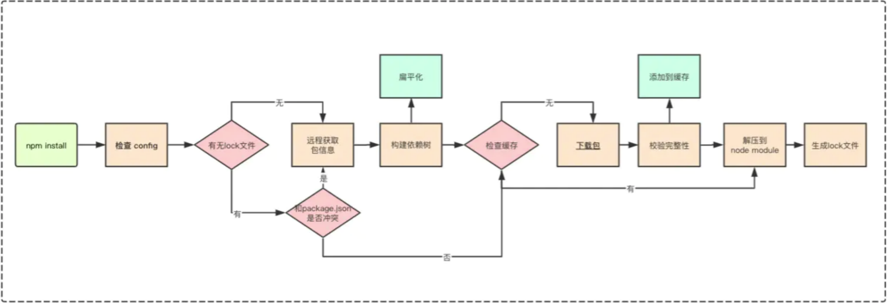
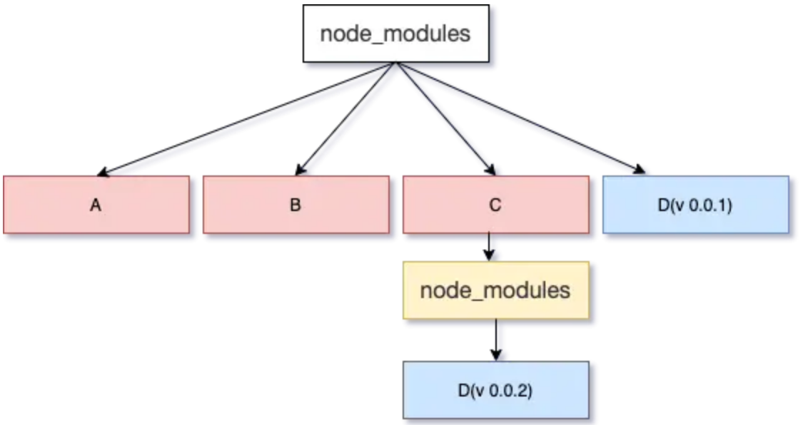
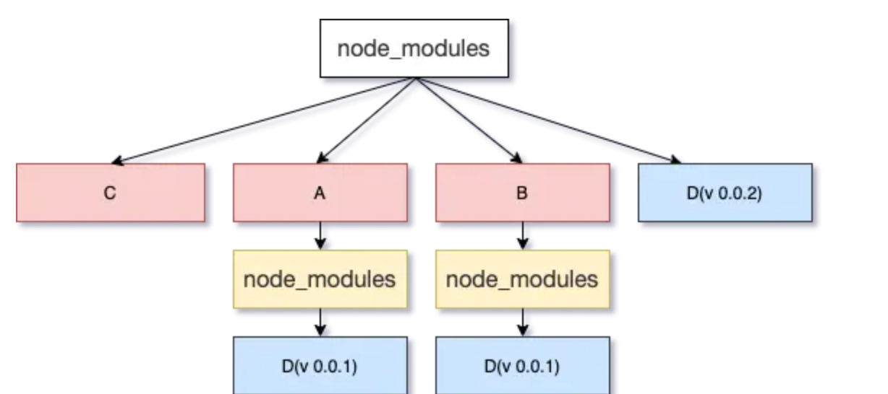

## 模块的安装过程



总结一下，Node模块的安装过程是这样的：
- 检查 .npmrc 文件的配置
- 检查项目中有无 lock 文件
- 有 lock 文件：
  - 检查 package.json 中的依赖版本是否和 package-lock.json 中的依赖有冲突。
  - 如果没有冲突，直接跳过获取包信息、构建依赖树过程，开始在缓存中查找包信息，后续过程相同
- 无 lock 文件：
  - 从 npm 远程仓库registry获取包信息
  - 根据 package.json 构建依赖树
  - 在缓存中依次查找依赖树中的每个包
    - 不存在缓存：
      - 从 npm 远程仓库下载包
      - 校验包的完整性
      - 将下载的包复制到 npm 缓存目录
      - 将下载的包按照依赖结构解压到 node_modules
    - 存在缓存：将缓存按照依赖结构解压到 node_module
  - 将包解压到 node_modules
  - 生成 lock 文件

### 什么是registry

registry是 模块仓库提供了一个查询服务，也就是我们常说的源。以yarn官方镜像源为例，它的查询服务网址是https://registry.yarnpkg.com。

这个网址后面跟上模块名，就会得到一个 JSON 对象，里面是该模块所有版本的信息。比如，访问 https://registry.npmjs.org/vue，就会看到 vue 模块所有版本的信息。

registry 网址的模块名后面，还可以跟上版本号或者标签，用来查询某个具体版本的信息。https://registry.yarnpkg.com/vue/2.6.10

执行 install 时，就是向 registry 查询得到上面的压缩包地址进行下载的。

### npm 缓存

以下的缓存策略是从 npm v5 版本开始的，在 npm v5 版本之前，每个缓存的模块在 ~/.npm 文件夹中以模块名的形式直接存储，储存结构是{cache}/{name}/{version}。

- npm install或npm update命令，从 registry 下载压缩包之后，都存放在本地的缓存目录：~/.npm/cacache。
- npm cache clean --force 清的是 ~/.npm/_cacache 文件夹中的数据。

npm在安装依赖的时候，根据package-lock中具体包的version,name和integrity信息（没有lock只能去请求registry了），用pacote:range-manifest:{url}:{integrity}生成唯一key，通过SHA256得到的hash，去_cacache/index-v5里找对应的文件，就能拿到基本的meta信息缓存了，前四位hash用来分路径
如果依赖信息改变了则生成的hash没有对应缓存信息可以命中，会重新下载再更新缓存。

npm install在执行的时候，首先构建依赖树，依次安装依赖树中的每个包。
如果缓存中有依赖包，就会向远程仓库确认是否过期（304检查）检查，如果过期，就使用新的返回数据刷新缓存，否则就直接使用缓存中的数据。
另外根据是否离线或失去对目标远程仓库的访问权限，npm还提供了fallback-to-offline模式。该模式使无法访问远程仓库的情况下，npm将直接使用本地缓存。
无论何时离线，npm都会尽可能地回退到缓存中-而不是坚持重试网络请求或失败
此外还提供了新的参数，是用户可以指定缓存使用的策略
--prefer-offline: 将使npm跳过任何条件请求（304检查）直接使用缓存数据，只有在缓存无法匹配到的时候，才去访问网络。这样我们将依赖包添加到项目的过程就会快很多。
例如，npm install express --prefer-offline将现在缓存中匹配express，只有在本地缓存没有匹配到的情况下，才去联网下载。
--prefer-online: 与它将强制npm重新验证缓存的数据（使用304检查），并使用重新验证的新鲜数据刷新缓存。
--offline 将强制npm使用缓存或退出。如果尝试安装的任何内容尚未在缓存中，则它将出现代码错误。
可以通过.npmrc或者npm config set来设置缓存使用的策略。

## node_modules 为什么采用扁平化设计

### 老版本

老版本 npm 采用的树状结构，优点是

- 例如新装一个依赖包，可以立即在第一层 node_modules 中看到子目录
- 在已知所需包名和版本号时，甚至可以从别的文件夹手动拷贝需要的包到 node_modules 文件夹中，再手动修改 package.json 中的依赖配置
- 要删除这个包，也可以简单地手动删除这个包的子目录，并删除 package.json 文件中相应的一行即可

缺点也十分明显：

- 对复杂的工程, node_modules 内目录结构可能会太深，导致深层的文件路径过长而触发 windows 文件系统中，文件路径不能超过 260 个字符长的错误
- 部分被多个包所依赖的包，很可能在应用 node_modules 目录中的很多地方被重复安装。随着工程规模越来越大，依赖树越来越复杂，这样的包情况会越来越多，造成大量的冗余。

### 新版本

最新的几版 npm 都采用了扁平结构：

实际的工程项目中，依赖树不可避免地会有很多层级，很多依赖包，其中会有很多同名但版本不同的包存在于不同的依赖层级，对这些复杂的情况,扁平化的结构便于在安装时遍历整个依赖树，计算出最合理的文件夹安装方式，使得所有被重复依赖的包都可以去重安装。

### 扁平化结构的问题

在诸多问题，梳理一下:

- 依赖结构的不确定性。
- 扁平化算法本身的复杂性很高，耗时较长。
- 项目中仍然可以非法访问没有声明过依赖的包

依赖结构不确定性：

逐个将模块放在 node_modules 的第一层，当发现有重复模块时，则丢弃， 如果遇到某些依赖版本不兼容的问题，则继续采用传统树状嵌套的处理方式，前面的放在 node_modules 目录中，后面的放在依赖树中。举个🌰：A，B，依赖 D(v 0.0.1)，C 依赖 D(v 0.0.2):



执行 npm install 的时候，按照 package.json 里依赖的顺序依次解析，上图如果 C 的顺序在 A，B 的前边，node_modules 树则会改变，会出现下边的情



package-lock.json的出现一部分原因是解决这个问题。

## 语义化版本控制模块-Semver

### 结构

版本号一般有三个部分，以.隔开，就像 X.Y.Z，其中

- X：主版本号，不兼容的大改动
- Y：次版本号，功能性的改动
- Z：修订版本号，问题修复

每个部分为整数（>=0），按照递增的规则改变。
在修订版本号的后面可以加上其他信息，用-连接，比如：

- X.Y.Z-Alpha: 内测版
- X.Y.Z-Beta: 公测版
- X.Y.Z-Stable: 稳定版

### 范围规则

^前缀（第一个非0数字不能变）:

- 允许在不修改[major, minor, patch]中最左非零数字的更改（匹配大于 X、Y、Z 的更新 Y、Z 的版本号）
- "^15.6.1",最左的非零数字是 15，所以 X 是不允许更新的，也就是说主版本号不会超过 15，表示的就是版本号>=15.6.1 && <16.0.0
- 如果 X 为 0，那么第一个非零数字就是 Y，就只能对 z 做出修改，^0.1.2 表示版本号>=0.1.2 && < 0.2.0

~前缀:

- 匹配大于 X.Y.Z 的更新 Z 的版本号
- X、Y、Z 都不为 0，~1.2.3 表示版本号>=1.2.3 && < 1.3.0

x 后缀：

- x: 可以替代 X、Y、Z 中任意一个，表示该位置可更新
- 1.2.x: >=1.2.0 && < 1.3.0
- 1.x: >=1.0.0 && < 2.0.0
- \*: 任意版本都可以

总结一波：^ 控制主要版本相同，~或x控制次要版本相同，package包里默认使用 ^

## 为什么需要package-lock.json

### 存在的问题
> 扁平化结构的问题中提到依赖结构的不确定性前面已经提到了，这里说另一个原因

假设我们创建了一个将使用 express 的新项目。 运行 npm init 后，我们安装 express：npm install express - save。在编写代码时，最新的版本是 4.15.4，所以 “express”：“^ 4.15.4”作为我的 package.json 中的依赖项添加，并且我的电脑安装了确切的版本。

现在也许明天，express 的维护者会发布 bug 修复，因此最新版本变为 4.15.5。 然后，如果有人想要为我的项目做贡献，他们会克隆它，然后运行`npm install。'因为 4.15.5 是具有相同主要版本的更高版本，所以为它们安装。 我们都安装 express ，但我们却是不同的版本。

### 如何解决 package-lock.json

package-lock.json 的目的是避免上述情况， **package.json 和package-lock.json 中版本是否兼容，如果兼容，就去下载 package-lock.json 中指定的版本，如果不兼容，下载package.json 中的最新版本并更新package-lock.json。** 在 npm 版本 5.x.x 中添加了 package-lock.json，因此如果你使用的是主要版本 5 或更高版本，除非您禁用它，否则它会自动生成。

package-lock 是 package.json 中列出的每个依赖项的大型列表，应安装的特定版本，模块的位置（URI），验证模块完整性的哈希，它需要的包列表 ，以及依赖项列表。

### 推入远程厂库

package-lock.json 不应写进 .gitignore。这点无论你是否使用 lock 都是一样的。具体来说：如果你使用 lock 机制，则应该将 package-lock.json 提交到 repo 中。比如 Vue 采取了该策略。如果你不使用 lock 机制，则应该加入 .npmrc 文件，内容为 package-lock=false ，并提交到 repo 中。比如 ESLint 采取了该策略。

### 自npm 5.0版本发布以来，npm i的规则发生了三次变化：

- npm 5.0.x 版本，不管package.json怎么变，npm i 时都会根据lock文件下载。但是这个就出现了明明手动改了package.json，为什么不升级包。
- npm 5.1.0版本后 npm install 会无视lock文件 ，去下载最新的npm。.但是出现了控诉“为什么package-lock 被忽视了的问题”。
- npm 5.4.2版本，规则变成了，大致意思是
  - ①如果改了package.json，且package.json和lock文件不同，那么执行npm i时npm会根据package中的版本号以及语义含义去下载最新的包，并更新至lock。
  - ②如果两者是同一状态，那么执行npm i都会根据lock下载，不会理会package实际包的版本是否有新。

### 为什么npm i后这个文件会跟新

如上5.4版本简述，npm install 总是先检查是否有依赖更新，有的话，安装更新，写入 package-lock.json。

即使你的项目直接固定了版本，但是依赖的依赖无法固定，还是会出现这种现象。

如果只想使用 package-lock.json 来安装且不更新依赖，npm使用5.7.1以上版本，使用 npm ci


对于新项目来说，有时候，为了保持当前大依赖的版本一致，建议是不将这个文件进行修改
将 npm install 改为 npm install --no-save  

### npm ci 读取package-lock.json进行下载

npm ci与npm i主要有以下的区别。
```tsx
npm i依赖package.json，而npm ci依赖package-lock.json。
当package-lock.json中的依赖于package.json不一致时，npm ci退出但不会修改package-lock.json。
npm ci只可以一次性的安装整个项目依赖，但无法添加单个依赖项。
npm ci安装包之前，会删除掉node_modules文件夹，因此他不需要去校验已下载文件版本与控制版本的关系，也不用校验是否存在最新版本的库，所以下载的速度更快。
npm安装时，不会修改package.json与package-lock.json。
```

### 有个问题,为什么不直接在 package.json 里固定版本呢？

因为即使你的 package.json 是固定版本的但是你一来的库的依赖包不一定是固定版本的，这就造成了，当另一个人安装你的应用的时候，应用的依赖库的依赖库可能会变化，这也会产生一些不稳定因素

### 总结

使用 package-lock.json 时，请记住以下关键要点：

不要在没有参数的情况下使用 npm install 来获取依赖关系，所以请使用 npm ci（不会更新lock，和lock冲突会报错）。你可以用 npm install 安装特定的依赖项。

## 最后吐槽一下node_modules-无底洞

node 如何共享 node_modules 呢？像 python 那样 site-packages，或者 Go 那样。
前端开发时每个项目都下一个好大呀。。。


## 参考
- https://juejin.im/post/5d08d3d3f265da1b7e103a4d
- https://juejin.cn/post/6844904022080667661#heading-54