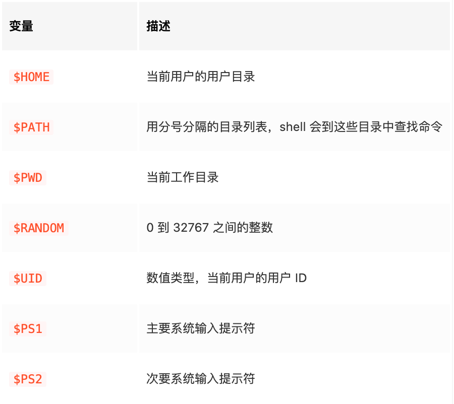
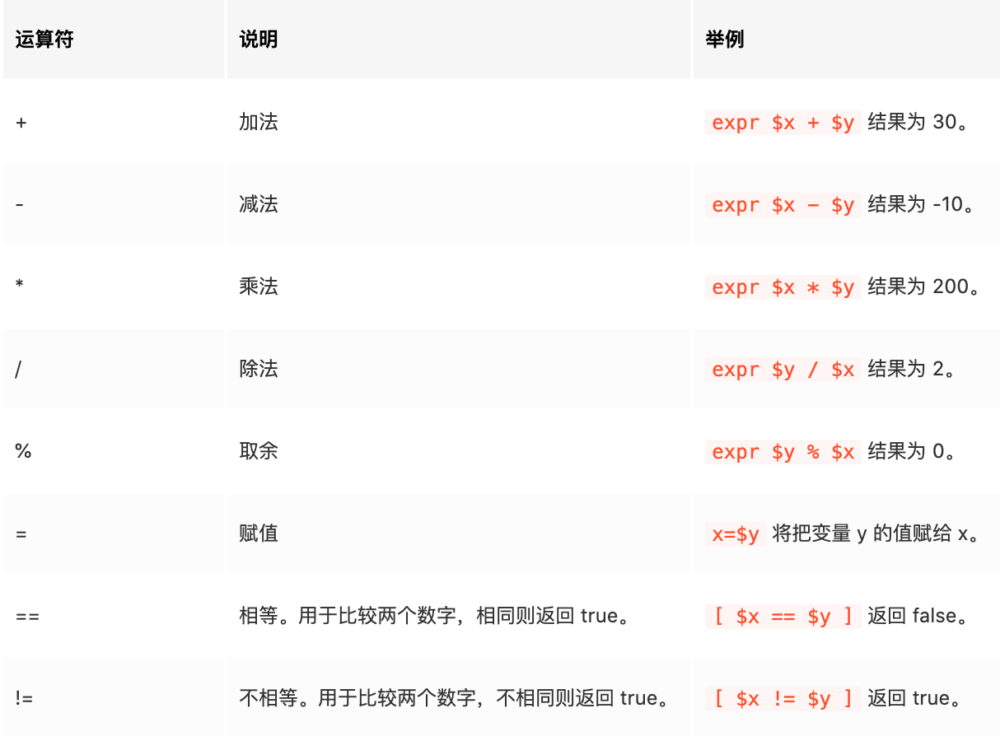
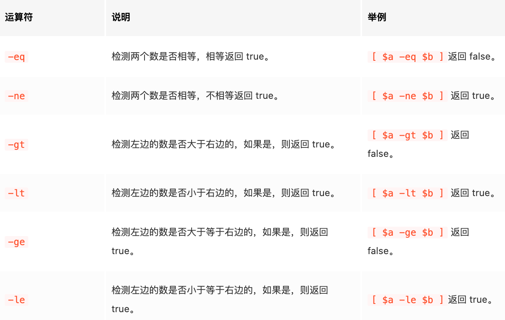
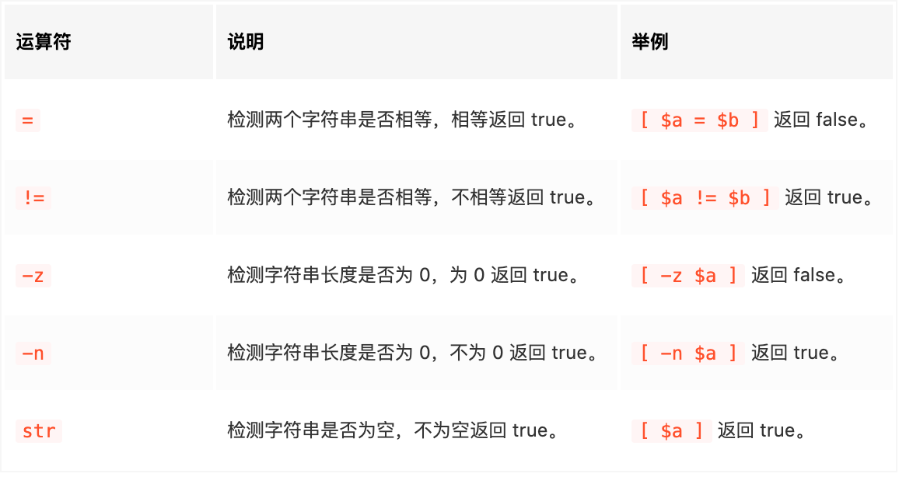

## 命令大全

- https://www.linuxcool.com/
- https://www.runoob.com/linux/linux-command-manual.html

## 常见的操作符

- Shell 中的特殊字符 https://www.runoob.com/w3cnote/shell-special-char.html
- Shell 特殊字符大全 https://blog.csdn.net/K346K346/article/details/51819236

### | 管道

我们可以将 " | " 看成将命令链接在一起的管道。它从一个命令获取输出，并将其作为输入送入下一个命令。管道命令的数量是任意的。

```tsx
cat words.txt | grep [cC] | sort -r
```

### & 后台处理

有时候在终端正在运行一个命令时，例如 vim，你想运行另外一个命令怎么办？这里有个小技巧就是在命令后面加一个 "&" 符号，将这个程序放在后台启动，这样你就能在终端实现后台多任务的效果了。

### &&

前面命令返回值为 0 才执行后面的命令

### ||

前面命令返回值为非 0 才执行后面的命令


### `` 反引号 相当于 $()

倒引号括起来的字符串被 Shell 解释为命令行，在执行时，Shell 会先执行该命令行，并以它的标准输出结果取代整个倒引号部分.

```tsx
Shell 解释执行:
$ echo current directory is `pwd` current directory is /home/huoty
命令行替换
mypath=`pwd`
echo My directory is $mypath
倒引号的嵌套应用，倒引号嵌套时在内层的一组倒引号必须用反斜杠（\）进行转义。
mypath=`echo My directory is `pwd``
echo $mypath
```

### : 冒号

冒号(null command [colon])。 空命令，这个命令什么都不做，但是有返回值，返回值为 0

### 重定向输入输出
```tsx
重定向输入/输出：
>file 重定向输出，设置file作为输出目标，以新建模式输出

>> file 重定向输出，设置file作为输出目标，以追加模式输出

<file 重定向输入，设置file作为输入源

2>file 将错误信息输出到file文件，正确信息不会输出到file

&>file 将错误信息和正确信息都同时输出到file文件

2>>或&>> 功能与上面一致，但是输出模式是追加模式

```

### 通配符

```tsx
* 匹配任意个字符（包含0个）

？ 匹配一个字符

[abc] 匹配括号中的任意一个字符

[a-b] 匹配括号中范围内的任意一个字符（a~b中）

[^abc] 匹配除了括号中以外的一个字符
```


## 模式

### 交互模式:可以输入一系列 Linux 命令

比如 ls，grep，cd，mkdir，rm 等等。

```tsx
user@host:~$

```

### 非交互模式: shell 从文件或者管道中读取命令并执行。

当 shell 解释器执行完文件中的最后一个命令，shell 进程终止，并回到父进程。

可以使用下面的命令让 shell 以非交互模式运行：

```tsx
sh /path/to/script.sh
bash /path/to/script.sh
source /path/to/script.sh
./path/to/script.sh
```

## 指定脚本解释器

```tsx
指定 sh 解释器
#!/bin/sh
复制代码
指定 bash 解释器
#!/bin/bash
```

安装完新版本的 bash，我们可能将其路径添加到 PATH 中，来“隐藏”老版本。如果直接用#!/bin/bash，那么系统会选择老版本的 bash 来执行脚本，如果用#!/usr/bin/env bash，则会使用新版本。

## 注释

单行注释 - 以 # 开头，到行尾结束。
多行注释 - 以 `:<<EOF` 开头，到 EOF 结束。

## 常用命令

### echo

echo 用于字符串的输出。

输出含变量的字符串：

```tsx
name=zp
echo "hello, ${name}"
# Output: hello, "zp"
```

### printf

格式化输出字符

### 计算

```tsx
path = `pwd`
# expr 可以识别算式
TEMP=`expr 2 + 3`
```

计算还有其他方式

```tsx
# 第1种方式 $(())
echo $(((2+3)*4))

# 第2种方式 $[]，推荐
echo $[(2+3)*4]

```

## 变量

Bash 中没有数据类型，bash 中的变量可以保存一个数字、一个字符、一个字符串等等。同时无需提前声明变量，给变量赋值会直接创建变量。

访问变量的语法形式为：${var} 和 $var 。

```tsx
dword="hello"  # 声明变量
echo ${dword}  # 输出变量值
# Output: hello

unset dword    # 删除变量
echo ${dword}
# Output: （空）

readonly rword # 只读变量

```

### 变量类型

- 局部变量 ： 局部变量是仅在某个脚本内部有效的变量。它们不能被其他的程序和脚本访问。
- 环境变量 ： 环境变量是对当前 shell 会话内所有的程序或脚本都可见的变量。创建它们跟创建局部变量类似，但使用的是 export 关键字，shell 脚本也可以定义环境变量。



## 字符串

- 单引号：内部不能直接识别变量，不能出现转义字符
- 双引号（推荐
- 直接不要引号

### 拼接字符串

```tsx
# 使用单引号拼接
name1='white'
str1='hello, '${name1}''
str2='hello, ${name1}'
echo ${str1}_${str2}
# Output:
# hello, white_hello, ${name1} // 这里的${name1}被直接输出了

# 使用双引号拼接
name2="black"
str3="hello, "${name2}""
str4="hello, ${name2}"
echo ${str3}_${str4}
# Output:
# hello, black_hello, black

```

### 获取字符串长度

```tsx
text="12345"
echo ${#text}
# Output:
# 5
```

### 截取子字符串

#### 按下标截取
```tsx
text="12345"
echo ${text:2:2}
# Output:
# 34
```
#### 截取指定格式的内容

假设有变量 var=http://www.aaa.com/123.htm
```bash
1. # 号截取，删除左边字符，保留右边字符。

echo ${var#*//}
其中 var 是变量名，# 号是运算符，*// 表示从左边开始删除第一个 // 号及左边的所有字符

即删除 http://

结果是 ：www.aaa.com/123.htm

2. ## 号截取，删除左边字符，保留右边字符。

echo ${var##*/}
##*/ 表示从左边开始删除最后（最右边）一个 / 号及左边的所有字符

即删除 http://www.aaa.com/

结果是 123.htm

3. %号截取，删除右边字符，保留左边字符

echo ${var%/*}
%/* 表示从右边开始，删除第一个 / 号及右边的字符

结果是：http://www.aaa.com

4. %% 号截取，删除右边字符，保留左边字符

echo ${var%%/*}
%%/* 表示从右边开始，删除最后（最左边）一个 / 号及右边的字符

结果是：http:

5. 从左边第几个字符开始，及字符的个数

echo ${var:0:5}
其中的 0 表示左边第一个字符开始，5 表示字符的总个数。

结果是：http:

6. 从左边第几个字符开始，一直到结束。

echo ${var:7}
其中的 7 表示左边第8个字符开始，一直到结束。

结果是 ：www.aaa.com/123.htm

7. 从右边第几个字符开始，及字符的个数

echo ${var:0-7:3}
其中的 0-7 表示右边算起第七个字符开始，3 表示字符的个数。

结果是：123

8. 从右边第几个字符开始，一直到结束。

echo ${var:0-7}
```

### 查找子字符串

查找 ll 子字符在 hello 字符串中的起始位置。

```tsx
#!/usr/bin/env bash

text="hello"
echo `expr index "${text}" ll`

# Execute: ./str-demo5.sh
# Output:
# 3

```

## 数组

bash 只支持一维数组。

数组下标从 0 开始，下标可以是整数或算术表达式，其值应大于或等于 0。

```tsx
# 创建数组的不同方式
nums=([2]=2 [0]=0 [1]=1)
colors=(red yellow "dark blue")

echo ${nums[1]}
# Output: 1

echo ${colors[*]}
# Output: red yellow dark blue

echo ${colors[@]}
# Output: red yellow dark blue
```

## 运算符

shell 里不同的数据运算符会有区别。字符串和数组的运算符规则有些差异

### 算数



### 关系运算

> 只能数字使用



### 字符串运算符



## 语句控制

### 条件

[ condition ] 注意 condition 前后要有空格。非空返回 0，0 为 true，否则为 false 。

```tsx
# 或者（推荐）
if [ 条件判断式 ]
then
    程序
elif [ 条件判断式 ]
then
    程序
fi
```

### for 循环

```tsx
#!/bin/bash


# 使用$@
for j in "$@"
do
    echo "the arg is $j"
done


SUM=0
for ((i=1;i<=100;i++))
do
    SUM=$[$SUM+$i]
done

echo $SUM
```

### while 循环

```tsx
while [ 条件判断式 ]
do
    程序
done
```

## 参考

- https://shellscript.readthedocs.io/zh_CN/latest/1-syntax/2-datatype/index.html
- https://juejin.cn/post/6844903784158593038
- https://zhuanlan.zhihu.com/p/102176365
